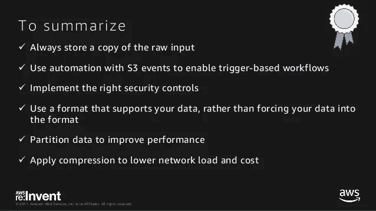
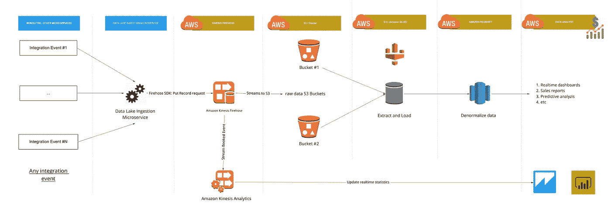
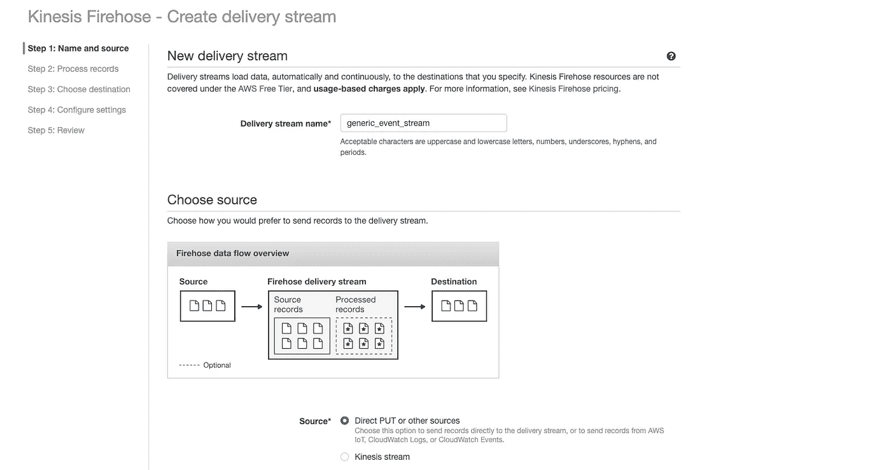
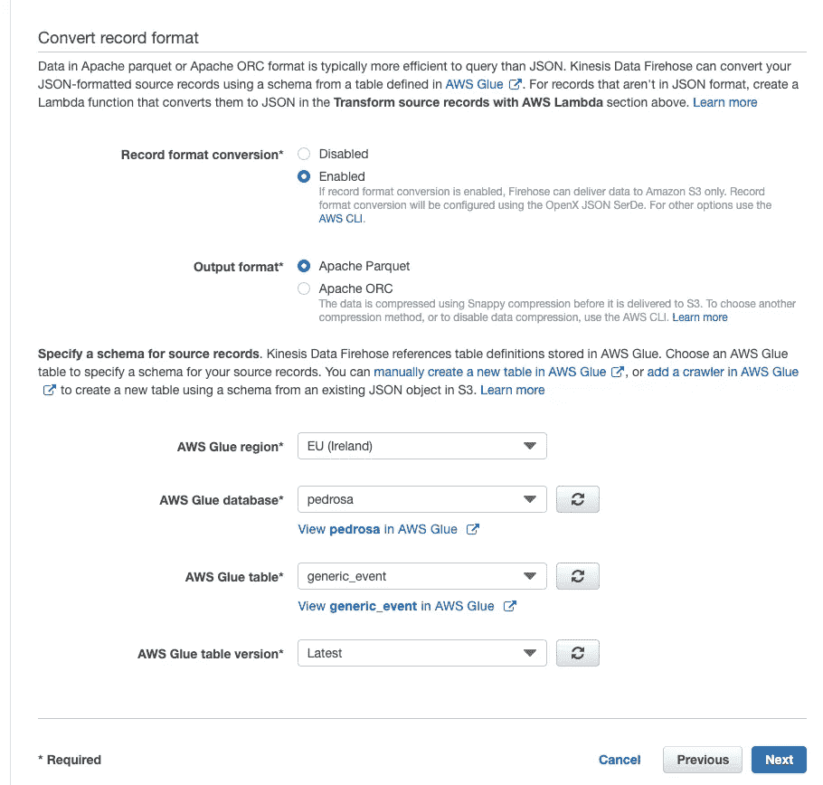
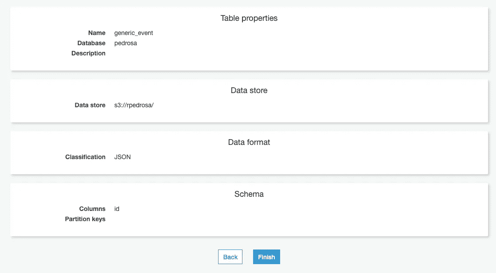
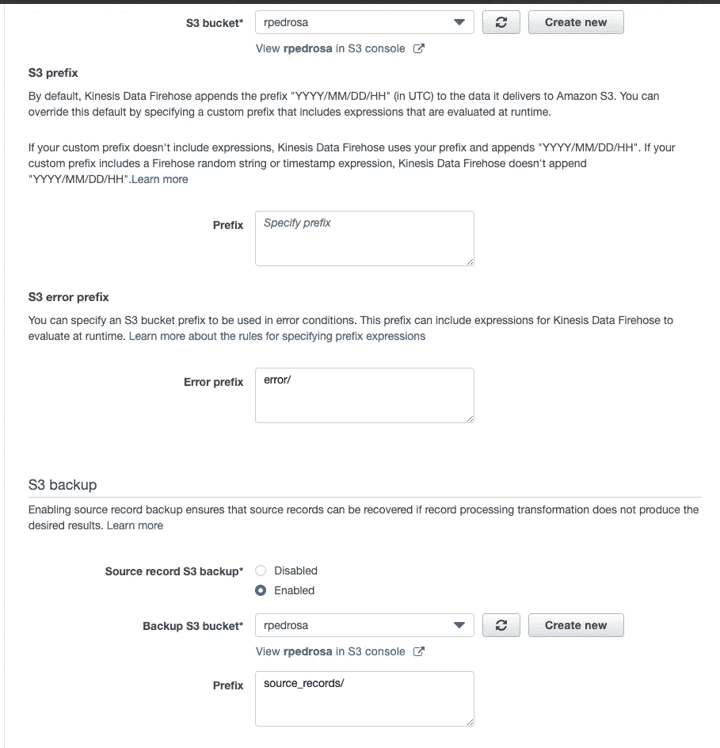
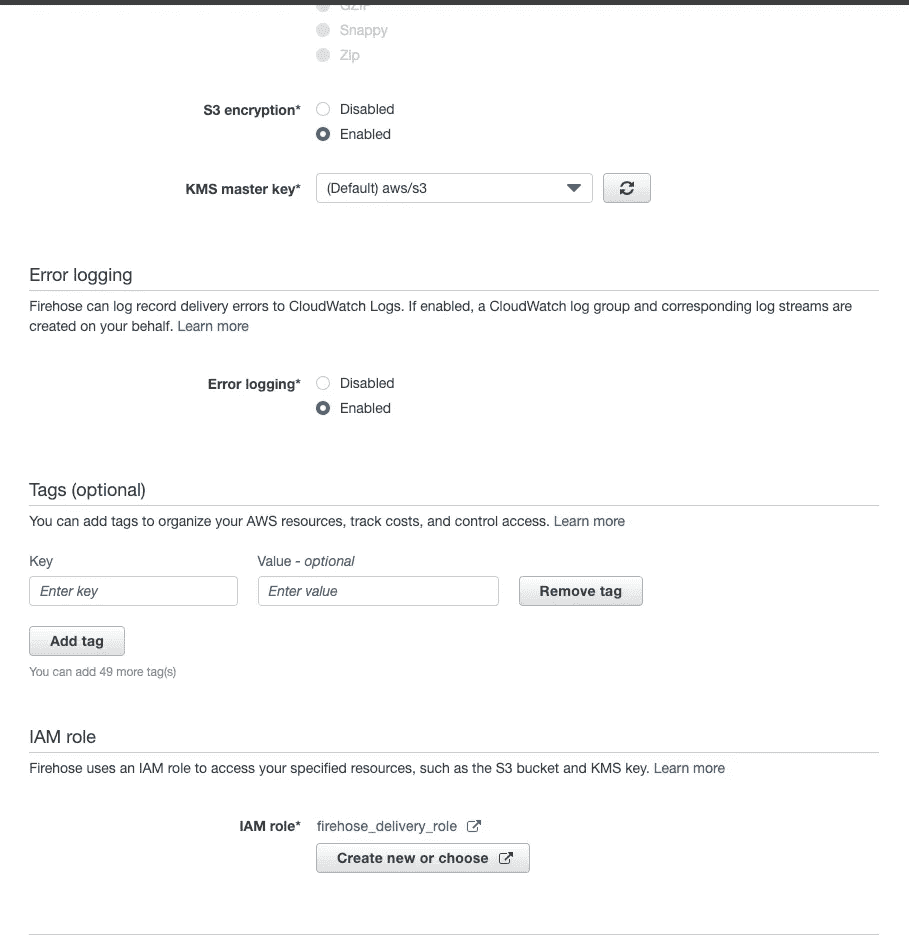
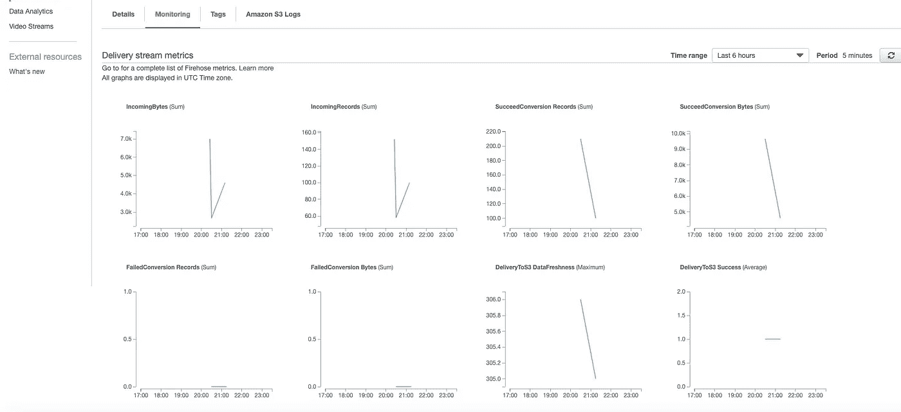
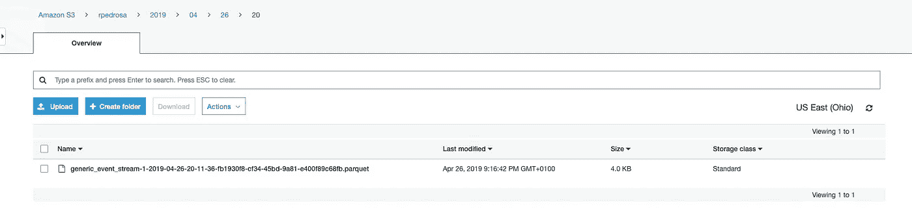
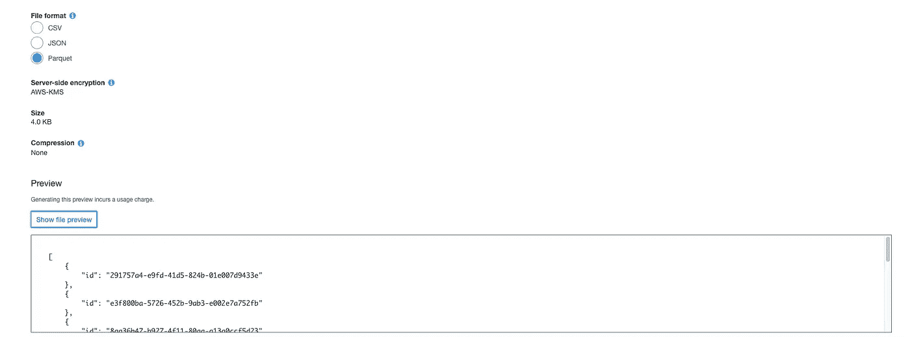

# 如何使用 Amazon Web Services (AWS)快速构建数据湖

> 原文：<https://medium.com/nerd-for-tech/how-to-quickly-build-a-data-lake-using-amazon-web-services-aws-97b85681e9ff?source=collection_archive---------1----------------------->

# intro—AWS 中的数据湖不止**只是将数据**转储到**[**【S3】**](https://aws.amazon.com/s3/)**

**在某些时候，你可能想要创建一个 [**数据湖**](https://en.wikipedia.org/wiki/Data_lake) ，像我一样，你**可能想要/需要使用 AWS** 。您可能知道，数据湖:**

1.  **促进数据利用；**
2.  **通过容易地提供商业见解(例如使用分析和/或可视化工具)来打开新商业机会；**
3.  **在我们这样做的同时，避免触及现场数据库和影响您的客户；**
4.  **通过将分析服务暴露给应用程序(API)来增加您的产品使用；**
5.  **避免数据复制成本，尤其是在微服务策略中；**
6.  **通过将数据存储在每个人(销售人员、CX、客户、开发人员等)都知道在哪里找到/搜索的集中位置，为您提供一种更简单、更安全、一致和透明的数据访问方式；)**

****

**听起来很棒，对吧？然而，只要你开始做，你就会意识到在 AWS **中创建一个 [**数据湖不仅仅是将数据转储到**](https://aws.amazon.com/big-data/datalakes-and-analytics/what-is-a-data-lake/)[**【S3】**](https://aws.amazon.com/s3/)中，因为你应该这样做:****

*   **以某种方式使该信息能够被其目标用户访问。换句话说，要防止出现 [**数据沼泽**](https://en.wikipedia.org/wiki/Data_lake)**；****
*   **在某种程度上，你总是可以访问原始数据(作为备份)；**
*   **通过加密生产数据以安全的方式；**
*   **通过限制对生产数据的访问(不是对组织内的每个人都可用)，以合规的方式；**
*   **通过压缩数据以成本有效的方式；" [Parquet(和 ORC)是列数据格式，与 JSON](https://docs.aws.amazon.com/firehose/latest/dev/record-format-conversion.html) 之类的面向行的格式相比，它节省了空间并支持更快的查询"；**
*   **通过将不经常访问的数据移动到更便宜的 AWS 存储设备，如 AWS S3(不经常访问)或 [AWS Glacier](https://aws.amazon.com/glacier/) ，以经济高效的方式进行；**

****

**[在亚马逊 S3 和亚马逊冰川建立数据湖的最佳实践，特邀嘉宾，Airbnb&Viber-stg 312-re:Invent 2017](https://pt.slideshare.net/AmazonWebServices/best-practices-for-building-a-data-lake-in-amazon-s3-and-amazon-glacier-with-special-guests-airbnb-viber-stg312-reinvent-2017/65)**

**综上所述，[我希望你认识到，从零开始构建一个数据湖涉及到大量的主题，如数据摄取、数据组织、安全性、成本等](https://pt.slideshare.net/AmazonWebServices/best-practices-for-building-a-data-lake-in-amazon-s3-and-amazon-glacier-with-special-guests-airbnb-viber-stg312-reinvent-2017/65)。**

# **作为解决方案的实时摄取流**

**有“[多数据湖摄取方法](https://pt.slideshare.net/AmazonWebServices/best-practices-for-building-a-data-lake-in-amazon-s3-and-amazon-glacier-with-special-guests-airbnb-viber-stg312-reinvent-2017/9)”但是，如果你有一个事件驱动的架构(不需要基于微服务，它可以是一个发布[集成事件](/@arleypadua/domain-events-vs-integration-events-5eb29a34fdbc)的单片应用程序)，你可能会立即跳入 [Amazon Kinesis Firehose](https://aws.amazon.com/kinesis/data-firehose/) 。即使您在交易数据库或内部服务器中有历史数据，您可能仍然希望构建一个应用程序来查询这些数据，并以某种方式在亚马逊 Kinesis Firehose 中结束的集成事件的形式发布这些数据。我尽可能多地使用这种实时摄取流，因为:**

*   **AWS Kinesis Firehose streams [处理转换、压缩并自动整理您的水桶](https://aws.amazon.com/kinesis/data-firehose/features/)；**
*   **提供更大的灵活性，例如，使用实时集成事件可以轻松地为其附加分析。它还允许将那些[集成事件](/@arleypadua/domain-events-vs-integration-events-5eb29a34fdbc)重新用于其他目的；**
*   **最佳实践的重用/更快的上市时间:如果我为 AWS Kinesis Firehose 设置了压缩和转换，我知道所有经过那里的数据都将被压缩和转换:)。通过后台工作(或类似于[存储网关](https://aws.amazon.com/storagegateway/)的 AWS 服务)来处理现有的历史数据是一种更容易出错的方法，而且成本可能更高；**

**也就是说，我只是想在 AWS 中创建一个 [**数据湖，它遵循**实时数据摄取流**，即使你没有事件驱动的架构，你也可能会发现这很有用。**](https://aws.amazon.com/big-data/datalakes-and-analytics/what-is-a-data-lake/)**

# **创建数据湖(第一部分)——架构**

**为了创造这种流动，我们将:**

*   **创建一个使用 [Kinesis 数据传输流](https://aws.amazon.com/kinesis/data-firehose/features/)向 S3/数据湖发送记录的工人(或者数据湖摄取微服务)。通常在真实世界的产品中，这些记录是您的产品产生的[集成事件](/@arleypadua/domain-events-vs-integration-events-5eb29a34fdbc)；**
*   **设置 [Kinesis 数据传输流](https://aws.amazon.com/kinesis/data-firehose/features/)，自动转换和压缩数据，并有组织地自动存储在 S3；)**

**总结起来，大概是这样的:**

****

**数据湖:实时数据摄取批处理和实时分析的推荐流程**

*   **这不仅仅是创建数据湖的实时数据接收流程。这是使用 AWS 服务进行批处理和实时分析的**推荐流程**，其中数据通过 [Kinesis 数据传输流](https://aws.amazon.com/kinesis/data-firehose/features/)存储在数据湖/S3 桶中；**
*   **数据湖摄取微服务只是一个抽象层，因此其他微服务或单片应用程序不需要了解 Kinesis 或如何发布事件。通过将数据湖的创建集中在一个地方，您可以很容易地改进，例如，记录 Kinesis 失败的请求，支持更多的事件，甚至切换[云提供商](https://azure.microsoft.com/en-us/solutions/data-lake/)；**
*   **[AWS Glue](https://aws.amazon.com/glue/) 、 [AWS 红移](https://aws.amazon.com/redshift/)以及商业洞察工具如 [AWS QuickSight](https://aws.amazon.com/quicksight/) 或 [Microsoft PowerBI](https://powerbi.microsoft.com/en-us/) 不在本文讨论范围之内，但我只想分享(1)你可以直接从 [Kinesis 数据交付流](https://aws.amazon.com/kinesis/data-firehose/features/)中填充 [AWS 红移](https://aws.amazon.com/redshift/)以及(2)你不一定需要像 [AWS 红移](https://aws.amazon.com/redshift/)这样的数据仓库来创建你的[“数据湖是一种日益流行的存储和分析结构化和非结构化数据的方式。如果你想建立自己的定制亚马逊 S3 数据湖，AWS Glue 可以让你所有的数据立即可用于分析，而无需移动数据"](https://aws.amazon.com/glue/)；**

**构建它的时间:)**

# **创建数据湖(第二部分)—以 S3 为目标目的地设置 AWS Kinesis 消防软管**

**登录 AWS 控制台并选择消防软管服务(如果您没有 AWS 帐户，您可以免费创建一个[帐户](https://aws.amazon.com/free/)，但请注意，Kinesis 消防软管资源不在 [AWS 免费等级](https://aws.amazon.com/free/)下，并且**基于使用的费用适用于**)。由于我们希望“持续收集、转换和加载流数据到亚马逊 S3”，选择“ [**创建交付流**](https://console.aws.amazon.com/firehose/home?region=eu-west-1#/wizard/nameAndSource) ”。**

****第一步:名称和来源:**给出一个流名称，并选择“直接上传或其他来源”，因为我们“[想要使用 Firehose PutRecord()或 PutRecordBatch() API 将来源记录发送到交付流](https://eu-west-1.console.aws.amazon.com/firehose/home?region=eu-west-1#/wizard/nameAndSource)”；**

****

****第一步:名称和来源****

****步骤 2:处理记录:**出于演示的目的，我不需要“记录转换”，因为我们将发布一个 JSON 格式的事件，而 Kinesis Firehose 知道如何转换它，但我肯定希望启用“记录格式转换”到 Apache Parquet。正如 AWS 所说，“Apache parquet 或 Apache ORC 格式的数据通常比 JSON 更高效”。此外，转换为 Apache Parquet 可以确保“数据在传送到 S3 之前使用 Snappy compression 进行压缩”。很好不是吗？:)**

****

****第二步:流程记录****

**如您所见，为了让 Kinesis 知道如何将 JSON 记录转换成 apache parquet，我们需要“为源记录指定一个模式”。出于演示目的，我刚刚在 AWS Glue 中手动创建了一个表格:**

****

****步骤 2:处理记录——为源记录指定一个模式****

****步骤 3:选择目的地:“**亚马逊 S3 是唯一可用的目的地，因为我们在步骤 2:处理记录中启用了记录格式转换”，所以只需选择一个 S3 目的地存储桶。我将 S3 前缀保留为空(默认)，但将 S3 错误前缀设置为“/error”。尤其是在数据非常重要的情况下，您还需要启用 S3 备份:**

****

****第三步:选择目的地****

****步骤 4:配置设置:**除了 S3 加密部分，我将所有内容都保留为默认设置。**当然，您希望在 AWS S3 中默认加密您的生产数据**，因此请确保您已启用此功能。您还需要创建一个 IAM 角色，但 AWS 会为您预先选择一个，让您的工作更轻松:**

****

****第四步:配置设置****

**现在，只需复习并继续。需要几秒钟，但最终会在 AWS 控制台中显示为活动状态；)**

****

**唯一缺少的是对生产数据的访问限制太多。有[多种方式可以进行](https://docs.aws.amazon.com/AmazonS3/latest/dev/s3-access-control.html)，但是从使用[贵组织的 IAM 负责人](https://aws.amazon.com/blogs/security/control-access-to-aws-resources-by-using-the-aws-organization-of-iam-principals/)开始可能就足够了，而且会更快。然而，请注意，例如使用 IAM 角色的[更易维护的方法是更可取的](https://aws.amazon.com/blogs/security/how-to-restrict-amazon-s3-bucket-access-to-a-specific-iam-role/)。**

**此时，您已经建立了一个用于存储数据的 Kinesis 流:**

*   **以加密的方式；**
*   **Parquet(和 ORC)是列数据格式，与 JSON 等面向行的格式相比，这种格式节省了空间，并且支持更快的查询。”；**
*   **以一种有组织的方式，即以日期存储，并为备份和错误添加适当的前缀。**

**填湖时间，查询数据；)**

# **创建数据湖(第三部分)—填充(和查询)**

**我将使用 [dotnet 新命令](https://docs.microsoft.com/en-us/dotnet/core/tools/dotnet-new?tabs=netcore21)创建一个. net 核心控制台应用程序来表示数据湖摄取微服务。出于演示目的，我将生成大量通用事件，并将其发送到我们刚刚使用 [AWS net SDK](https://github.com/aws/aws-sdk-net) 设置的 Kinesis 流。在您的产品中，您可能会使用来自像 [Kafka](https://kafka.apache.org) 或 [RabbitMq](https://www.rabbitmq.com/) 这样的消息代理的事件，并使用您喜欢的编程语言/ [AWS sdk](https://github.com/aws) :**

```
dotnet new console --name AWSFirehosePublisher
```

**参考[awsfirehosepublisher . csproj](https://github.com/rfpedrosa/AWSFirehosePublisher/blob/master/AWSFirehosePublisher.csproj)中的 [AWS net SDK](https://github.com/aws/aws-sdk-net) :**

```
<PackageReference Include="AWSSDK.Extensions.NETCore.Setup" Version="3.3.100.1" /><PackageReference Include="AWSSDK.KinesisFirehose" Version="3.3.100.10" />
```

**并使用 [Program.cs](https://github.com/rfpedrosa/AWSFirehosePublisher/blob/master/Program.cs) 上的 [PutRecordAsync](https://docs.aws.amazon.com/sdkfornet/v3/apidocs/items/KinesisFirehose/MKinesisFirehosePutRecordAsyncStringRecordCancellationToken.html) 开始发布您的精彩活动:)**

```
var data = "{\"id\": \"" + id + "\"}";......return _firehoseClient.PutRecordAsync(putRecordRequest);
```

**et vò ila！流显示活动和数据存储在 S3！**

********

**存储在 S3 的数据**

**通过 S3 选择，您可以使用 SQL 表达式从单个 CSV、JSON 或 Parquet 文件中提取记录。S3 选择支持 GZIP 和 BZIP2 压缩文件和服务器端加密文件。要在 S3 分析需要更复杂的 SQL 表达式的数据，请参见亚马逊雅典娜 T20)**

**因为我只是想检查一下我是否能读取数据，以及数据是否符合我的预期，所以我将使用 S3 选择。要使用 S3 选择，只需选择文件->进入“选择”选项卡，然后按“显示文件预览”:**

****

# **下一步？**

*   **理想情况下，您希望使用[基础设施作为代码(IaC)](https://aws.amazon.com/cloudformation/) 来设置那些 AWS 服务；**
*   **在 [AWS QuickSight](https://aws.amazon.com/quicksight) 和[上创建一个漂亮的仪表盘，并嵌入到你的应用](https://aws.amazon.com/blogs/big-data/embed-interactive-dashboards-in-your-application-with-amazon-quicksight)中？**

**希望你觉得有帮助:)感谢阅读！**