# 如何读懂 CNN 的心思

> 原文：<https://medium.com/nerd-for-tech/how-to-read-the-mind-of-a-cnn-98faabcf9439?source=collection_archive---------3----------------------->

## 基于实例的 CNN 可视化技术:非人工智能专家理解分类结果的概述

**TL；对于卷积神经网络(CNN)的实施来说，用户接受模型并信任分类是至关重要的。然而，由于网络不是直观可理解的，不透明的错误分类导致对模型信任的丧失。为了增加可理解性，可以使用可视化方法向非人工智能专家显示图像区域的相关性。在接下来的文章中，我们将展示其中的一些，并根据选定的评估标准对它们的使用进行评估。基于实例的可视化方法主要包括:基于扰动的、基于激活的、基于反向传播的和基于概念的。**

*这篇文章是达姆施塔特应用科学大学 2020/2021 冬季学期深度学习研讨会的一部分。*

照片由[埃迪·利贝丁斯基](https://unsplash.com/@supernov?utm_source=medium&utm_medium=referral)在 [Unsplash](https://unsplash.com?utm_source=medium&utm_medium=referral) 拍摄

# 有什么问题？

卷积神经网络(CNN)改变了图像处理的世界。卷积层使计算机视觉可以使用专门的网络，这些网络还可以处理图像数据的空间信息。各种各样的 CNN 网络架构正被用于解决越来越多的动态任务。其他像 Random Forest 这样的机器学习模型根本跟不上。一个众所周知的杰出表现的例子是 MNIST 时装数据集的图像分类。[在这里看看 CNN 的表现吧！](https://github.com/zalandoresearch/fashion-mnist)

除了良好的性能，卷积神经网络也非常实用。毕竟，对于图像分类的具体工作方式，不需要规定任何规则。然而，这正是问题出现的地方。随着灵活性的增加，可解释性受到严重损害。网络内的确切过程和分类结果的具体组成不容易理解。这种可理解性的缺乏在没有进一步措施的情况下阻止了从网络中提取重要的洞察力(例如，相关图像区域)。在分类错误的情况下，最终用户对模型的信任也会降低，这不利于它在关键应用中的使用。

在一篇围绕 ImageNet 数据集的论文( [*自然对立例子，2019*](https://arxiv.org/abs/1907.07174) )中可以找到几个无法理解的物体分类的例子。在这里，可以识别出 7500 个欺骗普通分类器的真实世界的例子。在选择的例子中值得注意的是，以非常高的确定性选择了不正确的类(红色)。

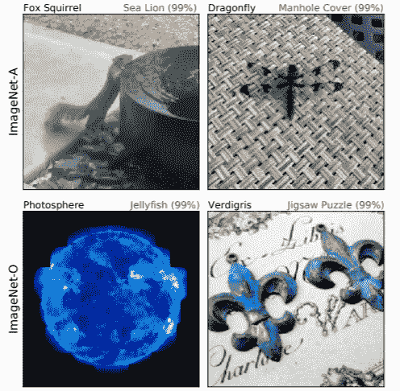

Image-Net 数据集分类的真实反例。在自然对抗性的例子(2019)【https://arxiv.org/abs/1907.07174 

没有关于背景的信息，这样的分类导致对模型的怀疑。在使用 CNN 的自动决策的情况下，例如在医疗诊断或自动驾驶中，分类结果的可验证性是如此重要，以至于它决定了程序是否成立。

**因此，我们来了解一个 CNN。我们将使用基于实例的可视化技术来读取它的想法。**

# 基于实例的可视化有什么帮助？

基于实例的可视化技术是突出特定图像的分类决策的原因的方法。因此，相关的图像区域被单独曝光或与重叠的热图一起显示。在错误分类的情况下，更容易确定例如背景而不是物体对于分类是否是决定性的。

但是你如何选择一个合适的可视化技术呢？

这些要求是根据这些方法的实际使用情况确定的。一个具体的用例是验证用于检测糖尿病视网膜病变的 CNN([*视网膜眼底图像中糖尿病视网膜病变的弱监督定位*， *2017*](https://arxiv.org/abs/1706.09634) )。从长远来看，在缺乏合格人员的发展中国家，应该使用 CNN 来检测这种视网膜病变，从而及时阻止失明的威胁。CNN 内部的分类决定在健康和受影响之间做出。卷积神经网络实现了比以前的方法更好的性能(告诉过你！).然而，由于缺乏可追溯性，医学专家不信任该模型。为什么一个训练有素的网络要取代多年的医学教育？！因此，应该评估网络是否在没有对其进行明确训练的情况下识别类似红色病变的典型体征。
因此，基于实例的可视化方法将用于形成特征的定位。然后将相关区域的位置与预先标记的标志进行比较。在这个例子中，细节的级别是次要的，因为只有关于标志的一般学习成功处于前景中。

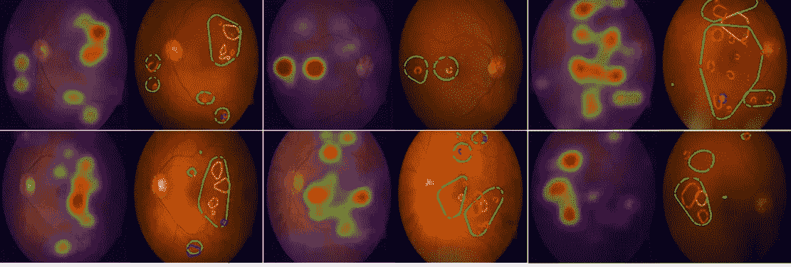

视网膜图像中相关图像区域的定位。在每个图像对中，关联图在左边，标记符号在右边。在*视网膜眼底图像中对糖尿病视网膜病变进行弱监督定位*，*2017*[https://arxiv.org/abs/1706.09634](https://arxiv.org/abs/1706.09634)

在考虑了其他用例之后，出现了以下方法选择标准:

1.  结果的详细程度
2.  方法的类别区分
3.  实施工作
4.  直观的可解释性
5.  模型不可知

*除了列出的要点，当然还有其他标准，如方法的稳健性、实时能力和检测基于颜色的问题的能力(例如黄色的东西自动是香蕉)，这里不考虑这些。*

但是在进行评估之前，让我们首先了解重要的可视化技术的原理

# 一些基于实例的可视化方法

可视化技术的数量是巨大的。除了许多基本概念，还有许多进一步的发展，以弥补特定的弱点。为了得到第一个概观，我们看选定的基于扰动，基于激活，基于反向传播和基于概念的可视化技术。

## 基于扰动的

基于扰动的方法中最简单的方法是基于图像区域的覆盖。如果相关的图像区域被覆盖，它应该(理论上)导致类别概率的降低。因此，图像点及其紧邻的周围环境(例如点周围的 7×7 区域)在灰色或黑色斑块的帮助下被系统地覆盖，并且观察分类概率的变化。方法叫做**遮挡** *(* [*学习深度特征进行判别定位，2015*](https://arxiv.org/abs/1512.04150) )。在下图中，根据正确类别的分类概率(作为覆盖位置的函数),形成了结果热图。在这个例子中，上面的图片被归类为博美犬。如果头部区域(图像的中心)被覆盖，则类别概率降低(右上方图像中的蓝色区域)。因此，这个区域对于将图片归类为博美犬非常重要。

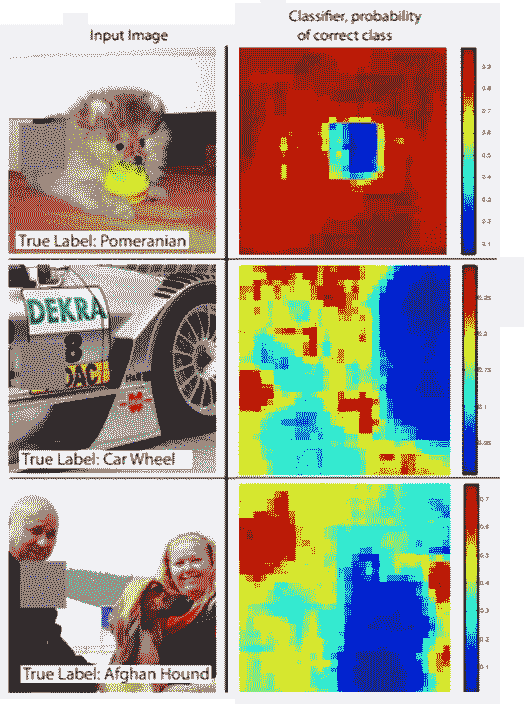

在图像上系统地移动遮挡片，以检查图像部分的相关性。在学习深层特征进行鉴别定位[https://arxiv.org/abs/1512.04150](https://arxiv.org/abs/1512.04150)

关于执行时间，在基于遮挡的方法的情况下，必须为每个覆盖步骤再次确定类别概率。因此，可视化方法的执行时间会受到补片的大小和步长的影响。然而，这通常高于其他方法。

使用均匀、连续补片的替代方法是**区域遮挡**方法。这里涵盖了与上下文相关的领域，这些领域来自于应用程序上下文。例如，在一篇关于阿尔茨海默病检测的论文( [*可视化卷积网络用于阿尔茨海默病的基于 MRI 的诊断，2018*](https://arxiv.org/abs/1808.02874) )中，可以通过 3D MRI 扫描来使用预定义的大脑区域，然后用 3D 补丁连续覆盖这些区域。由此通过自动解剖分割算法分割大脑区域。 *实际上，由于可视化技术是基于实例的，因此图像片段的先验定义是一个不容低估的挑战。因此，作为准备，必须对每个单独的图像执行明确的分割。*

还根据覆盖的区域来确定区域遮挡对分类结果的影响。下图比较了两种基于遮挡的方法的结果。相关区域以红色强度的增加来标记。

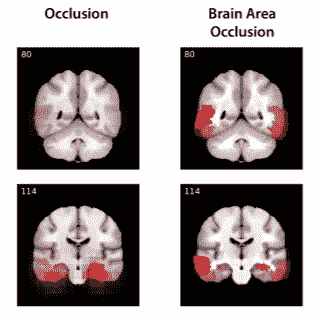

遮挡和区域遮挡可视化方法的比较。用红色标记的区域被认为与增加的颜色强度更相关。在可视化卷积网络用于基于 MRI 的阿尔茨海默病诊断中[https://arxiv.org/abs/1808.02874](https://arxiv.org/abs/1808.02874)

可以看出，两种方法的结果是不同的。在区域遮挡的情况下，大脑区域在叠加后仍然容易识别，这为评估者提供了更容易的解释途径。然而，因为每步只覆盖一个大脑区域，所以几个切片之间的边界重叠效应是检测不到的。因此，与其他方法相比，相关性图是不同的。

此外，基于覆盖的方法被认为对于 MRI 扫描具有有限的效用，因为片的灰色指示了上下文中的脑物质的性质。因此，连续的灰度值可以指示组织萎缩，这增加了在一些大脑区域中阿尔茨海默病的分类概率。由此可见，可视化方法是有偏差的！

## 基于反向传播的

下一组可视化方法使用反向传播来导出图像区域的相关性。

最简单的方法( [*可视化与理解卷积网络，2013*](https://arxiv.org/abs/1311.2901) )利用一个 CNN 的训练过程中的一个已知产物:通过梯度来估计每个像素的影响。这是通过类分数的偏导数创建的。
对于灰度图像，梯度的绝对幅度用于相关性图。较高的梯度表示像素的相关性较大。对于彩色图像，要么使用三个颜色通道上的梯度的最大绝对幅度，要么将所有颜色通道的绝对梯度叠加在图像上。由于梯度是通过反向传播确定的，该方法被恰当地称为**传统反向传播**或 **VisCNN** 。快速执行计算，无需进一步准备图像。

在下图中，显示了一种鸟的分类的关联图。相关性被归一化为从 0(不相关)到 255(最大相关)的范围，因此可以表示为灰度值。因此，亮区对于分类至关重要。尤其是在鸟的眼睛区域和领毛前面的秃顶区域。

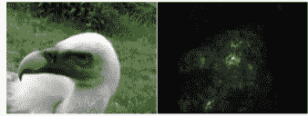

彩色原始图像(左)和通过反向传播创建的相应显著性图(右)。在可视化和理解卷积网络中，2013 年[https://arxiv.org/abs/1311.2901](https://arxiv.org/abs/1311.2901)

根据开发人员的说法，得到的显著图主要适用于执行弱监督对象定位。所得的相关性图用于将前景与背景分开。这些由显著图的像素灰度值的统计确定的阈值来定义。

尽管如此，这种形象化的解释看起来还是有点混乱，不是吗？它可以用一个简单的想法进一步发展，从质量上提高产量。

**引导反向传播** ( [*力求简单:全卷积网，2015*](https://arxiv.org/abs/1412.6806) )方法的基本思想是，神经元就像某些特征的检测器。对于可视化来说，重要的只是神经元恰当地检测到什么，而不是错误地检测到什么。
如果在更深的层中检测到另一类的特殊概念(例如狗的耳朵)，则该非类概念可能对正确类(例如猫)的类概率有负面影响。这种负面影响可以追溯到一个像素。如果此像素还涉及另一个相关的类(！idspnonenote)。)概念(例如。猫眼)，负面影响部分压制已有的正面影响。在解释的情况下，只有对分类决策有积极影响的因素才应该在可视化中突出显示。
因此，如果梯度通过使用反向传播的网络，所有 ReLu 层的负梯度被设置为零。这防止了负梯度的传播，从而过滤了负面影响。
下图比较了反向传播和引导反向传播对彩色图像的分类。这里可以看到，引导反向传播(右)相对于相关区域形成了更清晰的图像。对分类至关重要的小猫的眼睛和轮廓被更好地突出。

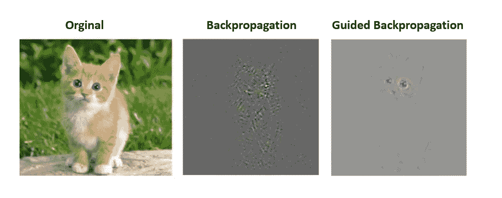

用于彩色图像分类的反向传播和引导反向传播的比较。追求简单:全卷积网络，2015 年[https://arxiv.org/abs/1412.6806](https://arxiv.org/abs/1412.6806)

然而，提出的梯度偏向方法的弱点是可视化方法没有明显的类别区分。

另一种方法使用反向传播而不是梯度来构建相关性图。**逐层相关性传播(LRP)** ( [*关于通过逐层相关性传播对非线性分类器决策的逐像素解释，2015*](https://journals.plos.org/plosone/article?id=10.1371/journal.pone.0130140) )使用训练好的网络的内部权重和激活函数来构建相关性图。在这个过程中，相关性分数通过网络从输出层传递到输入层。每个神经元根据它的重量得到它的份额。
下图显示了 LPR 获得的相关热图。负面影响用冷色调标出。最可能类别的相关性得分显示在图下方的条形图中。这张截图是通过一个[交互式在线工具](https://lrpserver.hhi.fraunhofer.de/image-classification)获得的，用来测试可视化技术。

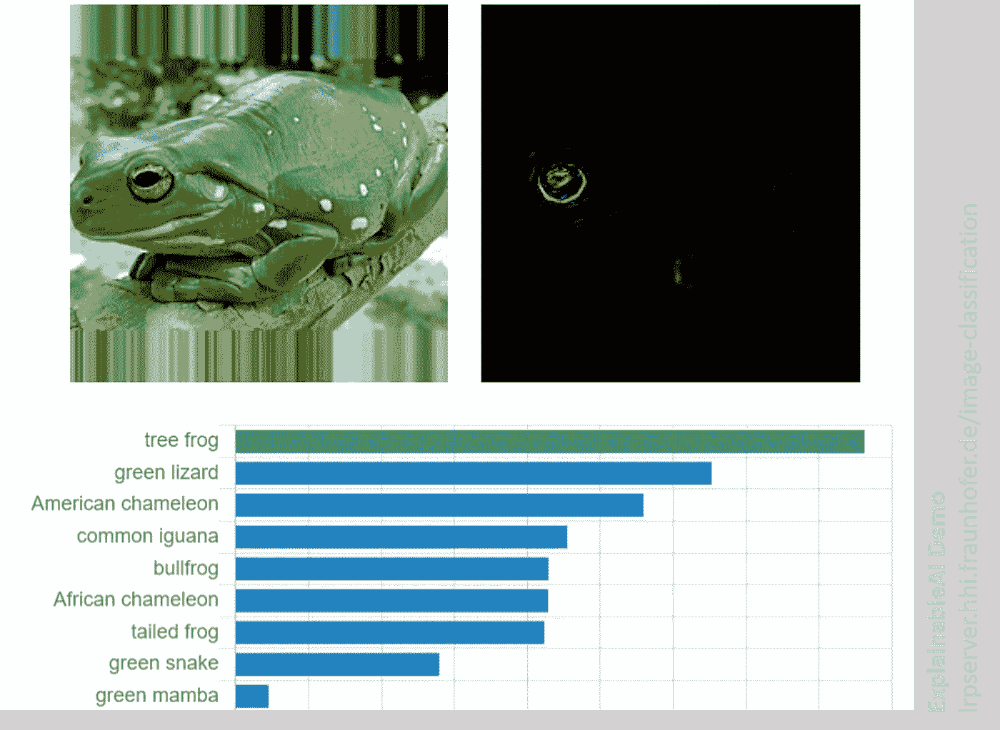

LPR 获得的牛蛙分类热图。

在 Softmax 梯度逐层相关传播扩展( [*讲解使用 Softmax 梯度逐层相关传播的卷积神经网络，2019*](https://arxiv.org/abs/1908.04351) )中，减少了可视化中非目标类的比例，从而提高了类区分度。

## 基于激活

对于另一组可视化方法，使用卷积网的结构。他们利用后螺旋层的激活。但是让我们从前面开始。CNN 的输入由空间排列的数据组成。这些通过 CNN 的前部。在此过程中，空间结构得以保持。随着网络深度的增加，卷积层对越来越高级别的视觉表示进行编码。虽然在第一层中识别出诸如边和角的一般结构，但是这些结构被组合成图案，并且对于更深的网络，被组合成整个结构。对于分类，通过展平层解析结构。因此，关于空间环境的信息因过渡而丢失。在网络的最后一部分，数据通过完全连接的神经元层进行图像的最终分类。
因此在基本思想中，大部分信息因此在网络的最后卷积层中，因为提取的图像信息和空间排列在这里一起出现。

直接利用这些信息的方法叫做**类激活映射(CAM)** ( [*学习深度特征进行判别定位，2016*](https://arxiv.org/abs/1512.04150) )。它是在特殊网络的背景下引入的，这些网络放弃了完全连接的层，以便最大限度地减少参数的数量，同时保持高性能并避免网络过拟合。为此，在末尾引入了全球平均池。采用这种策略的第一个网络是网络中的网络(NIN)。在那里，更详细地介绍了这个想法。

下面是简短版 **:** *全局平均池(GPA)的基本操作是最后一个卷积层的三维张量(h x w x d)要降维(1 x 1 x d)。因此，每个特征图(h×w)减少到一个数字。特征图的全局平均值用于这种减少。*

与 CAM 相关的可视化是借助于所选图像类别的全局平均池来形成的。这个过程可以在下图中直观地描绘出来。所示网络主要由卷积层组成。在实际输出层之前使用全局平均池。通过将输出层的权重(w_i)投影回特征映射来形成类别激活映射。因此，类别激活图是特征图的加权和。

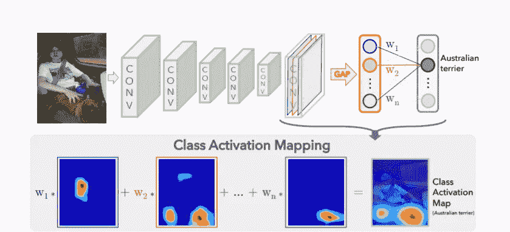

形成类激活图的示意性过程。在*学习深度特征进行鉴别定位，2016*https://arxiv.org/abs/1512.04150

在 CNN 中，特征图的维度在卷积层上减小。因此，以这种方式确定的类别激活图不能简单地转移到原始图像，而是必须首先使用双线性插值按比例放大到原始大小。这就是热图平稳过渡的原因。此外，这导致了细节水平的限制。

在下图中，该方法用于解释圆顶图像的错误分类。根据是一座教堂还是一座宫殿被认出来，焦点更多的是在塔上或者整个建筑的下半部分。宫殿类得分最高，正确的圆顶类得分第二高。在这种情况下，在基于实例的可视化的支持下，可以很容易地理解错误分类。

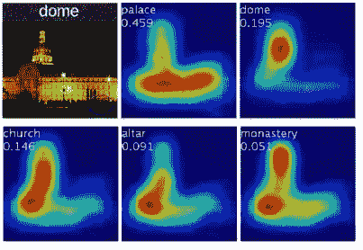

具有相关类别分数的圆顶图像的 5 个最可能类别的类别激活图。在*学习深度特征进行鉴别性定位，2016*https://arxiv.org/abs/1512.04150

在所描述的网络架构中，可视化不需要任何进一步的准备。仅需要在分类过程中创建的输出图层的特征地图和权重。这使得这个方法[可以实时使用。](http://cnnlocalization.csail.mit.edu/)
不使用全局平均池的现有网络不适合无自适应的方法。因此，该方法不是模型不可知的。

**梯度加权类激活映射** ( [Grad-CAM *通过基于梯度的定位来自深度网络的视觉解释，2016*](https://arxiv.org/abs/1610.02391) )的进一步发展是由推广 CAM 方法并使其可用作具有例如几个全连接层的其他网络架构的分类器的需求推动的。使用空间信息的基本思想保持不变。区别在于形成特征图的权重。基于梯度计算新的权重。这里，基于特征图的宽度和高度维度中的相应梯度来确定特征图的全局平均值。随后，应用 ReLU 函数进行滤波。只要特征图后面的后续层是可微分的，就可以为每个网络架构计算梯度。

剩下的职业激活图细节解析的问题随着**Guided Grad-CAM**([*Grad-CAM:为什么这么说？，2017*](https://arxiv.org/abs/1611.07450) )。这种可视化方法结合了 Grad-CAM 的分类识别和引导反向传播的细节。为此，进行结果图的逐点乘法。
在下图中，该程序专门用于理解错误分类。左边的图像列处理的是一个火山的图像，它被错误地归类为汽车镜。可以看出，天空和椭圆形截面有助于汽车后视镜的选择。

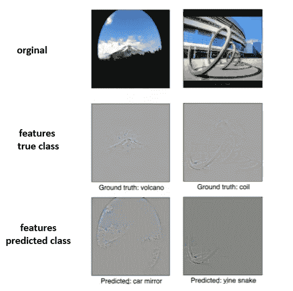

通过 Grad-CAM 可视化突出失败的原因。你为什么这么说？[https://arxiv.org/abs/1611.07450](https://arxiv.org/abs/1611.07450)

## 基于概念的

最后，提出了一种新的基于概念的框架**模型不可知概念提取器(MACE)** ( [*MACE 模型不可知概念提取器用于解释图像分类网络，2020*](https://arxiv.org/abs/2011.01472) )作为可视化方法。这种方法是基于人类的感知。这里，在图像中发现了单独的概念(像耳朵、腿、纹理)，这导致了相应的分类。

*框架的功能*
可理解的解释是通过几个组件的交互来提取的。不需要特定的模型架构。MACE 框架模块化地附加到预训练 CNN 的卷积层之一，并在再训练的环境中配置。除了来自上游卷积层的空间信息之外，还使用了来自网络分类器部分的区别特征。使用图像和相应的类标签启动基于实例的可视化。从而返回低级概念及其与类输出的相关性。

*框架的组件*
概念使用四个模块学习和提取。组件映射生成器、嵌入生成器、相关性估计器和输出生成器的排列如下图所示。

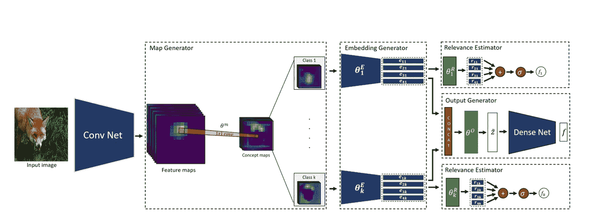

MACE 框架的体系结构。在梅斯模型不可知的概念提取器中解释图像分类网络，2020[https://arxiv.org/abs/2011.01472](https://arxiv.org/abs/2011.01472)

*地图生成器*从每个图像的最后一个卷积层(特征地图)的输出中估计概念图。从特征图中，基于图像中的显著性来确定概念的活动模式。MACE 框架通过加权平均来组合特征图的通道，以找到概念的单个激活模式。相关联的显著区域被用于后验可视化，以使概念能够被人类理解。

激活模式被传递给*嵌入发生器*。它将概念的外观转化为对空间信息不变的潜在表示。出于这个目的，一个类的概念图被集中考虑并抽象成特定的概念。这是通过多层密集神经网络来完成的。

*相关性估计器*确定特定类别概念对于模型输出的重要性。最后，*输出生成器*将提取的概念传递给预训练模型的第一密集层，以提高解释力。

下图显示了如何使用该框架来找到错误类的类分数的解释。在第一行中，狐狸的耳朵被显示作为对德国牧羊犬类的解释。相似性是可识别的，有助于用户理解分类决策。

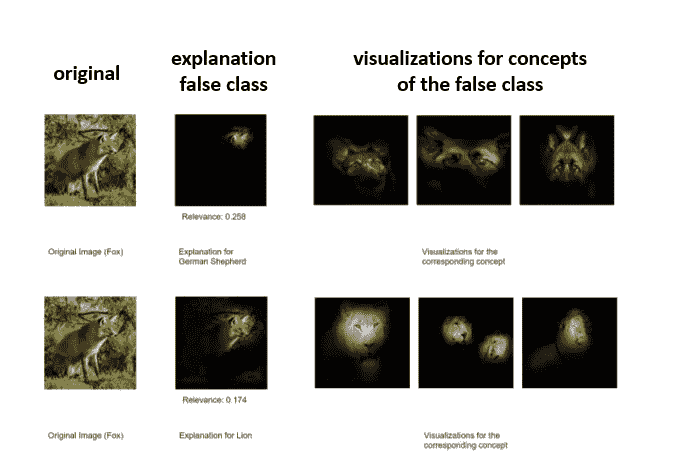

基于错误类别的概念对错误分类的解释。在梅斯模型不可知的概念提取器中解释图像分类网络，2020[https://arxiv.org/abs/2011.01472](https://arxiv.org/abs/2011.01472)

# 最好的方法是什么？

一如既往，复杂问题的解决方案并不简单明了。正如你已经注意到的，方法是非常不同的(不仅是从基本原理上)。好在我们已经提前想好了评价。下表总结了评估结果。

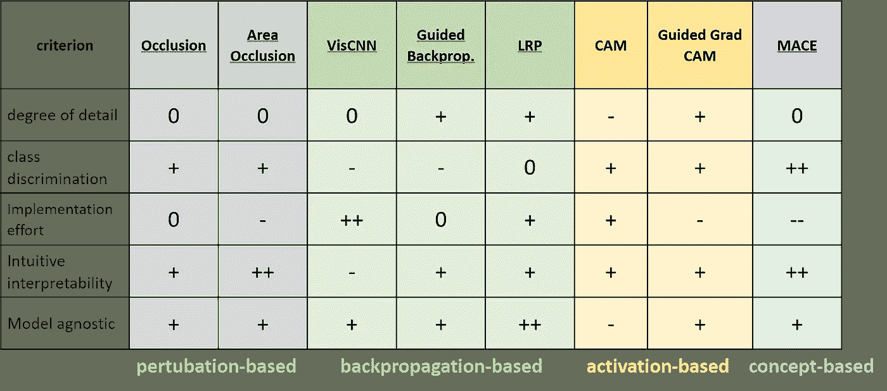

所提出的可视化方法的评估结果的概述。评级尺度指的是用户的观点。非常积极(++)和积极(+)是有利的(例如，很少的实施工作或高水平的细节)，中性(0)和消极(-)相应地。

基于**遮挡的方法**是区分类别的。因为它们是通过修改图像的重复分类来执行的，所以它们是模型不可知的，但是需要一些努力来实现它们。尤其是区域遮挡需要预先执行图像分割，这导致更大的工作量。反过来，这种方法带来了可解释性的提高。细节层次基本上可以通过选择覆盖补丁的大小来调整，但是这会导致运行时间更长。
*如果用户正在寻找一种易于理解并且不需要复杂的深度学习知识的可视化技术，那么区域遮挡方法可以很好地使用。*

基于**反向传播的方法**计算速度快，并且易于实现提供详细相关性图的方法。然而，这对于传统的反向传播方法来说很难解释，因为在可视化中没有创建焦点。这个问题可以通过引导反向传播来解决。由于反向传播的简单使用，这些方法适用于所有网络架构。LPR 本身适用于其他模型类型，如支持向量机。(不可知模型的加分！)
*引导反向传播的一个合适的用例是理解图像中只出现一个对象的分类决策。然后，可以利用颜色通道的附加信息来检测有助于分类的特征。特别是在医学分类任务中，精细结构是至关重要的，这通过引导反向传播得到很好的强调。*

**基于激活的方法** CAM 并不通过对最后一个卷积层的压缩信息进行放大来显示详细信息，而是依赖于具有 GPA 层的特殊网络结构。然而，该实现非常容易实现，并且给出了可视化的类依赖性。作为引导式 Grad-CAM 的进一步发展，将引导式反向传播与 Grad-CAM 过程相结合。因此，在这里可以实现模型诊断，并且增加了细节级别。
*Guided-Grad-CAM 方法特别适用于图像中的多重分类，其中一方面应突出特定对象，另一方面应突出特征。*

提出的**基于概念的方法** MACE 显然是模型不可知的。概念区域通过涂黑不属于它们的图像部分来显示。像边和角这样有助于分类的细节不会以这种方式突出显示，只会突出整个概念。然而，这种方法极大地增强了直观的可解释性，因为这种表示适应于人类的感知。由于提取了特定于阶级的概念，阶级区分得到了特别好的发展。由于许多组件和概念的再培训，实现工作增加了。
*基于实例的可视化方法 MACE 特别适用于错误类的现有类分数的误分类和解释的考虑。该方法最适合非人工智能专家。*

# **结论**

现在我们知道许多不同的基于实例的可视化技术。
如果你现在想知道如何使用所介绍的技术之一来使你的下一个深度学习项目取得成功，那么最后但同样重要的是一个实际的例子。

如果你的训练数据带来了隐藏的偏差，它们就不容易被发现。这里，CNN 被用来划分年龄和性别。利用逐层相关性传播，正面影响(暖色)和负面因素(冷色)可以被解码。这有助于检测偏差。自己看看吧！

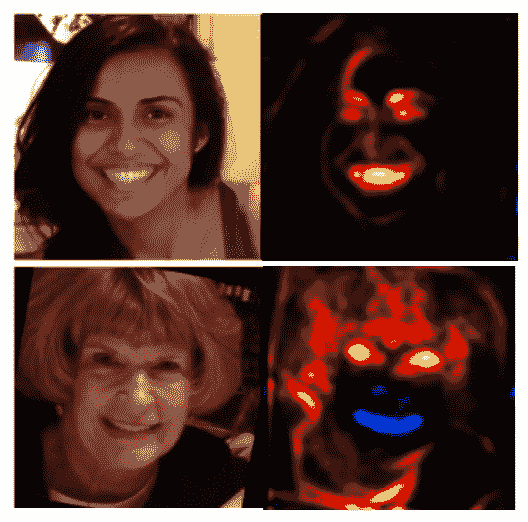

CNN 对老年人有趣行为的偏见通过基于实例的可视化揭示出来。蓝色违背了适当的分类。在理解和比较用于年龄和性别分类的深度神经网络中，2017[https://arxiv.org/abs/1708.07689](https://arxiv.org/abs/1708.07689)