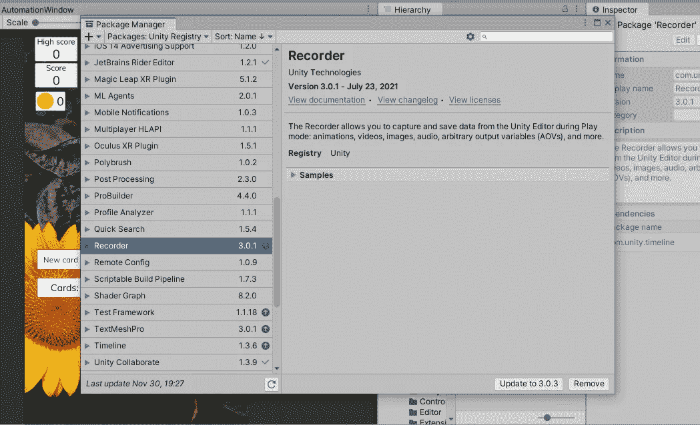
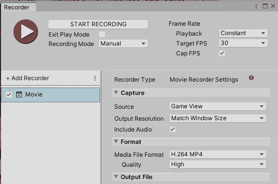

# 如何在 Unity 中为游戏录制视频

> 原文：<https://medium.com/nerd-for-tech/how-to-record-videos-for-your-game-in-unity-bfb172c073a6?source=collection_archive---------6----------------------->

当你需要为你的游戏制作宣传片和预告片时，你用什么工具？

Unity Recorder 允许您在编辑器中轻松创建游戏视频。

我将在本文中向您展示如何使用它。

首先，您需要使用软件包管理器安装它。

Unity 记录器，已经安装在我的项目中

从**窗口**菜单项中选择**通用>记录仪>记录仪窗口**启动记录仪。

这将打开记录器窗口

如你所见，我已经添加了一个电影录像机，方法是点击**添加录像机**按钮，并从下拉菜单中选择**电影**。这里有相当多的选项，我不会解释。您可以在本文末尾的链接中找到关于它们的更多信息。

现在我需要做的就是点击**开始录制**按钮，我就可以开始录制我当前场景的高质量视频，如果它还不在里面，就会进入播放模式。

这是我用它制作的一个视频:

有关如何使用 Unity Recorder 的更多信息和更详细的教程:

 [## 使用 Unity 记录器- 2019.3 - Unity Learn

### Unity Recorder 是一个编辑专用工具，允许您录制项目的图像或视频。在本教程中…

learn.unity.com](https://learn.unity.com/tutorial/working-with-the-unity-recorder-2019-3#5e1efe36edbc2a00f36bd675) 

在你的游戏项目中，你还用哪些方式录制视频？请在下面留言告诉我！