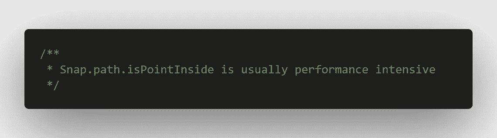
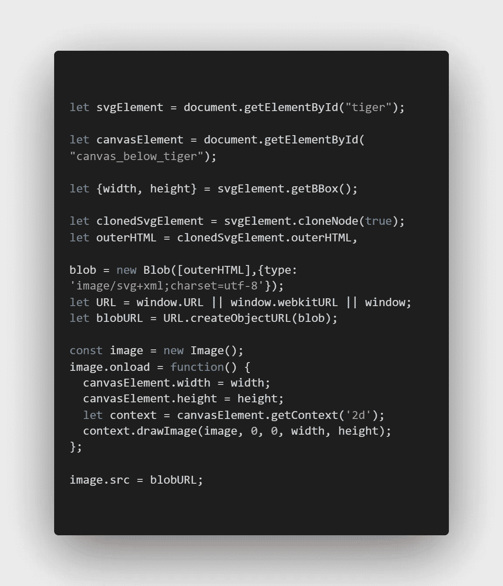
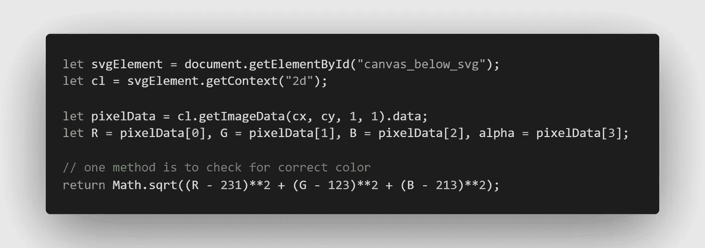

# 如何用画布替换静态 SVG 的 Snap.path.isPointInside？

> 原文：<https://medium.com/nerd-for-tech/how-to-replace-snap-path-ispointinside-of-a-static-svg-with-a-canvas-969a346dc32e?source=collection_archive---------20----------------------->

## Snap.path.isPointInside 通常是性能密集型的

[***tiger . SVG***](https://gist.github.com/nscalo/e6b092cb62c32da8f633fd7937faeb4c)

> 对于大的路径字符串，Snap.path.isPointInside 通常是性能密集型的。对于这种情况，创建一个位于可用 SVG 下面的 canvas 元素。

**画布代码转换**

> 一旦 SVG 的图像截图在画布中，一种方法是检查 R、G、b 的颜色是否正确。

