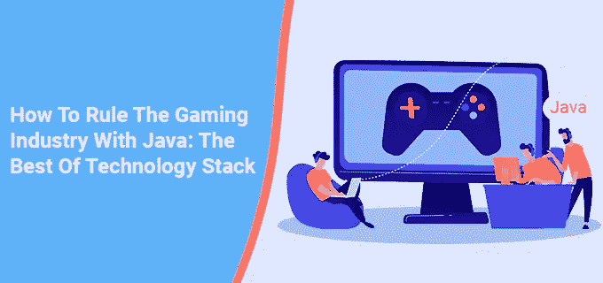

# 如何用 Java 统治游戏行业:最好的技术堆栈

> 原文：<https://medium.com/nerd-for-tech/how-to-rule-the-gaming-industry-with-java-the-best-of-technology-stack-c6c8edc13557?source=collection_archive---------6----------------------->

## **目录:**

*   [简介](#1c72)
*   [Java 游戏编程初学者:从哪里开始？](#0f3a)
*   [Java 游戏编程的来龙去脉](#a461)
*   [Java 游戏改进费](#21b0)
*   [作为虚拟人，我从哪里开始 Java 游戏开发？](#efda)
*   [总结](#a801)

# 介绍

这一代游戏的绝对魅力随着所有新奇的技术惊喜而与日俱增。然而，只有幕后工作人员才能理解要超越任何可理解的编程方法需要付出多少努力。此外，游戏设备现在真的是一个怪物。因此，显而易见的是，对于任何游戏开发，开发人员都会在更高的抽象程度上工作。

从技术上来说，一旦游戏的初始设计达成一致，就必须选择开发语言。然而，在所有语言中，Java 是最受欢迎的语言之一，因为它有外包服务的巨大好处。选择取决于许多标准，包括编程人员对语言的经验、目标平台、所需的执行速度、任何游戏引擎的语言、API、使用的库或技术堆栈。

最常见的编程语言通常是过程化的或面向对象的，并且使用编译器来实现；例子包括 C、C++和 Java。开发人员可能会考虑特定领域的问题，如与操作系统的互操作性和对在线视频游戏逆向工程的抵抗力。许多游戏不是主要用一种语言编写的，而是可能包含两种或更多种语言。

在本文中，我们将关注 Java 以及作为初学者如何使用它。

# Java 游戏编程初学者:从哪里开始？

Java 被非主流游戏开发组织广泛用于制作灵活的游戏。此外，考虑到这种语言的多功能性和它的大量开源信息，这不应该是一个特别大的冲击。大量的世界顶级便携式游戏都是用 Java 开发的。[像《《我的世界》》](https://www.theserverside.com/podcast/Java-video-games-like-Minecraft-keep-the-language-popular)、《碟中谍 3》、《柏油路 6》这样的手机游戏，以及 1 Gb 内存以下的最优秀的电脑游戏，不仅仅是你可能熟悉的几个知名游戏。

# Java 游戏编程的细节

Java 并不难使用，所以一个新手可能知道如何构建一个项目范围和编写可重用的代码，有效地在 PC 框架之间转换。与 C++等编程方言相比，Java 易于编写、研究、学习和收集。

如果您正在为业余爱好者研究 Java 游戏编程，您需要先了解使用这种语言编码的基本知识。之后，会有大量的各种各样的空缺职位向你介绍自己。意识到你可以选择在游戏中获得新的工作，这会让你更容易放下心来学习语言。

# Java 游戏改进费

关于薪水，重要的是你的级别(初级、中级、高级)，而不是工作头衔。根据 GlassDoor 的说法，如果你正在寻找一个没有经验(或接近经验)的段落级游戏软件开发员的部门级职位，你每年可以赚大约 65，433 美元。你的经验越多，你的职位就越高，因此，你的报酬也会增加。一个游戏设计师的平均工资是 65000 美元，尽管它可以达到每年 103000 美元。

如今，在线游戏也越来越受欢迎。在像 Winz 这样的比特币赌场中，多个游戏完全用 Java 资源创建。这只是一个例子。Java 开发人员有很多工作机会。

# 作为虚拟人，我从哪里开始 Java 游戏开发？

Java 是一种简单易学的应用层编程语言。你不需要任何编程知识就可以开始学习如何用 Java 编码；这种语言组织良好，前后一致，非常适合初学者。

*   Java 核心:这是第一步。
*   Java 的基本语言结构:组件(对象、技术和类)、原始数据类型、字符串、循环和分支、数组等等。
*   学习 oop 的基础知识:什么是对象，什么是抽象，什么是继承，什么是封装，什么是多态，什么是类和接口，什么是内部类。
*   java 集合框架定义了许多类和接口，用于将项目集合作为一个单元进行寻址。
*   java 集合和映射接口的利用及其执行(列表、映射、集合)。
*   Java 异常:该工具增强了软件调试。每个特例类都是 java.lang 的子类——异常类。
*   信息/输出流:java 通过流处理输入和输出操作。根据定义，流是不间断的信息流。
*   java 中的多线程是一个真正令人困惑的主题。事实上，对于初学者来说，即使是最简单的 thread API 赋值也可能具有挑战性。在任何情况下，它都是至关重要的，如果你学会了如何有效地使用它，你会非常喜欢它。

## 让自己熟悉 Android 开发的基础知识

Android 的官方网站对于开发者来说是一个极好的信息来源。它包括一个指导你创建第一个 Android 应用程序的教程。如果您已经掌握了 Java Core 的工作知识，那么最好先温习一下游戏组件，比如 GUI(图形用户界面)、游戏图形和物理以及音乐。

## 熟悉 libGDX

[libGDX 是一个跨平台的游戏开发框架](https://dzone.com/articles/make-a-game-with-libgdx-part-1)。因此，您可以为多个平台编写一段代码，包括 Android、iOS、Windows、Linux、macOS 和 Web。它是用 Java 编写的，有一系列有用的特性(比如绘图 API、声音、资产管理和存储)，使游戏制作变得非常容易。它有足够的文档来帮助您开始。

libGDX 构建于 LWJGL 之上，LWJGL 是一个提供 OpenGL 图形库访问的库，包括用于创建 2D 和 3D 游戏的工具。LWJGL 支持 OpenAL(一种用于创建音乐和声音效果的跨平台 API)和 OpenCL(一种跨平台并行编程标准)。

## GitHub 和 git

Git 是最广泛使用的版本控制系统，用于记录对计算机文件的更改，并协调多人对这些文件的工作。每个专业人士都应该熟悉它，以及 GitHub，这是世界上最大的 it 项目托管和协作开发的 web 服务。

虽然一些独立开发者从所有的图像、关卡地图、纹理、角色精灵和纹理地图创建了整个游戏，但是你可能希望在你的初始项目中使用各种来源的免费图片。

一旦你掌握了 Android 应用程序开发，你就可以通过创建游戏开始练习。关于如何在互联网上创建简单的游戏，有许多书面和视频教程。

## 永远不要停止学习——继续练习。

当谈到成为一名开发人员，没有结束游戏。随着技术的进步和人们兴趣的变化，要求越来越高，你必须不断发展你的技能。只要记住把你的时间分配在研究和实践任务上，重点放在实践上。

## 学习 Java 时，请考虑以下几点

你还记得婴儿是如何反复尝试走路、跌倒和爬起来的吗？同样，编程也是一种实践活动。这都是关于应用程序开发的！

在实践之前，你不能确定你理解了概念。除非你理解了 Java 的基本概念，否则你将无法进入下一个层次，也无法涉足更复杂的 Java 编程领域。

因此，专注于实践而不是理论，尤其是在最初的阶段。

## 完美的实践

Java 的流行也意味着实践机会比比皆是。

在 CodeGym 的乐趣中发展你的技能:它是面向新手的。它使您能够构建小游戏和程序，允许您以各种方式检验您对 Java 理论的理解。

利用 w3 资源的适度作业和练习。它的结构是这样的，你可以在做项目的时候验证理论，让你获得编程语言的经验。

## 编码活动的说明

在开始 Java 游戏编程之前，做一些基本的编码练习:

*   逻辑活动，如构建斐波纳契数列或计算整数的阶乘。
*   涉及输入和输出的练习，如列出指定目录中的几个文件。
*   字符串操作的实验，例如替换字符串的单个部分。

一旦您熟悉了 Java 编程语言的基础，您就会想继续学习更复杂的活动，例如:

*   用数字构建金字塔。
*   开发一个双人游戏。请记住，它应该完全是文本。
*   一旦你构建了一个双人游戏，试着对它进行编程，使它可以由一个人在电脑上玩。
*   请记住，每天的练习对于发展您的 Java 编程技能是必要的。

## 利用每一个你可以利用的在线资源

自学 Java 编程时，你必须寻找任何对你有帮助的东西。因为 Java 是一种流行的编程语言，所以有许多论坛、视频课程和在线资源可用。你只需要使用它们！

Java 编程论坛将帮助您熟悉这门语言。Stack Overflow 和 Oracle 的 Java 社区只是在线 Java 论坛的两个例子，在这里，您可以与面临类似挑战的其他人讨论您的 Java 学习经验，并从经验丰富的专业人士那里获得指导。

# 包裹

一旦掌握了基础知识，初学者开始使用 Java 进行游戏开发就很简单了。只需要一点点的承诺、坚持和练习。创建一个学习计划，加入在线网络，参加实践课程，学习理论，并尝试视频教程的帮助。

一旦你掌握了 Java，你就可以开始寻找初级游戏开发人员的工作和实习机会。一旦你获得了一个职位，就要紧跟行业发展，以确保你始终处于领先地位。