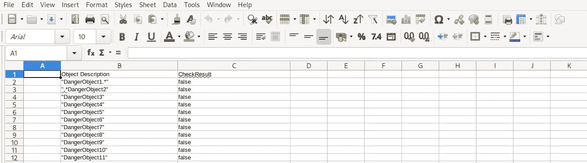
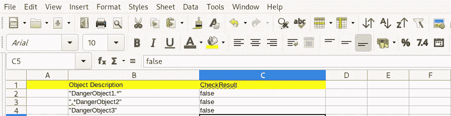
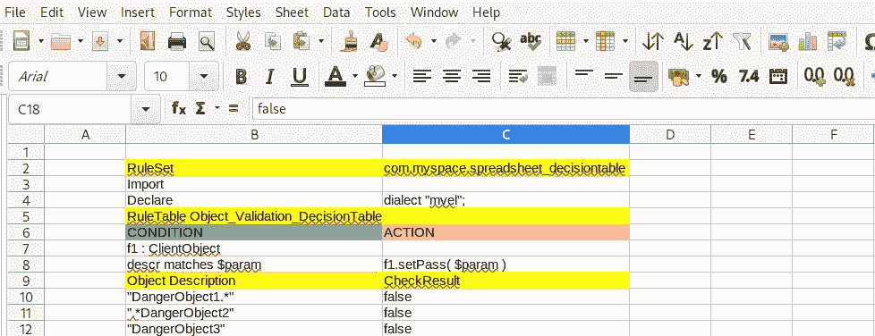

# 如何在 Drools 中处理 100k 行决策表——第 1 部分

> 原文：<https://medium.com/nerd-for-tech/how-to-run-100k-rules-in-drools-7b9308e75687?source=collection_archive---------3----------------------->

# TLDR；

如何在 Drools 中处理 100k 的决策表行？

当处理大量决策表时，一个棘手的问题是性能。在本文中，我准备了一个简单场景的原型设置来模拟大型决策表用例，并提供了三个利用 drools(一个面向规则的应用程序框架)的解决方案。我将关注决策表规则的执行性能。

为了解释问题解决的核心概念，我准备了两个决策表 10k 和 100k 行数据来模拟规则应用中的决策过程。

我在三个 git 分支中提供了 3 个不同的解决方案，对于编码爱好者来说，可以随意直接跳转到下面的 github 链接并检查代码。

[规则-模板-解决方案](https://github.com/ryanzhang/drools-bigtable/tree/rule-template-solution) —使用规则模板+ XLS 原始格式决策表

[预编译-规则-解决方案](https://github.com/ryanzhang/drools-bigtable/tree/precompile-rule-solution) —使用 Kie-Maven-Plugin 预编译格式化的 Drools 决策表

[row-as-fact-solution](https://github.com/ryanzhang/drools-bigtable/tree/rule-template-solution) —使用大量行数据作为事实，而不是规则作为解决方案；

总的来说，我的演示代码中的性能比较如下:

10k 行决策表场景

100K 行决策表场景

(预热时间包括:加载规则和事实、Xls、创建 kiesession 等)

性能差异是显而易见的，但是每种解决方案都有其优缺点。

如果你对这个话题感兴趣，让我来引导你深入细节。

# 情景简介

最近，我帮助一位客户在 drools 中处理了大量决策表，并提供了合理的性能。

通常，在保险、医疗保健或银行、物流行业，必须维护大量数字、规则或关键字或值来计算结果并不罕见。

对于这种情况，通常推荐使用决策表，因为从业务用户的角度来看，它易于理解和维护。

决策表对于处理大量规则非常方便。然而，性能是一个大问题。从前面的表格中可以看出。我的规则框架(例如:本文中的 drools 是一个规则框架)能满足我的性能需求吗？

仅仅编译规则就可能需要几分钟，服务一个规则请求也可能需要几秒钟。

因此，在我的设置中，我构建了一个规则使用场景的原型，它可以重现大型决策表规则触发的用法。

假设我有一个决策表，它将匹配一个关键字，当一个关键字被匹配时，结果被判定为真或假。

当 ClientObject 描述与列表中的关键字匹配时，clientObject.result 为 false，否则 clientObject.result 为 true(注意，我将 true 设为默认值)。

当然，在现实中，做商业决策时有更复杂规则。Drools 为复杂的规则处理提供了复杂的解决方案，例如使用 drl 或将其他规则集成到相同的决策表中。然而，在本文中，我们想要解决的问题是处理大量的行，所以我隐藏了复杂的规则配置。

100k 决策表

为了比较和提高效率，我提供了两个决策表:

10kTable.xls 和 100kTable.xls，其中包含 10k 行和 100k 行。

客户端对象

我们还希望将业务规则代码从应用程序代码中分离出来。所以我们设置了两个独立的 maven 项目

1.  规则—用于存储和管理规则逻辑
2.  myapp —用于维护通用应用程序代码

项目设置

在生产中，我们通常会在独立的流程中运行规则，而不是嵌入到 myapp 中。然而，在我们的设置中，我们主要关注规则的执行性能，所以我们将其简化为在嵌入式模式下运行规则，但是我们将规则打包在一个单独的 jar 文件中((a.k.a [kjar](https://developers.redhat.com/blog/2018/03/14/what-is-a-kjar/) )。嵌入式或独立模式下的规则执行应该没有性能差异。

同样关于 cpu 和内存配置，我的笔记本电脑是 8 核 x 64G。由于决策表很大，在一些测试运行中编译和运行需要大量的计算资源。如果运行 100k 决策表测试场景花费的时间太长，我建议您只运行 10k 决策表场景。默认情况下，我还禁用了 100k 个决策表。你需要按照 github 中的自述来进行主动 100k 决策表测试。

# 解决方案 1 规则模板+ Xls 文件

在 drools 中，我们可以利用规则模板来处理 Excel 文件。

在我的示例代码中，您需要做的主要是 2 个步骤

1.  配置 kmodule.xml 并将 kjar 打包到 maven 项目中(通过使用 kie-maven-plugin)

2.在客户端代码中触发您的规则，如下所示

决策表是普通的 xls 格式:

规则配置在规则模板中管理

语法几乎不言自明。首先将每一列的变量定义为“description”和“result”，然后在 drl 中引用变量@{result}，@{description}。

只要你熟悉 [drools 规则语言](https://docs.jboss.org/drools/release/5.2.0.Final/drools-expert-docs/html/ch05.html)的基本语法，它就相当简单。

注意，规则模板将在决策表的每一行生成 **1 规则。假设您有一个 100k 的行表，那么您的运行时内存中就会有 100k 的规则。**

# 赞成

该解决方案不需要 Excel 数据的特殊标题。标题和条件配置在规则模板中配置。

您可能已经注意到，我们的决策表非常简单:

相比之下，让我们看看电子表格决策表的典型 drools 域名标题是什么样子的:

所以第一个优点是**规则数据很容易**。普通的电子表格更容易被任何不了解 drools 域语法的用户理解和维护。在采用 drools 进行规则管理之前，您可能已经用这种形式维护了业务规则。

配置在一个单独的规则模板文件中管理，该文件可以由不同的人或团队管理。

其次，通过利用规则模板，**对于规则条件和操作来说非常灵活**，因为你可以像任何编码块一样添加多行代码逻辑，而不是将它们放在 Excel 列中，当它变成多行时会失去可读性。

此外，如果您愿意，您可以将规则数据存储在 [DB](https://github.com/kiegroup/drools/blob/master/drools-templates/src/main/java/org/drools/template/jdbc/ResultSetGenerator.java) 或 CSV 中，因为它只是简单的行数据，没有元信息。Drools 提供了处理这个问题的接口。

在某些情况下，用户可能希望通过开发自己的编辑、管理解决方案来自定义规则数据治理。虽然通常我会建议用户使用 kie workbench，它是一个复杂且功能丰富的规则创作和治理工具。但是，如果您想要开发自己的门户或者将规则创作体验集成到现有的应用程序中，那么您可以通过 DB 行数据编辑业务规则，并通过规则模板将它们转换为 drools 规则。

# 欺骗

劣势在我看来也很明显。

1.  原始 Excel 不容易进行版本控制

信不信由你，在面向规则的应用程序中，将业务逻辑与应用程序代码分离是至关重要的。因此，规则数据版本控制是至关重要且困难的。

尽管 drools 社区提供了复杂且功能齐全的治理工具“kie workbench”来管理规则创作和版本控制特性等。遗憾的是，它不能同时识别“规则模板”和原始 Excel 格式。

所以基本上不能导入到 kie workbench 或者导出。

2.表现不好

这可以通过执行我的演示代码中的客户端代码来观察到:

因此，显然对于一个大型决策表，考虑到一个规则的执行可能需要几秒钟，这不是一个理想的解决方案，尽管它非常灵活，并且规则数据很容易通过 excel 文件管理。

我认为有两个原因导致运行缓慢:

1.  有大量的规则，在我的例子中，在我的规则执行会话中有 10K 或 100k 个规则；
2.  将行数据转换成 drools 规则很慢，这会降低应用程序的速度，可能会导致大量的 JVM 开销。

尽管本文主要关注性能，但我认为规则治理至少与性能同等重要。否则，我实际上可以用普通的 java 来处理这个逻辑，而不是使用 drools。

我还看到一些用户选择了部分解决方案:

1.  从规则引擎中分离大行数据
2.  照常在规则引擎中保留其他规则数据

它确实可以通过分离 drools 域之外的挑战来解决性能问题。

我个人认为这也不是一个理想的解决方案，因为它没有把所有的业务规则都放在一个地方。它会渗入或者说污染您的通用应用程序代码。

对于面向规则的应用程序，半桶就像一个空桶。如果不使用 drools 之类的规则应用程序框架，就很难管理 business rules 软件的生命周期，比如编辑、版本控制和部署。

我将在我的下一篇文章的[中描述**解决方案 2 预编译规则解决方案**，我想要修复的问题是:](https://ryanzhangcheng.medium.com/how-to-handle-100k-rows-decision-table-in-drools-part2-2b7fb4de3532)

1.  运行时不要动态加载 Excel 数据，我们在构建时预编译吧；
2.  使用 drools 电子表格决策表，以便它可以被 KIE 工作台“版本控制”；