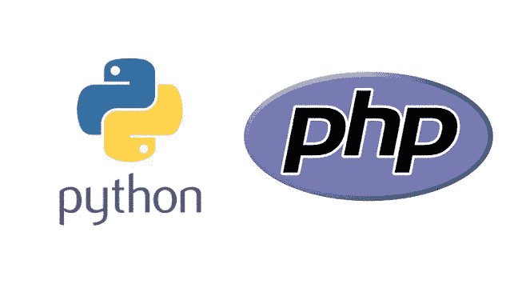
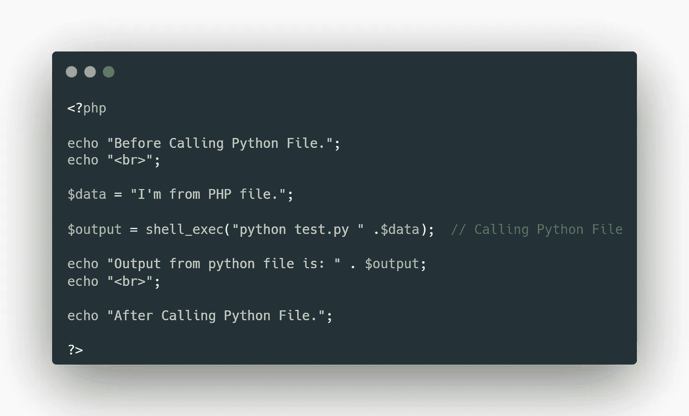
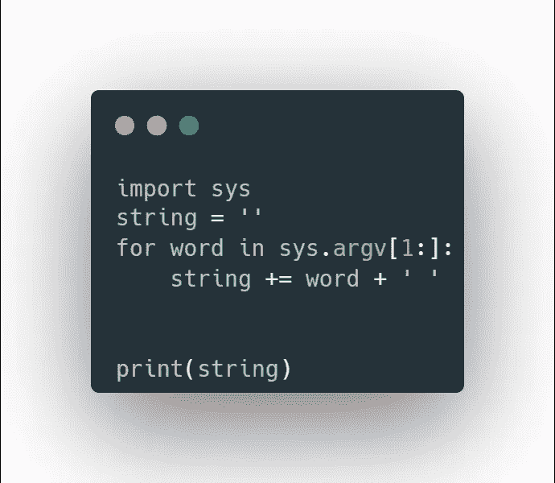
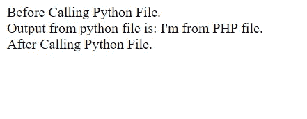

# 如何从 PHP 文件运行 Python 文件！！！

> 原文：<https://medium.com/nerd-for-tech/how-to-run-a-python-file-from-a-php-file-e0758e7b3e3f?source=collection_archive---------0----------------------->

来源:谷歌

看到我们能够设法使用两种强大的编程语言，难道不令人兴奋吗？？？我必须说这将是这两种语言史诗般的结合。所以让我们开始吧！！！

我假设您已经在系统中安装了 **Python** 。我使用的是 Windows 系统，所以我为 PHP 安装了 **Xampp** 。

# 步骤 1: PHP 和 Python 文件

您只需要在当前工作目录中创建两个文件。

1.  index.php
2.  测试. py

# 第二步:PHP 代码

在你的 index.php 文件中，你只需要写这几行来从你当前的 php 文件运行你的 python 文件。

index.php

因此，在这里我们可以看到我们正在调用 shell_exec()函数来调用 python 文件。shell_exec()函数是 PHP 中的内置函数，用于通过 shell 执行命令，并以字符串形式返回完整的输出。

还要注意一件事，我们将一个**字符串数据，而不仅仅是一个单词**从 PHP 文件传递到 Python 文件。所以请仔细观察我们如何在 python 文件中轻松管理它。

之后，我们打印$output 变量来显示来自 python 文件的结果。为了让你理解程序是如何执行的，我还增加了几行代码。

# 步骤 3: Python 代码

在 test.py 文件中，您只需要编写这几行代码来处理传入的字符串数据，并将输出返回到 PHP 文件。

测试. py

这样，我们可以很容易地获取来自 PHP 文件的整个字符串值 print 语句再次返回 PHP 文件。

如果您正确地遵循这一点，您的输出应该是这样的。

在您的浏览器中

# 关键注意事项:

所以，简单回顾一下，作为一名优秀开发人员，有两个重要的主题是您应该认真理解的。

1.  用数据从 PHP 文件调用 python 文件是多么容易。
2.  如何在 python 文件中获取全部数据。

非常感谢你一直读到最后。如果你需要帮助，可以联系我。

***Web:****[*https://ankandas . net lify . app*](https://ankandas.netlify.app/)***insta gram:****[*https://www.instagram.com/ankaninperson/*](https://www.instagram.com/ankaninperson/)***GitHub:*****