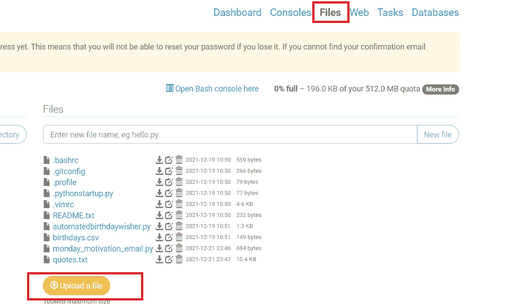
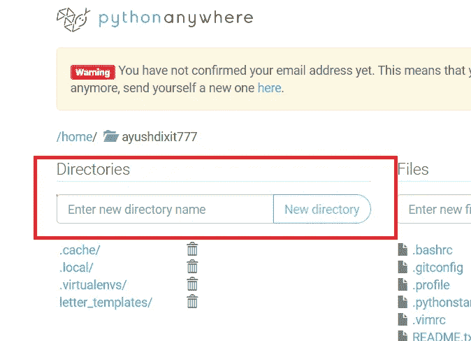
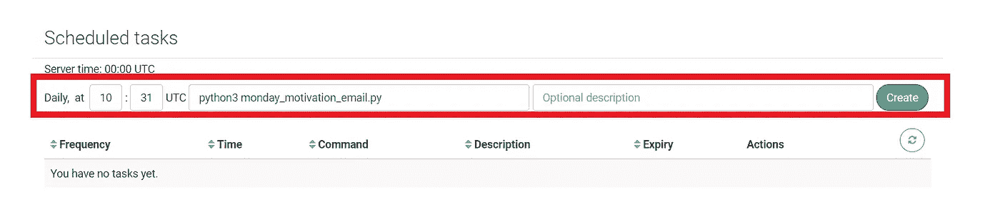
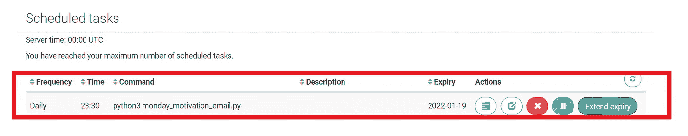

# 如何在云端运行 Python 脚本？

> 原文：<https://medium.com/nerd-for-tech/how-to-run-a-python-script-in-the-cloud-139e8a57eb30?source=collection_archive---------1----------------------->

在编写周一激励邮件的脚本时，基本上是每周一发送一封激励邮件。我面临的挑战之一是如何让它持续运行？

在云中运行相同的 Python 脚本将是答案，因为脚本可以在用户选择的时间每天运行。在抓取网站或安排脚本在特定时间运行时非常有用。

解决方案→pythonanywhere.com 在预定时间提供基于云的脚本执行。

一旦你完成了你的脚本，注册后上传到 pythonanywhere.com。

上传的方法是进入“文件”选项卡，然后单击“上传”。

如果您需要上传支持文件或文本文件，这些文件在另一个文件夹中并在您的脚本中引用。也可以通过创建目录并上传所需的文件来完成。而不改变脚本中的路径。

下一步是运行您的脚本，这可以通过任务栏将其安排为任务来完成。

通过给出如下所示的 python 执行命令来运行脚本。

该任务现在计划在 UTC 时间。我通过一个简单的网站[将 UTC 时间转换为 IST 时间。](https://www.utctime.net/utc-to-ist-indian-converter)

该任务现在已计划好，并且您的 python 脚本每天都在计划的时间运行。恭喜你！

你喜欢我的努力吗？如果是的话，请跟我来获取我的最新帖子和更新，或者更好的是，请我喝杯咖啡！☕

