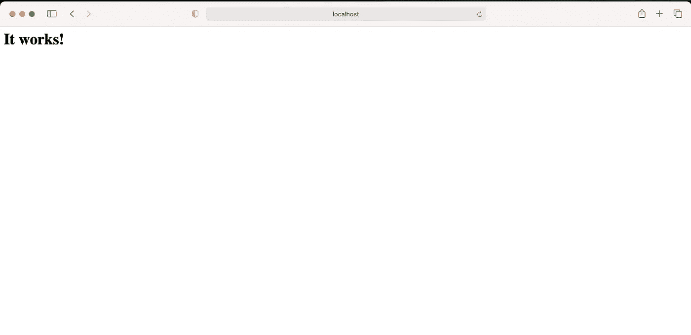
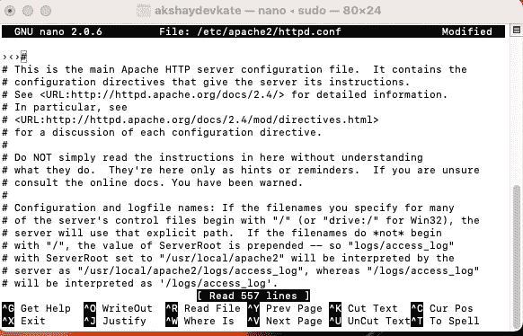
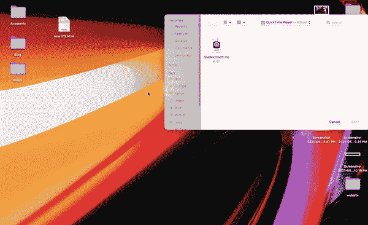
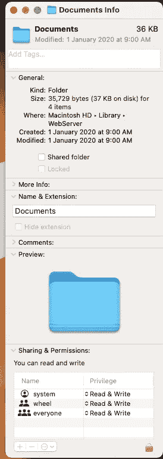
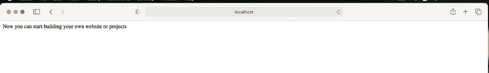

# 如何在 mac OS Big Sur 上安装和运行 Apache，PHP

> 原文：<https://medium.com/nerd-for-tech/how-to-run-apache-php-on-mac-os-big-sur-7ffbf7cbef7b?source=collection_archive---------1----------------------->

克里斯托夫·高尔在 [Unsplash](https://unsplash.com?utm_source=medium&utm_medium=referral) 上拍摄的照片

# 索引

安装 Apache

安装 php

**安装阿帕奇**

Apache 和 php 预装在 mac OS Big Sur 中，你只需要使用终端激活它们。要启动 apache，请在终端中键入以下命令并运行。

> sudo apachectl 开始

您需要在实际命令之前写“sudo”。我们使用 sudo(代表“超级用户 do”)来运行具有更高权限的应用程序。换句话说，它允许普通用户执行系统级任务。安装应用程序或升级操作系统就是例子。典型用户不应该做的事情。一旦你按下回车键执行命令，你将被要求输入系统密码。

为了确保 apache 能够正常工作，请在 web 浏览器中键入以下地址。

> http://localhost

如果一切顺利，你会很高兴“成功了！”浏览器中的消息表明 apache 工作正常。否则你可能会遇到任何错误。

[http://localhost](http://localhost) 的输出图像

**安装 PHP**

运行 apache 服务器后，现在你可以启动 php，打开终端，输入以下命令和密码。

> *sudo nano/etc/Apache 2/httpd . conf*

请记住，对于每个 sudo 命令，您将被要求输入密码。nano 是文本编辑器，在 macOS 和大多数 Linux 发行版上，Nano 文本编辑器是预装的。该命令将在 nano 文本编辑器中打开 httpd.conf 文件。

上面的 nano 文本编辑器将在这里打开，您需要取消注释包含 php 的行(即从前面删除#)。为了节省我们的时间，我们可以在 nano 编辑器中使用(cmd+f)并复制粘贴下面一行。在获得该行之后，您需要取消对它的注释，从开始就是 remove #。

> # load module PHP 7 _ module libexec/Apache 2/libphp 7 . so

一旦你从头开始删除#你需要按 ctrl +x 退出纳米编辑器，你将被要求保存你在纳米文件中所做的更改。

现在您需要重新启动 apache。使用以下命令重新启动。

> sudo apachectl 重新启动

现在我们需要更改本地主机使用的默认文件。再次转到终端，键入以下命令

> *sudo nano/etc/Apache 2/httpd . conf*

搜索以下代码

> *<if module dir _ module>*
> 
> *index.html 董事索引*
> 
> *</if module>*

这表示当我们键入 [http://localhost 时，我们的 web 服务器运行的默认文件。](http://localhost.)现在我们想运行名为 index.php 的文件，为此将它改为以下代码

> 【T2<if module dir _ module>
> 
> index.php·index.html 导演索引
> 
> *< /IfModule >*

这会将默认的可执行文件更改为 index.php。现在，使用以下命令重新启动服务器

> sudo apachectl 重新启动

重新启动服务器后，您可能会遇到用户权限错误，您需要授予用户“读写权限”才能进行更改。这可以用下面的方法来完成。

在上方导航栏的 finder 中，导航到 Finder ->转到->转到文件夹并键入位置/库/web 服务器导航到文档并写入单击“文档”文件夹，然后选择“获取信息”现在导航到“共享和权限”您需要将每个权限从“只读”更改为“读写”。您需要点击窗口底部的黄色锁进入 admin，点击它并输入系统密码进入 admin。稍后，您将能够更改权限。

现在你只需要创建一个 php 文件并运行 web 服务器。因为我们没有。

> *<？php*
> 
> *echo " < title >终于我们做到了</title>"；*
> 
> 现在你可以开始建立自己的网站或项目了。
> 
> *？>*

在以下位置/资源库/WebServer/Document 文件夹中将其另存为 index.php。现在在你的网络浏览器中运行 [http://localhost](http://localhost)

