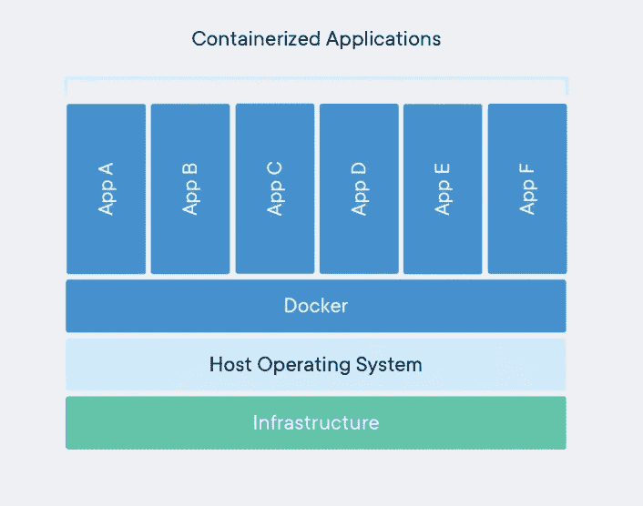

# 如何在同一个 PID 名称空间中运行容器？

> 原文：<https://medium.com/nerd-for-tech/how-to-run-containers-in-the-same-pid-namespace-cd67983516be?source=collection_archive---------2----------------------->

## 容器隔离和 PID 名称空间概述



来自: [Docker Docs](https://www.docker.com/resources/what-container/)

## 容器隔离概述

使用名称空间和 cgroups 将容器与主机内核隔离开来。

**名称空间:**限制每个进程可以看到的内容(例如—其他进程、用户、文件系统)
Cgroups:限制进程的资源使用(例如— RAM、磁盘、CPU)

## Linux 内核名称空间:

名称空间是 Linux 内核的一个特性，它对内核资源进行分区，使得一组进程看到一组资源，而另一组进程看到一组不同的资源。

## 命名空间的类型:

**PID 名称空间:**这种类型的名称空间将进程相互隔离。一个进程看不到其他进程，而且同一个进程 ID 可以存在于多个名称空间中。比如— **进程 ID 1** 可以存在多次，但是在每个名称空间中只能存在一次。

**挂载名称空间:**有一个独立的挂载点列表，由相应名称空间中的进程查看。这意味着我们可以在挂载名称空间中挂载和卸载文件系统，而不会影响主机文件系统。

**网络名称空间:**只允许访问某些网络设备。它有自己的防火墙、路由规则和套接字端口号。因此，它无法看到所有流量或联系所有端点

**用户名称空间:**使用一组不同的用户 id 和组 id。例如—一个命名空间中的用户(0)可能与另一个命名空间中的用户(0)不同。

但是为了安全起见，建议不要在容器内部使用 root 用户(0)。

让我们运行两个 docker 容器，看看它们是如何相互隔离的:

**●集装箱 1: c1**

```
>> docker run --name c1 -d ubuntu sh -c 'sleep 1d'

>> docker exec c1 ps aux

USER         PID %CPU %MEM    VSZ   RSS TTY      STAT START   TIME COMMAND
root           1  0.1  0.0   2880  1004 ?        Ss   03:57   0:00 sh -c sleep 1d
root           6  0.0  0.0   2780  1056 ?        S    03:57   0:00 sleep 1d #**
root          12  0.0  0.0   7052  1588 ?        Rs   03:57   0:00 ps aux
```

**●容器 2: c2**

```
>> docker run --name c2 -d ubuntu sh -c 'sleep 365d'

>> docker exec c2 ps aux

USER         PID %CPU %MEM    VSZ   RSS TTY      STAT START   TIME COMMAND
root           1  0.1  0.0   2880   964 ?        Ss   04:00   0:00 sh -c sleep 365d
root           6  0.0  0.0   2780  1008 ?        S    04:00   0:00 sleep 365d
root           7  0.0  0.0   7052  1576 ?        Rs   04:00   0:00 ps aux
```

我们已经创建了两个名为**【C1】**和**【C2】**的容器。我们可以看到“c1”容器无法看到“c2”的过程，反之亦然。

但是由于这两个容器运行在同一个 Linux 内核上。从主机可以看到容器内部运行的进程。但是进程 ID 会有所不同，因为它是使用 PID 名称空间隔离的。因此，我们可以说容器只不过是运行在 Linux 内核上的一组进程。

从 Linux 内核检查进程:

```
>> ps aux | grep -i sleep

root     46938  0.0  0.0   2880  1004 ?      Ss   03:57   0:00 sh -c sleep 1d
root     46973  0.0  0.0   2780  1056 ?      S    03:57   0:00 sleep 1d #<--
root     48280  0.0  0.0   2880   964 ?      Ss   04:00   0:00 sh -c sleep 365d
root     48366  0.0  0.0   2780  1008 ?      S    04:00   0:00 sleep 365d #<--
```

在上图中，我们可以看到在“c1”和“c2”容器中运行的进程可以从 Linux 主机上进行检查。

## 在同一个 PID 名称空间中运行容器:

现在，我们将尝试在同一个 PID 名称空间中运行容器。如果我们能够做到这一点，那么在同一个 PID 名称空间中运行的容器将会看到彼此的进程。

让我们删除**“C1”**容器，然后我们将尝试在**“C2”**容器的 PID 名称空间中创建它:

```
>> docker rm c1 --force
```

让我们尝试在同一个 PID 名称空间中运行两个容器。

```
# run container "c1" within the same namespace of the "c2"
>> docker run --name c1 --pid=container:c2 -d ubuntu sh -c 'sleep 1d'

>> docker exec c1 ps aux
USER         PID %CPU %MEM    VSZ   RSS TTY      STAT START   TIME COMMAND
root           1  0.0  0.0   2880   948 ?        Ss   04:00   0:00 sh -c sleep 365d
root           6  0.0  0.0   2780  1008 ?        S    04:00   0:00 sleep 365d
root          12  0.0  0.0   2880   964 ?        Ss   04:11   0:00 sh -c sleep 1d
root          17  0.0  0.0   2780  1056 ?        S    04:11   0:00 sleep 1d
root          18  0.0  0.0   7052  1580 ?        Rs   04:11   0:00 ps aux

>> docker exec c2 ps aux
USER         PID %CPU %MEM    VSZ   RSS TTY      STAT START   TIME COMMAND
root           1  0.0  0.0   2880   948 ?        Ss   04:00   0:00 sh -c sleep 365d
root           6  0.0  0.0   2780  1008 ?        S    04:00   0:00 sleep 365d
root          12  0.0  0.0   2880   964 ?        Ss   04:11   0:00 sh -c sleep 1d
root          17  0.0  0.0   2780  1056 ?        S    04:11   0:00 sleep 1d
root          23  0.0  0.0   7052  1644 ?        Rs   04:12   0:00 ps aux
```

现在，我们可以看到两个容器运行在同一个 PID 名称空间上，并且能够看到彼此。

> *如果你觉得这篇文章很有帮助，请点击* ***跟随*** *👉******拍拍*** *👏* *按钮帮助我写更多这样的文章。
> 谢谢🖤***

## ***👉所有关于 Linux 的文章***

**

[Md 沙米姆](/@shamimice03?source=post_page-----cd67983516be--------------------------------)** 

## **所有关于 Linux 的文章**

**[View list](/@shamimice03/list/all-articles-on-linux-1339e15e3304?source=post_page-----cd67983516be--------------------------------)****12 stories**************

## **👉关于 Kubernetes 的所有文章**

**

[Md 沙米姆](/@shamimice03?source=post_page-----cd67983516be--------------------------------)** 

## **关于 Kubernetes 的所有文章**

**[View list](/@shamimice03/list/all-articles-on-kubernetes-7ae1a0f96f3b?source=post_page-----cd67983516be--------------------------------)****24 stories**************