# 如何在 iPhone 上测试 Xcode 应用程序

> 原文：<https://medium.com/nerd-for-tech/how-to-run-xcode-on-your-iphone-irene-bosque-783a2975534a?source=collection_archive---------1----------------------->

## 本教程是在 Xcode 12 中完成的

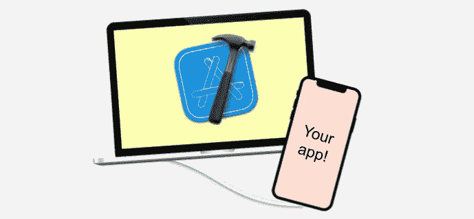

你正在 Xcode 12 中构建一个应用程序，你想知道如何在你的 iPhone 上运行 Xcode 吗？然后，在这个简短的教程里和我呆在一起。

# 1.创建新的 iOS 应用程序(可选)

如果您已经开始构建应用程序，请跳过这第一步，否则，打开 Xcode 并为 iOS 创建一个新的应用程序:

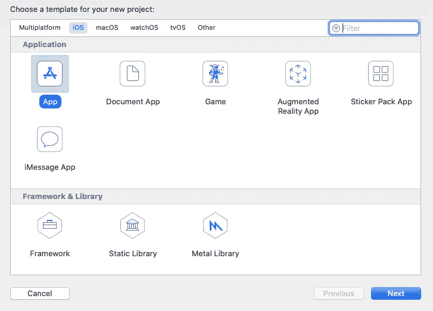

# 2.尝试在您的 iPhone 中运行该应用程序…

去点击你当前模拟器的图标…

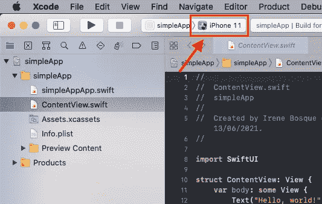

…将 iPhone 连接到 Mac，并从列表中选择它

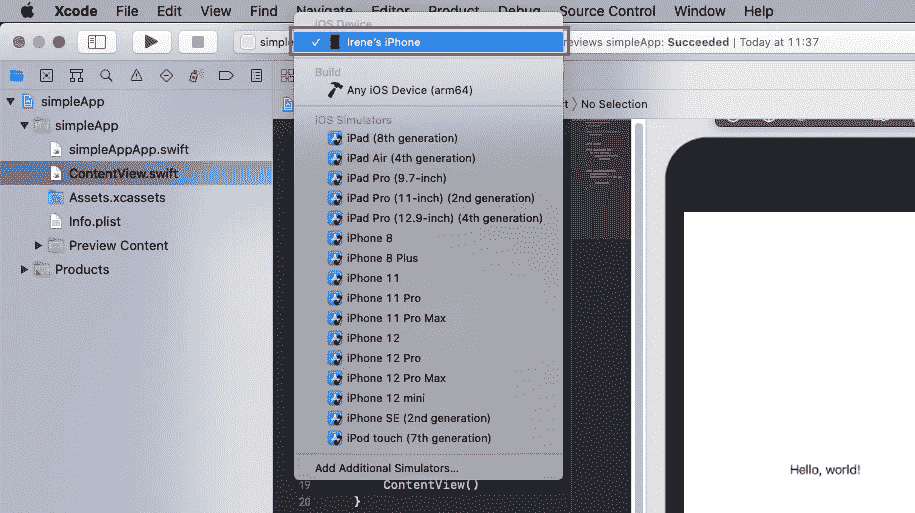

现在，如果你点击运行按钮，你会看到一个红色的错误，告诉你需要一个开发团队:

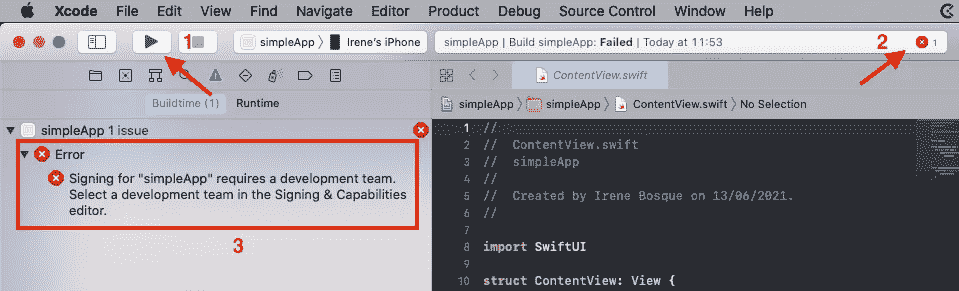

# 3.解决方法:添加一个团队帐户

在左侧面板中，选择您的应用程序，然后选择名为*签名&功能*的选项卡。点击*添加账户……*

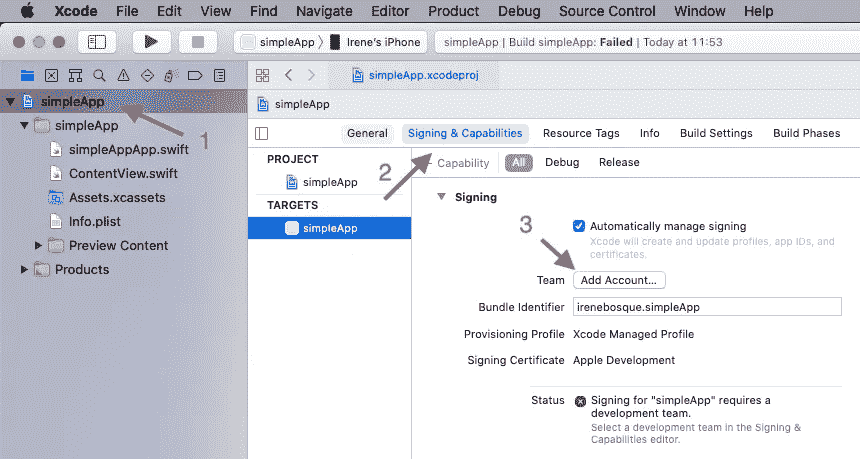

添加您的常规 icloud 电子邮件并输入您的密码:

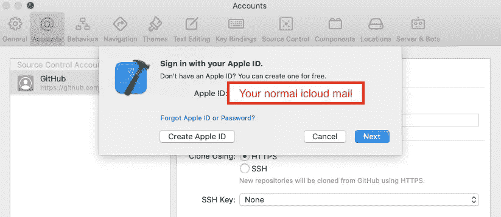

还没离开*签约&能力*标签；在*签名*部分，点击*团队*，而不是*无*，选择您最近添加的 Apple ID 账户:

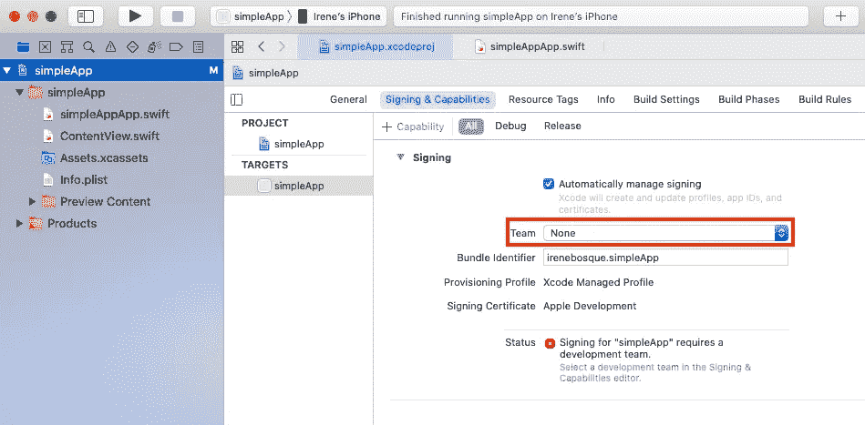

# 4.在你的 iPhone 上运行应用程序

就是这样，如果您再次运行它，您应该不会收到任何问题。现在转到你的 iPhone，你会看到你的应用程序。如果你点击它，很可能会出现一条关于不可信开发者的警告信息:

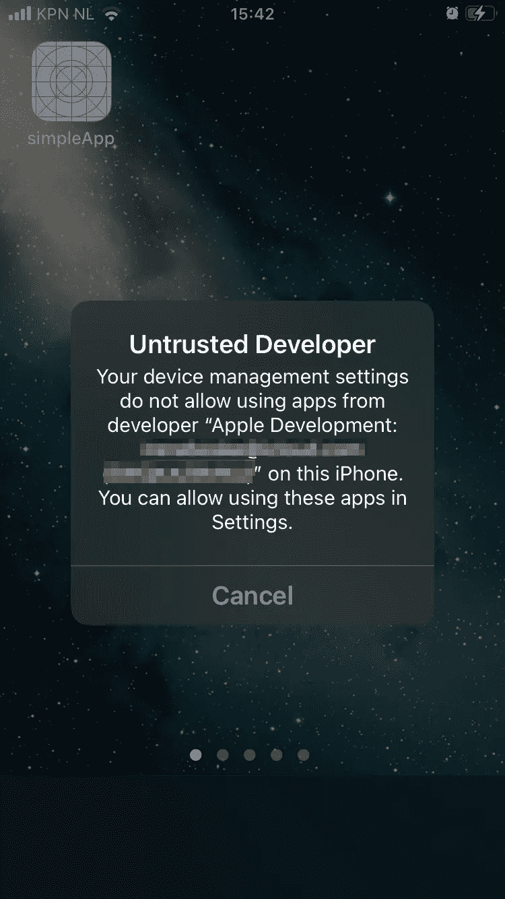

前往“设置”>“通用”>“设备管理”,并信任开发者:

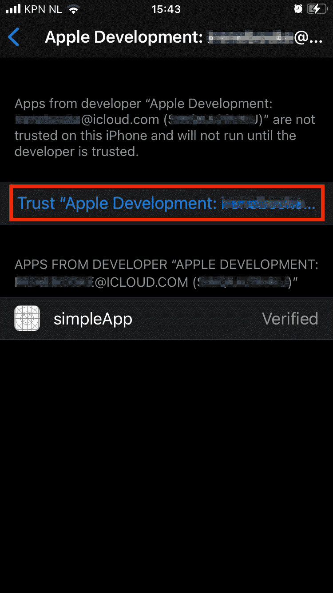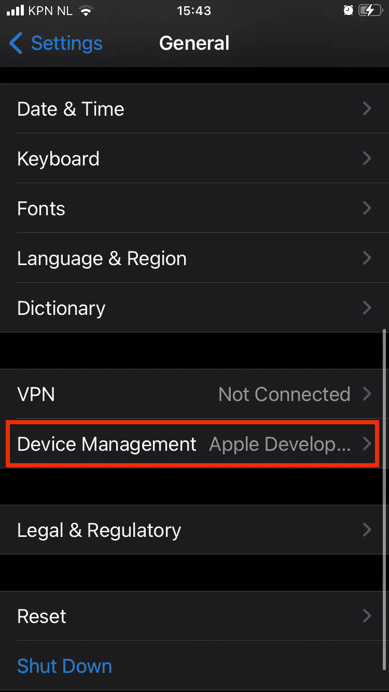

就是这样！这就是如何在你的 iPhone 上运行 Xcode！🎉🥳

感谢阅读😊！

# 参考资料:

[https://www . twilio . com/blog/2018/07/how-to-test-your-IOs-application-on-a-real-device . html](https://www.twilio.com/blog/2018/07/how-to-test-your-ios-application-on-a-real-device.html)

*原载于 2021 年 6 月 13 日 http://irenebosque.com***。**