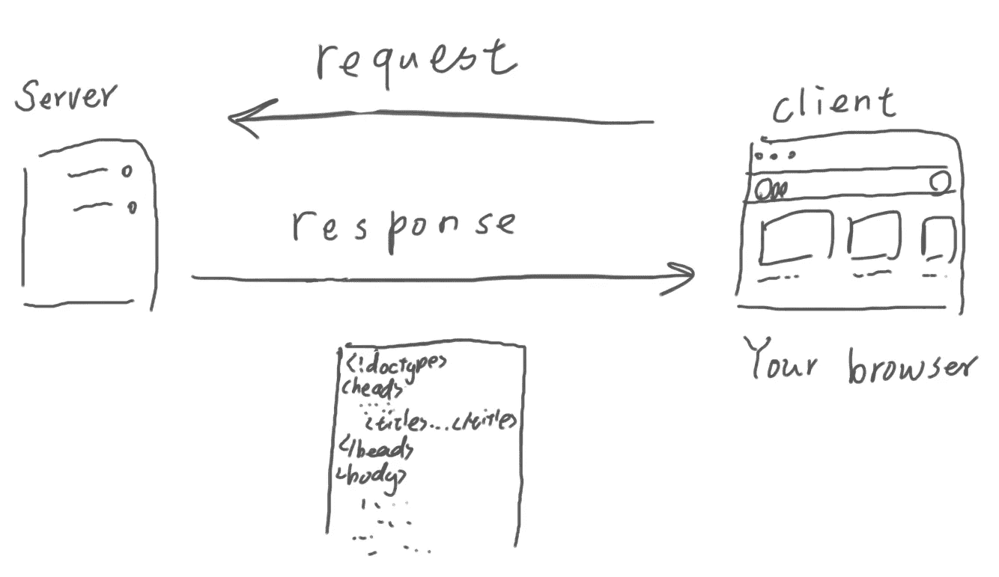
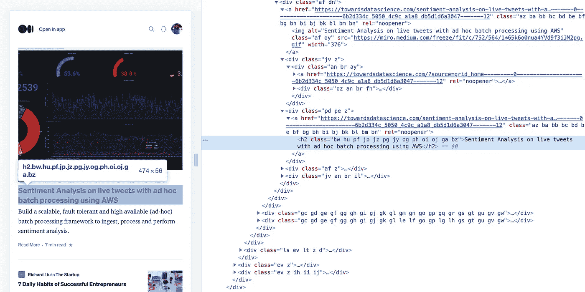
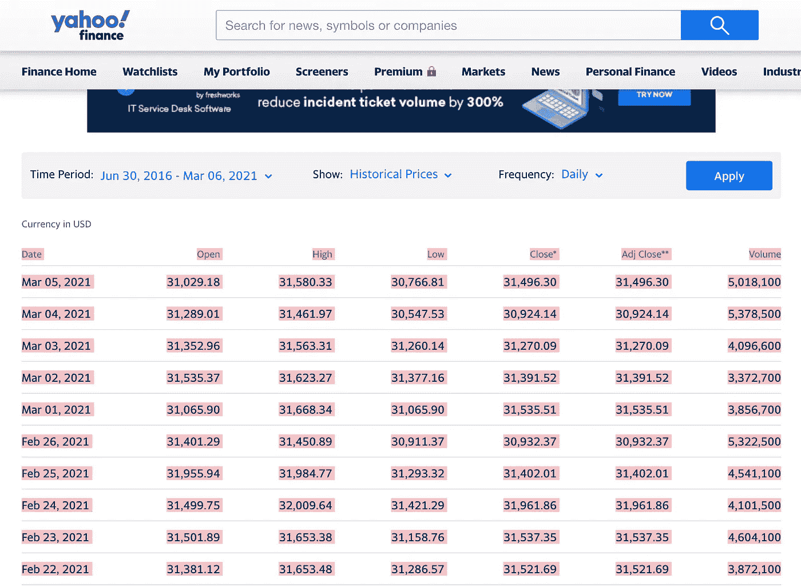
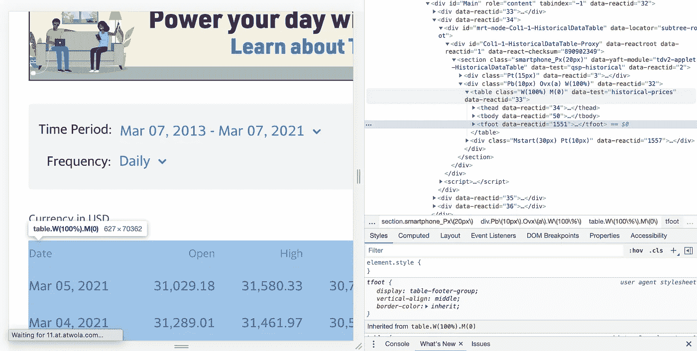
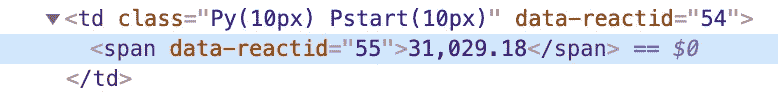
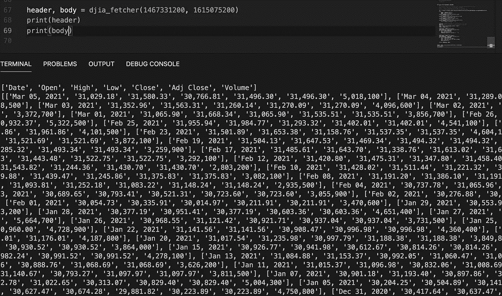

# 如何从雅虎财经抓取道琼斯工业平均指数数据

> 原文：<https://medium.com/nerd-for-tech/how-to-scrape-dow-jones-industrial-average-data-from-yahoo-finance-bd2cba5d163a?source=collection_archive---------11----------------------->


鸣谢:unsplash [@markusspiske](https://unsplash.com/@markusspiske)

最近，我正在做一个股票价格预测项目，我们将使用头条新闻来预测道琼斯工业平均指数是上升还是下降。Kaggle 上有很多数据集供你使用，这很好。但是，要收集最新的数据，您可以考虑使用 web 抓取。挺好接的，那就开始吧！

# 事情是如何在后台运行的

我们将从客户端和服务器如何通信开始，这样我们就可以对什么是 web 抓取有一个概念。这就是当你在浏览器上访问这个页面时将要发生的事情。您的浏览器将通过这个 URL(www.medium.com/…)向服务器发出一个**请求**，服务器将通过发送一个告诉浏览器如何显示数据的 HTML 文件做出响应。瞧啊。现在你的浏览器得到了数据，并很好地显示在你的浏览器上！



因此，web 抓取是从我们向服务器请求的 HTML 文件中提取数据，我们编写的 Python 脚本称为 web bot。

# **网页抓取所需的库**

web 抓取只有两个步骤:下载网页和解析数据。我们将使用`requests`库进行网页下载，使用`beautifulsoup4`进行数据解析。在项目终端中运行以下命令来安装这些库。

```
pip3 install beautifulsoup4
pip3 install requests
```

## 为什么我们需要解析数据？

HTML 文件由数据和标签组成。因为我们只需要数据，所以我们需要解析 HTML 文件，删除标签和所有其他不需要的东西。正如您在下面的截图中看到的，要获取我们的文章标题，我们需要从突出显示的

## 标签中提取标题。



medium.com 的视察

# 从雅虎财经搜集数据



雅虎财经**道琼斯工业平均指数页面截图**

既然我们知道了网络抓取是如何工作的，我们现在就可以进入正题了。我们想从[雅虎财经](https://finance.yahoo.com/quote/%5EDJI/history?p=%5EDJI)获取道琼斯工业平均指数数据，所以我们将提取我在截图中高亮显示的表格。


一旦你选择了时间段，点击应用按钮，你会看到网址已经改变。

```
[https://finance.yahoo.com/quote/%5EDJI/history?period1=1362700800&period2=1615161600&interval=1d&filter=history&frequency=1d&includeAdjustedClose=true](https://finance.yahoo.com/quote/%5EDJI/history?period1=1362700800&period2=1615161600&interval=1d&filter=history&frequency=1d&includeAdjustedClose=true)
```

刚刚发生的是，我们发出了一个 **GET** 请求，我们说我们想要从`period1=1362700800`到`period2=1615161600`的数据。这里时间戳的格式是*纪元时间。

# 我们的网络机器人概述

在我们的 web bot 中，我们可以编写一个接受两个时间戳的函数，这样我们就可以获得任何想要的时间间隔，而不必再打开网站。

# 分解剧本

我知道上面的剧本是相当压倒性的。别担心，我会牵着你的手，一步一步地教你:)

## 下载网页

我们将使用我们上面讨论过的 URL，并且我们将用这个函数的参数交换纪元时间。接下来，编写一个 try-except 块，以防在请求数据时出现任何错误。

`page = requests.get(url)`是魔法发生的地方，程序将发出请求并将数据存储在`page`变量中。注意，返回的对象`page`是一个响应对象。为了以字节串的形式获取 HTML 页面的内容，我们将做`page.content`

```
url = f"https://finance.yahoo.com/quote/%5EDJI/history?
period1={period1}
&period2={period2}
&interval=1d
&filter=history
&frequency=1d
&includeAdjustedClose=true"*try*:
    page = requests.get(url)
    page.raise_for_status()*except* requests.exceptions.HTTPError *as* e:
    print("HTTP Error:", e)
*except* requests.exceptions.ConnectionError *as* e:
    print("Error Connecting:", e)
*except* requests.exceptions.Timeout *as* e:
    print("Timeout Error:", e)
*except* requests.exceptions.RequestException *as* e:
    print("Request exception: ", e)
```

# 解析数据

因为 HTML 页面中的数据嵌入在 HTML 标签中，而标签并不遵循严格的语法。用普通 Python 解析 HTML 页面中的数据可能是一场噩梦。这就是为什么我们需要 BeautifulSoup，因为它让事情变得如此简单！用`soup.table`可以很容易的得到标签中的数据。

```
soup = BeautifulSoup(page.content, "lxml")
table = soup.table
```

## 观察 HTML 文件

在我们继续之前，我们需要知道数据位于何处，以便我们知道如何提取它。在下面的截图中，我们可以看到我们想要的数据在`<table>`标签中，标题在`<thead>`标签中，正文在`<tbody>`标签中。



让我们仔细看看表的结构。在`<thead>`标签中，有一个`<tr>`标签定义了表格中的一行，而`<th>` 标签定义了标题单元格。至于在`<tbody>`标签里面有什么，这是非常相似的，但是我们在这里使用`<td>`来定义标准的数据单元格。

```
<table>
    <thead> 
        <tr>
           <th>...</th>
           <th>...</th>
        </tr>
    </thead>
    <tbody>
        <tr>
           <td>...</td>
           <td>...</td>
        </tr>
    </tbody>
</table>
```

## 提取标题

为了找到带有标签的数据，我们使用`find()`或`findall()`，所以我们在这里做的是从`<thead>`中提取标题，并将它们存储到`headings`列表中。

```
table_head = table.find('thead')
table_headrows = table_head.find_all('th')
*for* row *in* table_headrows:
    col = row.text.strip()
    headings.append(col.replace('*', ''))
```

## 提取尸体

```
table_body = table.find('tbody')
table_bodyrows = table_body.find_all('tr')
*for* row *in* table_bodyrows:
    cols = row.select('td span')
    cols = [col.get_text() *for* col *in* cols]
    data.append(cols)
```

如果你研究一下`<td>`标签里面的内容，你会发现数据是用一个< span >标签包装的，所以我们将`use row.select(‘td span’)`来获取我们的数据。



现在我们已经找到了数据所在的位置，为了移除标签，我们将使用`get_text()`来移除标签。

你有它！我们只是从网站上搜集了所有我们想要的数据。您可以使用`pickle`库将其作为 JSON 文件转储，或者将它们写入 CSV 文件。



网络机器人的输出

# 笔记

**什么是纪元时间？*

****Unix epoch****(或****Unix time****或****POSIX time****或****Unix timestamp****)是自 1970 年 1 月 1 日(午夜 UTC/GMT)以来经过的秒数，不计算闰秒(in)**

# *参考资料:*

1.  *[股票情绪分析-分类，NLP](https://www.kaggle.com/geminikeggler/stock-sentiment-analysis-classification-nlp/notebook?select=Stock_Dataa.csv)*
2.  *我导师的课堂笔记[克莱尔·阮](https://www.deanza.edu/faculty/nguyenclare/)*
3.  *什么是纪元时间？引自历元转换器*