# 如何在 Ruby on Rails 中安全地实现 OAuth

> 原文：<https://medium.com/nerd-for-tech/how-to-securely-implement-oauth-in-ruby-on-rails-2b9546994132?source=collection_archive---------6----------------------->

在本教程中，我们将逐步设置一个基本的 Ruby on Rails 应用程序，使用授权码 grant 安全地向 OAuth2 服务器进行身份验证。

许多 Rails 应用程序传统上在框架本身中处理身份验证、授权和用户管理。有许多策略可以实现，包括使用像[device](https://github.com/heartcombo/devise)这样的便捷工具。然而，使用 FusionAuth，我们能够[将我们的认证关注点](https://en.wikipedia.org/wiki/Separation_of_concerns)从我们的应用程序中分离出来。现在，我们可以独立于我们的主应用程序来扩展我们的用户群。当我们构建新的应用程序或与其他平台集成时，我们现在有一个集中的地方来处理我们的身份验证和授权需求。

这有什么关系？假设我的公司已经有一个现有的身份提供者，我需要将我的新应用程序与它集成。也许我有许多应用程序需要与我的身份提供者集成。也许我是一家初创公司，想卸载所有用户管理，包括功能和安全问题。通过在一个地方处理我们所有的用户管理问题，我们可以独立地关注应用程序的需求。

借助 FusionAuth 这样的客户身份和访问管理平台，我们获得了完整身份解决方案的优势，能够满足 SSO、MFA 和社交登录等大多数身份认证要求。

在本教程结束时，您将拥有一个运行中的 Ruby on Rails 应用程序，该应用程序利用 FusionAuth 对用户进行身份验证，完成了 [OAuth 2.0 授权代码](https://oauth.net/2/grant-types/authorization-code/)流程。

该代码可以在 Github 的 Apache2 许可[下获得。](https://github.com/FusionAuth/fusionauth-example-rails-oauth)

在[之前的帖子](https://fusionauth.io/blog/2020/06/11/building-protected-api-with-rails-and-jwt/)中，我们演示了如何编码、解码和验证 JWT 的真实性，以[保护 Ruby on Rails API](https://fusionauth.io/blog/2020/06/11/building-protected-api-with-rails-and-jwt/) 。在本文中，我们将利用那些相同的概念，FusionAuth 是发布令牌的身份验证提供者。

# 先决条件

*   轨道 6
*   Docker(可选，但安装 FusionAuth 时首选)

# 设置融合验证

在本教程中，我们将使用 Docker 进行快速设置:

```
curl -o docker-compose.yml https://raw.githubusercontent.com/FusionAuth/fusionauth-containers/master/docker/fusionauth/docker-compose.yml
curl -o .env https://raw.githubusercontent.com/FusionAuth/fusionauth-containers/master/docker/fusionauth/.env
docker-compose up
```

如果您更喜欢在本地安装 FusionAuth，请参见 [5 分钟安装指南](https://fusionauth.io/docs/v1/tech/5-minute-setup-guide/)进行安装和运行。

一旦你安装了 FusionAuth，它应该运行在 [localhost:9011](http://localhost:9011/) 。导航到那里并完成设置步骤。完成这些操作后，以刚刚创建的管理员身份登录。现在我们准备好摇滚了！

一个 FusionAuth 应用程序只是用户可以登录的东西。因此，我们希望在 FusionAuth 中为我们的 Rails 应用程序创建一个新的应用程序。

# 创建应用程序

从左侧导航栏中选择“应用程序”。然后单击右上角的绿色加号添加一个新应用程序。我们需要配置一些重要信息:

*   **Name** (必需):我们的应用程序的显示名称。输入`fusionauth-rails-app`。
*   **授权重定向 URL**:在“OAuth”标签下找到。这个 URL 告诉 FusionAuth 在用户成功认证后重定向到哪里。
*   **注销 URL** :也可以在“OAuth”选项卡下找到。这个 URL 告诉 FusionAuth 当用户注销时重定向到哪里。

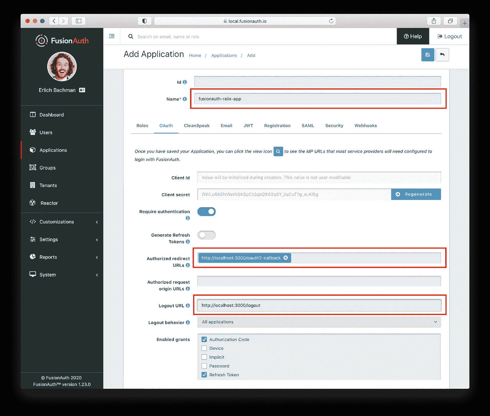

这个应用程序是在默认租户中创建的。FusionAuth 支持无限的租户，但是对于这个示例应用程序，我们可以将所有内容都保留在默认应用程序中。

# 创建用户

对于本例，我们将手动创建一个用户。单击左侧导航栏中的“Users ”,然后单击右上角的绿色加号添加新用户。

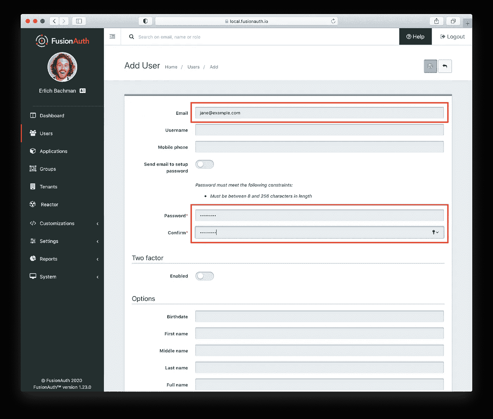

配置以下属性，然后保存新用户:

*   **电子邮件**
*   **密码并确认**:将“向设置密码发送电子邮件”切换为关闭，手动输入用户密码。

# 注册用户

看起来不错！现在我们有了新的应用程序和用户。我们要做的最后一件事是向我们的应用程序注册用户。为我们新创建的用户导航到“用户->管理”。

单击“添加注册”按钮，选择我们创建的 Rails 应用程序，然后单击“保存”按钮。

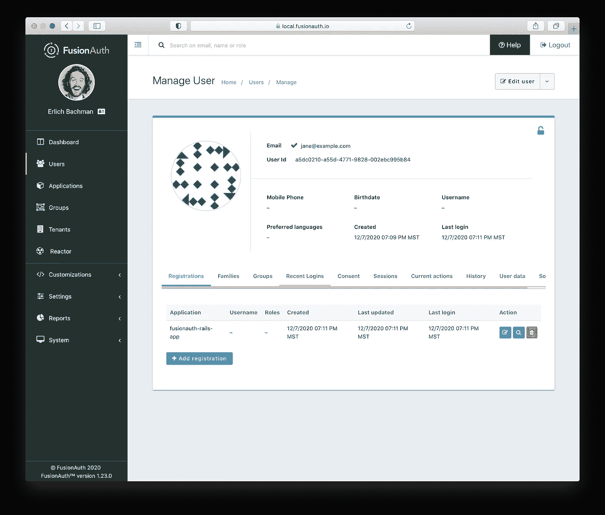

# 颁发者和签名密钥

我们还想在 FusionAuth 中配置两个属性。第一个属性是用于签名令牌的命名颁发者值。我们将在登录期间验证访问令牌时使用该值。为此，导航到左侧导航栏上的“租户”，然后单击与“默认”租户对应的“编辑”按钮。在“常规”选项卡下设置“发行人”字段。颁发者的值通常是身份提供者的主机名。由于这是一个演示，我们将使用值`fusionauth.io`。

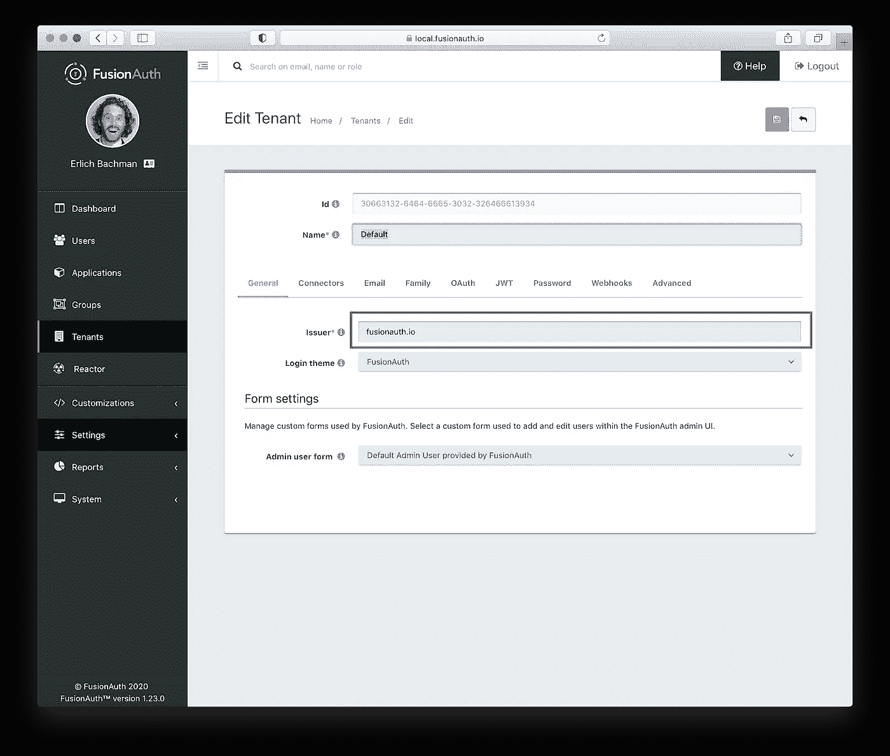

第二个属性是用于编码令牌的 HMAC 签名密钥。从左侧导航栏导航至“设置”，然后导航至“万能钥匙”。然后点击与`Default Signing Key`相对应的“查看”按钮。从这里，“点击显示”密钥，并将其复制到一个安全的位置。我们将需要这个值来成功解码我们的应用程序中的令牌。

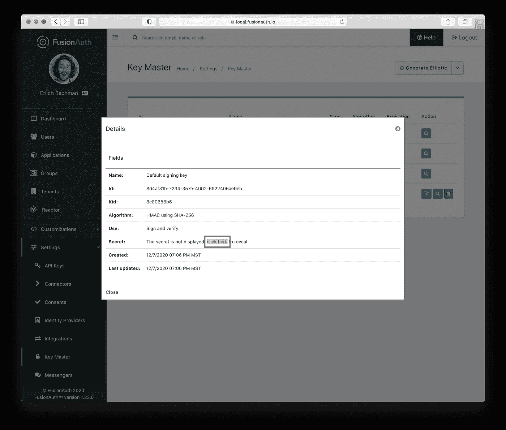

# 构建 Rails 应用程序

让我们开始构建一个非常基本的 Rails 应用程序来演示使用 FusionAuth 的身份验证。如果你想直接查看代码，请点击这里查看我们的 Github repo [。](https://github.com/FusionAuth/fusionauth-example-rails-oauth)

创建新的 Rails 应用程序。

```
rails new rails-fusionauth-app
```

我们的`Gemfile`将使用一些额外的依赖项，所以在我们开始之前继续添加它们。

```
gem 'jwt'
gem 'oauth2'
```

安装我们的依赖

```
bundle install
```

# 配置

在我们继续之前，我们需要 FusionAuth 配置中的一些关键应用程序属性，以便我们的 Rails 应用程序知道如何成功地与它通信。具体来说:

*   **客户端 Id**
*   **客户机密**
*   **授权重定向网址**
*   **注销网址**

您可以回忆一下，在 FusionAuth 中修改应用程序时，可以在“OAuth”选项卡下找到这些。

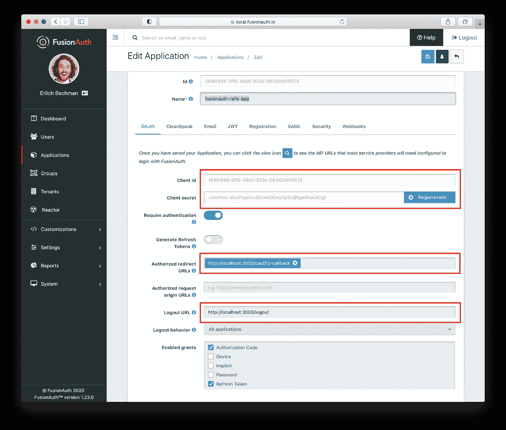

让我们使用`development.rb`设置`client_id`、`client_secret`、`idp_url`(身份提供者 url)和`redirect_uri`值。我选择在这里设置这些值，因为它们可能会在试运行或生产环境中发生变化，但是您可以根据自己的标准随意设置。我们还将初始化一个包含“HMAC 秘密”的环境变量，该变量将用于解码在身份验证过程中收到的令牌。我们希望尽可能地保证它的安全，因此我们将在运行时设置它。

```
# OAuth configuration
  config.x.oauth.client_id = "my-client-id"
  config.x.oauth.client_secret = "my-super-secret-oauth-secret"
  config.x.oauth.idp_url = "http://localhost:9011/"
  config.x.oauth.redirect_uri = "http://localhost:3000/oauth2-callback"
  config.x.oauth.hmac = ENV['HMAC_SECRET']
```

# 使用 FusionAuth 认证

在我们进入代码之前，让我们看一下应用于我们的 Rails 应用程序、用户和 FusionAuth 的认证码授权流:

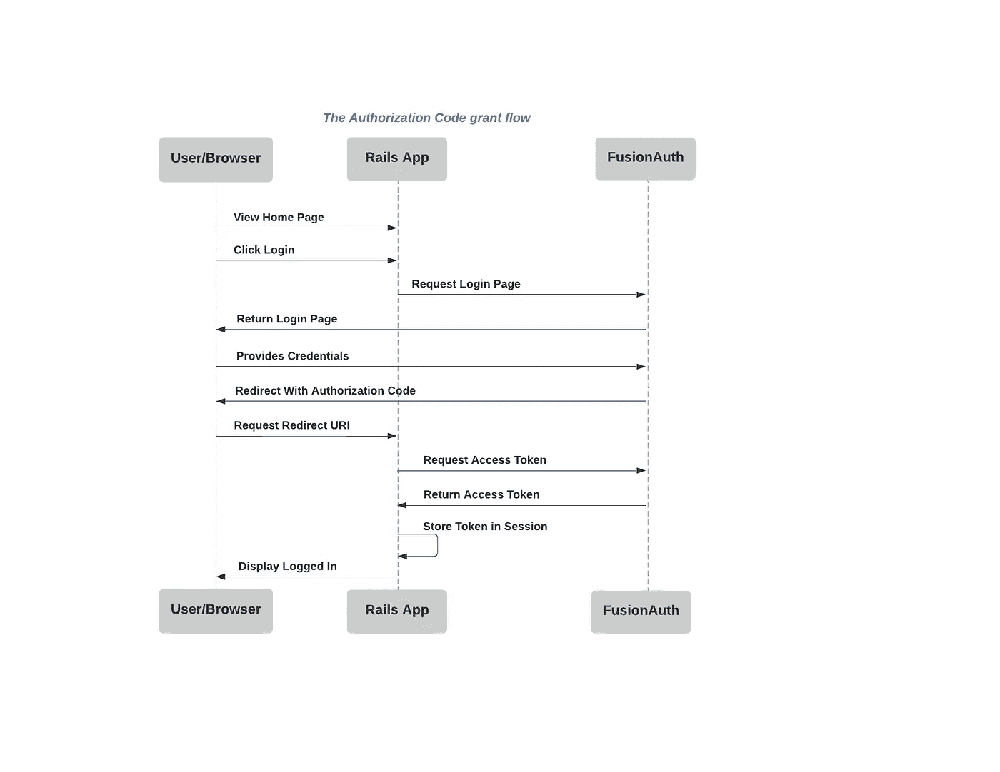

这让我们能够深入了解需要在 Rails 应用程序中定义的路线。

# 路线

对于此应用程序，我们将设置四条路线:

*   **欢迎页面**:我们的根页面。
*   **登录端点**:当用户点击登录链接时，请求 FusionAuth 登录页面。
*   **OAuth 回调端点**:授权码授予时 FusionAuth 重定向的接收方。
*   **注销端点**:成功注销时 FusionAuth 重定向的接收者。

```
Rails.application.routes.draw do
   root to: 'welcome#index'
   get '/oauth2-callback', to: 'oauth#oauth_callback'
   get '/logout', to: 'oauth#logout'
   get '/login', to: 'oauth#login'
 end
```

## 欢迎页面

让我们从一个非常基本的欢迎视图开始，它包含一个用户登录应用程序的链接。这个页面将作为我们应用程序的根页面。

```
# app/views/welcome/index.html.erb<p>Welcome! Please <%= link_to 'sign in', controller: 'o_auth', action: :login %> </p>
```

渲染时应该是这样的。

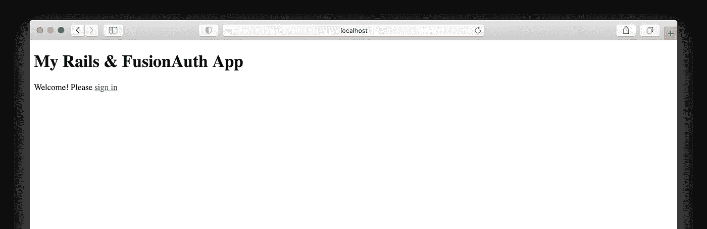

## OAuthController

“OAuthController”将处理完成授权码授权流所需的每个剩余路由。这是我们完成后的样子:

```
class OAuthController < ApplicationController
  def initialize
    @oauth_client = OAuth2::Client.new(Rails.configuration.x.oauth.client_id,
                                       Rails.configuration.x.oauth.client_secret,
                                       authorize_url: '/oauth2/authorize',
                                       site: Rails.configuration.x.oauth.idp_url,
                                       token_url: '/oauth2/token',
                                       redirect_uri: Rails.configuration.x.oauth.redirect_uri)
  end # The OAuth callback
  def oauth_callback
    # Make a call to exchange the authorization_code for an access_token
    response = @oauth_client.auth_code.get_token(params[:code]) # Extract the access token from the response
    token = response.to_hash[:access_token] # Decode the token
    begin
      decoded = TokenDecoder.new(token, @oauth_client.id).decode
    rescue Exception => error
      "An unexpected exception occurred: #{error.inspect}"
      head :forbidden
      return
    end # Set the token on the user session
    session[:user_jwt] = {value: decoded, httponly: true} redirect_to root_path
  end def logout
    # Invalidate session with FusionAuth
    @oauth_client.request(:get, 'oauth2/logout') # Reset Rails session
    reset_session redirect_to root_path
  end def login
    redirect_to @oauth_client.auth_code.authorize_url
  end
end
```

首先，我们将使用 [oauth2](https://github.com/oauth-xx/oauth2) gem 设置我们的客户端。这为我们提供了 OAuth 2.0 规范的 [REST](https://www.codecademy.com/articles/what-is-rest) 客户端包装器。

```
# ...
def initialize
  @oauth_client = OAuth2::Client.new(Rails.configuration.x.oauth.client_id,
                                     Rails.configuration.x.oauth.client_secret,
                                     authorize_url: '/oauth2/authorize',
                                     site: Rails.configuration.x.oauth.idp_url,
                                     token_url: '/oauth2/token',
                                     redirect_uri: Rails.configuration.x.oauth.redirect_uri)
end
# ...
```

当用户点击我们创建的“登录”链接时，登录过程开始。正如在上面的序列图中所看到的，我们希望将这个请求发送给负责验证用户凭证的 FusionAuth。接下来，用户将看到一个默认的登录页面，包括用户名和密码字段。FusionAuth 提供了通过[主题](https://fusionauth.io/docs/v1/tech/themes/)定制表单样式的灵活性，但是对于本教程，我们将坚持使用默认样式。

下面的方法使用“OAuth2”客户端来构造“authorize_url ”,并相应地重定向请求。

```
# ...
def login
  redirect_to @oauth_client.auth_code.authorize_url
end
# ...
```

成功的响应将产生登录页面:


认证成功后，FusionAuth 使用“redirect_uri”将“授权代码”重定向到 Rails 应用程序。这个值告诉 FusionAuth 在成功认证后重定向到哪里，这与我们的`oauth_callback`路由相对应。我们还将它添加到 FusionAuth 中，因为给定应用程序的每个“redirect_uri”都必须作为“授权的重定向 URL”存在。想想安全！

总之，我们应用中的`oauth_callback`做了几件事:

1.  在通过身份验证并被授予授权代码后，处理来自 FusionAuth 的重定向。
2.  执行返回给 FusionAuth 的请求，以将授权码交换为访问令牌。
3.  对接收到的访问令牌上的声明进行解码和验证。
4.  在会话上保存访问令牌/JWT，以指示用户已成功通过身份验证。

OAuth 流程中的下一步是将我们的授权码换成访问令牌。为此，我们将提出一个额外的[代码交换](https://fusionauth.io/docs/v1/tech/oauth/endpoints/#complete-the-authorization-code-grant-request)请求。使用 [oauth2](https://github.com/oauth-xx/oauth2) gem，我们构建一个客户端，然后通过授权代码发出请求，并重定向 URI。

```
# ...
# Make a call to exchange the authorization_code for an access_token
response = @oauth_client.auth_code.get_token(params[:code])# Extract the access token from the response
token = response.to_hash[:access_token]
# ...
```

我们接收编码为 JWT 的访问令牌。我们现在想解码 JWT 并验证声明。对于这个例子，我们验证了分别反映应用程序`client_id`和令牌发放者的`aud`和`iss`声明。回想一下，我们之前在 FusionAuth 中配置了 issuer 值。

```
# ...
# Decode the token
begin
  decoded = TokenDecoder.new(token, client_id).decode
rescue Exception => error
  "An unexpected exception occurred: #{error.inspect}"
  head :forbidden
  return
end
# ...
```

TokenDecoder 类解码 JWT，验证 HMAC 秘密，并确认声明。

```
class TokenDecoder def initialize(token, aud)
    @token = token
    @aud = aud
    @iss = 'fusionauth.io'
  end def decode
    begin
      JWT.decode(
        @token,
        Rails.configuration.x.oauth.hmac,
        true,
        {
          verify_iss: true,
          iss: @iss,
          verify_aud: true,
          aud: @aud,
          algorithm: 'HS256'})
    rescue JWT::VerificationError
      puts "verification error"
      raise
    rescue JWT::DecodeError
      puts "bad stuff happened"
      raise
    end
  end
end
```

最后，我们在用户会话上设置令牌，并重定向回我们的欢迎页面，结束我们的`oauth_callback`方法。

```
# ...
# Set the token on the user session 
# httponly to prevent XSS attacks
session[:user_jwt] = {value: decoded, httponly: true}redirect_to root_path
# ...
```

当用户注销时，我们希望使他们在 FusionAuth 和我们的应用程序上的会话无效。类似于`oauth_callback`接收`authorize`重定向的方式，我们的`destroy`方法接收`logout`重定向。接收到重定向告诉我们用户已经从 FusionAuth 注销，我们可以安全地清除用户在 Rails 中的会话。

```
# ...
def logout
  # Invalidate session with FusionAuth
  @oauth_client.request(:get, 'oauth2/logout') # Reset Rails session
  reset_session redirect_to root_path
end
# ...
```

# 完善我们的 Rails 会话

既然我们已经有了认证用户以及将他们从 FusionAuth 中注销的功能，我们将希望在我们的 Rails 应用程序上完成相同的循环。

在 Rails 中有许多处理用户会话的方法，但是对于这个例子，我决定创建 ApplicationController 的所有子类都可以访问的 helper 方法。

`current_user`在会话中查找用户 JWT。如果存在，并且电子邮件已经过验证，它将从 JWT 中检索用户的电子邮件地址。如果不存在，这意味着用户已注销或其会话已过期。

```
# app/controllers/application_controller.rbclass ApplicationController < ActionController::Base
  helper_method :current_user
  helper_method :logged_in? def current_user
    if session[:user_jwt]
      token = session[:user_jwt]["value"].first if token && token["email_verified"]
        @email = token["email"]
      else
        head :forbidden
        return
      end
    end
  end def logged_in?
    current_user.present?
  endend
```

# 把所有的放在一起

是时候通过一个登录示例来实现我们的 Ruby on Rails OAuth 流了。在启动 Rails 服务器之前，一定要在您的环境中设置`HMAC_SECRET`的“默认签名密钥”值，使它可以被我们的开发配置访问。

踢轮胎，点火！

```
rails s
```

导航至`http://localhost:3000`。如果您使用的不是 3000，请替换相应的端口。


使用我们在 FusionAuth 中创建和注册的用户登录应用程序。

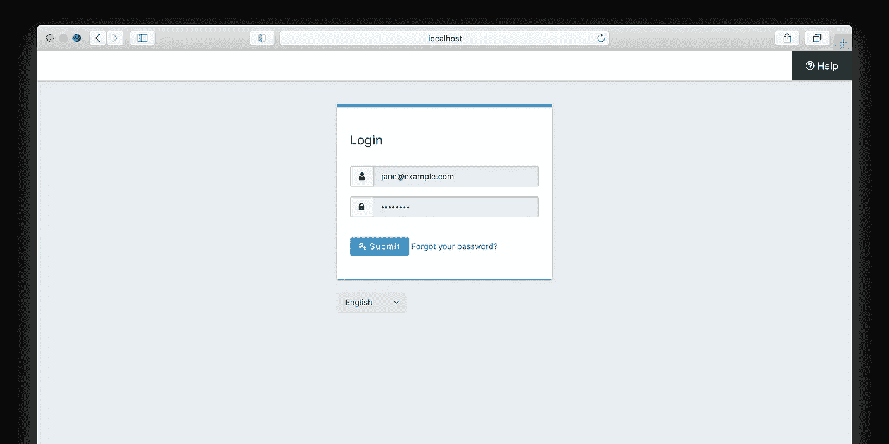

我们成功了！我们登录了，我们的应用程序知道我们是谁。

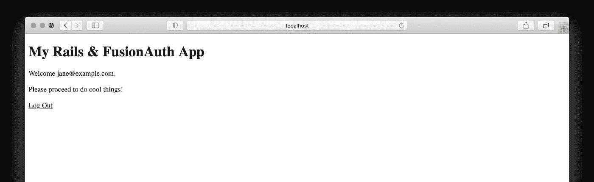

现在让我们假设我们已经完成了与应用程序的交互，并准备好通过导航到相应的 URL 来注销。

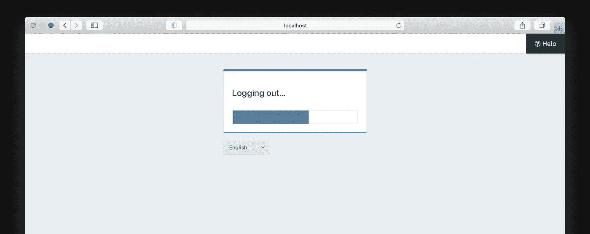

# 后续步骤

现在我们已经有了 OAuth 流，我们的基础可以根据需要进行扩展。以下是接下来要解决的一些想法:

*   添加并分配用户[角色](https://fusionauth.io/docs/v1/tech/core-concepts/roles/#overview)，以便我们的 Rails 应用程序中的功能可以相应地显示或隐藏。
*   使用[主题](https://fusionauth.io/docs/v1/tech/themes/)定制 FusionAuth 登录页面的外观和感觉。
*   使用[身份提供商](https://fusionauth.io/docs/v1/tech/core-concepts/identity-providers/#overview)添加“登录谷歌”或“登录脸书”社交登录按钮。

# 我们学到了什么？

使用 Rails 中的授权码授权，您可以使用任何 OAuth 兼容的身份提供者来保护您的应用程序。示例代码可以在 Github [这里](https://github.com/FusionAuth/fusionauth-example-rails-oauth)找到。

编码快乐！

*最初发布于*[*https://fusion auth . io*](https://fusionauth.io/blog/2020/12/14/how-to-securely-implement-oauth-rails/)*。*