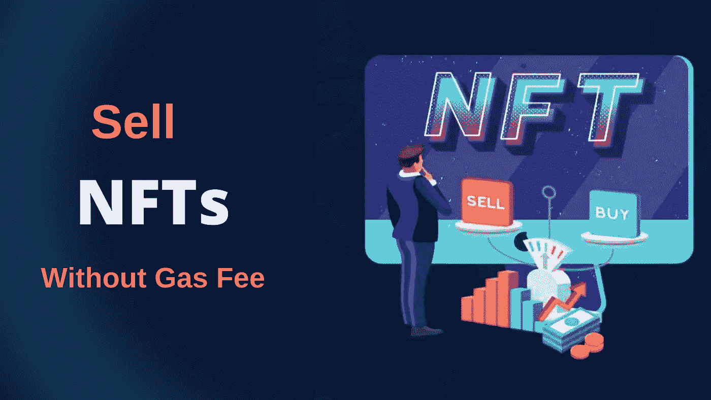

# 如何在不付汽油费的情况下卖掉 NFT？

> 原文：<https://medium.com/nerd-for-tech/how-to-sell-nft-without-paying-a-gas-fee-79638eff14bf?source=collection_archive---------2----------------------->

如何出售 NFT 没有汽油费

不可替换令牌(NFT)是一种证明数字资产所有权的令牌。令牌化(或铸造 NFT)是在区块链上创建它们的过程。它伴随着很高的汽油费用。

如果你使用 Mintable Marketplace 或者使用 Opensea 上的 Polygon Network，你可以列出 NFT 进行销售，而不必支付汽油费。即使你钱包里有 0 个 eth。

以下是如何使用以太坊和多边形区块链免费创建和销售 NFT。

# 如何免费制作 NFT

## 下载并设置元掩码钱包:

MetaMask 是一种与设备集成的浏览器扩展，是最受欢迎的比特币钱包之一。如果您还没有 MetaMask 钱包，请下载它。您还需要创建您的钱包密码。每次您想要链接它时都需要此密码。

## 将元掩码连接到 OpenSea:

打开海洋市场，点击右上角的钱包符号链接你的钱包。选择元掩码，然后确认钱包连接。一旦您的钱包连接到市场，您将能够查看您的个人资料，并制作您的第一个 NFT。

## 在 OpenSea 上免费创建和制作 NFT:

有两种选择:你可以列出单个项目或整个 NFT 收藏。单击右上角的菜单创建一个 NFT。单击钱包图标旁边的帐户图标。>我的收藏>创建 NFT 收藏，开始打造收藏。

单个和多个集合遵循相同的过程。单击创建后，将创建第一个 NFT。但是这个东西是非卖品，你无法通过搜索框找到它。

## 列出你的 NFT:

若要出售您的 NFT，请前往出售(右上角)。您可以设定 NFT 的价格。输入所有必要信息后，单击完成列表。您的 NFT 现在可以购买了。OpenSea 收取 2.5%的服务费。一旦 NFT 售出，这将从售价中删除。

最后，这是在 OpenSea 中创建 NFTs 的过程，没有天然气费。所有 NFT 市场的流程都是一样的。但是，让他们不同的一点是，他们有能力在多个区块链上制造 NFT。

# 结论

很明显，他们有潜力成为收集和交易非森林交易的主要参与者。因此，这是一个伟大的 NFT 市场的商业模式，为你建立你在 NFT 行业的存在。接触最好的 [**OpenSea 克隆开发者**](https://www.clarisco.com/opensea-clone-script) 让你的商业想法成真！