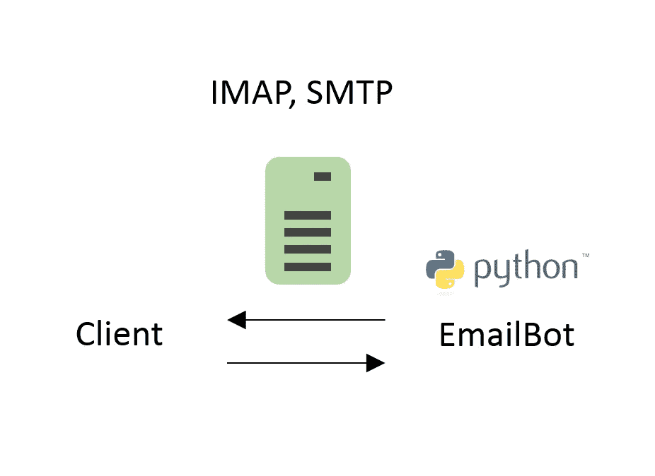
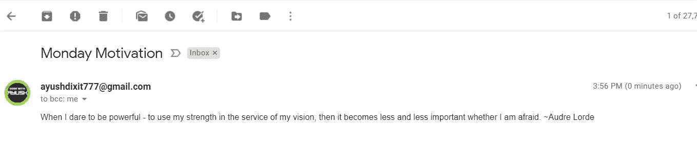

# 如何用 Python 发送自动化的周一激励邮件？

> 原文：<https://medium.com/nerd-for-tech/how-to-send-an-automated-monday-motivation-email-in-python-25bf6c306405?source=collection_archive---------2----------------------->

周一可能是一个艰难的开始。星期一是最受欢迎的病假。根据 2009 年在英国进行的一项研究，35%的病假是在周一休的。:P

周一早上的一点点激励可以帮助你起床，开始新的一周，激励你充满自信和活力地开始新的一周。

Python 来拯救，有了这个 python 项目，你可以每周一给自己、朋友或同事发一封激励邮件。

让我们直接开始吧。



出于我们的目的，我们将利用 python 中的三个库，即 smtplib、datetime 和 random。

我们还需要一个报价列表，稍后将由我们的程序解析。我在这里找到了一份准备导入的报价清单#[https://gist.github.com/robatron/a66acc0eed3835119817](https://gist.github.com/robatron/a66acc0eed3835119817)

## **第一步:导入库**

```
import smtplib
import datetime as dt
import random
```

## **第二步:定义从**发送邮件的登录凭证

```
my_email = "<your_email>"
password = "<your_password>"
```

## **第三步:考虑工作日**

找出今天是星期几。我们可以使用 datetime 模块的 weekday()方法，首先通过“datetime.now()”方法获取当前的 datetime。

```
now = dt.datetime.now()
weekday = now.weekday()
```

星期一是一周的第一天，因此在模块中会被初始化为 0。

## **步骤 4:生成随机报价**

```
if weekday == 0:
    with open("quotes.txt") as file:
        all_quotes = file.readlines()
        quote = random.choice(all_quotes)

    print(quote)
```

很简单，我们检查当前的工作日是否是星期一，如果是，我们继续读取“quotes.txt”文件，并获得一个随机的报价，将其存储在“quote”变量中。

## 第五步:给自己发一封附有激励性引言的电子邮件

```
with smtplib.SMTP("smtp.gmail.com", 587, timeout=120) as connection:
    connection.starttls()
    connection.login(my_email, password)
    connection.sendmail(
        from_addr=my_email,
        to_addrs=my_email,
        msg=f"Subject:Monday Motivation\n\n{quote}")
```

我们定义 smtplib。smtp 接受运行 smtp 主机服务器的 SMTP 主机。即“smtp.gmail.com”，端口号:587，超时= 120。我已经明确定义了最后两个参数，因为代码运行出错，解释器在读取 smtp 对象时卡住了。

" connection.starttls()"初始化 starttls 协议。STARTTLS 是**一个电子邮件协议命令**，它告诉电子邮件服务器，一个电子邮件客户端，包括在 web 浏览器中运行的电子邮件客户端，想要将现有的不安全连接转变为安全连接。

此外，在编译之前，请确保您已经允许 gmail 允许来自不太安全的应用程序的访问。要检查并允许进入，请到[这里](https://support.google.com/accounts/answer/6010255?hl=en)。

最后，我们准备好了输出:



您也可以在您的发送箱中找到该电子邮件。点击获取完整代码[。](https://github.com/Ayu-dxt777/100daysofpython/tree/main/monday_motivation_mail)

你喜欢我的努力吗？如果是的话，请跟我来获取我的最新帖子和更新，或者更好的是，请我喝杯咖啡！☕

[](https://www.buymeacoffee.com/ayushdixit)[](https://www.buymeacoffee.com/ayushdixit) [## ayushdixit 正在编码、部署项目和写博客

### 嘿👋我刚刚在这里创建了一个页面。你现在可以给我买杯咖啡了！

www.buymeacoffee.com](https://www.buymeacoffee.com/ayushdixit)