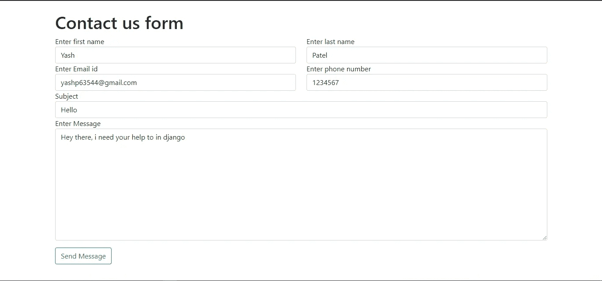
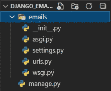
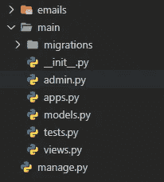
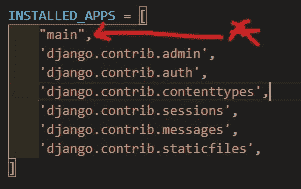
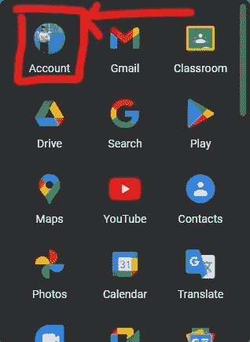
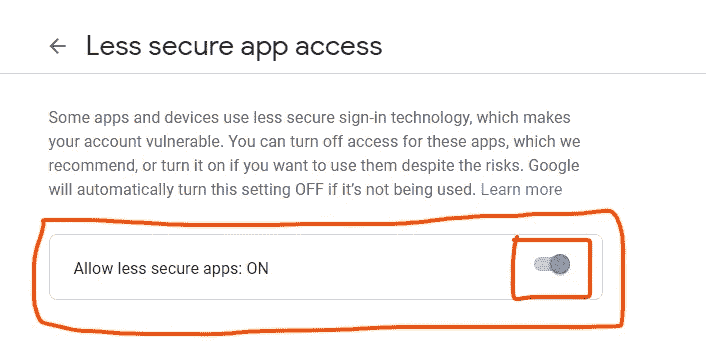
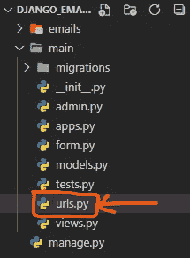
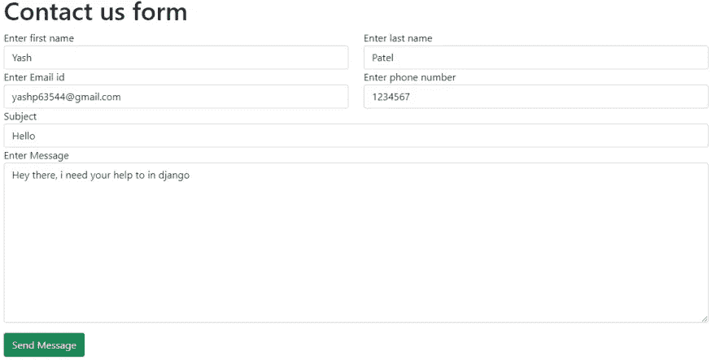
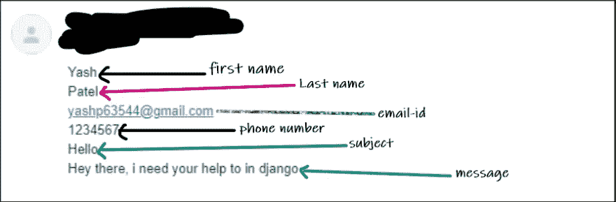

# 如何在 Django 发送电子邮件？

> 原文：<https://medium.com/nerd-for-tech/how-to-send-e-mail-in-django-20d6f6558f01?source=collection_archive---------1----------------------->



在 django 中，我们可以使用 **SMTP(简单邮件传输协议)**服务发送电子邮件，这是 python 和 django 中内置的包。

# 什么是 smtp？

*   ***SMTP(简单邮件传输协议)*** 是在发送方和接收方之间提供**发送、接收和*或*中继外发邮件**的服务。
*   SMTP 服务获取您正在使用的客户端电子邮件地址(您也可以给出多个电子邮件地址),并将其格式化为 smtp.gmail.com，因为我们以 Gmail 的 SMTP 服务器地址为例，它的地址是 smtp.gmail.com，而 Twilio Send Grids 的地址是 smtp.sendgrid.com。您通常可以在邮件客户端的“帐户”或“设置”部分找到您的 SMTP 服务器地址。

# Django 电子邮件发送设置

**步骤 1** →创建一个文件夹，命名为 django_email

**步骤 2** →使用下面的命令`django-admin startproject emails .`创建 django 项目



创建项目后的目录预览

**步骤 3** →在上述步骤创建的项目中创建 django 应用程序，并使用命令`python manage.py startapp main`



在项目中创建应用程序后查看目录

**步骤 4** →现在在 settings.py 中安装 app，这个文件会在 emails 文件夹
目录预览中



在 django 安装应用程序

**步骤 5** →现在您需要使用
命令`python manage.py migrate`来迁移项目

**第六步** →进入 *settings.py* 底部，在静态变量下写代码。

```
EMAIL_BACKEND = 'django.core.mail.backends.smtp.EmailBackend'
EMAIL_HOST = 'smtp.gmail.com'
EMAIL_HOST_USER = 'gmail account email id'
EMAIL_HOST_PASSWORD = 'Your gmail password'
EMAIL_USE_TLS = True
EMAIL_PORT = 587
```

在变量`EMAIL_HOST_USER`中，您需要填写电子邮件 id，该 id 具有**两步验证关闭**，因为我们需要对您的电子邮件帐户进行一些设置更改。在变量`EMAIL_HOST_PASSWORD`中，你需要写下你的电子邮件账户密码。

**第 7 步** →现在打开你最喜欢的浏览器，按照以下步骤操作

*   进入选项**账户**



*   进入选项**安全**，搜索 ***不太安全的应用程序访问*** ，打开**，因为如果你不打开它，django 将无法发送邮件。**

****

****步骤 8** →现在在**邮件文件夹**中创建 **form.py** 文件，并在代码下面编写代码**

**form.py**

```
from django import forms

class ContactMeForm(forms.Form):
    first_name = forms.CharField(widget=forms.TextInput(attrs={'class':'form-control', 'placeholder':'Enter first name'}), required=True)
    last_name = forms.CharField(widget=forms.TextInput(attrs={'class':'form-control', 'placeholder':'Enter last name'}), required=True)
    emailid = forms.EmailField(widget=forms.TextInput(attrs={'class':'form-control', 'placeholder':'Enter email id'}), required=True)
    phone_number = forms.CharField(widget=forms.TextInput(attrs={'class':'form-control', 'placeholder':'Enter phone number'}))
    subject = forms.CharField(widget=forms.TextInput(attrs={'class':'form-control', 'placeholder':'Enter subject'}), required=True)
    message = forms.CharField(widget=forms.Textarea(attrs={'class':'form-control', 'placeholder':'Enter Message'}), required=True)
```

****第 9 步** →现在进入 views.py 文件并编写以下代码**

**views.py**

```
from django.shortcuts import render
from main.form import ContactMeForm
from django.core.mail import send_mail, BadHeaderError
from django.http import HttpResponse
from django.contrib import messagesdef home(request):
    form = ContactMeForm() if request.method == 'POST':
        form = ContactMeForm(request.POST)
        if form.is_valid():
            # form.save()
            # send_mail(subject, message[fname, lname, email, phonenumber, subject, message], sedner, recipient) subject = "Contact form inquiry"
            body = {
                'first_name': form.cleaned_data['first_name'],
                'last_name':form.cleaned_data['last_name'],
                'email': form.cleaned_data['emailid'],
                'phonenumber': form.cleaned_data['phone_number'],
                'subject': form.cleaned_data['subject'],
                'message': form.cleaned_data['message'],
            } message = '\n'.join(body.values()) sender = form.cleaned_data['emailid']
            recipient = ['gameforyash@gmail.com'] try:
                send_mail(subject, message, sender, recipient, fail_silently=True) except BadHeaderError:
                return HttpResponse("Invalid header found.") messages.success(request, "Your respoce has been submited successfully")
    context = {
        'form':form,
    }
    return render(request, "home/index.html", context)
```

****步骤 10** →现在在主文件夹
目录预览中创建 urls.py 文件**

****

****第 11 步** →打开主文件夹中创建的 **urls.py** ，写下下面的代码**

```
from django.urls import path
from main import viewsurlpatterns = [
    path('', views.home, name="home"),
]
```

****步骤 12** →现在将主文件夹中创建的 **urls.py** 注册到 **emails > url.py** 中，如下图所示**

```
from django.contrib import admin
from django.urls import path, includeurlpatterns = [
    path('admin/', admin.site.urls),
    path('', include('main.urls'))
]
```

****步骤 13** →现在在主文件夹中创建模板文件夹，在模板文件夹中创建主文件夹，在主文件夹中创建 index.html**

****有些事情是这样的** `**main>templates>home>index.html**`
目录预览**

****

****第 14 步** →打开**index.html**并编写以下代码**

```
<!DOCTYPE html>
<html lang="en"> <head>
        <meta charset="UTF-8">
        <meta http-equiv="X-UA-Compatible" content="IE=edge">
        <meta name="viewport" content="width=device-width, initial-scale=1.0">
        <title>Document</title>
        <link href="https://cdn.jsdelivr.net/npm/bootstrap@5.0.0-beta3/dist/css/bootstrap.min.css" rel="stylesheet"
            integrity="sha384-eOJMYsd53ii+scO/bJGFsiCZc+5NDVN2yr8+0RDqr0Ql0h+rP48ckxlpbzKgwra6" crossorigin="anonymous">
        <style>
            .marg {
                margin: 20%;
            }
        </style>
    </head> <body>
        <dev class="marg">
            <form class="form-contact contact_form container" action="" method="post" id="contactForm"
                novalidate="novalidate">
                <h1>Contact us form</h1>
                
                <div class="row">
                    <div class="col-sm-6">
                        <div class="form-group">
                            <label for="first_name">Enter first name</label>
                            {{ form.first_name }}
                        </div>
                    </div> <div class="col-sm-6">
                        <div class="form-group">
                            <label for="last_name">Enter last name</label>
                            {{ form.last_name }}
                        </div>
                    </div> <div class="col-6">
                        <div class="form-group">
                            <label for="email">Enter Email id</label>
                            {{ form.emailid }}
                        </div>
                    </div> <div class="col-6">
                        <div class="form-group">
                            <label for="phone_number">Enter phone number</label>
                            {{form.phone_number}}
                        </div>
                    </div> <div class="col-12">
                        <div class="form-group">
                            <label for="subject">Subject</label>
                            {{form.subject}}
                        </div>
                    </div> <div class="col-12">
                        <div class="form-group">
                            <label for="Message">Enter Message</label>
                            {{form.message}}
                        </div>
                    </div>
                </div>
                <div class="form-group mt-lg-3">
                    <button type="submit" class="btn btn-outline-success">Send Message</button>
                </div>
            </form>
        </dev> <script src="https://cdn.jsdelivr.net/npm/bootstrap@5.0.0-beta3/dist/js/bootstrap.bundle.min.js"
            integrity="sha384-JEW9xMcG8R+pH31jmWH6WWP0WintQrMb4s7ZOdauHnUtxwoG2vI5DkLtS3qm9Ekf"
            crossorigin="anonymous"></script>
    </body></html>
```

****步骤 15** →现在使用命令`python manage.py runserver`启动你的 django 服务器**

****第 16 步** →填写数据，点击提交按钮，查看您的邮件信箱，您必须查看邮件**

****

**邮件已收到**

****

**如果你喜欢这个 django 邮件发送教程，那么请喜欢这个博客，如果你有任何疑问，请在讨论框中告诉我。**