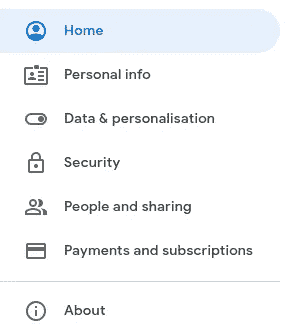

# 如何使用 Python FastAPI 发送电子邮件

> 原文：<https://medium.com/nerd-for-tech/how-to-send-email-using-python-fastapi-947921059f0c?source=collection_archive---------1----------------------->


[天翼马](https://unsplash.com/@tma?utm_source=medium&utm_medium=referral)在 [Unsplash](https://unsplash.com?utm_source=medium&utm_medium=referral) 上拍照

在进入主题之前，我们先介绍一下 FastAPI。什么是 FastAPI？

直接取自官方文件:

> FastAPI 是一个现代、快速(高性能)的 web 框架，用于基于标准 Python 类型提示用 Python 3.6+构建 API。

FastAPI 由于其速度快和易于设置，最近很受欢迎。FastAPI，Flask(除了新的 Flask 2.0)，Django 之间到底哪个更好，大概还是有争议的。但在我看来，这要追溯到我们的用例。详情可以在这里阅读[https://www . section . io/engineering-education/choosing-between-django-flask-and-fastapi/](https://www.section.io/engineering-education/choosing-between-django-flask-and-fastapi/)。

跳转到主话题，我们来创建一个简单的 app，通过两种方式使用 FastAPI 发送邮件，有后台任务和没有后台任务。

# 在那之前

在这篇文章中，我们将使用 Gmail 帐户发送电子邮件，并确保一切正常工作，你需要一个 Gmail 帐户这样做。确保您在 google 帐户设置中将`Allow less secure apps`设置为`On`。你可以这样做:

1.  点击账户图标上的`manage your Google account`(右上角)。

2.转到安全选项卡。



3.你会在本页找到一个部分，允许不太安全的应用程序。(在这里，我已经设置好了)


4.打开此设置。

如果您的帐户启用了双因素身份验证，这将不起作用。选择是你可以创建一个单独的帐户或创建[应用程序特定的密码](https://support.google.com/accounts/answer/185833)。

如果仍然出现验证错误，您可以尝试以下方法:

1.  显示解锁验证码。([https://accounts.google.com/DisplayUnlockCaptcha](https://accounts.google.com/b/2/DisplayUnlockCaptcha))
2.  启用 IMAP 访问。([https://mail.google.com/mail/#settings/fwdandpop](https://mail.google.com/mail/#settings/fwdandpop))

# 创建应用程序

## 配置虚拟环境

为了隔离该应用程序的环境，我们必须使用虚拟环境，在这种情况下，我将使用`pipenv`来管理虚拟环境。

```
pipenv shell
```

该命令将在虚拟环境中生成一个 shell 并生成`Pipfile`。然后，我们可以安装我们需要的依赖项。

```
pipenv install fastapi fastapi-mail uvicorn python-dotenv
```

创建一个`main.py`文件并将一些模板代码放入其中。

```
*import* uvicorn
*from* fastapi *import* FastAPI, BackgroundTasks
*from* send_email *import* send_email_background, send_email_asyncapp = FastAPI(title='How to Send Email')@app.get('/')
def index():
    *return* 'Hello World'*if* __name__ == '__main__':
    uvicorn.run('main:app', reload=True)
```

要运行这个应用程序，你可以输入命令`python main.py`。这个命令将启动服务器，然后您可以通过转到[http://localhost:8000/docs](http://localhost:8000/docs#/)来查看由 FastAPI 生成的文档。

不错…

现在，创建`.env`文件来存储敏感数据。

```
MAIL_USERNAME=<GMAIL_USERNAME>
MAIL_PASSWORD=<GMAIL_PASSWORD>
MAIL_FROM=<SENDER_ADDRESS>
MAIL_PORT=587
MAIL_SERVER=smtp.gmail.com
MAIL_FROM_NAME=<TITLE_FOR_MAIL>
```

创建一个名为`send_email.py`的文件，然后加载`.env`。

```
*import* os
*from* fastapi *import* BackgroundTasks
*from* fastapi_mail *import* FastMail, MessageSchema, ConnectionConfig*from* dotenv *import* load_dotenv
load_dotenv('.env')*class* Envs:
    MAIL_USERNAME = os.getenv('MAIL_USERNAME')
    MAIL_PASSWORD = os.getenv('MAIL_PASSWORD')
    MAIL_FROM = os.getenv('MAIL_FROM')
    MAIL_PORT = int(os.getenv('MAIL_PORT'))
    MAIL_SERVER = os.getenv('MAIL_SERVER')
    MAIL_FROM_NAME = os.getenv('MAIN_FROM_NAME')
```

我们有我们需要的导入和设置(我们需要 FastAPI 邮件连接配置)。然后编写连接配置和发送电子邮件的代码。

```
conf = ConnectionConfig(
    MAIL_USERNAME=Envs.MAIL_USERNAME,
    MAIL_PASSWORD=Envs.MAIL_PASSWORD,
    MAIL_FROM=Envs.MAIL_FROM,
    MAIL_PORT=Envs.MAIL_PORT,
    MAIL_SERVER=Envs.MAIL_SERVER,
    MAIL_FROM_NAME=Envs.MAIL_FROM_NAME,
    MAIL_TLS=True,
    MAIL_SSL=False,
    USE_CREDENTIALS=True,
    TEMPLATE_FOLDER='./templates/email'
) async def send_email_async(subject: str, email_to: str, body: dict):
    message = MessageSchema(
        subject=subject,
        recipients=[email_to],
        body=body,
        subtype='html',
    )

    fm = FastMail(conf)
    *await* fm.send_message(message, template_name='email.html') def send_email_background(background_tasks: BackgroundTasks, subject: str, email_to: str, body: dict):
    message = MessageSchema(
        subject=subject,
        recipients=[email_to],
        body=body,
        subtype='html',
    ) fm = FastMail(conf)
    background_tasks.add_task(
       fm.send_message, message, template_name='email.html')
```

在这个例子中，有两个函数，一个异步发送电子邮件(或者像普通函数一样)，另一个在后台发送电子邮件。在我们尝试使用这些函数后，您会注意到不同之处。

注意，我们使用 Jinja2 模板引擎生成 HTML 电子邮件。所以让我们创建一个 HTML 文件。首先，创建一个`templates`文件夹，并创建一个名为`email.html`的 HTML 文件。该文件用于连接配置(`TEMPLATE_FOLDER`)。

像任何使用 Jinja2 引擎的 HTML 文件一样，我们可以在那里提供动态数据，Jinja2 将负责处理它的呈现方式。我们可以使用`body.property`模式访问它。

注意，这里我们使用了内联 CSS，就像 FastAPI-MAIL 的官方文档所建议的那样。

> 在发送 HTML 电子邮件时，邮件服务器——outlook、google 等——所期望的 CSS 必须是内联 CSS。

创建发送电子邮件的路径操作。

```
@app.get('/send-email/asynchronous')
async def send_email_asynchronous():
    *await* send_email_async('Hello World','someemail@gmail.com',
    {'title': 'Hello World', 'name': 'John Doe'})
    *return* 'Success'@app.get('/send-email/backgroundtasks')
def send_email_backgroundtasks(background_tasks: BackgroundTasks):
    send_email_background(background_tasks, 'Hello World',   
    'someemail@gmail.com', {'title': 'Hello World', 'name':       'John Doe'})
    *return* 'Success'
```

保存所有文件，服务器将重新加载。现在，刷新文档页面。

您将看到两个新的端点，即`/send-email/asynchronous`和`/send-email/backgroundtasks`。尝试两个端点以查看差异。

当您使用异步调用服务器时，您会在文档中看到一个加载指示器，因为应用程序需要时间来发送电子邮件。但是如果使用后台任务，客户端不需要等待操作完成。当我们向用户发送电子邮件或通知时，这个功能会很有用。这里更多关于后台任务[https://fastapi.tiangolo.com/tutorial/background-tasks/](https://fastapi.tiangolo.com/tutorial/background-tasks/)。

这是电子邮件发送后的外观:


你可以在这里找到这篇文章的代码，[https://github . com/agusrichard/fastapi-workbook/tree/master/send-email](https://github.com/agusrichard/fastapi-workbook/tree/master/send-email)。

我希望这篇文章对你来说是一个很好的资源，谢谢你的阅读。

# 参考资料:

*   https://fastapi.tiangolo.com/
*   【https://sabuhish.github.io/fastapi-mail/ 
*   [https://www . geeks forgeeks . org/sending-email-using-fastapi-framework-in-python/](https://www.geeksforgeeks.org/sending-email-using-fastapi-framework-in-python/)
*   [https://www . twilio . com/blog/2018/03/send-email-programmably-with-Gmail-python-and-flask . html](https://www.twilio.com/blog/2018/03/send-email-programmatically-with-gmail-python-and-flask.html)
*   [https://mailtrap.io/blog/flask-email-sending/](https://mailtrap.io/blog/flask-email-sending/)