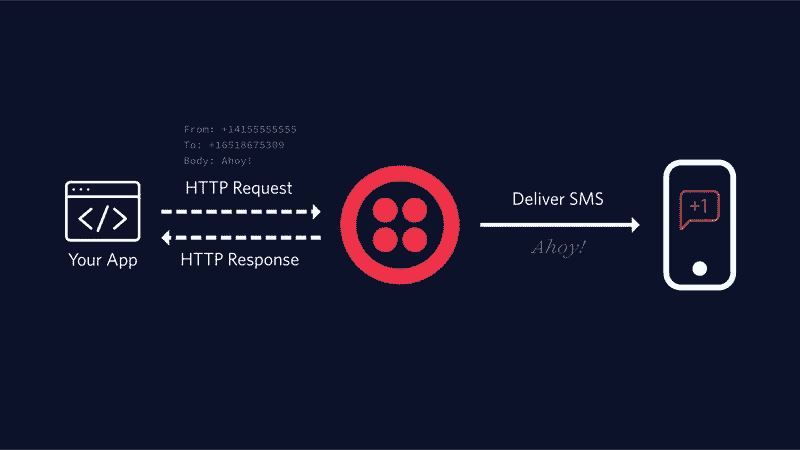
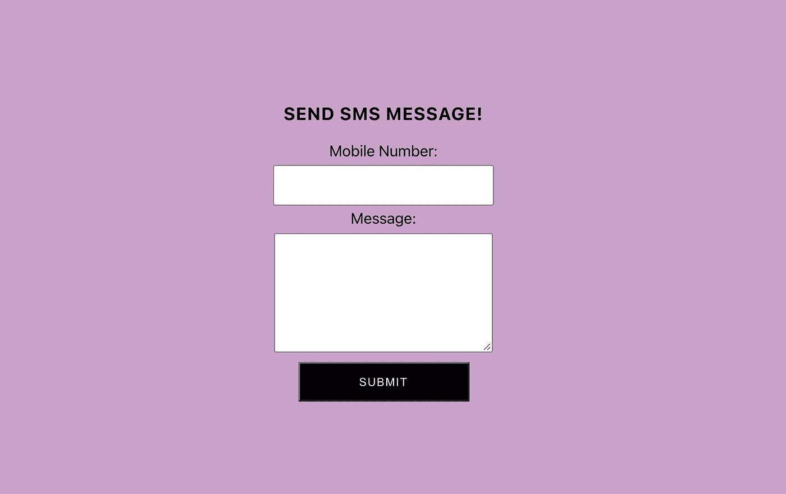

# 如何使用 Twilio、Rails 和 React 发送短信

> 原文：<https://medium.com/nerd-for-tech/how-to-send-sms-messages-using-twilio-rails-and-react-47b749d21c7f?source=collection_archive---------1----------------------->

我的朋友凯文(看看他的博客)🤓)和我一直在为一家名为分手空间的公司做一个自由职业项目。他们的任务是阻止通过模板化分手短信鬼混的约会趋势。与一家公司合作，让他们的愿景成为现实，这是一件有趣且值得的事情。

在开发这款应用时，我们开发了一个功能，让用户可以向移动设备发送短信。最终我们取消了这个功能，但我认为创建它真的很有趣，并想分享！有许多受欢迎的服务可以使用，我发现了 Twilio，他们有非常容易理解的文档。Twilio 可以做的不仅仅是发送短信，但对于本文，我将只介绍发送文本。

# 什么是短信？


SMS 代表短消息服务，是一种纯文本标准，通常通过蜂窝网络从一个移动设备发送到另一个移动设备。简单来说就是短信！如果您想了解更多信息，请查看 [Twilio 文档](https://www.twilio.com/docs/glossary/what-is-an-sms-short-message-service)。

# Twilio 设置



Twilio 过程！

如果您没有 Twilio 的帐户，请在这里注册一个。接下来，安装 [Twillio CLI](https://www.twilio.com/docs/sms/quickstart/ruby) 。对于我们的 Rails 后端，我们将需要`Account Sid`、`Auth Token`和您的`Twilio Number`。现在，我们已经完成了 Twilio 的设置。让我们继续设置我们的 Rails 后端！

# 后端设置

让我们首先用以下代码生成一个 Rails 应用程序:

```
rails new twilio-messaging --database=postgresql --api
```

在`Gemfile`中，我们需要包含一个宝石来整合 Twilio。添加`gem 'twilio-ruby'`，也取消`gem 'rack-cors'`，运行`bundle install`。

## 生成模型和控制器

现在我们需要为`SmsMessage`生成模型，它具有`mobile_number`和`message`的属性，数据类型为 string。

```
rails g model SmsMessage mobile_number:string message:string --no-test-framework
```

接下来还将生成控制器:

```
rails g controller SmsMessages --no-test-framework
```

一旦我们生成了控制器和模型，让我们创建数据库并进行迁移

```
rails db:create && rails db:migrate
```

## 配置文件

让我们导航到`config/initializers/cors.rb`。在文件中，用`*`替换`example.com`，并取消下面的注释

出于安全考虑，我们需要创建一个`environment.rb`文件来存储我们的 Twilio 信息，并将这个文件名添加到`.gitignore`。这将阻止我们的`environment.rb`文件被提交到 GitHub。

现在将您的`Twilio number`、`Account Sid`和`Auth Token`添加到您的`environment.rb`文件中。在`auth_sid`、`auth_token`和`twilio number`字段中，用您自己的 Twilio 信息替换它们！确保它们是字符串格式。

接下来，导航到`config/routes.rb`并为`sms_messages`设置`create`路线:

```
resources :sms_messages, only: [:create]
```

现在让我们实现 Sms 消息的创建。转到您的`SmsMessagesController`并定义方法`create`。

# SmsMessagesController

在`SmsMessagesController`的`create`方法中，我们想要做的是使用 Twilio API 将消息从客户端发送到提供的手机号码。遵循下面的代码片段。

# 前端设置

对于前端，我刚刚创建了一个新的 React 应用程序，并下载了[样式组件](https://styled-components.com/)来帮助前端看起来更漂亮😍。我还使用了你应该熟悉的钩子。如果你需要设置 React 应用程序的说明，请点击这里的文档[或点击这里的](https://reactjs.org/docs/create-a-new-react-app.html)阅读 hooks。

创建一个 SmsForm 组件，它将处理向 Rails API 提交手机号码和文本消息。在`SmsForm`中，我们将创建一个表单、一个手机号码输入、一个消息文本区和一个提交按钮。

一旦点击了提交按钮，我们的应用程序就会向我们的 Rails API 发送一个包含用户输入的 post 请求。需要注意的一件重要事情是，Twilio 需要以`1`为前缀的手机号码。所以在第 12 行，你会看到我给用户提交的手机号码添加了一个`1`。

从第 53 行开始，我使用`styled-components`来设计我的 React 应用程序。请随意忽略这部分代码，做自己的样式😊。

现在，只需将 SmsForm 组件导入到您的`src/App.js`中，就大功告成了！

# 最终的结果！

用`npm start`启动您的 React 应用程序，您应该会看到如下所示。



既然我们的前端已经设置好了，我们就可以向 Rails API 提交请求了！首先，如果您还没有用`rails s`启动 Rails API。接下来在你的浏览器中输入你的手机号码和短信，然后点击提交。

你应该会在手机上收到一条短信。恭喜🎉！现在，您已经正式将 Twilio 集成到您的 Rails API 中。你可以从这个博客查看所有代码，[前端](https://github.com/slurio/sms-frontend)和[后端](https://github.com/slurio/sms-backend)。

您还可以利用 Twilio 做更多事情！请随意查看 [Twilio REST API 文档](https://www.twilio.com/docs/api)。我想添加的一点是用户输入的验证和错误消息，并添加[电话号码查找](https://www.twilio.com/docs/lookup/api)。我希望你喜欢这个博客和快乐编码！