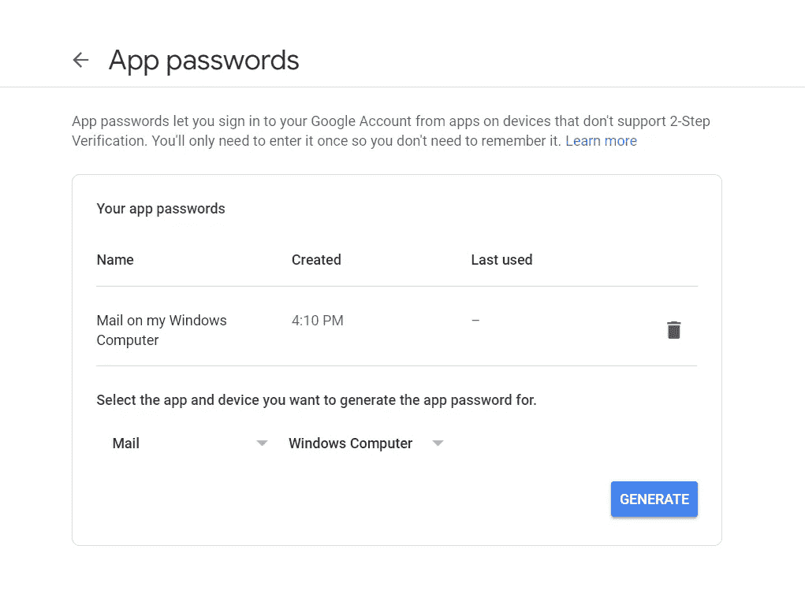

# 如何使用 GMail 帐户从 Lua 发送测试邮件

> 原文：<https://medium.com/nerd-for-tech/how-to-send-test-mails-from-lua-using-gmail-account-73b11b81ca91?source=collection_archive---------12----------------------->

*Lua 是一种快速的脚本语言，具有易于学习的编程范式。*

我试图用一种新的语言来测试电子邮件的发送过程。我试过在 PHP 中使用 sendmail 程序。Lua 的工作方式不同，使用 OpenResty。

*克隆此存储库:*

> https://github.com/GUI/lua-resty-mail

然后按照 README.md 页面上的说明，更改 make test 命令头。

注释掉`— exclude_tags=integration_external`并包含`— exclude_tags=integration_internal`

这将执行规格文件`mail_integration_internal_spec.lua`

设置 SMTP Gmail 帐户的环境详细信息，并更改发件人地址。

**您的 GMail 帐户**

1.  导航至您的[谷歌账户](https://myaccount.google.com/)。
2.  选择安全性。
3.  在“登录谷歌”下，选择应用程序密码。

然后，点击**生成。**

现在，将您的密码添加到 Lua 程序中，享受发送电子邮件的乐趣。