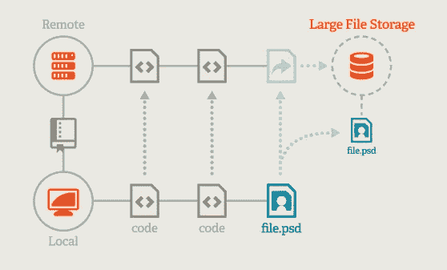
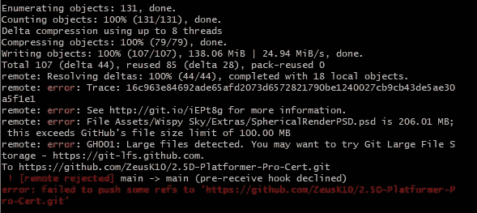
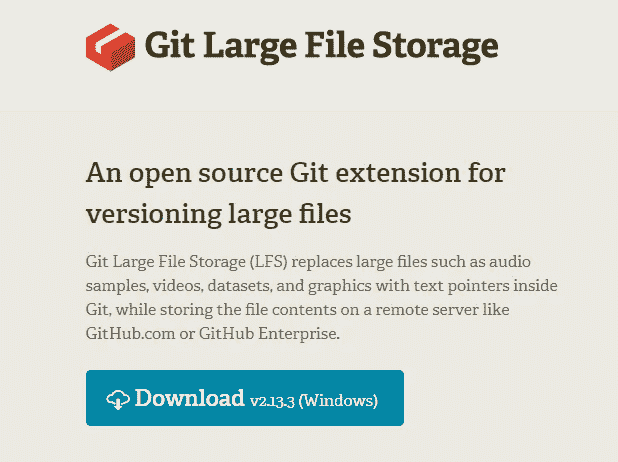
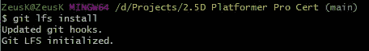
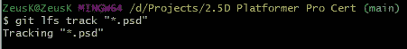
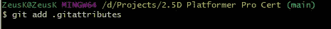
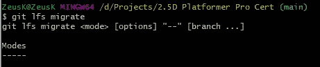
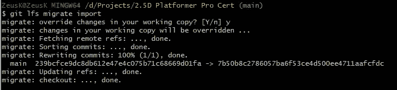

# 如何设置 Git

> 原文：<https://medium.com/nerd-for-tech/how-to-setup-git-lfs-c00e83de3411?source=collection_archive---------9----------------------->

**目的:**使用 Git-LFS 推送大小超过 100MB 的文件

如果不使用 git-LFS，你可能会看到类似这样的错误

所以我们要做的是下载 git LFS 安装文件。你可以在谷歌搜索中找到它。

下载完成后，将其安装到您的 PC 上，我们就可以在 git bash 中应用它了。

然后用 **git lfs install** 命令初始化已安装的 git lfs。当您设置 lfs 时，您只需要这样做一次，因此在整个过程之后，没有必要在同一个存储库中再次这样做。

现在你需要跟踪超过 100MB 的文件，所以写下一行 **git lfs track "*。文件类型”。该命令现在跟踪所有类型为**的文件。psd** 。**

现在添加。要推送的 gitattributes 文件。此文件包含有关跟踪上述跟踪文件类型中的文件的信息。

然后编写命令 **git lfs migrate。**我们这样做是因为我们已经提交了用于推送的文件，默认情况下，在推送过程中文件不会更改为 lfs，因此我们输入该命令来查找潜在用例的选项。

使用此命令，您可以将文件类型转换为 lfs，而无需修改存储库的现有历史。

并且该文件已经被成功推送。