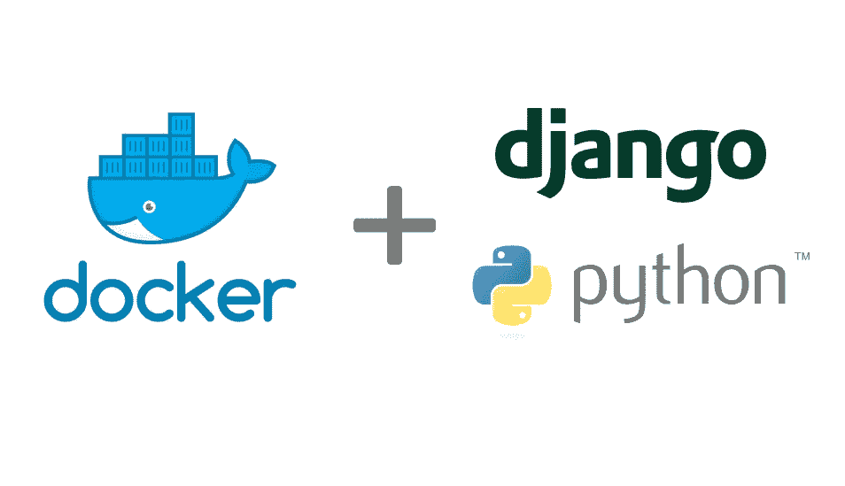
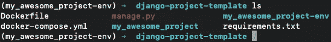
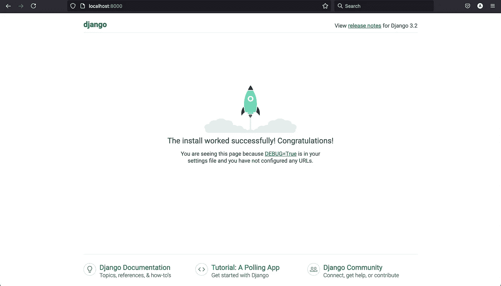

# 如何用 Django 和 Docker 设置无头开发环境

> 原文：<https://medium.com/nerd-for-tech/how-to-setup-headless-dev-environment-with-django-and-docker-7495bd79b1cb?source=collection_archive---------0----------------------->

在本教程中，我将介绍如何用 Django 和 Docker 创建一个强大的开发环境。本教程的灵感来自于我和我朋友的一个项目，我们分工合作，我做后端服务，我朋友负责前端的所有工作。我的目标是为有效的后端开发创建一个开发环境，没有任何部署或其他方面的麻烦。我的设置相当简单，我使用 Django 作为后端框架，并选择 PostgreSQL 作为数据库。如果您想跳过教程部分，可以在底部找到样板模板的链接，直接跳到代码。

1.  **确保您安装了 Docker 和 git(如果您使用提供的模板)**

你可以从[官方 Docker 页面](https://www.docker.com/products/docker-desktop)获取 Docker，从[官方 git 页面](https://git-scm.com/book/en/v2/Getting-Started-Installing-Git)获取 Git。

**2。首先创建一个 python 环境**

为您的项目创建新目录，并导航到该目录。之后，让我们创建新的 python 环境。使用 python 3 创建 Python 环境就像运行`python3 -m venv <venv_name>`命令一样简单。这将为我们的项目创建一个独立的环境，在这里我们可以安装我们的依赖项，而不会影响我们系统上的任何东西。

**3。创建需求文件**

让我们创建我们的`requirements.txt`文件来轻松安装我们的 Python 依赖项。在项目根目录下新建一个名为`requirements.txt`的文件，并添加以下内容:

**4。激活 python 环境**

要激活环境，在项目目录中运行以下命令:
`source <venv_name>/bin/activate`

要关闭 venv，你可以运行 `*deactivate*` *，但是不要运行这个！*

**5。安装所有依赖项**

在`requirements.txt`所在的项目目录下运行`pip install -r requirements.txt`，安装`requirements.txt` 文件中定义的所有依赖项

6。创建 Dockerfile

让我们创建我们的`Dockerfile` 来配置我们的 docker 映像。在项目根目录下新建一个名为`Dockerfile`的文件，并添加以下内容:

在这个文件中，我们定义了当一个映像被创建时，它将如何被构建。简而言之，我们安装依赖项，并将所有项目文件复制到容器中。

**7。创建 docker-compose.yml 文件**

为了保持项目易于扩展，让我们创建一个`docker-compose.yml`文件来处理我们所有的容器。在我们的项目目录的根目录下创建一个`docker-compose.yml`文件，并在那里添加以下内容:

我想在这里解释一下也无妨。在这个 docker-compose 文件中，我们定义了一个 PostgreSQL 容器，它是一个数据库容器，应该在其中存储它的卷。所有带有`${}`语法的地方都将被来自`.env`文件的 env 变量填充，我们将在第 11 步创建该文件。

**8。开始一个新项目**

现在让我们通过调用`django-admin startproject <your_project_name> .`来启动一个新的 Django 项目。这将在当前目录中用我们提供的名称创建新的 Django 项目。现在，您应该在工作目录中看到类似这样的内容:

项目目录的内容

**9。通过添加 PostgreSQL 连接**更改设置文件

Django 在创建新项目时默认使用 SQLite 数据库。这完全没问题，因为它可以处理一些测试和轻度开发，但我们想要更多的东西，所以让我们把我们新创建的 PostgreSQL 数据库投入使用。

让我们从导航到 Django 项目目录并编辑数据库设置开始。在`settings.py`文件中找到`DATABASES = ...`并用以下内容替换它:

数据库连接设置

要利用`.env`文件中的设置，将以下内容添加到第一次`Path`导入下的文件顶部:

使用中的环境变量。环境文件

**10。将 django_secret 移动到。环境文件**

为了保持我们的`settings.py`文件整洁，让我们将`SECRET_KEY`移动到`.env`文件中。但在此之前，我们需要创建一个这样的文件，在项目根目录中创建包含以下内容的`.env`命名文件:

的内容。环境文件

现在再次转到`settings.py`文件，将带有`SECRET_KEY = ...`的行复制到`.env`文件的末尾，并将`settings.py`中的行替换为`SECRET_KEY = env("SECRET_KEY")`。**注意添加** `**SECRET_KEY**` **时，删除该行中的所有空格，尤其是等号周围的空格。**

**11。恭喜，您的开发环境现在已经设置好了！🎉**

现在我们应该能够运行`docker-compose up -d`来启动 PostgreSQL 容器，并在等待它启动后运行`./manage.py runserver`来启动 django 服务器。在此之后，您应该能够导航到`http://localhost:8000`并看到以下页面:

成功启动 Django 项目

现在，我们已经在本地机器上实现了带有 PostgreSQL 数据库的完全工作的 Django 安装。确认一切正常后，请继续修改`.env`文件内容以更好地适应您的需要。

在教程的开始，我承诺提供一个模板来简化设置。你可以从[django-project-template](https://github.com/aaralh/django-project-template)仓库中找到它。有了这个模板，您可以通过运行`setup.sh`脚本来加速这个过程。git 文件夹，并为您创建一个新文件夹，用给定的名称初始化新项目，并对初始设置进行所有必要的更改。现在，我只希望你快乐黑客，如果你有任何建议或变化，请随时打开一个公关🙂