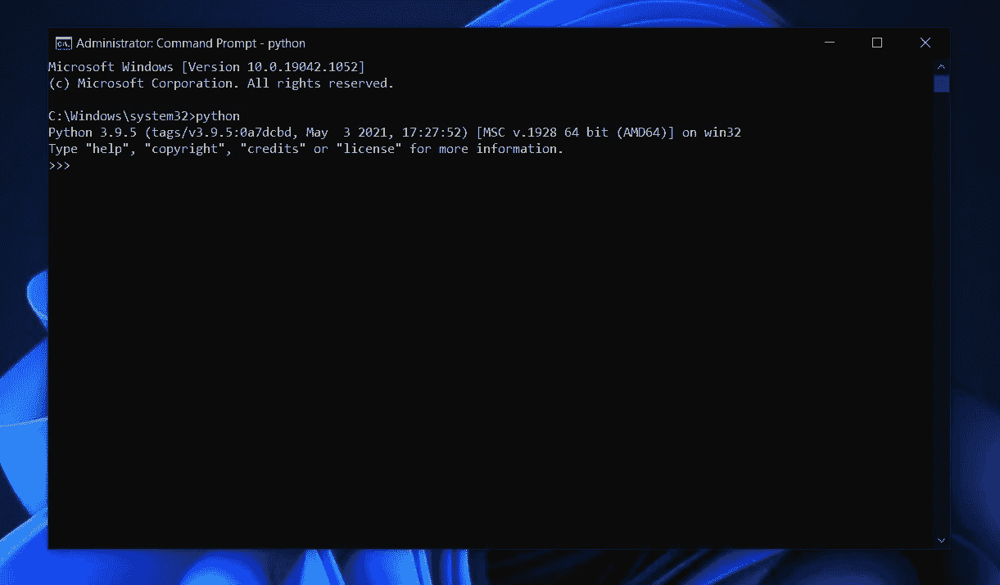
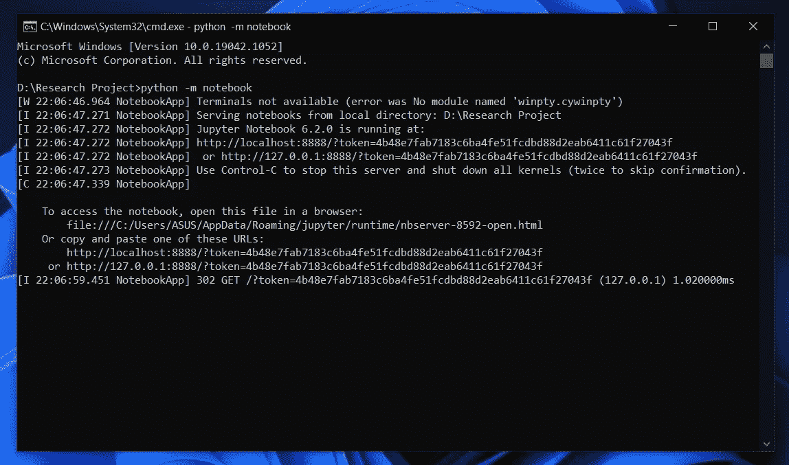
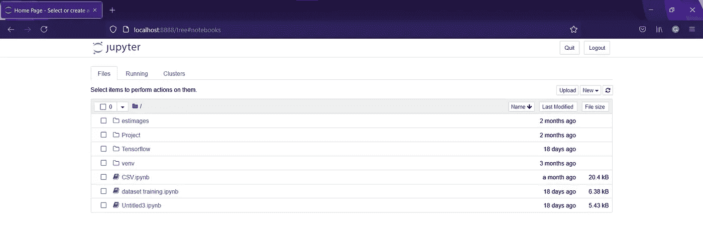

# 如何设置 Jupyter 笔记本(Windows)

> 原文：<https://medium.com/nerd-for-tech/how-to-setup-jupyter-notebook-windows-a5abf35c09bb?source=collection_archive---------11----------------------->

**第一步:在 windows 中安装 Python**
领先的 Python 站点在[https://www.python.org/](https://www.python.org/)上，Windows 最新的源代码分发版本是 python 3.9.5。建议使用比最新版本更低的版本。

python 官方网页

**步骤 2:确认 Python 已安装**
在 Windows 服务器上测试 Python 安装的最简单方法是打开命令提示符。一旦命令提示符窗口打开，键入 **python** 并按 **Enter** 。如果 Python 安装正确，您应该会看到如下所示的输出。

检查 python 版本

第三步:在 Windows 中安装 Pip
一旦你确认 Python 安装正确，我们就可以继续安装 Pip 了。
1。将 [get-pip.py](https://bootstrap.pypa.io/get-pip.py) 下载到您计算机上的文件夹中。
2。打开命令提示符并导航到包含 get-pip.py 安装程序的文件夹。
3。运行以下命令:
*python get-pip.py*

**步骤 4:验证安装并检查 Pip 版本**
我们现在可以通过打开命令提示符并输入以下命令来验证 Pip 安装是否正确。
*pip -V*

**第五步:使用 pip 命令安装 OpenCV 库**安装完 Python 和 pip 之后，我们就可以直接安装 OpenCv 库并开始使用了。要安装这个库，我们需要在终端中输入给定的命令。
*pip 安装 opencv-python*

**步骤 6:使用 pip 命令安装 matplotlib 库**
Matplotlib 是一个用于在 Python 中创建静态、动画和交互式可视化的综合库。要安装 matplotlib，我们需要在终端中输入给定的命令。
*pip 安装 matplotlib*

**第七步:使用 pip 命令安装 Jupyter notebook**
要使用 Python 的包管理器 pip 安装 Jupyter notebook，我们需要在终端输入给定的命令。
*python -m pip 安装 jupyter*

**步骤 8:在 Windows 上运行 Jupyter 笔记本**
要运行笔记本，在终端中运行以下命令。
*python -m 笔记本*

运行 [http://127.0.0.1:8888](http://127.0.0.1:8888) 或在 web 浏览器中复制粘贴命令末尾给出的 URL。

