# 如何在 AWS RDS(关系数据库服务)上设置 mysql 数据库

> 原文：<https://medium.com/nerd-for-tech/how-to-setup-mysql-database-on-aws-rds-relational-database-service-f5a186ccbadb?source=collection_archive---------1----------------------->

在本文中，我们将学习如何在 AWS **RDS** 中设置 mysql 数据库，以及如何从我们的 **EC2** 实例或本地机器的 phpmyadmin 连接该数据库。所有这些都符合[自由层](http://aws.amazon.com/free/)的条件。

**先决条件** 创建 AWS 账户。

# **在 Amazon RDS 上创建一个数据库实例**

我们将使用 Amazon RDS 创建一个带有 **db.t2.micro** DB 实例类的 **MySQL** DB 实例， **20 GB** 存储，这是符合[自由层](http://aws.amazon.com/free/)条件的。

亚马逊 **RDS 免费等级**向您提供 **12 个月**。

*   在单个 AZ db.t2.micro 实例中每月 750 小时的 Amazon RDS。
*   每月 20 GB 的通用存储(SSD)。
*   每月 20 GB，用于自动备份存储和任何用户启动的数据库快照。

# 创建数据库实例的步骤

1.使用您的 AWS 帐户登录并转到**控制台。**

2.在服务中搜索 **RDS** 并转到 RDS。

3.在 Amazon RDS 控制台的右上角，选择要在其中创建 DB 实例的*区域*。(可选)

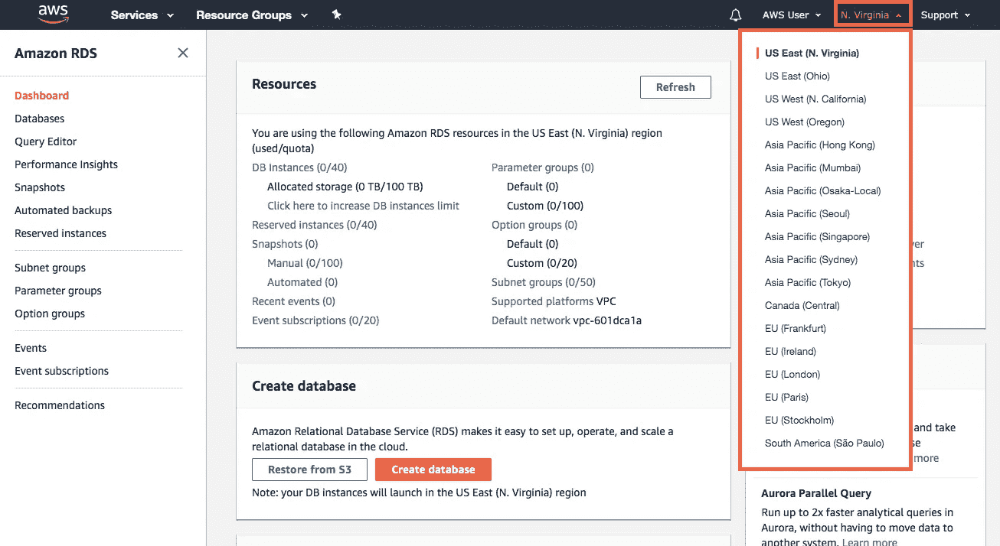

4.点击仪表板上创建数据库部分的**创建数据库**。

5.选择**标准**创建来配置数据库实例。

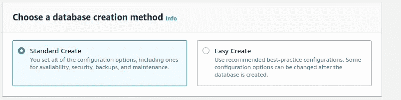

6.在引擎选项中选择 **MYSQL** ，在模板中选择**自由层**。

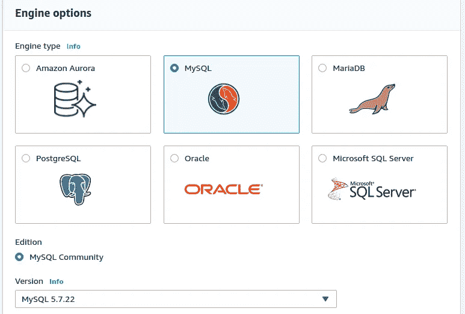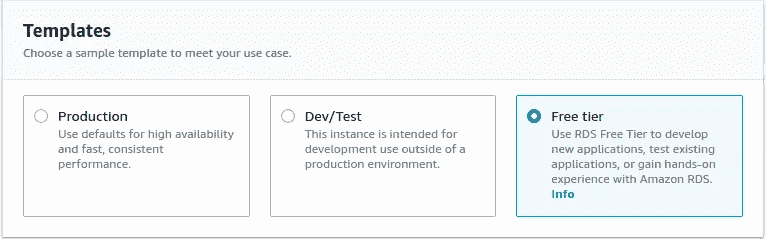

7.配置一个 **DB 实例名**和**凭证设置。**

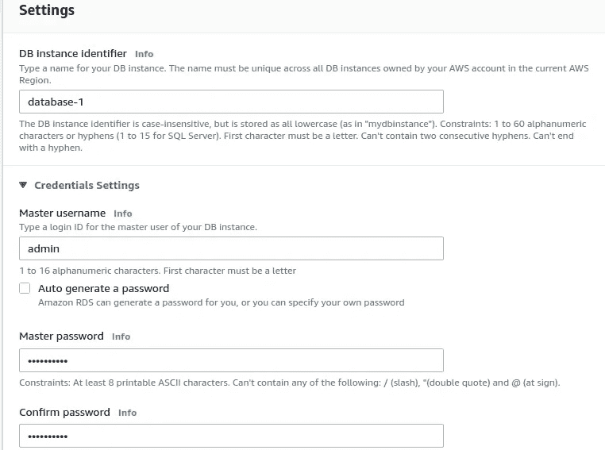

8.**禁用**存储部分的存储自动缩放。

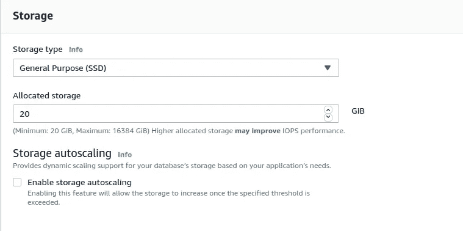

9.**改变**你附加的**连通性**配置**。公共访问**是**从**本地**机器**访问数据库**。**

**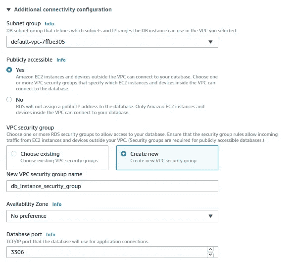**

**10 .将数据库认证设置为**密码**认证**

**11.现在向**走来附加配置****

**a)输入一个**初始**数据库名**

**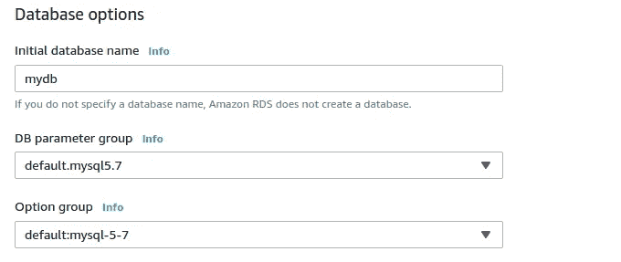**

**b)启用**自动备份**并将**备份保留期**设为 1 或 2 天，并禁用监控。**

**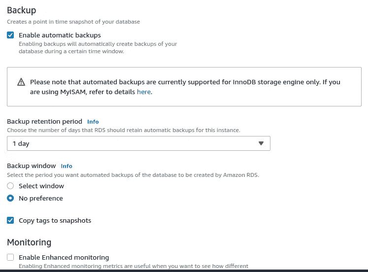**

**d)启用**所有日志导出。****

**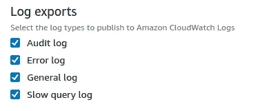**

**e)同时启用**自动小版本升级**和**删除保护**。这将不允许任何人直接删除数据库实例。**

**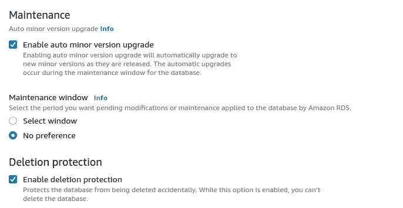**

**12.点击**创建数据库****

**在这里，您已经完成了在 Amazon RDS(免费层资格)中设置 MYSQL 数据库的工作。**

## **如何在本地机器或 EC2 实例中从 phpmyadmin 访问 mysql 数据库？**

> **要从本地机器访问 db 实例，您必须在步骤 9 中将 public accessibility 选项设置为 yes。此外，数据库实例中的安全组规则应该如下所示。**

**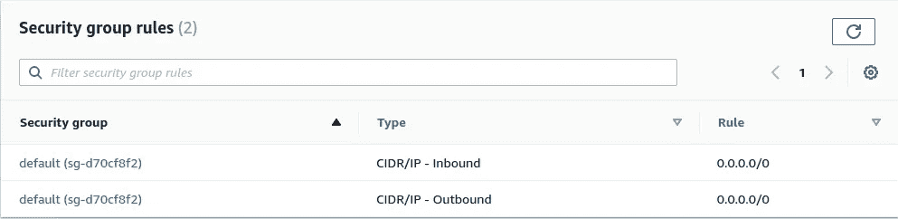**

**现在，在您的机器或 EC2 实例中打开 phpmyadmin config.inc.php，以连接您的数据库服务器。**

**打开/etc/phpmyadmin/config.inc.php，将 DB 实例添加到 phpmyadmin**

```
$ sudo vi /etc/phpmyadmin/config.inc.php
```

**在 config.inc.php 的末尾加上下面一行**

```
$i++;
$cfg['Servers'][$i]['host']          = 'ENDPOINT_HERE';
$cfg['Servers'][$i]['port']          = '3306';
$cfg['Servers'][$i]['socket']        = '';
$cfg['Servers'][$i]['connect_type']  = 'tcp';
$cfg['Servers'][$i]['extension']     = 'mysql';
$cfg['Servers'][$i]['compress']      = FALSE;
$cfg['Servers'][$i]['auth_type']     = 'config';
$cfg['Servers'][$i]['user']          = 'root'
$cfg['Servers'][$i]['password']      = 'PASSWORD_HERE';
```

**将“**ENDPOINT _ HERE*”***和“ **PASSWORD_HERE** ”替换为您的凭证。**

****对于端点**:转到 RDS 上的数据库。单击您的数据库实例，您将在**连接性&安全性中找到您的数据库端点。****

****密码**:使用您在步骤 7 中使用的数据库密码(配置数据库实例名称和**凭证设置**)。)创建数据库实例时。**

****注意**:您可以在任何连接到您的数据库实例的软件上使用您的凭证。即 [DataGrip](https://www.jetbrains.com/datagrip/) 、 [MySQL Workbench](https://dev.mysql.com/downloads/workbench/) 等。**

# ****参考文献****

1.  **[https://AWS . Amazon . com/getting-started/hands-on/create-MySQL-db/](https://aws.amazon.com/getting-started/hands-on/create-mysql-db/)**
2.  **[https://docs . AWS . Amazon . com/Amazon rds/latest/user guide/CHAP _ MySQL . html](https://docs.aws.amazon.com/AmazonRDS/latest/UserGuide/CHAP_MySQL.html)**