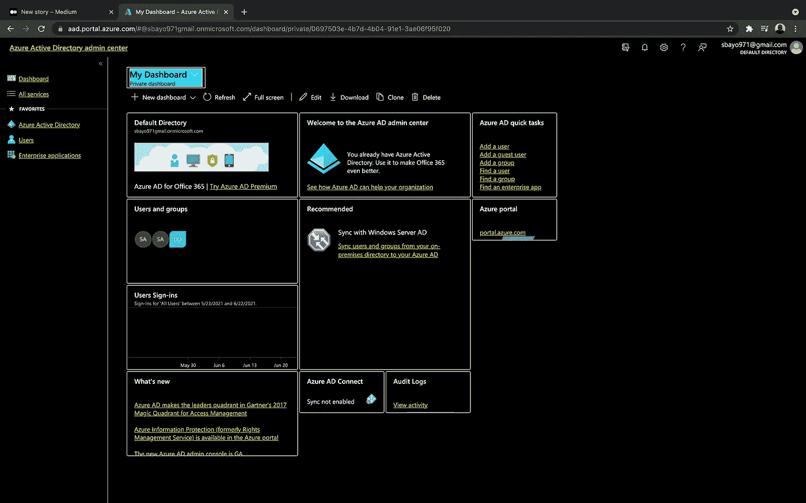
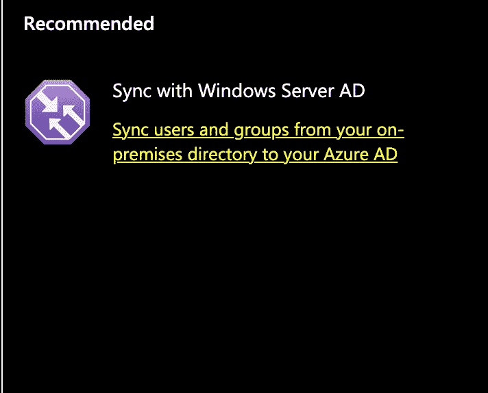
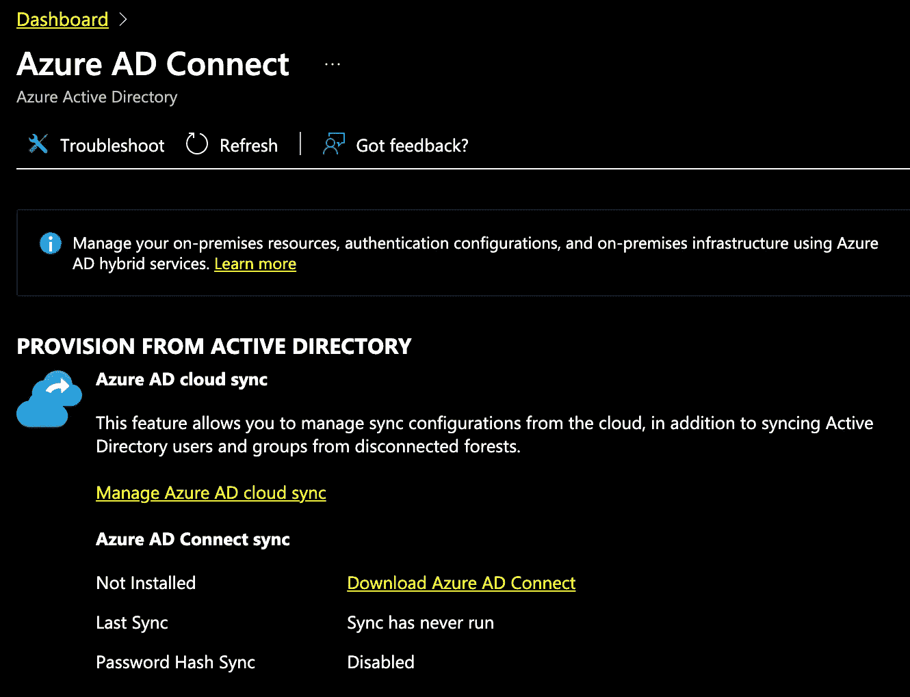

# 如何在 Microsoft Azure 中设置密码哈希同步

> 原文：<https://medium.com/nerd-for-tech/how-to-setup-password-hash-synchronization-in-microsoft-azure-7c4abf1eb42?source=collection_archive---------14----------------------->

照片信用:检查

Azure 正在迅速成为该领域最高效的云提供商之一，鉴于我是一名 DevOps 工程师，多年来，我开始探索与不同公司的项目相关的不同云工具，从 FAANG 到成长型初创公司。

> 我一直认为，只要在处理云时对 IAM 进行排序，你就可以实现令人敬畏的东西，同时这个作品将通过**混合身份执行简单的 IAM 任务。**

我们将解决如何将本地 Azure 目录与微软 Azure 同步，这里的同步被称为**混合身份。**一些组织没有内部使用案例，必须单独处理云，可能不需要这种混合身份。另一种可能的情况是，在一个团队中，有一个 **office 365 设置**和**本地设置**，但不同的用户有不同的登录详细信息，这很疯狂，因为随着客户群的增加，维护列表将变得很困难。因此，这就是 SSO 和单一身份验证细节派上用场的地方，使工作方式更容易实现。

> **注意:当您输入密码时，它不会保存为纯文本，而是经过特殊的算法或哈希处理后，才允许您使用唯一的字符串进行访问。我们将使用密码哈希同步方法同步密码，以便于访问和控制。**

# 先决条件

1.  尽可能理解 Azure 和 office 365 的基本 IAM 类比。
2.  创建 azure 租户并验证 IAM。
3.  如有必要，连接一个域。
4.  拥有 Azure 帐户。

# 演示

*   通过[**aad.portal.azure.com**](http://aad.portal.azure.com)进入广告门户

*   通过选择所需文本，从本地目录用户 AD 同步用户和组，如下所示:

*   下载 azure AD connect 并运行安装文件以及需要下载的任何必要框架

*   使用所有必需的(尤其是域服务凭据)设置 Azure AD connect 软件
*   安装 Azure 广告软件
*   您可能会遇到配置错误，不要惊慌，访问您的终端并运行

*   然后返回门户，查看反映的用户，主要用户是管理员帐户。
*   瞧，你成功了！

身份验证的要点是为用户提供一组凭证，如用户名和密码，并验证他们在需要访问应用程序时是否提供了正确的凭证。因此，我们需要一种方法将这些凭证存储在我们的数据库中，以便将来进行比较。然而，在服务器端存储密码进行身份验证是一项困难的任务。

现在，请记住，这篇文章不仅仅是为软件领域的专家准备的，即使是新手也可以加入并学到很多东西，这就是为什么我试图用外行和专业术语将一切都讲清楚，所以如果你有任何问题，可以通过 [**Twitter**](https://twitter.com/SamuelArogbonlo) **联系我，或者通过**[**GitHub**](https://github.com/samuelarogbonlo)**找到我。**

**感谢阅读❤️**

如果你对这个话题有任何想法，请留下评论——我乐于学习和探索知识。

# 我可以想象这个帖子有多有用，请留下掌声👏下面几次以示对作者的支持！此外，如果你需要一个咨询和自由职业的 DevOps 工程师，我就是你要找的人；雇用我，让我们完成这个项目。