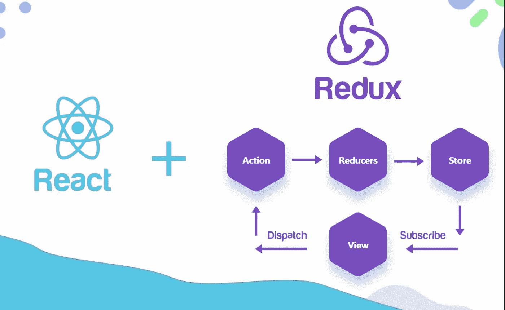
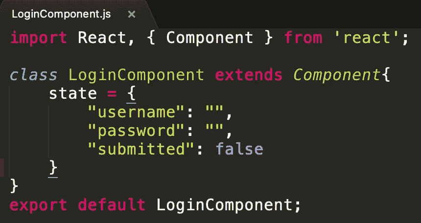
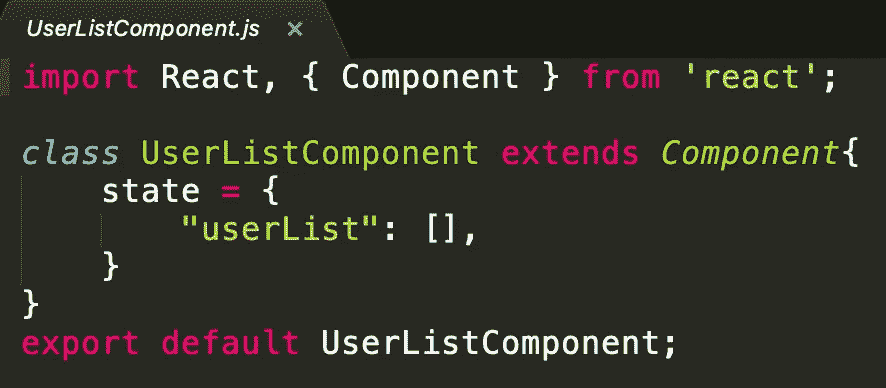
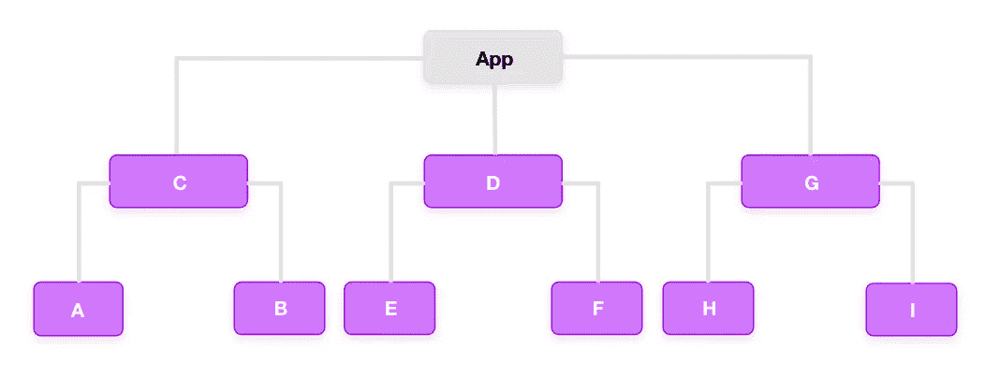
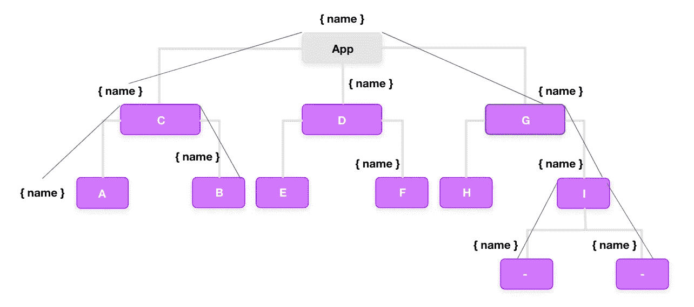
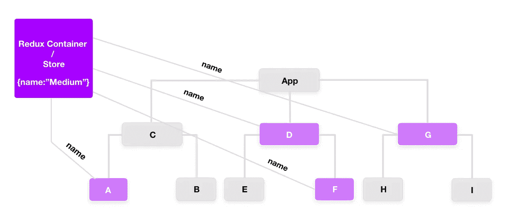
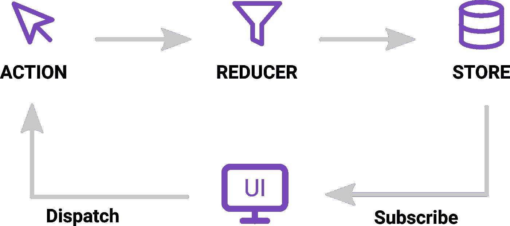
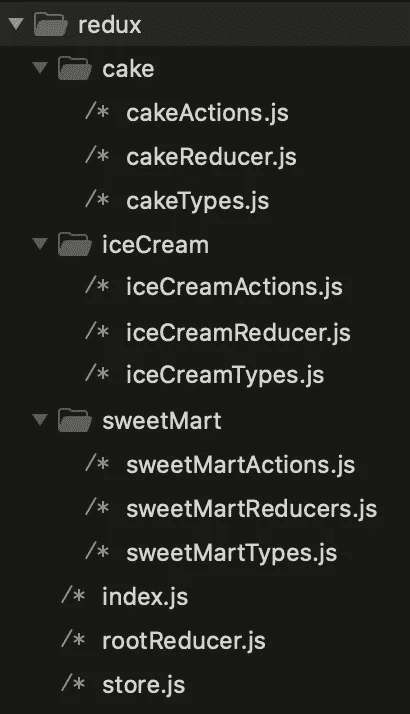
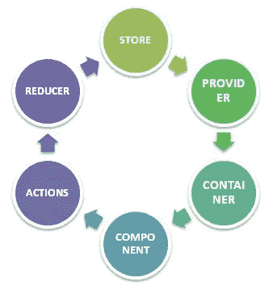

# 如何设置 Redux 并连接到 React 应用程序

> 原文：<https://medium.com/nerd-for-tech/how-to-setup-redux-and-connect-to-react-app-a059149641d3?source=collection_archive---------14----------------------->

在这里，我分享我的知识和经验，关于我们如何设置 Redux 和连接反应应用程序(你需要知道的一切)。



反应还原

> 随着世界的快速变化。我们不能无所事事，我们需要继续前进，我们需要在每一个起伏中尽我们最大的努力。我们如何尽最大努力？答案是日复一日的学习。如果你有 6 年以上的工作经验，你需要每天学习，让自己变得更好。

在继续之前，我们将尝试了解 redux 的定义是什么，以及所有的好处是相同的。

# 介绍

Redux 是 JavaScript 应用程序的可预测状态容器。为了理解它的意思，让我们把它分成三个部分。

*   它适用于 javascript 应用程序
*   它是一个状态容器
*   这是可以预测的

让我们来谈谈每一个-

## Redux 是针对 javascript 应用的。

*   Redux 不绑 react。
*   它可以与任何框架一起使用，如 React、Vue 和 Angular 或带有普通 javascript 的 event。
*   所以 redux 是 javascript 应用的库。

## Redux 是一个状态容器

*   Redux 用于存储应用程序的状态。
*   这意味着什么，让我们把一个 react 应用看作是一个组件的状态？
*   应用程序的状态是由该应用程序的所有单个组件表示的状态。所以这包括数据和 UI 逻辑。参考下图。



Ishwar Deoolkar 的组件状态

*   如果您的应用程序是中型到大型的。所以应用程序的状态应该是这样的。参考下图。


Ishwar Deoolkar 的应用程序组件状态

*   Redux 将存储和管理应用程序状态。

## Redux 是可预测的

*   哪方面可以预测？所以我们参考上一点。(看上面 Redux 是状态容器)。
*   应用程序的状态可以改变。比如—待办事项 app —项目(待定)→项目(已完成)。
*   在 redux 中，所有的状态转换都是显式的，跟踪它们是可能的，应用程序状态的变化也是可预测的。

# 反应还原

在讲 react-Redux 之前，我会假设你知道 React 的基础知识，比如什么是 React，我们如何创建组件，如何管理组件中的状态和道具等等。正如我在上一节解释了什么是 redux。

先说 React+Redux，

*   为什么我们要在 react 应用程序中使用 redux？
*   React 中的组件有自己的状态。
*   为什么我们需要另一种工具来帮助管理这种状态？

让我来帮你理解这些问题。考虑一个 react 应用程序可能由嵌套在不同级别的几个组件组成。参考下图。



Ishwar Deoolkar 使用嵌套组件的应用程序

其中组件 **C** 是 **A** 和 **B** 的父组件。在这种情况下，如果组件 **A** 中只有一些数据，但是组件 **B** 也想要这些数据。我们知道组件 **B** 不能访问数据，因为组件只能与它的父组件或子组件(不是表兄弟)对话。那么我们如何做到这一点呢？使用提升道具回答问题。



将状态从一个组件提升到另一个组件

先说几秒钟解除道具或者解除状态。

## **解除状态**

我们知道，React 中的每个组件都有自己的状态。因此，有时数据可能是冗余的和不一致的。因此，通过提升状态，我们将父组件的状态作为真实的单一来源，并将父组件的数据传递给其子组件。

**使用解除状态的时间:**如果“父子组件”或“表亲组件”中的数据不同步。这一切都是为了提升国家。想要了解更多关于解除状态的信息，请访问此[链接](https://reactjs.org/docs/lifting-state-up.html#gatsby-focus-wrapper)。

当您的应用程序增长时，维护状态就变得非常困难。并且很难将状态从一个组件提升到另一个组件。因此，redux 在维护应用程序状态方面发挥了重要作用。

在 redux 中，我们需要创建一个存放所有应用程序状态的存储。从存储区，您可以直接将状态传递给任何组件。因此，这不需要做状态提升和所有。检查下图看起来如何。



Ishwar Deoolkar 的 Redux 商店

所以它是关于 redux 和 react-redux 的。让我们继续讨论如何设置 Redux 并连接到 React App。

# 如何设置 Redux

从 npm 软件包安装 redux，或者在您的终端中运行此命令。一旦你安装了 redux。它将被添加到 package.json 文件中。

```
// Install with npm
npm install redux**or** // Install with yarn
yarn install redux**or** // Install with bower
bower install redux
```

让我解释一下一个真实的场景，假设你有一个商店，在你的商店里有多种商品，如蛋糕、冰淇淋等。在商店里，我们有蛋糕存放在货架上，我们有一个雇佣店主来维护蛋糕货架。假设一个顾客来到你的商店，问店主我想买蛋糕。

然后店主问顾客他们想买多少数量的蛋糕。顾客回复店主想买 **10** 蛋糕。店主的工作是记录店里有多少数量的蛋糕。例如，有 100 种蛋糕可供选择。

让我们回顾一下客户的要求和其他细节。

*   顾客想买 10 块蛋糕。—(行动—购买蛋糕)
*   店主跟踪商店中可用的蛋糕数量— 100 个蛋糕(商店—“蛋糕”)。

Redux 有三个步骤——动作、减少器和存储。参考下图。



伊什瓦尔·德奥尔卡的 Redux flow

让我们看看文件夹结构是什么样子的



伊什瓦尔·德奥尔卡的双重折叠结构

在上图中，您可以看到多个应用程序的文件夹结构，例如 Cake、iceCream 和 sweetMart。

这是他们每个人的简介—

**动作**

*   行动是商店信息的唯一来源。
*   它从你的应用程序中携带一个有效载荷的信息来存储。
*   动作是普通的 JavaScript 对象，必须有一个 type 属性来指示所执行动作的类型。它告诉我们发生了什么。类型应该在应用程序中定义为字符串常量，如下所示

```
**cakesTypes.js**export const BUY_CAKE = 'BUY_CAKE';
```

```
**iceCreamTypes.js**export const BUY_ICECREAM = "BUY_ICECREAM";
```

```
**sweetMartTypes.js**export const BUY_KUNDA = "BUY_KUNDA";
export const BUY_KAJUKATLI = "BUY_KAJUKATLI";
```

*   除了这种类型的属性，action 对象的结构完全取决于开发人员。建议你的动作对象尽量轻，只传递必要的信息。
*   要在存储中进行任何更改，您需要首先使用 store.dispatch()函数调度一个操作。操作对象如下

```
**cakesAction.js**{ type: BUY_CAKE, info: "Buy cake is redux action" }
{ type: BUY_CAKE, payload: number }
```

```
**iceCreamActions.js**{ type: BUY_ICECREAM, info: "Buy ice cream is redux action" }
{ type: BUY_ICECREAM, payload: number }
```

```
**sweetMartActions.js**{ type: BUY_KUNDA, info: "Buy ice cream is redux action" }
{ type: BUY_KAJUKATLI, payload: number }
```

*   动作创建者是封装动作对象创建过程的功能。

```
**cakesActions.js**// Import types of cakes.
import { BUY_CAKE } from './cakesTypes.js';export const buyCake = () => {
    return {
        type: BUY_CAKE,
        info: "Buy cake is redux action"
    }
}
```

```
**iceCreamActions.js**// Import types of icecream.
import { BUY_ICECREAM } from './iceCreamActions.js';export const buyIceCream = (number = 1) => {
    return {
        type: BUY_ICECREAM,
        info: "Buy ice cream is redux action",
        payload: number
    }
}
```

```
**sweetMartActions.js**// Import types of sweetmart.
import { BUY_KUNDA, BUY_KAJUKATLI } from './sweetMartActions.js';export const buyKunda = () => {
    return {
        type: BUY_KUNDA,
        info: "Buy kunda is redux action"
    }
}export const buyKajuKatli = (number = 1) => {
    return {
        type: BUY_KAJUKATLI,
        info: "Buy kunda is redux action"
        payload: number
    }
}
```

**减速器**

*   Redux 中的还原器是一个纯函数。
*   纯函数是可预测的。
*   还原器是 Redux 中改变状态的唯一方式。这是你唯一可以写逻辑和计算的地方。
*   reducer 函数将接受正在调度的应用程序和操作的前一个状态，计算下一个状态，并返回新的对象。
*   以下几件事绝对不能在减速器内进行-
    1。函数变元
    2。API 调用&路由逻辑
    3。调用非纯函数，例如 Math.random()
*   以下是缩减器的语法

```
(state,action) => newState
```

*   让我们继续在网页上展示蛋糕的例子。在“行动创建者”模块中讨论。下面让我们看看它的 reducer 怎么写。

```
**cakesReducer.js**// Import types. 
import { BUY_CAKE } from './cakesTypes.js';const cakeInitialState = {
    numberOfCakes: 100
}const cakeReducer = (state = cakeInitialState, action) => {
    switch(action.type){
        case BUY_CAKE:
            return {
               ...state,
               numberOfCakes: state.numberOfCakes - 1
            }
        default:
            return state;
    }
}
export default cakeReducer;
```

```
**iceCreamReducer.js**// Import types of icecream.
import { BUY_ICECREAM } from './iceCreamActions.js';const iceCreamInitialState = {
    numberOfIceCreams: 20
}const iceCreamReducer = (state = iceCreamInitialState, action) => {
    switch(action.type){
        case BUY_ICECREAM:
            return {
               ...state,
               numberOfIceCreams: state.numberOfIceCreams - action.payload
            }
        default:
           return state;
   }
}
export default iceCreamReducer;
```

```
**sweetMartReducer.js**// Import types of sweetmart.
import { BUY_KUNDA, BUY_KAJUKATLI } from './sweetMartActions.js';const sweetMartInitialState = {
    numberOfKunda: 200,
    numberOfKajuKatli: 100
}const sweetMartReducer = (state = sweetMartInitialState, action) => {
    switch(action.type){
        case BUY_KUNDA:
            return {
               ...state,
               numberOfKunda: state.numberOfKunda - 1
            }
        case BUY_KAJUKATLI:
            return {
               ...state,
               numberOfKajuKatli: state.numberOfKajuKatli - action.payload
            }
        default:
           return state;
   }
}
export default sweetMartReducer;
```

**商店**

*   在 Redux 中，存储是不可变的对象树。
*   存储是保存应用程序状态的状态容器。
*   Redux 在您的应用程序中只能有一个存储。每当在 Redux 中创建存储时，都需要指定 reducer。
*   让我们看看如何使用 Redux 的 **createStore** 方法创建一个商店。需要从 Redux 库中导入 createStore 包，该库支持如下所示的存储创建过程

```
**store.js** import { createStore } from 'redux';// Import cake reducer from cakeApp.
import cakeReducer from '../cakes/cakesReducer';const store = createStore(cakeReducer);
```

上面的片段展示了我们如何创建一个商店，以及如何将缩减器传递给商店。这表明要调用单个减速器来存储。但是假设你有多个 app，比如*蛋糕*、*冰淇淋*、 *SweetMart* 。

每个应用程序都有自己的 reducer，所以我们如何将所有这些 reducer 调用到一个商店。在 redux 中，我们只需要声明一个商店，而这个商店包含多个应用程序。但是我们不能在 redux 中声明多个商店。因此，在不破坏 redux store 术语的情况下，我们如何实现这一点——使用 redux 中的**组合缩减器**。让我写代码，向您展示如何在一个地方组合多个减速器。

```
**rootReducers.js**import { combineReducers } from 'redux';// Import cake reducer from CakeApp.
import cakeReducer from '../cakes/cakesReducer';// Import icecream reducer from IceCreamApp.
import iceCreamReducer from '../iceCream/iceCreamReducer';// Import sweetmart reducer from SweetMartApp.
import sweetMartReducer from '../sweetMart/sweetMartReducer';// Combine the each reducers using combineReducers.
const rootReducers = combineReducers({
     cake: cakeReducer,
     iceCream: iceCreamReducer,
     sweetMart: sweetMartReducer
});export default rootReducers;
```

现在你可以在你的商店中导入这些 rootReducers 了。

```
**store.js**import { createStore } from 'redux';// Import rootReducers from all redcuers apps.
import rootReducers from './rootReducers';const store = createStore(rootReducers);
```

让我们将您的所有操作导入到一个文件中-

```
**index.js**export { buyCake } from './cake/cakeActions';
export { buyIceCream } from './iceCream/iceCreamActions';
export { buyKunda, buyKajuKatli } from './sweetMart/sweetMartActions';
```

Redux 本身是同步的，那么像**网络请求**这样的**异步**操作如何与 Redux 一起工作呢？

## 中间件

*   Redux 中间件功能提供了一个媒介，在分派的动作到达 reducer 之前与它们进行交互。
*   定制的中间件功能可以通过编写高阶函数(一个函数返回另一个函数)来创建，这些函数包装了一些逻辑。
*   多个中间件可以组合起来增加新的功能，每个中间件都不需要知道之前和之后发生了什么。你可以想象在 action dispatched 和 reducer 之间的中间件。
*   通常，中间件用于处理应用程序中的异步操作。
*   Redux 提供了名为 applyMiddleware 的 API，允许我们使用定制中间件以及 Redux 中间件，如 **redux-thunk** 和 **redux-promise、redux-logger、redux-saga** 。它应用中间件来存储。使用 applyMiddleware API 的语法是

```
applyMiddleware(...middleware)
```

*   有多个中间件，你可以从列表中选择任何一个。所以我将使用 redux-logger。让我们使用 npm 命令安装 redux-logger。

```
// Install with npm
npm install redux-logger**or**// Install with yarn
yarn install redux-logger
```

一旦您安装了中间件，它将被添加到 package.json 文件中。这可以应用于如下存储

```
**store.js**import { createStore, applyMiddleware } from 'redux';// Import logger from redux logger package.
import logger from 'redux-logger';// Import rootReducers from all redcuers apps.
import rootReducers from './rootReducers';const store = createStore(rootReducers, applyMiddleware(logger));export default store;
```

你想了解更多关于中间件的知识。检查此[链接](https://redux.js.org/tutorials/fundamentals/part-4-store#middleware)并参考下图，了解中间件如何工作。


Ishwar Deoolkar 的 redux-中间件-流程

现在你已经设置了 redux，让我们来谈谈如何将 redux 连接到 react 应用程序。所以在写一些代码之前，我们需要安装 react-redux。要安装 react-redux，请在您的终端中运行以下命令。

```
// Install with npm
npm install react-redux**or**// Install with yarn
yarn install react-redux
```

在您的 react 应用程序中有一个名为 App.js 的文件。导入您已经设置的 redux 存储，并从 react-redux 导入 provider。

Redux 提供了 react-redux 包，用下面给出的两个实用程序绑定 react 组件

*   Provider — Provider 使存储对应用程序的其余部分可用。
*   Connect-Connect 函数帮助 react 组件连接到存储，响应存储状态中发生的每个变化。

假设你的 app.js 是这样的。

```
**App.js**import React from 'react';
import { Provider } from 'react-redux';
import store from './redux/store';
import CakeContainer from '../components/CakeContainer/CakeContainer';const App = () => {
    return (
       <Provider store={store}>
          <div className="app-container">
              <CakeContainer />
          </div>
       </Provider>
    )
}
export default App;
```

每当 react-redux 应用程序中发生更改时，就会调用 **mapStateToProps()** 。在这个函数中，我们准确地指定了需要向 react 组件提供的状态。在下面解释的 connect()函数的帮助下，我们将这些应用程序的状态连接到 react 组件。Connect()是一个高阶函数，它将一个组件作为参数。它执行某些操作，并返回一个新的组件，其中包含我们最终导出的正确数据。在 mapStateToProps()的帮助下，我们提供这些存储状态作为 react 组件的支柱。该代码可以包装在容器组件中。

```
**CakesContainer.js**const mapStateToProps = state => {
    return {
        numOfCakes: state.cake?.numOfCakes
    }
}
```

**mapDispatchToProps()** 函数接收 dispatch 函数作为参数，并以传递给 react 组件的普通对象的形式返回回调属性。mapDispatchToProps()用于将操作分派给存储。在 react-redux 中，组件不能直接访问存储。唯一的方法是使用 connect()

```
**CakeContainer.js**const mapDispatchToProps = dispatch => {
    return {
        buyCake: () => dispatch(buyCake())
    }
}
```

让我们通过下图来理解 react-redux 是如何工作的



伊什瓦尔·德奥尔卡的作品

**存储**——将应用程序的所有状态存储为一个 JavaScript 对象

**供应商**提供商店

**容器**—获取应用程序状态&将其作为道具提供给组件

**组件**—用户通过视图组件进行交互

**操作**—导致商店发生变化，这可能会也可能不会改变你的应用程序的状态

**减速器**—改变 app 状态、接受状态和动作并返回更新状态的唯一方式。

Redux 是一个独立的库，可以用于任何 UI 层。React-redux 是官方的 redux，UI 与 React 绑定。此外，它鼓励良好的 react Redux 应用程序结构。React-redux 在内部实现了性能优化，因此组件仅在需要时重新呈现。

综上所述，Redux 不是为了写最短最快的代码而设计的。它旨在提供一个可预测的状态管理容器。它帮助我们理解某个状态何时改变，或者数据来自哪里。

```
**CakeContainer.js**import React from 'react';
import { connect } from 'react-redux';
import { buyCake } from '../redux/index';const CakeContainer = (props) =>  {
    return (
        <div className="cake-container">
            <h1>Without Hooks - Cake App</h1>
            <h2>Number of cakes - {props.numOfCakes}</h2>
            <button type="button" onClick={props.buyCake}>Buy cake</button>
        </div>
    )
}const mapStateToProps = state => {
    return {
        numOfCakes: state.cake?.numOfCakes
    }
}const mapDispatchToProps = dispatch => {
    return {
        buyCake: () => dispatch(buyCake())
    }
}export default connect(
    mapStateToProps, 
    mapDispatchToProps
)(CakeContainer);
```

# **结论**

这就是我们如何设置 redux 并连接到 react 应用程序。尝试用 react 应用程序设置 redux。

让我知道这篇文章对你有帮助，并且有任何我认为我错过或应该包括的某些特征吗？请在下面的评论中告诉我！

快乐编码…！！！