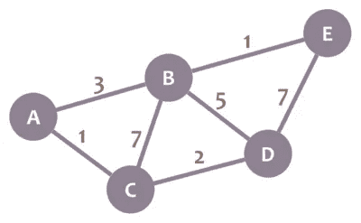
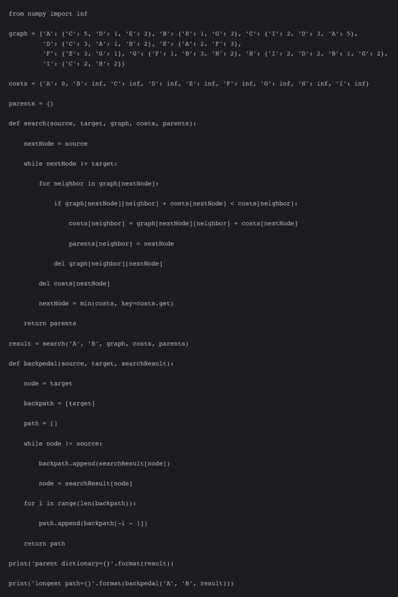
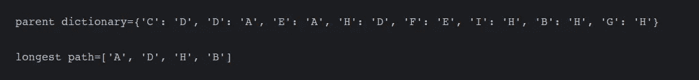

# 如何解决 Dijkstra 的问题(寻路问题)

> 原文：<https://medium.com/nerd-for-tech/how-to-solve-dijkstras-problem-pathfinding-problem-4ba4dbe43e8f?source=collection_archive---------15----------------------->

如果我们搜索 **Dijkstra 的算法**，那么我们看到定义为*寻找从源顶点到所有其他顶点或任何特定顶点*的最短路径。我们在任何地方都能看到这种说法，这一点也很清楚。

首先，Dijkstra 的算法是基于贪婪方法的，那么什么是贪婪方法呢？**贪婪方法**是一种方法，在这种方法中，我们找到可用的最佳选择，并假设它会引导我们找到最佳解决方案。

## Dijkstra 算法的基础

*   从我们选择的源节点开始，它分析图形以找到该节点和图形中所有其他节点之间的最短路径。
*   跟踪当前已知的最短路径，如果找到更短的路径，它会更新这些值。
*   一旦一个特定的节点访问了所有的相邻节点，那么我们就将该节点标记为*已访问。*
*   过程继续，直到所有节点都没有被标记。这样我们就找到了从每个节点到所有其他节点的最短路径。

## 例子



如果我们以上图为例，那么我们必须首先选择我们的源节点。之后，我们用 0(零)初始化源节点，用无穷大(∞)初始化所有其他节点。现在我们通过首先访问邻居节点来开始寻找较短的路径。

假设“A”作为源节点，并将源节点值初始化为 0，并将所有其他节点值初始化为无穷大(∞)。“A”的邻居是“B”和“C ”,如果我们从 A 访问 B，那么节点 B 的值将变为 3，因为 3 小于无穷大。类似地，对于节点 C，从 A 到现在的较短路径是(A -> C)。因此，节点 C 的值将变为 1。

如果我们看到这里(B 和 C 之间)，我们发现 B 和 C 之间的路径值是 7，比我们通过 A 访问的路径值大，所以我们不改变 B 的节点值。

如果我们坚持使用这个算法，我们现在可以完成任何来源的所有节点的最短路径。

## 履行

```
function Dijkstra(Graph, source):
       dist[source]  := 0         
       for each vertex v in Graph:            
           if v ≠ source
               dist[v]  := infinity           
           add v to Q                               while Q is not empty:                  
          v := vertex in Q with min dist[v]  
          remove v from Q           for each neighbor u of v:           
              alt := dist[v] + length(v, u)
              if alt < dist[u]:               
                  dist[u]  := alt            
      return dist[]
  end function
```

## 代码片段

```
from numpy import infdef search(source, target, graph, costs, parents):

    nextNode = source

    while nextNode != target:

        for neighbor in graph[nextNode]:

            if graph[nextNode][neighbor] + costs[nextNode] < costs[neighbor]:

                costs[neighbor] = graph[nextNode][neighbor] + costs[nextNode]

                parents[neighbor] = nextNode

            del graph[neighbor][nextNode]

        del costs[nextNode]

        nextNode = min(costs, key=costs.get)

    return parentsdef backpedal(source, target, searchResult):

    node = target

    backpath = [target]

    path = []

    while node != source:

        backpath.append(searchResult[node])

        node = searchResult[node]

    for i in range(len(backpath)):

        path.append(backpath[-i - 1])

    return path

graph = {'A': {'C': 5, 'D': 1, 'E': 2}, 'B': {'H': 1, 'G': 3}, 'C': {'I': 2, 'D': 3, 'A': 5},
         'D': {'C': 3, 'A': 1, 'H': 2}, 'E': {'A': 2, 'F': 3},
         'F': {'E': 3, 'G': 1}, 'G': {'F': 1, 'B': 3, 'H': 2}, 'H': {'I': 2, 'D': 2, 'B': 1, 'G': 2},
         'I': {'C': 2, 'H': 2}}costs = {'A': 0, 'B': inf, 'C': inf, 'D': inf, 'E': inf, 'F': inf, 'G': inf, 'H': inf, 'I': inf}parents = {}result = search('A', 'B', graph, costs, parents)print('parent dictionary={}'.format(result))print('longest path={}'.format(backpedal('A', 'B', result)))
```



上面的代码给出了以下输出:

