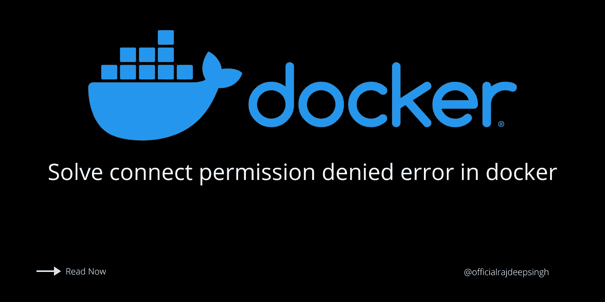
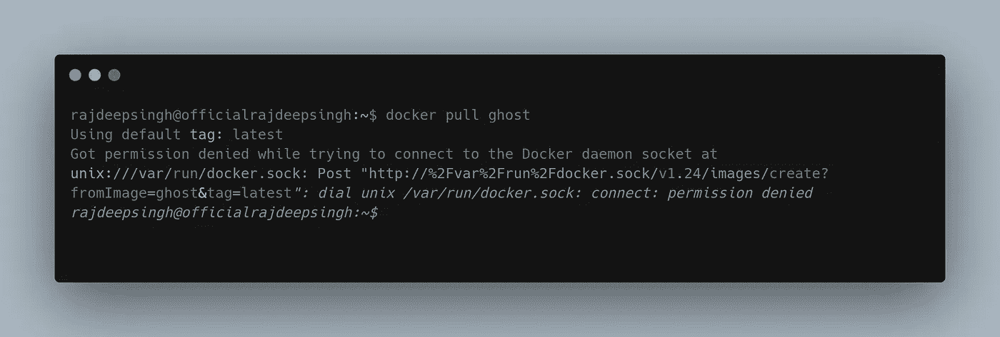
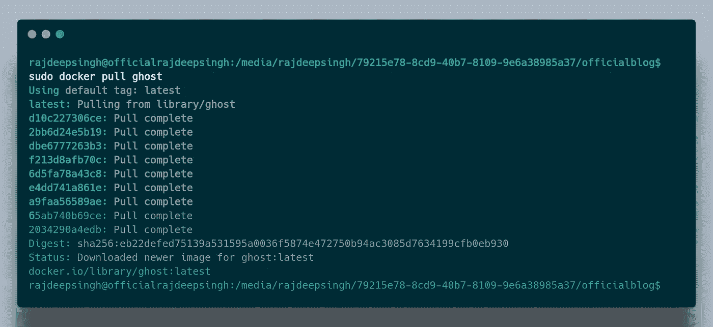
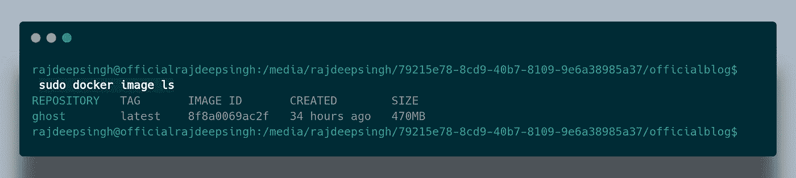
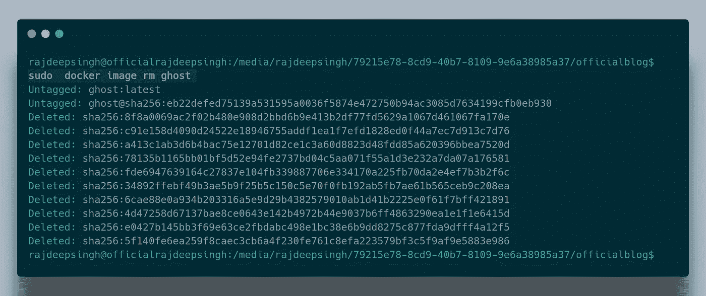

# 如何解决 docker:在尝试连接 Docker 守护进程套接字时获得的权限被拒绝？

> 原文：<https://medium.com/nerd-for-tech/how-to-solve-docker-got-permission-denied-while-trying-to-connect-to-the-docker-daemon-socket-82e81ab012b7?source=collection_archive---------1----------------------->

## 码头工人

## 解决了在你的系统中显示下载 docker 镜像时 docker 中的连接权限被拒绝错误。

大多数时候，我们会面临权限被拒绝的错误。当我们在系统中本地下载或安装 docker 镜像时。我也在一天中遇到许多时间许可被拒绝的码头工人错误。



在本地解决 docker 权限被拒绝的错误。

## 为什么显示这个错误？

获取权限错误主要出现在 Linux 系统中。因为你没有 sudo 权限在本地安装或下载 docker 镜像。

例如，当我在本地安装 docker ghost cms 映像时，您会检查权限被拒绝错误。

```
docker pull ghost
```



在 docker 中显示权限被拒绝错误。

## 怎么解决？

你只是在你的命令里加了**须藤** **特权**，你的错误就没了。

检查我的幽灵形象的例子。

```
**sudo** docker pull ghost
```



Linux 发行版中的 Solove docker 权限被拒绝错误。

## 如何检查 docker 镜像是否成功安装在系统中？

简单，你安装 docker 镜像。运行 docker 镜像命令以验证 docker 镜像是否已成功安装在您的系统中。

```
sudo docker image ls
```



在本地检查安装中的 Docker 图像。

## 如何去除 docker 图像？

您只需在命令终端中运行 docker 镜像删除命令。

```
sudo  docker image rm <**your-image-name-in-my-case-ghost**>
```



删除本地系统中的 docker 映像。

## 结论

我希望你理解 docker 得到许可被拒绝的错误，并且你很快解决了这个错误。如果你有任何问题和反馈，请在评论区提问。