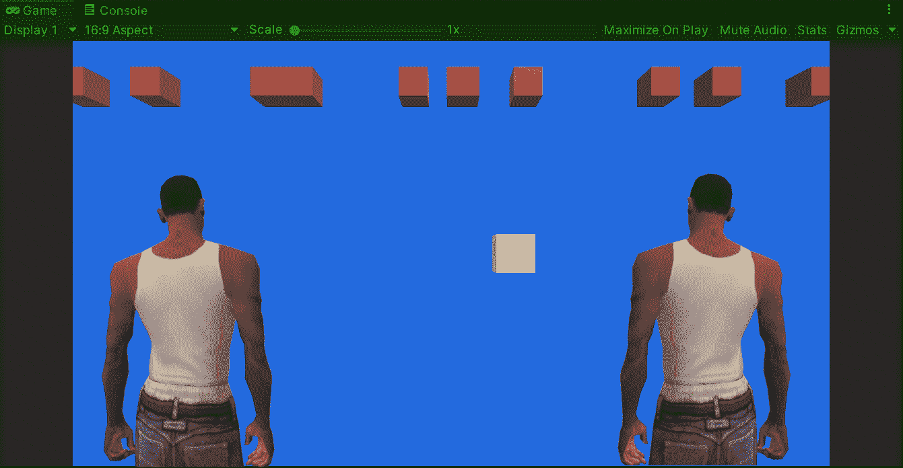
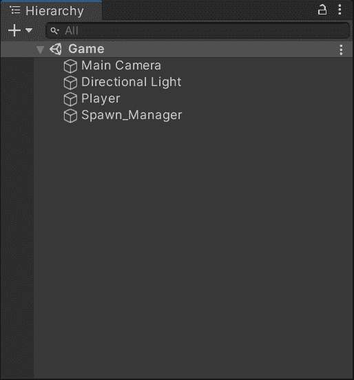
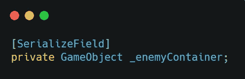
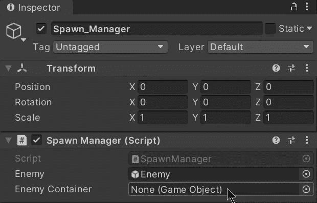
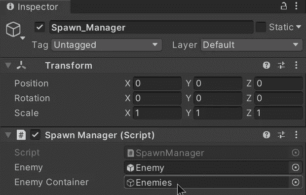
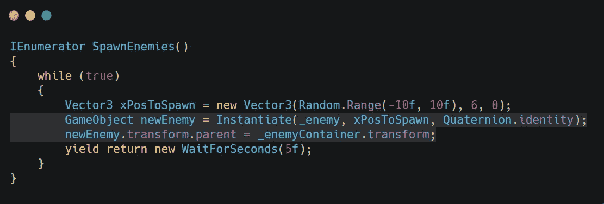
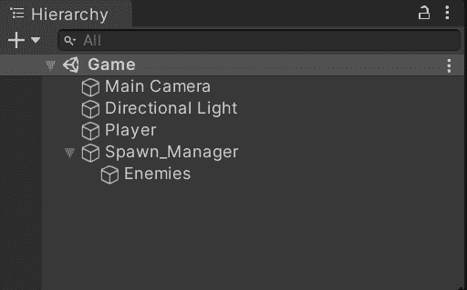

# 在 Unity 中生成对象，场景中没有混乱

> 原文：<https://medium.com/nerd-for-tech/how-to-spawn-objects-in-unity-without-clutter-in-the-scene-7610379bbc64?source=collection_archive---------20----------------------->

## 统一指南

## 在 Unity 场景中生成对象时处理混乱的快速指南

**目标**:统一避免场景层次内部的杂乱。

继续上一篇关于[如何使用协程](https://fas444.medium.com/using-coroutines-in-unity-5fa1d51e0055)、无限繁殖敌人的帖子，我们需要在 Unity 中去掉场景中的杂乱，这样就不会让层次看起来一团糟。

例如，如果我们运行最后一个帖子的最后一个版本，我们会看到当敌人出现在场景中时，层次结构如下所示:

敌人预设的每一个克隆体都将被**堆叠**，这将使得**很难在场景中搜索**其他游戏对象。

因此，为了避免上述情况，我们可以在 spawn manager 中使用一个空的游戏对象来控制所有的敌人克隆体:

创建完成后，我们需要在 spawn manager 脚本(克隆创建的地方)中创建一个新变量，以引用场景中的空游戏对象:

记住我们可以使用**【serialize field】**在 Unity 的检查器中显示一个私有变量

现在保存脚本，转到 Unity，选择 spawn manager，然后将空游戏对象拖动到 spawn manager 附带的脚本变量中:

拖动空对象

这是 spawn manager 脚本中的变量

一旦你将空的游戏对象拖到脚本组件中，它将保存引用**以便在代码中使用**

最后，打开 spawn 管理器脚本，在我们的协程中编辑下面几行:

空的游戏对象被设置为每个克隆体的父对象

如你所见，我们需要一个 Gameobject 变量来保存场景中产生的每个克隆体，这样每次出现这种情况时，空的 gameobject 就会被设置为克隆体的父对象。

现在，克隆体在层次结构中看起来像这样，杂乱的情况消失了:

使用这种方法可以避免场景中其他游戏对象的混乱

就是这样！只要我们保持层次项目有序，混乱就不会成为问题。我会在下一篇文章中看到你，在那里我会展示如何用新的资产将你的 Unity 游戏带入下一个阶段。

> *如果你想了解我更多，欢迎登陆*[***LinkedIn***](https://www.linkedin.com/in/fas444/)**或访问我的* [***网站***](http://fernandoalcasan.com/) *:D**