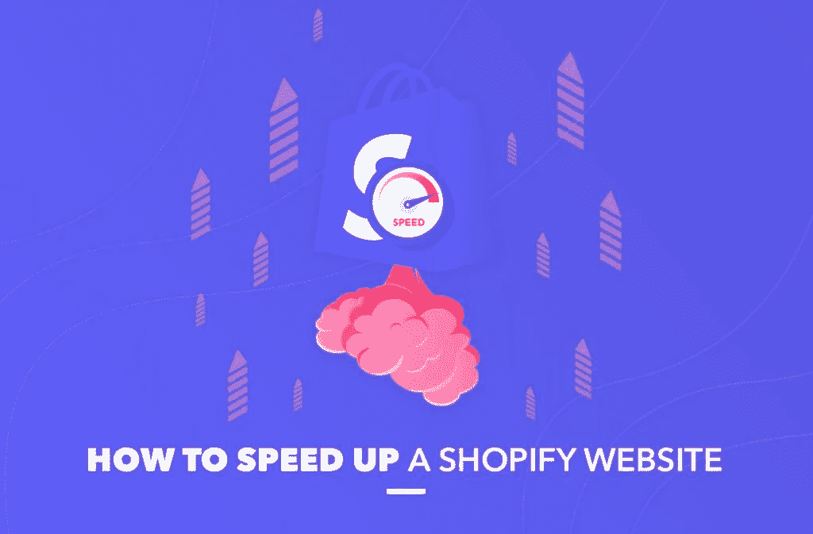
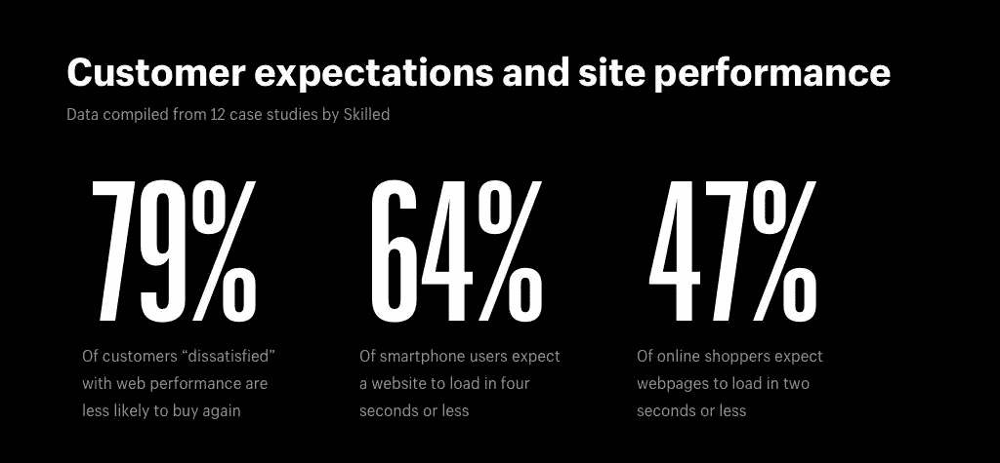
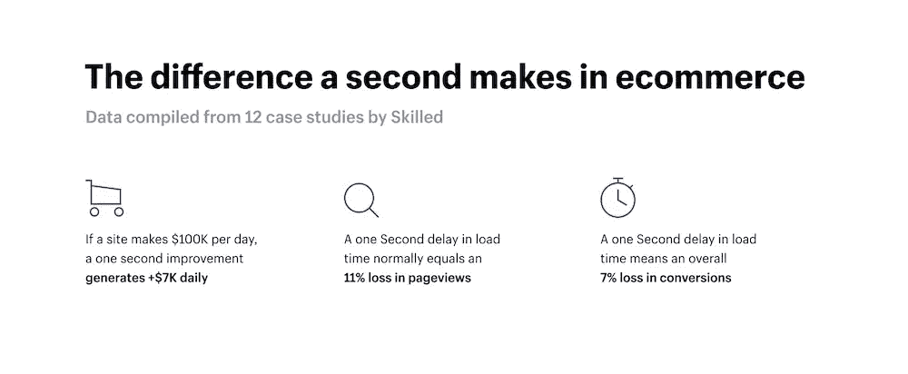
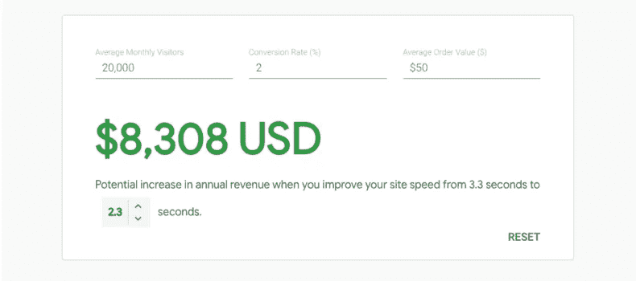
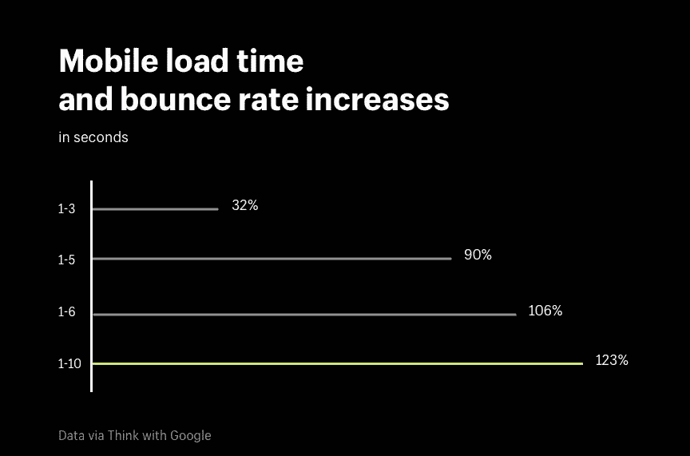
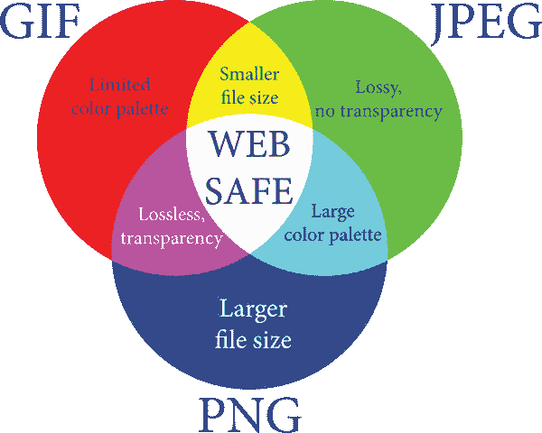
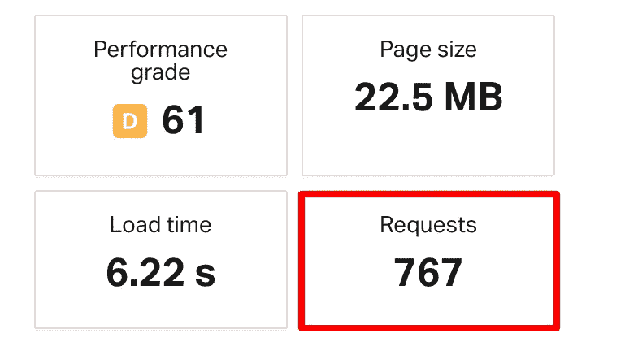

# 如何加速 Shopify 商店

> 原文：<https://medium.com/nerd-for-tech/how-to-speed-up-shopify-store-bc7198fbfc8?source=collection_archive---------12----------------------->

速度很重要。没有人会为了得到想要的东西而等待多年。但即使到了秒，你愿意等吗？在网上呢？你要等几秒钟，直到你要打开的网页正在加载吗？大多数人不会。大多数人不愿意等待网页打开超过两秒钟，这也适用于网上商店。因此，在线零售商需要尽可能加快他们的在线商店的速度，以便他们的客户能够等到页面加载。

# 页面速度如何影响电子商务？

首先，页面速度是通过链接加载内容的速度，而网站速度是代表网站整体速度的速度。一旦网页速度和网站速度成为衡量网站运行好坏的重要指标，就有很多服务可以免费或几乎免费测试网站及其网页的速度和性能。例如，Google PageSpeed Insights 是评估网站性能和页面加载速度最常用的工具。

对于在线零售商来说，页面速度是证明高质量发展的又一个指标。当网上商店发展得好，组织得好，它不会让客户等待页面加载超过一两秒钟。因此，使用 Google Page Insights 工具对于提高转化率非常重要。实际上，当人们能够让购物过程变得快速和感性时，就会有更多的人去购买这些商品。有时，顾客可能会在购买商品时改变主意，当然，如果他们在点击名为“结帐”的重要按钮之前有时间考虑一下的话。研究人员证实了这一想法，并表示页面速度加快一秒钟就可以提高 7%的转化率。也就是说，如果你想维持你的客户流，确保你尽可能地提高网上商店的速度。

只是在这里玩玩数字，当网店带来每日 10 万美元的利润时，仅增加 7%的转化就要增加每日 7000 美元的收入。因此，投入时间和精力使页面快速加载将为商店带来额外的收入。反之亦然:顾客不会对缓慢的网站变得有耐心，因此网站，尤其是网上商店，应该尽可能的快。

速度对网站的影响还有一个含义。慢速网站(和在线商店也是！)不好搜索。当你在点击付费的基础上为你的广告付费时，缓慢的页面加载速度会导致谷歌 AdWords 质量分数的降低，这意味着你需要为每次点击支付更高的费用。此外，缓慢的页面加载会影响所有设备上所有页面的流量。谷歌只是不能很好地处理加载缓慢的页面。因此，快速的页面加载是提高谷歌搜索排名的必要条件。

# 如何优化 Shopify 网站速度？

大规模的流量激增可能对网站有害，甚至可能导致网站完全瘫痪。这种情况对你的声誉没有任何好处。实际上，你越是推迟网站的速度优化，你给竞争对手的奖励就越多。来自 Shopify 的信息图很好地说明了页面加载速度慢的影响:

该图显示，页面加载时间越长，客户不返回网站的可能性就越大(跳出率是单页会话占所有会话的百分比)。当谈到提高加载速度时，有几种方法可以加快页面加载速度，即选择轻量级主题，减少大图像大小，压缩和减少图像的大小和数量，使用低效的代码，限制使用第三方服务，以及与 Google Page Insights 密切合作。

# 选择轻量级主题

Shopify 提供了广泛的主题，这意味着每个企业都会找到最适合自己需求的主题。实际上，每个主题都由 Liquid、HTML、CSS 和 JavaScript 代码组成。总之，主题的组件会影响加载速度。因此，通过控制主题的组件，可以影响加载速度。大多数情况下，当您编辑或自定义主题时，主题的文件会变得越来越大，可能会影响存储的速度。

要使主题工作得更快，请考虑下面的步骤:

1.  考虑禁用您不使用的功能
2.  考虑使用系统字体:您可以在各种字体中为您的在线商店选择字体，但是如果您选择的字体在您的计算机上不存在，系统将需要在加载整个页面之前加载该字体。因此，使用系统字体是减少页面加载时间的好主意。
3.  如果一切都不顺利，考虑[咨询 Shopify 开发者](https://soft-loft.com/how-to-hire-shopify-developer/)关于 Shopify 主题的改进。如果你使用免费的主题，咨询 Shopify 的支持来获得指导可能会很好。但是，如果你使用第三方主题，就需要联系一个主题开发者或者雇佣一个 Shopify 专家或者[一个专门的 Shopify 开发者团队](https://soft-loft.com/dedicated-developers/)，这也是一个不错的选择。

# 缩小大图像尺寸

加速 Shopify 在线商店的另一个重要因素是所用图片的大小和格式。当图片尺寸过大时，无疑会降低页面的加载速度。因此，为了优化图像，需要使用图像优化服务，例如 Optimizilla 或 Crush.pics，或任何其他图像优化服务。

图像优化服务的理念是压缩图像，以便在保持相同质量的情况下缩小图像大小。例如，Optimizilla 提供图像压缩功能，将 JPEG 和 PNG 图像压缩到尽可能小的尺寸，同时保持尽可能高的质量。Crush.pics 做的也差不多，声明该服务旨在保持质量并粉碎尺寸。当使用平衡压缩时，图像质量没有明显的差异，但是图像的尺寸要小得多。因此，页面加载速度更快。

# 压缩并减少图像的大小和数量

实际上，图片占了网页大小的大部分。即使使用了压缩服务，图像仍可能是影响网页快速加载的因素。在这一点上，可以减少整个页面上的图像数量。事实是，页面上的每个图像都会创建一个新的 HTTP 请求，修整图像是提高页面加载速度的好方法。

此外，没有必要通过删除图片来减少网页上的图像数量。使用将许多图像组合成一个图像的服务通常就足够了。Sprite 就是这样的服务之一，它允许将许多小图像合并成一个大图像。因此，只创建了一个 HTTP 请求，页面的加载速度会更快。其他服务，如 TinyJPG 和 TinyPNG，可以帮助用户缩小图像的尺寸。结合使用这两种方法有助于减少加载图像的大小和加载图像的请求数量。

# 复杂或低效的流动代码

编写流动代码有高效和低效两种方式，最低效的方式是重复复杂操作，从而增加网页的渲染时间。这影响了网页的整体速度和商店的速度。有时，当您需要按价格将产品放入集合中时，您需要遍历集合中的产品，而不使用循环代码。如果你很清楚如何编码，你可以使用 Chrome 的 Shopify Theme Inspector，这样就有机会改进代码。如果你没有足够的编码知识，最好找一个懂的人。在这一点上，[雇佣一名 Shopify 专家](https://soft-loft.com/how-to-hire-shopify-developer/)是对你的商店发展的可靠投资。一旦网上商店的加载速度提高，商店将获得更多的访问者和更多的成功购买。

# 限制第三方 JavaScript 和 Shopify 应用程序

限制第三方服务以及 JavaScript 和其他应用程序的使用将提高网页的加载速度。因此，当你注意到你的在线商店仍然加载缓慢时，确保你使用的应用程序都是非常必要的。如果你怀疑至少一个应用程序，最好停止使用它，因为拒绝一个应用程序会大大提高网站速度。

当在线商店的工作使用了太多的应用程序和第三方服务时，情况看起来就像上面图片中的情况。诚然，应用程序增加了功能，但应用程序也降低了商店的速度。与 pics 一样，用于商店运营的所有应用程序和第三方服务都会发送请求，这会降低网页和在线商店的工作速度。结果，当这样的请求太多的时候，网店就被请求淹没了。

# 通过 Google PageSpeed Insights 运营您的商店

PageSpeed Insights 是一个谷歌实验室工具，允许跟踪和改善网站的工作方式。使用 PageSpeed Insights，您可以获得关于提高网站速度的个性化建议。因此，这是一个伟大的工具，以提高网站速度和增加转化率。有了 Google PageSpeed Insights，你就可以获得对你的在线商店的问题的最新估计，并意识到需要纠正的问题。

# 结论

一旦网上商店的加载速度提高，商店将获得更多的访问者和更多的成功购买。你可以自己做，也可以聘请专业人士，更确切地说，是 Shopify 专业人士。

*原载于 2021 年 3 月 30 日***。**