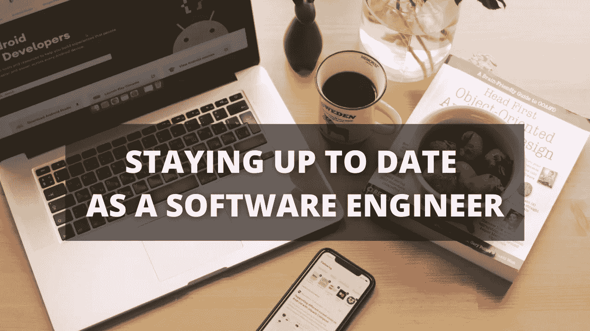

# 作为开发人员保持最新状态的 3 种方法

> 原文：<https://medium.com/nerd-for-tech/how-to-stay-up-to-date-as-a-mobile-developer-552283dd47ca?source=collection_archive---------18----------------------->

对于一个移动开发者来说，跟上时代并了解行业动态是至关重要的。在本文中，我将讨论作为一名移动开发人员如何跟上时代的步伐。

## 官方文件

你可能经常听说阅读官方文档，但是我不能强调它对保持最新的重要性。你当然不会…