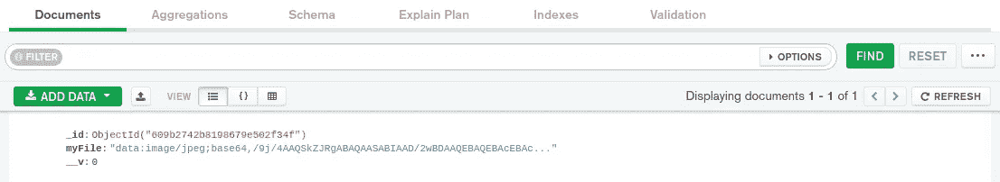

# 如何使用 Base 64 将图像存储到数据库中？

> 原文：<https://medium.com/nerd-for-tech/how-to-store-an-image-to-a-database-with-react-using-base-64-9d53147f6c4f?source=collection_archive---------0----------------------->

## 使用 base64 编码和解码图像的最简单指南。


# **简介**

向前端应用程序添加图像时，通常只需输入该图像的 URL，或者创建一个本地目录，从中可以添加应用程序要使用的任何图像。但是如果你正在创建一个要求用户上传自己照片的应用程序呢？这需要一种不同的方法来解决这一挑战。
许多可用的教程专注于在服务器端使用 multer 或 cloudinary 将图像存储到数据库，但本文将教你如何使用 base64 实现相同的目标。

**Base64 是什么？**

*Base64 也称为 Base64 Content-Transfer-Encoding，是一种编码和解码技术，用于将二进制数据转换为美国信息交换标准(ASCII)文本格式，反之亦然。——*[](https://www.techopedia.com/definition/27209/base64)

*任何二进制数据(比如本例中的图像)都可以用 base64 编码，编码后的数据通常由 64 个不可读的英文字符组成。当使用 base64 将图像存储到数据库(如 MongoDB)时，图像将作为字符串存储在数据库中。需要时，可以将该字符串解码回其原始形式。*

***创建您的服务器***

*由于我们的应用程序有前端和后端分离，我们将从创建我们的服务器开始。首先，我们将使用下面的命令创建一个名为服务器的目录。*

```
*mkdir server
cd server*
```

*接下来，我们将使用下面的命令初始化项目。该命令将 **package.json** 集成到您的应用程序中。json 帮助跟踪我们所有的包和依赖项。*

```
*npm init -y*
```

*接下来，我们将安装所有必要的依赖项。我们将使用下面的代码在一行中安装它们；*

```
*npm i express mongoose cors* 
```

*   *Cors:这是“跨源资源共享”的简称，用于保护一个 web 服务器不被另一个网站访问。*
*   *Express:这是一个 node.js 框架，有助于快速创建基于节点的应用程序。*
*   *Mongoose:这是一个对象数据建模(ODM)库，使得对 MongoDB 的访问、通信和利用更加容易。*

*在服务器中，我们需要创建另一个目录来存放模型和模式。*

```
*mkdir models
touch models/post.js*
```

*我们的模式将如下所示:*

*您会注意到我在模式中只创建了一个对象键，即 **myFile** 。这个键有一个值为**的字符串**，它将保存来自图像的编码数据。
接下来，我们将在服务器目录中创建一个名为“index.js”的文件，它将存放我们剩余的代码。*

```
*touch index.js*
```

*我们的 index.js 文件将包含以下内容:*

*至此，我们已经完成了服务器的工作。因此，我们将使用下面的命令启动我们的服务器:*

```
*node index.js*
```

***创建我们的 React 应用***

*现在是时候进入我们应用程序的客户端了。我们将首先创建一个 react 应用程序，并将其更改为应用程序目录。之后，我们将创建一个名为“components”的新目录，然后创建一个名为“ImageUploader”的 jsx 文件。*

```
*npx create-react-app client
cd client
mkdir components
touch components/ImageUploader.jsx*
```

*我们需要的唯一依赖项是 **axios** ，它是一个基于 promise 的 HTTP 客户端，用于发出 HTTP 请求。可以使用以下命令安装它；*

```
*npm i axios*
```

*在 ImageUploader.jsx 文件中，将添加以下代码行:*

*上面的代码看起来很像一个函数的蜂巢，分解如下:*

*   *createImage 函数使用 axios 通过服务器向数据库发送数据。*
*   *createPost 函数异步创建一个新图像或返回一个错误，这取决于服务器中声明的参数。*
*   *convertToBase64 函数使用 JavaScript FileReader，它有一个 readAsDataURL 方法，读取二进制数据并将其编码为 Base64 数据 URL。顾名思义，它的工作就是将文件转换成 base64。*
*   *handleFileUpload 函数以要上传的文件为目标，该文件由 convertToBase64 函数异步转换为 base64。然后，编码数据用于更新后图像状态。*
*   *然后，当单击 Submit 按钮时，handleSubmit 函数将编码后的数据作为字符串提交给数据库。*

*我们的应用程序的客户端可以通过在终端中使用 **npm start** 命令来启动。一旦客户端和服务器端并发运行，您可以上传任何图像，它将被保存在数据库中。为了清楚起见，我上传了一张图片，通过 MongoDB Compass，我们可以访问如下所示的数据:*

**

*从上面的图像中，您可以看到上传的图像被存储为一个字符串。必要时，可以对该字符串进行解码和利用。*

***结论***

*如果你已经做到了这一步，那么恭喜你。您已经成功地学习了如何使用 base64 在数据库中存储图像。如果你喜欢这个教程，请和我击掌。如需评论、投稿或提问，请在 Twitter 上关注我。谢谢。*