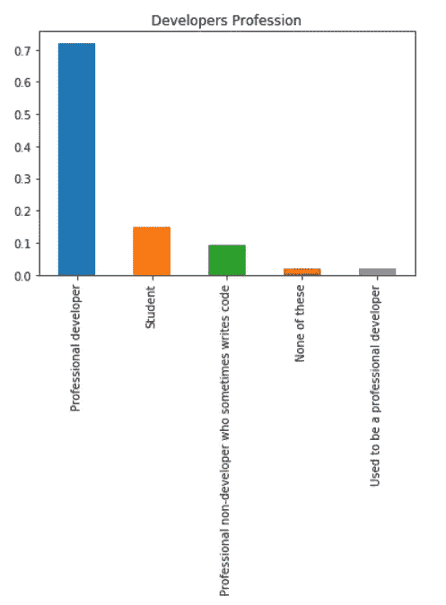
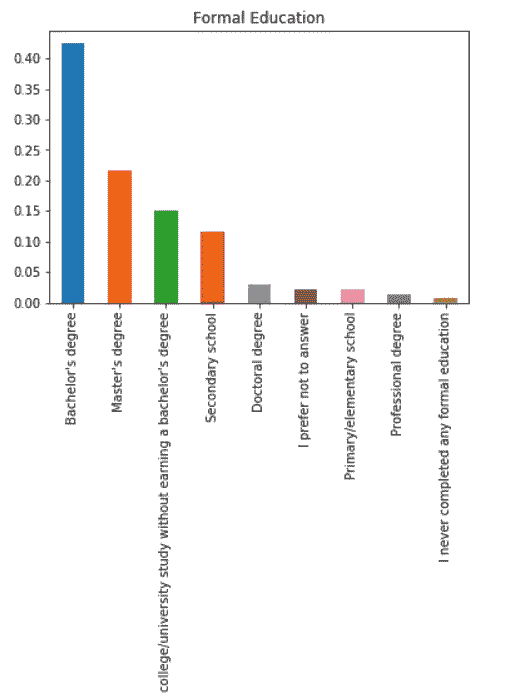
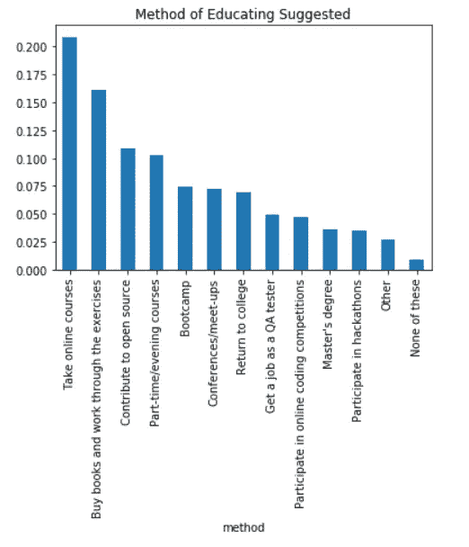
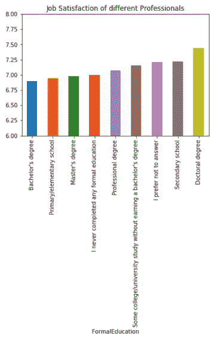

# 一份基于数据分析的结果，关于如何进入一份“技术工作”？

> 原文：<https://medium.com/nerd-for-tech/how-to-storm-into-a-tech-job-bootcamps-vs-online-courses-vs-master-s-degree-vs-others-79fc7a73b8eb?source=collection_archive---------1----------------------->

## 一种基于数据分析的方法，使用 Stack Overflow 2017 年的开发者调查数据。

# 介绍

我们多次听到不同人对如何在科技行业找到工作的不同看法，特别是在人工智能、数据科学等趋势领域开始职业生涯。

有些人可能会建议，成为数据科学家需要硕士学位，有些人说你需要参加新兵训练营，有些人会建议你坚持参加在线课程。

关于这个话题可能会有不同的看法，但让我们看看 Stack Overflow 2017 年的开发者调查数据有什么建议。这些数据将让我们深入了解目前在顶级科技巨头中工作的专业开发人员的想法。

数据中有大约 64000 篇评论，涉及来自 165 个国家的各种不同的工作文化。

我们将分析来自不同科技行业的职场人士给了他们目前在非科技行业工作的兄弟们什么样的建议，让他们投身于科技行业。

# 向他们的表亲建议的开发人员职业和正规教育是什么？

提出他们兄弟姐妹建议的开发人员大多是专业开发人员，他们提供了超过 70%的建议，大约 15%是学生。此外，他们中的大多数是学士学位持有者，一些是硕士学位持有者。

# 如何强攻进场？

从上面的柱状图可以看出，明显的赢家是在线课程和书籍。

超过 20%的人建议参加在线课程，超过 16%的人建议购买书籍。有点支持搭配新兵训练营，硕士学位。

# 职场人士的满意度如何？

上面的柱状图表明，拥有博士学位的专业人士对自己的工作最满意，他们的工作满意度评分为 7.375 分(满分 10 分)。对工作最不满意的专业人士是那些拥有学士学位的人，他们对工作的满意度为 6.875 分(满分 10 分)。

# 考辛斯按照建议进入“技术工作”后，工作满意度如何？

你可以很容易地看到，按照买书建议行事的表兄弟姐妹对他们的工作最满意，工作满意度略低的表兄弟姐妹随后参加了训练营，攻读硕士学位，参加了在线课程。

# 结论

在这篇文章中，我们根据 Stack Overflow 2017 年的调查数据，了解了如何进入一份“技术工作”。

1.  我们分析了职场人士对如何投身于“技术工作”的建议，发现大多数职场人士建议参加在线课程和购买书籍。
2.  然后，我们观察了那些向表亲建议的专业人士对他们目前工作的满意度，我们发现满意度水平之间没有太大差异，但最满意的是那些拥有博士学位的人。
3.  最后，我们观察了那些遵循专业人士建议的途径在科技行业开始职业生涯的表兄弟的工作满意度，我们发现，遵循买书途径的表兄弟最满意。

这里的发现是分析的一部分，但不是真正的正式实验，所以真正的问题还是留给你-

> *你将如何进军“科技行业”？*

要查看更多关于分析的细节，你可以访问我的 Github 的链接[这里](https://github.com/MILIND-RAJ/Stack-Overflow-s-developer-survey-data-from-2017-analysis)