# 如何简化您的计算机视觉管道…无需代码

> 原文：<https://medium.com/nerd-for-tech/how-to-streamline-your-computer-vision-pipeline-without-code-4608701a2746?source=collection_archive---------18----------------------->

你是否曾经想进入人工智能和机器学习领域，但不知道如何编码，或者想将你的计算机视觉管道精简到一个平台中？别担心，随着最近发布的 [Datature](https://www.datature.io/) 平台，你可以创建自己的计算机视觉模型，可以检测图像中的对象，等等！

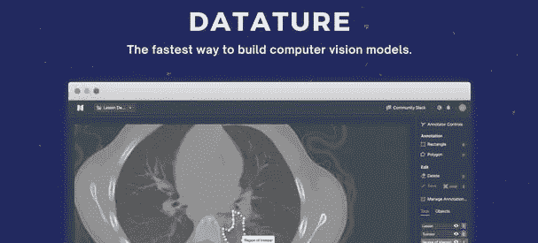

# 首先，什么是计算机视觉？

计算机视觉(此后称为 CV)是人工智能的一个子集，它处理世界的视觉方面，从相机的图像和视频数据中识别模式和识别特征。现实生活中计算机视觉的一些例子有:

*   零售店中识别商店扒手的人脸识别
*   在产品离开生产线时识别产品缺陷
*   检测医学影像中的异常，如核磁共振成像和 x 光扫描

工业上使用的 CV 模型有 3 种类型，即分类、对象检测和实例分割模型。

**分类**

这些模型能够将图像分类成预定义的 n 个类别。例如，如果我们要在不同花卉的数据集上训练模型，我们的模型的预测看起来会像这样，其中每张图片都被分配一个类别，该模型认为它最有可能属于该类别。


该模型将这些图像分为 4 类:玫瑰、郁金香、蒲公英和向日葵。

这些模型需要在一组图像上训练，其中每个图像属于其中一个类别。每个类别中的图像数量必须大致相同，因为不平衡可能会导致训练过程中的偏差，从而扭曲您的结果。

**物体检测**

对象检测建立在分类的基础上，能够定位图像中的对象，并将对象分为 n 个不同的类别。它在图像中的每个感兴趣的对象周围绘制一个边界框，并为它们分配一个类标签。例如，用于生成以下输出的模型被训练为识别图像中动物的位置，并将该动物分类为猫或狗。

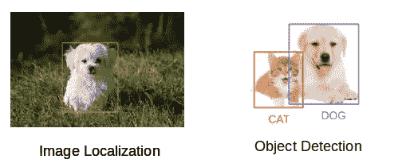

**实例分割**

实例分割建立在对象检测的基础上，现在不仅在图像上绘制边界框，而且在感兴趣的对象周围提供每像素分割遮罩。

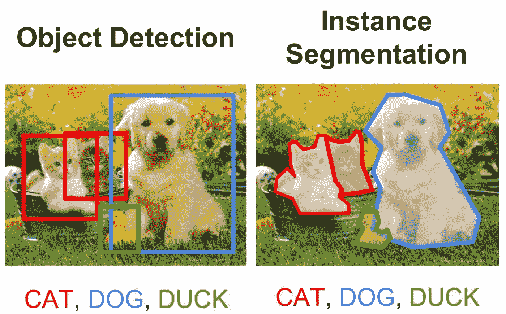

**如何训练你的模特**

在使用机器学习来训练 CV 模型时，有 4 个阶段。

1.  我们需要收集图片或视频供模型训练。
2.  然后，我们需要注释我们的图像，即从输入数据中提取有用的特征，这些特征清楚地定义了图像中我们希望能够识别的对象，并为它们分配相关的标签。
3.  现在可以使用输入数据集和我们定义的注释来训练模型。
4.  训练之后，模型就可以进行预测了。

这一过程不断重复，每次都会稍微调整一下，直到您最终得到一个性能良好的模型。这些步骤通常使用不同的软件来完成，第二步通常使用图像注释工具如 [labelImg](https://github.com/tzutalin/labelImg) 来完成，第三步使用 [TensorFlow](https://www.tensorflow.org/) 或 [PyTorch](https://pytorch.org/) 来完成，这两种技术都需要编程知识。这不仅对不具备这些知识的人来说是个问题，对必须使用多种平台和软件的研究人员来说也是个问题，增加了测试 CV 模型的时间。

# 那么我们如何解决这些问题呢？

Datature 是一个允许我们注释图像或视频数据以及训练 CV 模型的平台，所有这些都不需要接触一行代码！在本教程中，我们将经历训练一个简单的猫或狗对象检测模型所需的步骤，但可以随意使用您可能拥有的任何其他数据集。为了这个教程，我准备了一个由 100 张猫图片和 100 张狗图片组成的小数据集，你可以在这里下载。你确实需要创建一个 Kaggle 帐户来完成这项工作，但是设置一个非常简单。

有了数据集之后，我们就可以继续使用 Datature 了。在[他们的网站](https://www.datature.io/)上，点击右上角的“开始免费试用”按钮。创建新账号登录进入平台，选择免费计划。完成后，您将看到项目仪表板。首先创建一个新项目，并给它一个描述性的名称。由于我们将处理一个对象检测模型，我们从“类型”下拉菜单中选择相应的类型。由于我们将处理图像而不是视频，我们将从“内容”下拉菜单中选择图像选项。点击“下一步”继续。

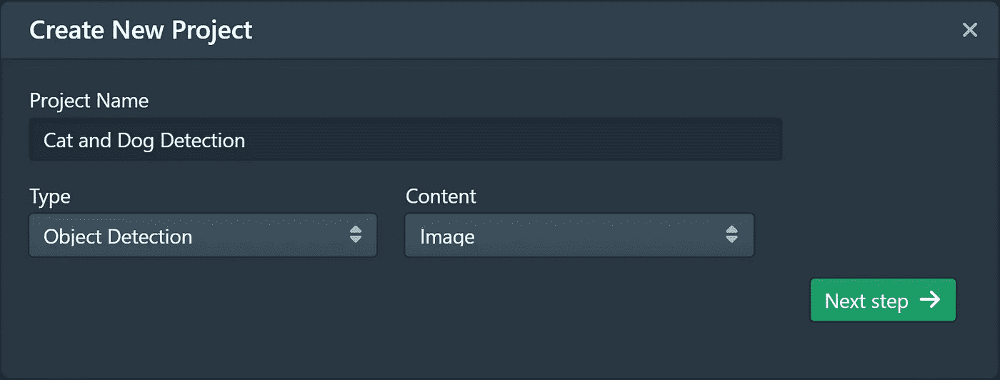

创建我们的项目

现在我们已经创建了我们的项目，我们可以使用侧边栏导航到我们的图像。

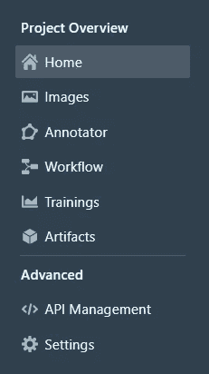

侧栏视图

点击“上传图像”并选择包含您的数据集的文件。这将把你所有的图片上传到项目中。


图像现在被加载到平台上

**注释我们的图像**

一旦这个步骤完成，我们就可以使用侧栏导航到注释器。这里，我们首先需要创建一些标签，每个标签代表一个类别。由于教程数据集只有猫和狗，我们创建两个标签，一个“猫”和一个“狗”。

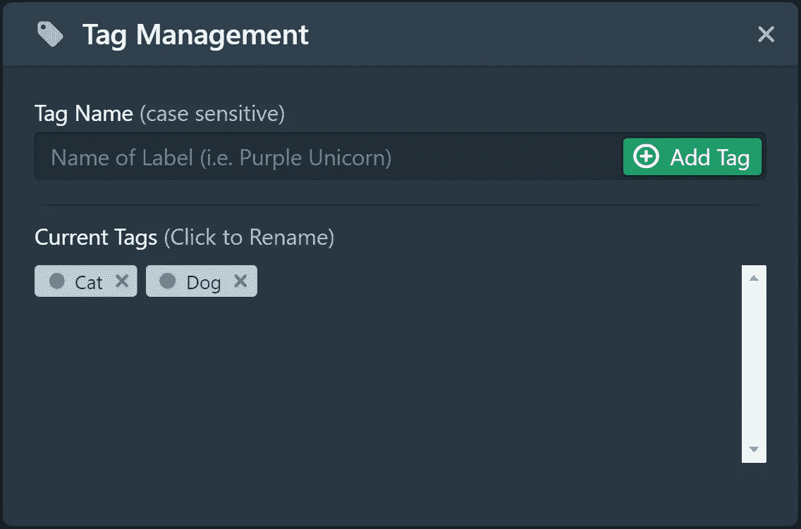

创建我们的标签

使用左侧的侧边栏，我们可以选择注释数据集所需的相关工具。对于本教程，我们将使用矩形注释器工具，我们可以使用 R 键选择它。我们将在给图像中的猫和狗加标签之间切换，我们可以通过从侧边栏中选择标签或者使用组合键(在本例中，1 代表猫，2 代表狗)来完成。如果您正在训练实例分割模型，则应使用面工具来拟合要素的轮廓。

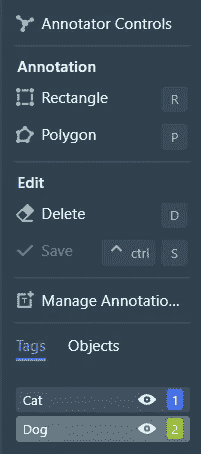

注释器侧栏视图

现在，我们必须注释我们的数据集。浏览所有的图像，我们在每种动物周围画一个矩形的边界框，并给它贴上猫或狗的标签。这是一个乏味的过程，但不幸的是，所有研究人员都必须经历这个过程。请确保您的边界框尽可能接近图像中的主题，忽略模型可能训练的任何不必要的功能。

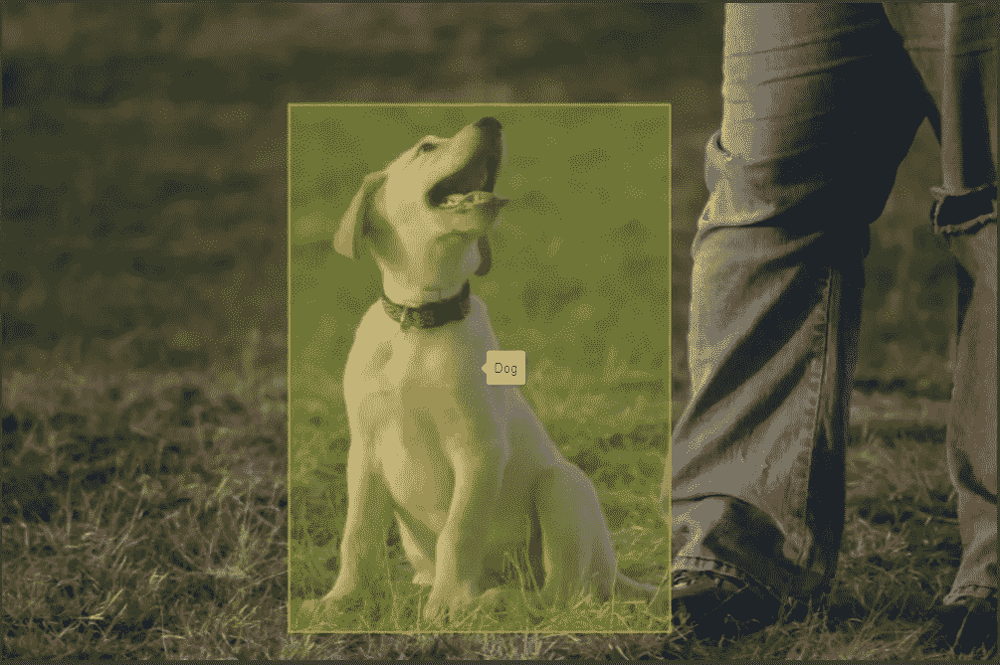

单条狗的边界框示例

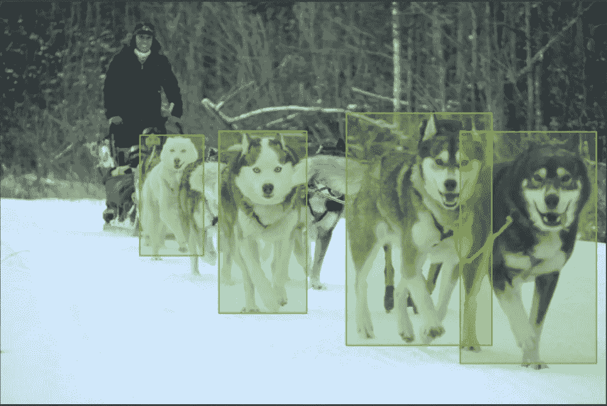

一幅图像中多只狗的边界框示例

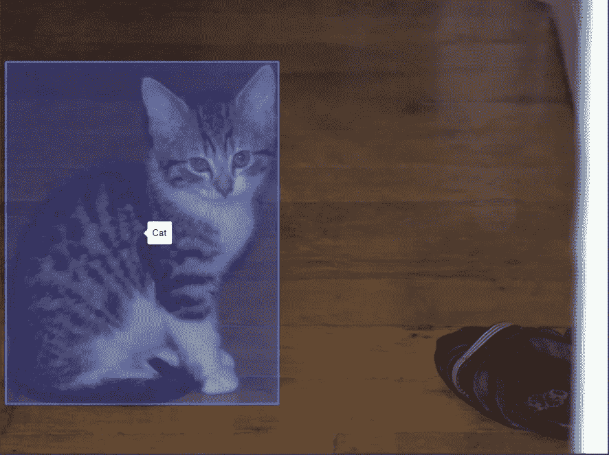

单只猫的边界框示例

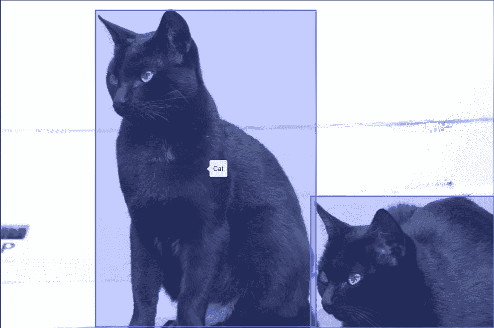

一个图像中多只猫的边界框示例

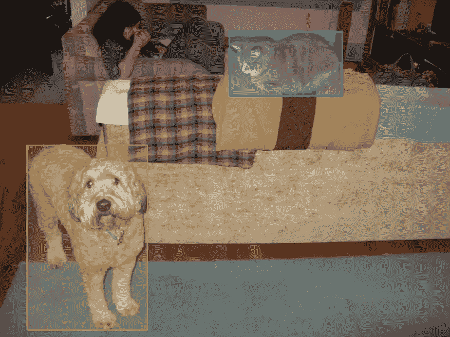

一张照片中的猫和狗的例子

为图像添加注释后，返回项目主页查看数据集统计数据。您应该看到每个标签下的项目数量大致相等。如果不是这样，您将需要用更多的图像填充数据集来实现这一点。

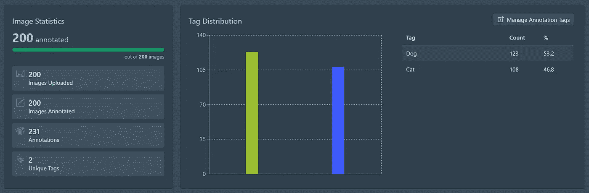

条形图显示了我们标签的大致平均分布

**创建工作流程**

我们现在可以开始为我们的项目创建工作流了。使用侧边栏导航到“工作流”部分，并选择“创建工作流”。右键单击工作区，将会显示以下菜单:

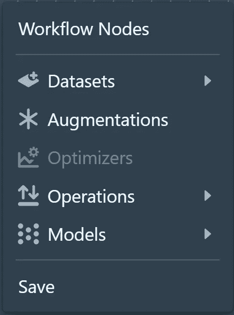

我们可以通过单击 Datasets > Project Dataset 来导入数据集。这将创建一个新节点，该节点将我们的注释数据集包含在我们的工作流中，我们可以通过左键单击该节点来编辑训练-测试分割比、种子和洗牌参数。

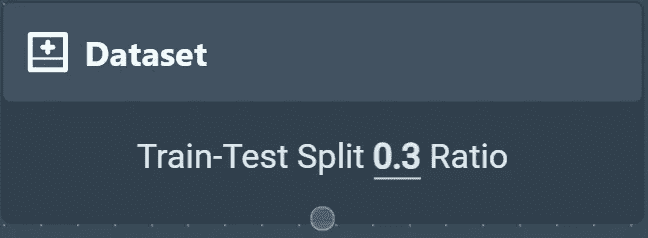

然后，我们可以通过右键单击并选择扩充来扩充我们的数据。这将创建一个 augmentations 节点，我们可以像这样连接到我们的数据集:

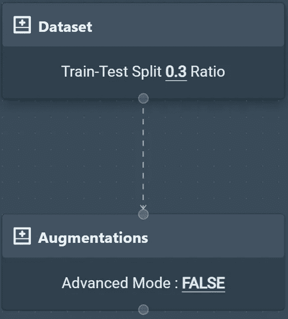

通过左键单击增强节点，我们可以启用和禁用增强类型。对于本教程，我们可以启用亮度、水平翻转和垂直翻转。

然后我们可以将增强的图像输入到我们的模型中。对于对象检测，通常使用 FasterRCNN，因此我们将从 Models > fasterr CNN Models > fasterr CNN resnet 50 640 x640 创建一个新节点。将此节点连接到增强节点。

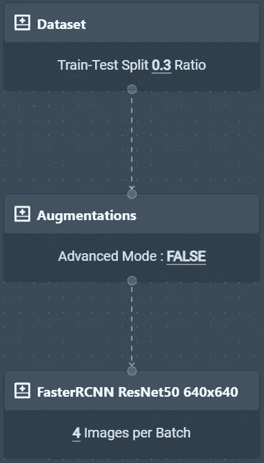

**训练我们的模特**

定义工作流程后，我们可以点击屏幕右下方的“运行培训”。这将打开一个模型，我们可以在其中选择我们的 GPU 类型和数量、检查点策略和训练限制。通过升级您的计划，您可以获得性能更好的 GPU，但当我们的数据集只有 200 张图像时，处理能力是不必要的。

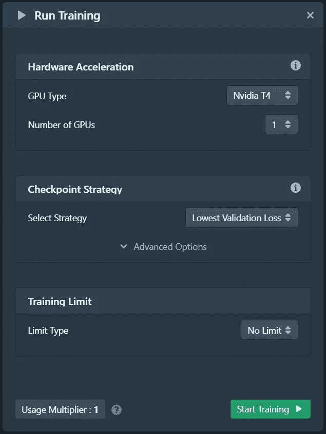

选择“开始训练”将启动一个云实例并训练你的模型，剩下要做的就是等待！耐心是一种美德，尤其是如果你是一名人工智能/人工智能研究者。同时，一系列线形图会随着时间的推移而更新，以直观显示重要的统计数据，包括:

*   全损
*   分类损失
*   定位丢失(用于物体检测)
*   正规化损失
*   平均召回率
*   精度/地图

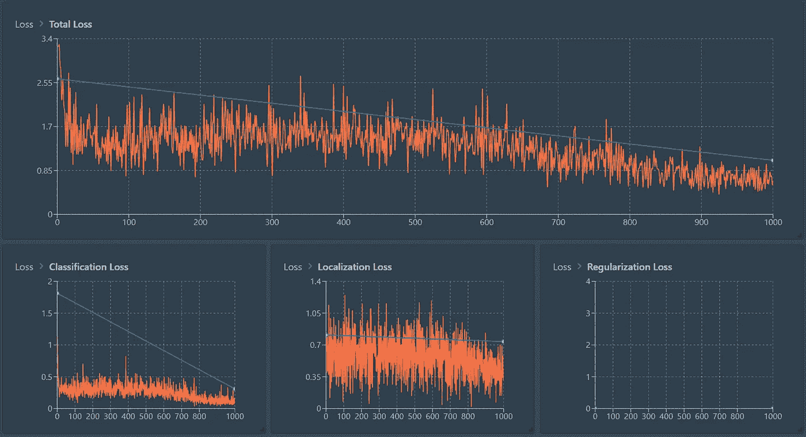

培训完成后，我们可以返回到我们的项目主页，并使用侧栏导航到“工件”。点击工作流程下的三个点，选择“生成张量流模型”。

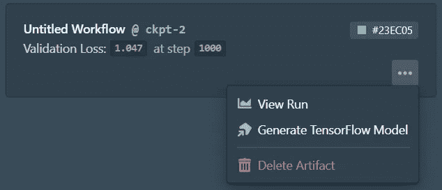

生成后，再次点击三个点，选择“下载张量流模型”

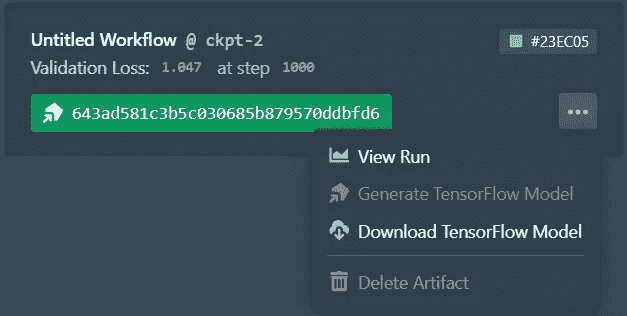

**做出预测**

Datature 已经准备了一个开源脚本来使用你的模型进行预测，可以从[这里](https://github.com/datature/resources)下载。下载文件后，将 *saved_model* 文件夹和 *label_map.pbtxt* 替换为您下载的 TensorFlow 模型文件夹中的相应文件。

要做预测，先下载几张有猫狗的示例照片，放在*输入*目录下。以下是我选择的照片:

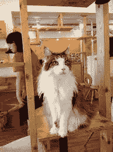

一只猫的示例图像


一只狗的示例图像

准备好图像后，导航到终端中的预测目录并运行:

```
pip install -r requirements.txt
python3 prediction.py --input "input" --output "output"
```

预测将位于输出文件夹中。

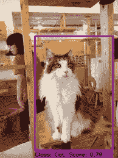

预测猫

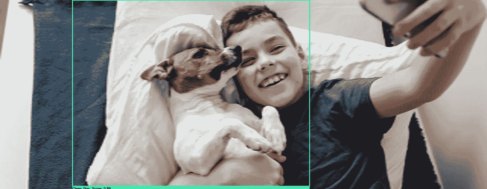

预言狗

如果你喜欢 Datature 并想支持它，请在我们的 [ProductHunt 页面](https://www.producthunt.com/posts/datature?utm_source=badge-featured&utm_medium=badge&utm_souce=badge-datature)上给它投上一票。如果你对我做过的其他项目感兴趣，[看看我的网站](https://isaacchendev.com/)和我的 [Github](https://github.com/Iscaraca) 。如果你想和我联系，你可以评论这个帖子或者通过 LinkedIn 给我发消息。