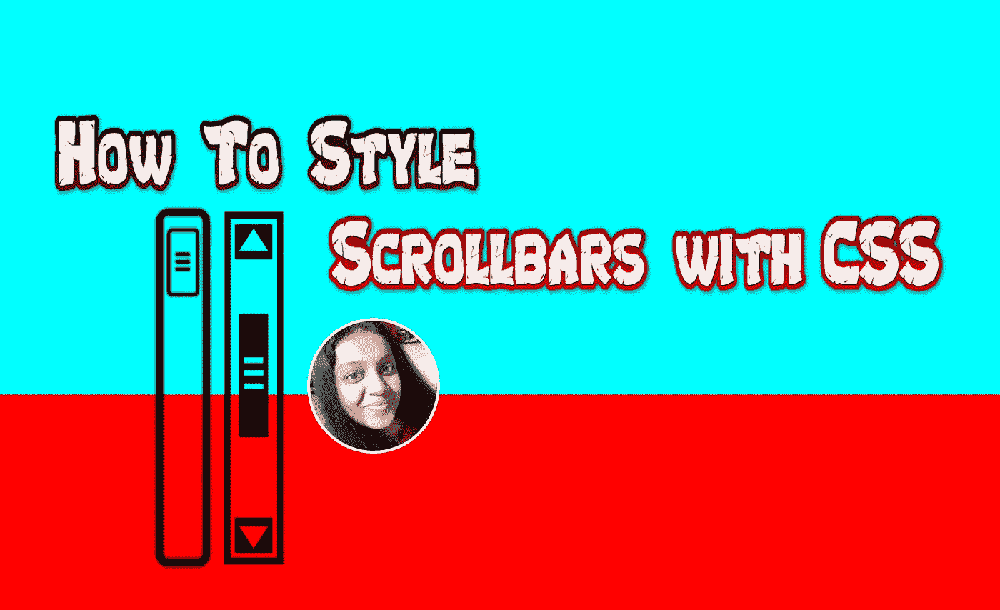
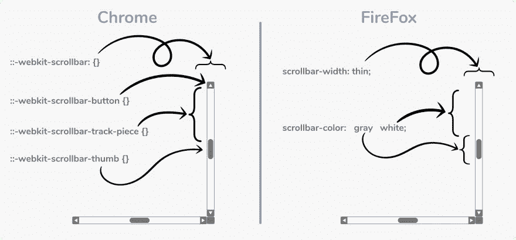
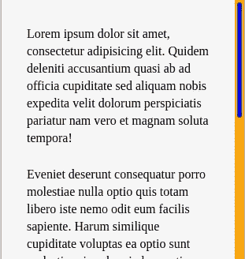
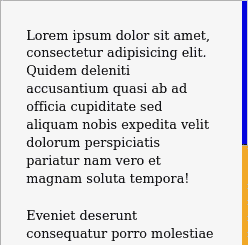

# 如何用 CSS 设计滚动条的样式

> 原文：<https://medium.com/nerd-for-tech/how-to-style-scrollbars-with-css-1f8ac0b9599?source=collection_archive---------0----------------------->



> 你是否曾经访问过一个带有自定义滚动条的网站，并想知道他们是如何做到的？
> 
> 读完这篇文章后，你可以理解关于使用 CSS 定制和样式滚动条的一切。

## 自定义滚动条的利与弊

在开始编写代码之前，我认为有必要考虑一下为你的网站或应用程序创建自定义滚动条的潜在利弊。

好处是，与数百万使用浏览器默认滚动条的网站相比，它可以让你的网站有机会脱颖而出。任何能让你的网站让访问者更加难忘的东西都会让你长期受益。

另一方面，许多用户界面设计者认为你不应该干涉像滚动条这样的“标准化”用户界面组件。如果你过多地修改滚动条，可能会让使用你的网站或应用的人感到困惑。

如果你正在为你自己的个人网站做这件事，只要你喜欢它的外观，你可能就不需要担心它。

另一方面，如果你正在考虑在工作中实现一个自定义滚动条，或者你想赚钱的一些项目，你应该尝试 A/B 测试，并根据结果做出数据驱动的决定。

在一天结束的时候，我们中的大多数人都在编写代码来增加企业的收入，所以你需要时刻记住这一点。

2018 年 9 月，W3C [CSS 滚动条](https://www.w3.org/TR/2018/WD-css-scrollbars-1-20180925)定义了用 CSS 定制滚动条外观的规范。

截至 2020 年， [96%的互联网用户](https://caniuse.com/#feat=css-scrollbar)正在运行支持 CSS 滚动条样式的浏览器。然而，你需要编写两套 CSS 规则来覆盖 Blink 和 WebKit 以及 Firefox 浏览器。

在本教程中，你将学习如何使用 CSS 来定制滚动条以支持现代浏览器。

## 先决条件

在阅读本文之前，您需要:

*   熟悉 [**厂商前缀**](https://flaviocopes.com/css-vendor-prefixes/)[**伪元素**](https://www.w3schools.com/css/css_pseudo_elements.asp)[**优雅退化**](https://www.thoughtco.com/graceful-degradation-in-web-design-3470672) 等概念。

> “供应商前缀”是您的浏览器在所有浏览器完全支持新的 CSS 功能之前支持它们的一种方式。
> 
> “优雅降级”是一种为各种不同的新旧浏览器处理网页设计的策略。
> 
> “伪元素”是添加到选择器中的关键字，选择器允许您设置所选元素的特定部分的样式。下面是一些你应该在 Chrome 和 Safari 上使用的“伪元素”:

*   `::-webkit-scrollbar`:酒吧本身的背景。
*   `::-webkit-scrollbar-button`:滚动条上的方向按钮。
*   `::-webkit-scrollbar-track`:进度条“下方”的空白区域。
*   `::-webkit-scrollbar-track-piece`:进度条最顶层没有被拇指覆盖。
*   `::-webkit-scrollbar-thumb`:可拖动的滚动元素的大小取决于可滚动元素的大小。
*   `::-webkit-scrollbar-corner`:可滚动元素的底角，两个滚动条在此相遇。
*   `::-webkit-resizer`:可拖动的大小调整手柄，出现在一些元素的底角的滚动条角的上方。



## Chrome、Edge 和 Safari 中滚动条的样式

目前，Chrome、Edge 和 Safari 的滚动条样式可以使用供应商前缀伪元素`[-webkit-scrollbar](https://developer.mozilla.org/en-US/docs/Web/CSS/::-webkit-scrollbar)`。

下面是一个使用`::-webkit-scrollbar`、`::-webkit-scrollbar-track`和`::webkit-scrollbar-thumb`伪元素的例子:

```
body::-webkit-scrollbar {
  width: 12px;               /* width of the entire scrollbar */
}body::-webkit-scrollbar-track {
  background: orange;        /* color of the tracking area */
}body::-webkit-scrollbar-thumb {
  background-color: blue;    /* color of the scroll thumb */
  border-radius: 20px;       /* roundness of the scroll thumb */
  border: 3px solid orange;  /* creates padding around scroll thumb */
}
```

下面是使用这些 CSS 规则生成的滚动条的屏幕截图:



这段代码适用于最新版本的 Chrome、Edge 和 Safari。

不幸的是，这个规范已经被 W3C 正式放弃，并且随着时间的推移可能会贬值。

## 在 Firefox 中设置滚动条的样式

目前，新的 CSS 滚动条提供了 Firefox 滚动条样式。

下面是一个使用`scrollbar-width`和`scrollbar-color`属性的例子:

```
body {
  scrollbar-width: thin;          /* "auto" or "thin" */
  scrollbar-color: blue orange;   /* scroll thumb and track */
}
```

下面是使用这些 CSS 规则生成的滚动条的屏幕截图:



这个规范与控制滚动条颜色的`-webkit-scrollbar`规范有一些共同之处。然而，目前还不支持修改“跟踪拇指”的填充和圆度。

## 构建面向未来的滚动条样式

你可以用支持`-webkit-scrollbar`和`CSS Scrollbars`规范的方式编写你的 CSS。

下面是一个使用`scrollbar-width`、`scrollbar-color`、`::-webkit-scrollbar`、`::-webkit-scrollbar-track`、`::webkit-scrollbar-thumb`的例子:

```
/* Works on Firefox */
* {
  scrollbar-width: thin;
  scrollbar-color: blue orange;
}/* Works on Chrome, Edge, and Safari */
*::-webkit-scrollbar {
  width: 12px;
}*::-webkit-scrollbar-track {
  background: orange;
}*::-webkit-scrollbar-thumb {
  background-color: blue;
  border-radius: 20px;
  border: 3px solid orange;
}
```

Blink 和 WebKit 浏览器会忽略它们不识别的规则，并应用`-webkit-scrollbar`规则。Firefox 浏览器会忽略它们无法识别的规则，并应用`CSS Scrollbars`规则。一旦 Blink 和 WebKit 浏览器完全摒弃了`-webkit-scrollbar`规范，它们将优雅地退回到新的`CSS Scrollbars`规范。

## 结论

在本文中，向您介绍了如何使用 CSS 样式化滚动条，以及如何确保这些样式在大多数现代浏览器中被识别。

也可以通过隐藏默认滚动条并使用 JavaScript 检测高度和滚动位置来模拟滚动条。然而，这些方法在再现类似惯性滚动(例如，当通过触控板滚动时衰减运动)的体验时遇到了限制。

如果你想学习更多关于 CSS 的知识，请查看下面的练习和编程项目链接。

[](https://www.w3schools.com/w3css/defaulT.asp) [## W3。CSS 主页

### W3。CSS 更小、更快、更容易使用。w3。CSS 是一个现代的、反应灵敏的、移动优先的 CSS 框架。W3。CSS…

www.w3schools.com](https://www.w3schools.com/w3css/defaulT.asp) [](https://www.digitalocean.com/community/tags/css) [## CSS 教程、问题和资源|数字海洋

### 级联样式表(CSS)是用于指定网页的视觉外观和表示的语言…

www.digitalocean.com](https://www.digitalocean.com/community/tags/css)