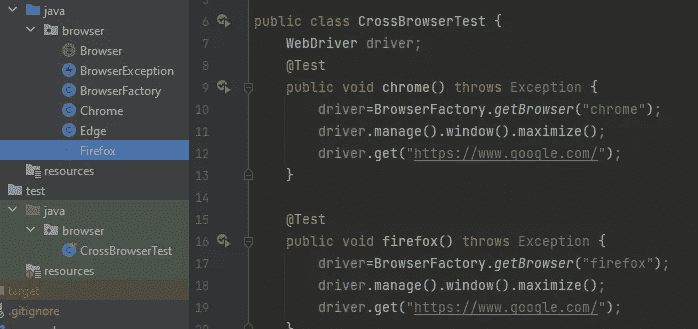

# 如何在您的测试框架中支持多种浏览器—第一部分

> 原文：<https://medium.com/nerd-for-tech/how-to-support-multiple-browsers-in-your-test-framework-part-i-592e7d87c193?source=collection_archive---------3----------------------->

今天，跨浏览器测试是自动化框架中的一个必备特性，因为它产生了巨大的回报，因为您编写的测试只需几次点击就可以跨浏览器执行。如果你的脚本床被很好地优化，不仅节省时间，而且避免质量工程师的重复任务，从而减少人为错误。

Sajitha 的跨浏览器实现