# 如何安全访问暗网？

> 原文：<https://medium.com/nerd-for-tech/how-to-surf-and-monitor-the-dark-web-traffic-5087e93e714d?source=collection_archive---------2----------------------->

# **1。什么是互联网世界里的洋葱路由:**

洋葱路由(Tor)是一个开源工具，它通过在互联网上实现匿名通信，通过各种隐藏的通道和路由机制安全地到达目的地。根据 Tor 的官方网站，全球大约有 6000 个 Tor 节点在运行。换句话说，Tor 也被称为互联网的密室。暗网网络继承自母目录万维网(WWW ),并且目前独立存在于以互联网为骨干的暗网覆盖网络上，它需要专门设计的 Tor 软件、Tor 配置、Tor 控制来访问不被常规搜索引擎索引的暗网内容。网络犯罪利用暗网和暗网进行网络犯罪活动。然而，今天在我们的研究行动中，我们计划了解黑暗网络的功能和操纵能力，以及它如何帮助网络罪犯比以往任何时候都更方便地在黑暗网络上穿行，匿名对社会和治理产生了巨大的影响。缺乏暗网监控研究，典型的正统存在的全球情报监控网络犯罪活动产生了巨大的影响和全球性的影响。

**1.1 研究策略和目标:**

本分析性研究致力于提供对暗网的全面了解，寻找研究技术以识别、评估和提供 Tor 浏览器的概要，使用 Tor 访问暗网的机制，通过开源和商业可用工具对进出 Tor 连接进行独家监控和流量分析。

**1.2 如何使用 Tor 浏览器访问和操纵黑暗网络:**

采用经济高效的 VPN 解决方案，可以扩大用户的匿名级别，并帮助他们模糊通往目的地的弹性路径，防范任何高级社会工程攻击、政府入侵、限制、审查，尤其是 APT 对手。Dark Web 提供的绝大多数付费和非付费内容和服务通常由一些知名的匿名服务使用，如 Tor、Freenet、I2P 和 JonDonym。

**1.3 暗网资源:**

在我们的分析研究中，我们使用 Tor 浏览器工具分析了不同暗网资源的存在。

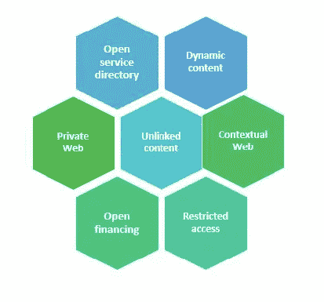

**1.4 如何启动 Tor 浏览器:**

一旦你从官方网站下载了 Tor 浏览器，如果你的原籍国受到严格审查，你会选择向 Tor 发送一封电子邮件请求接收镜像链接以进行下载，而不会引起任何怀疑。之后，当您第一次运行 Tor 浏览器时，屏幕上会显示一个通知窗口，提供两个选项，一个是选择“连接”，另一个是选择“Tor 网络设置”，以配置代理服务器配置。如果您的原籍国受到严格审查，最后您也可以通过勾选复选框选择自动连接到 Tor 网络。我们在图 2 中描绘了 Tor 浏览器连接和协商过程链。

**4.1 微调配置:**在此部分，您可以根据您的需求和安全性选择执行多种配置。如果您的互联网服务提供商(ISP)、教育机构、公司、受审查的国家/地区阻止了该邮件，则收到拒绝访问邮件的可能性很大。为了克服这个问题，我们需要使用规避工具来摆脱这些限制。Tor 创建了这个规避工具，并将其命名为可插拔传输。目前，有三种类型的可插拔传输可以使用，如 obfs4，meek，Snowflake。

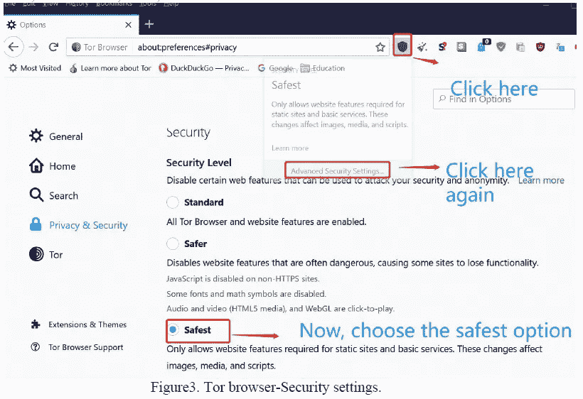

**第一步:**点击安全设置图标，如图 3 所示。

**第二步:**请导航至 Tor 部分。在这里，您可以选择“快速启动”，一如既往地自动连接到 Tor。如果你的网络阻塞了对 Tor 的访问，你肯定需要一个“桥”，来连接 Tor 网络。此外，您可以从 torproject.org“请求一座桥梁”，或者如果您已经获得一座桥梁，您可以选择“提供一座桥梁”。如果您要使用“请求网桥”，请暂时跳过这一步，转到步骤 6。

**第三步:**保护您的网络形象。请点击盾形图标，一个显示窗口显示"高级网络设置"。

**第四步:**现在选择左侧栏中的“隐私&安全”选项，或者您也可以交替向下拖动。

**Step5:** 现在，在“安全”下，选择“最安全”的。它只允许网站收集或使用最少的功能来获取它。因此，为了满足我们的案例研究，这里实施了额外级别的保护，以实现最高的安全性和匿名性。

**步骤 6:** 现在，请关闭此窗口，开始使用 Tor。

**1.4.2 请求桥接:**

当您第一次运行 Tor 浏览器时，请遵循步骤 1 至步骤 4。如果您运行了 Tor 浏览器，请相应地执行步骤 5 至步骤 7。

**步骤 1:** 请点击“Tor 网络设置”。

**步骤 2:** 现在导航到“网桥”部分，勾选“使用网桥”复选框，然后选择窗口上的“选择内置网桥”选项。

**第三步:**从下拉菜单中选择您喜欢的“可插拔传输”。

**第四步:**完成选择后，请向上滚动并点击“连接”保存您的设置。

**第五步:**请点击浏览器窗口上的“首选项”或“选项”图标≡。

**步骤 6:** 请导航至左侧栏中的 Tor 部分。从下拉列表中，选择您喜欢的“可插拔传输”。第七步:一旦你完成选择，请向上滚动并点击“连接”保存你的设置。

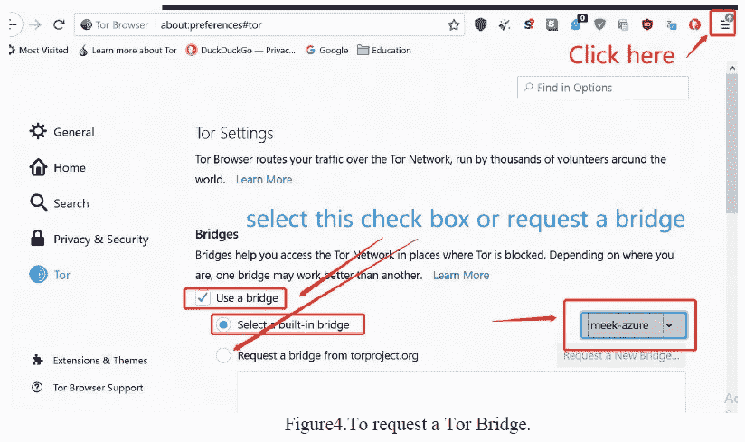

# **2。安全浏览黑暗网络并捕获互联网流量连接:**

**2.1 暗网监控工具类型:**

在 21 世纪，由于最近 IT 部门发明的快速技术突破，有大量的开源、商业可用工具和基于 SaaS 的订阅模式来保护您组织内部的整个防御。因此，任何 IT 部门都必须采取持续的识别、分析、检测、保护和防御措施，以应对任何可能对您的资产和声誉造成实际损害的威胁迹象。在我们的分析研究中，我们使用一些业界最好的开源工具来进行我们的暗网流量监控。

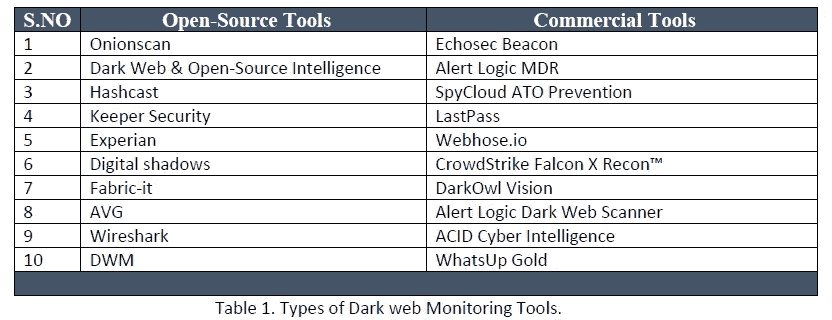

**2.2 Wireshark:**

在我们的分析研究中，我们选择了“Wireshark”工具来识别、分析、监控和排查我们的暗网流量连接和协议。Wireshark 是一款开源工具，主要用于分析网络流量包和其他方面，如网络故障排除、分析、软件开发、通信预测、协议开发和教育用途。Wireshark 网络分析器的主页如图 3 所示。

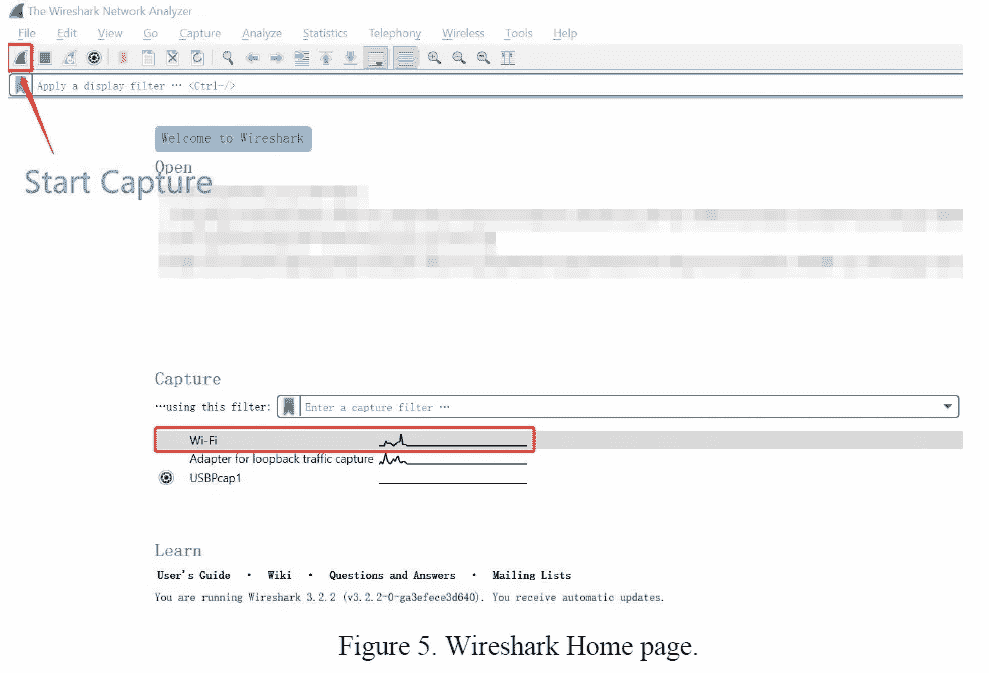

2.2.1 Wireshark 任务先决条件:一些被广泛请求的参数是必需的管理员访问，选择正确的网络接口，并捕获确定的和请求的流量供您使用。

**2.3 捕获实时网络数据:**

在我们的研究中，我们使用以下方法开始用 Wireshark 数据包分析器捕获暗网网络流量数据包。

**步骤 1:** 在欢迎屏幕上选择所需的有线或无线接口。

**第二步:**然后你可以点击“捕获”，选择“开始”或者按 Ctrl + E，或者你可以选择界面，在主屏幕页面上点击这个图标。

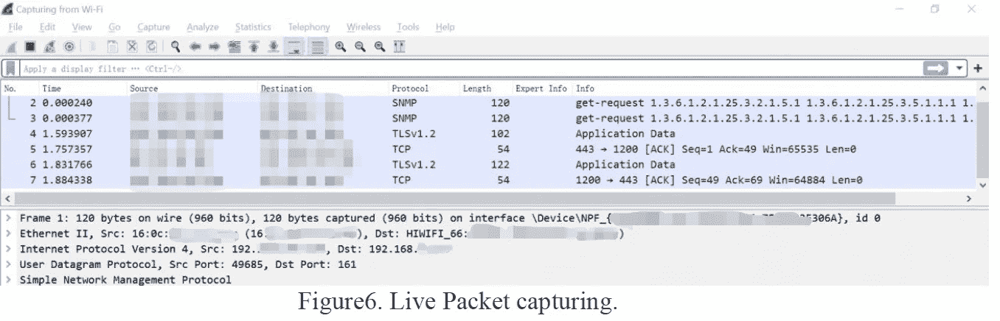

现在，最小化这个 Wireshark 窗口，当我们在黑暗的网站上冲浪时，让它在后台运行。

**第四步:**现在，打开 Tor 浏览器，开始在 Dar 网上冲浪。在我们的分析研究中，我们使用隐藏维基进行数据包捕获。因为，它是黑暗网上最古老的目录之一，包含了所有在黑暗网上冲浪的链接和资源。

**步骤 5:** 隐藏的 wiki 主页如图 7 所示。

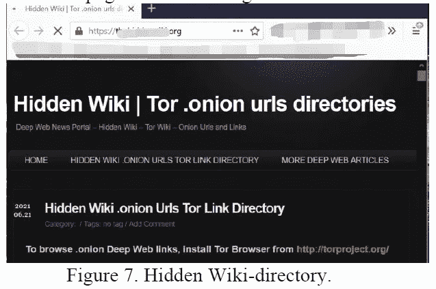

我们已经提到了一个。隐藏 wiki 上的洋葱网络链接捕获有趣的流量，如图 8 所示。

**第四步:**现在，点击这个图标停止抓取流量。

注意:当工具捕获到足够的流量时，请单击“停止”。

**第五步:**点击“文件”，第一次保存时选择“保存”，如果要以不同格式保存，则交替选择“另存为”。在我们的情况下。pcap 的单模式文件格式，并将该文件存储在特定的文件夹中。

请关闭 Tor 浏览器。

**步骤 7:** 要停止 Wireshark 上正在运行的会话，您可以按 Ctrl +E 或单击“Capture”并选择“stop”或按主屏幕上的红色方形图标框。

# **3。分析捕获的暗网流量:**

在本节中，我们将对捕获的流量进行深入分析，以识别威胁。

**步骤 1:** 请打开 Wireshark 工具。

**第二步:**点击“文件”，选择“打开”，从具体文件夹位置选择您的文件，或者通过“打开最近”选择文件，如图 9 所示。

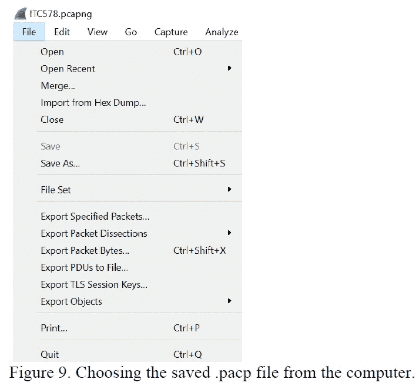

**步骤 3:** 现在，点击工具栏部分的“分析”功能，并点击“专家信息”。屏幕上将弹出一个新窗口，如图 10 所示。

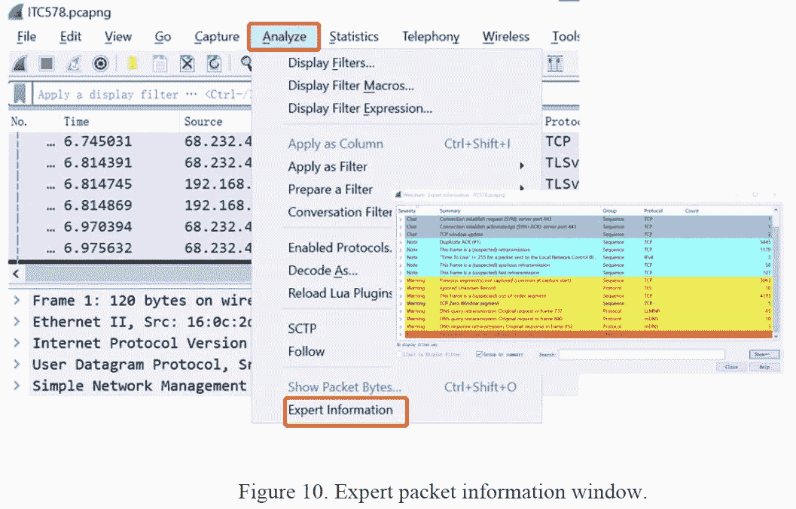

第四步:请使用表 2 中定义的颜色编码方案。

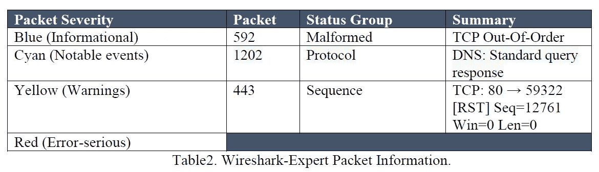

专家信息功能是调查之旅的起点，它在捕获过程中跟踪每一个异常和感兴趣的特殊项目，这里是捕获的文件。当我们使用这个功能时，一个对话框会为我们提供关于不常见行为和需要注意的问题的综合信息。一般来说，异常条目根据这些协议进行筛选，突出显示并按严重性级别分组，例如 TCP 和 DNS 协议，以识别乱序的 TCP 数据包(无论其是否格式错误)、DNS 查询和 TCP 序列顺序数据包。除了专家数据包信息，默认情况下它是不启用的。因此，我们可以选择一个额外的“专家信息严重性”特性来突出显示并列出重要的严重性信息，如图 11 所示。

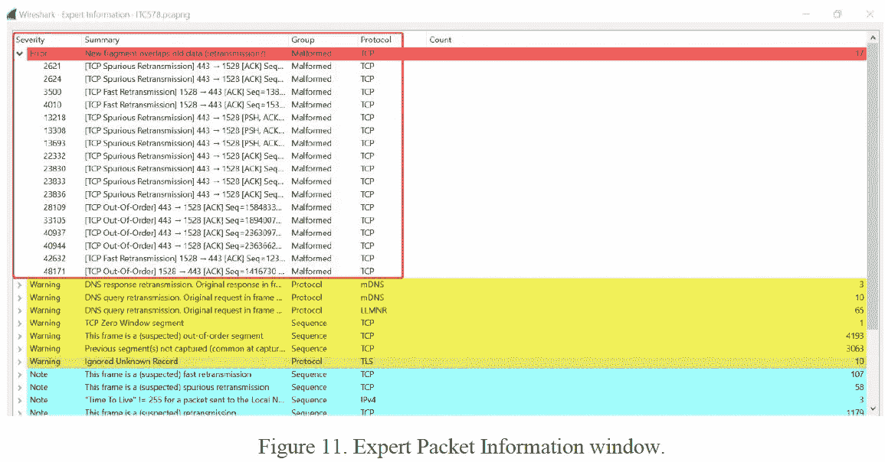

**格式错误的数据包:**

一般来说，格式错误的数据包会被识别为可疑的，或者分析程序中有错误。因此，中止对这些数据包的解析。

**专家包信息汇总:**

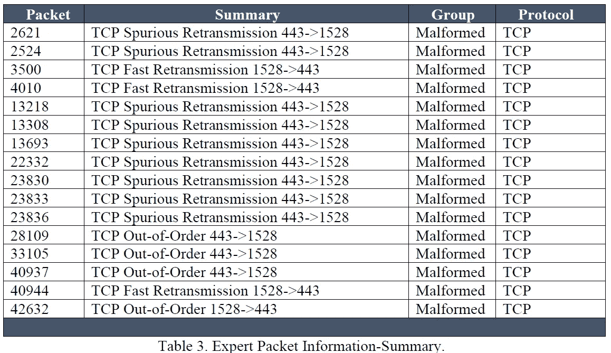

从总结数据包列表中取出一个格式错误的数据包来分析其内容以进行调整。现在，请右键单击数据包并“应用 ass 过滤器”，选择“选中”。

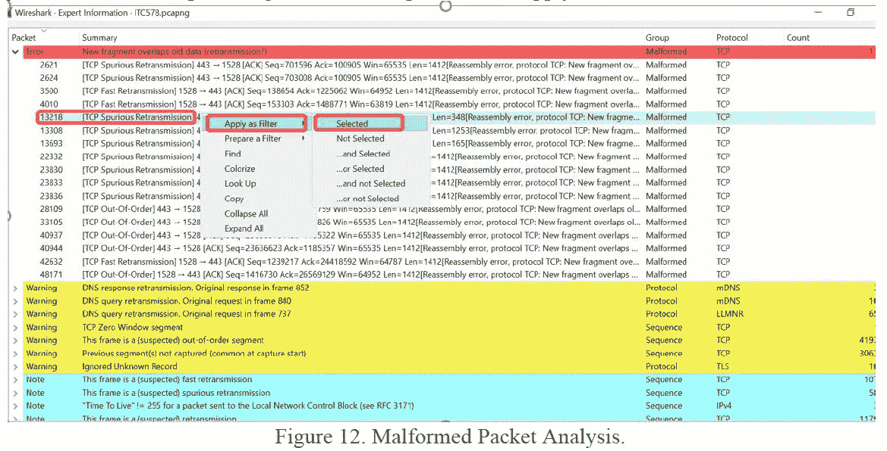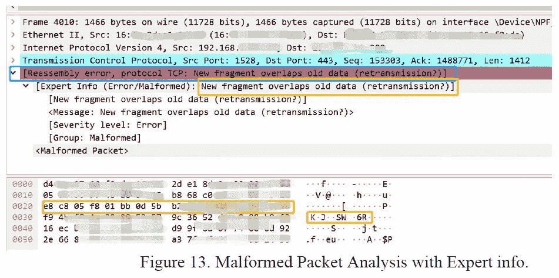

我们发现了另一个带有“警告”标志的数据包，并选择该数据包进行分析。

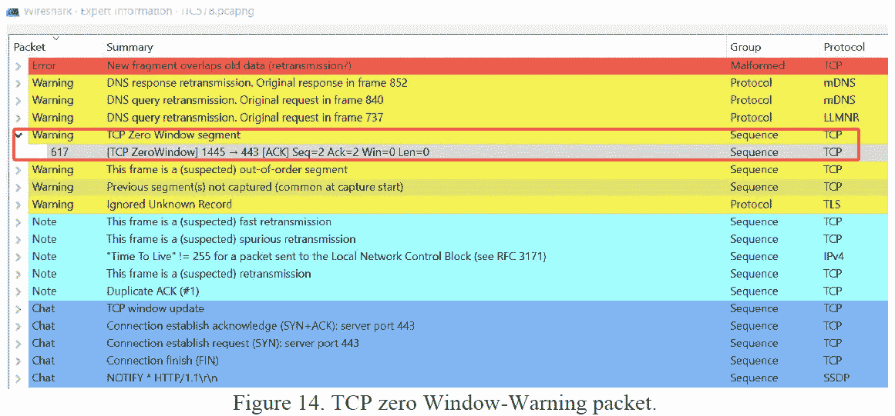

我们找到了 TCP 零窗口的原因，并且部分地识别了当我们的计算机向服务器通告其窗口大小的零值时，这规定了 TCP 接收缓冲帧现在已满，并且它不能接收任何更多的数据来处理。如图 14 和图 15 所示。

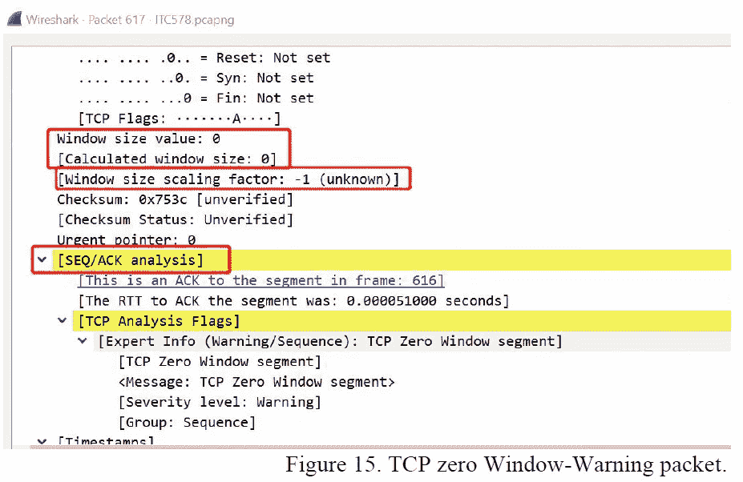

网络取证分析工具(NFAT): NetworkMiner 工具是一个被动的网络嗅探器，也称为高级数据包捕获工具，用于取证和网络事件响应。它可以支持基于离线的分析，以从多个网络软件产品重新生成和重组继承的基于 pcap 的文件。这个指定的入侵者 IP 用我们随机生成的 MAC 地址欺骗了 MAC 地址。

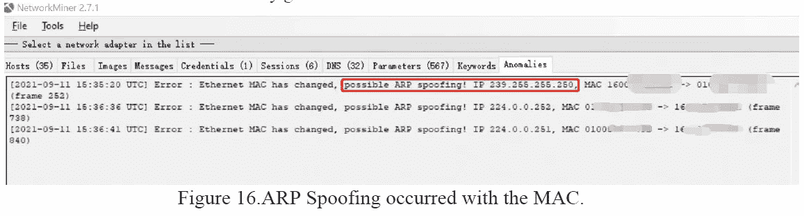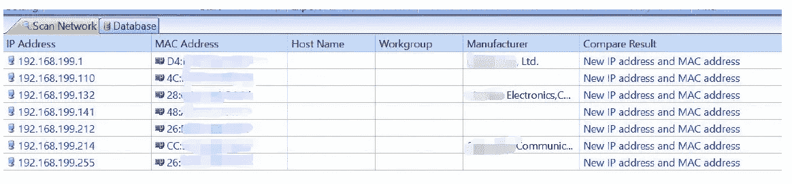

图 17。随机 MAC 出现 ARP 欺骗。

在启动 Tor 浏览器之前，我们使用随机硬件地址。因此，伪造的 MAC 不是与原始 MAC 表匹配的 MAC，我们仍然不清楚。

# **4。暗网网络流量监控的功能挑战:**

Tor 匿名成为了好的敌人，因为在安全和高度加密流量的网络上的模糊存在使得执法部门、网络警察、it 管理员和其他个人用户更难破解外壳。监控黑暗网络既费时又复杂，因为犯罪分子经常在论坛和博客上留下足迹，这使得追踪他们变得更加困难。我们需要一个基于人工智能驱动技术的工具来自动进行定期扫描和监控异常。在识别目标时，索引数据应该以简单明了的方式呈现。

(I)威胁情报:我们需要一个自动化的威胁情报系统，将捕获的数据输入其中并呈现数据。

㈡寻找威胁:我们需要使用商业上可获得的和开放源码的工具，对黑暗网络进行全面的工作。

(iii)更快的事件响应:目前，没有为暗网监控定义足够的工作流和框架来减轻威胁，此外，我们缺乏并努力应对威胁的快速扩展。

(iv)集成到一个核心安全平台中:事实上，每个组织都能够拥有一个中型团队来管理其资产的基础架构监控。如果我们将重点放在将网络和 d ark web 流量包合并到一个智能监控平台上，以便在短时间内准备、发现、识别、评估、修复和重新扫描整个基础架构。

# **5。结论:**

意识和充分的培训有助于个人、组织、执法机构加强对暗网监控的自觉方法，同时系统方法和改进被证明更有效、更准确，并有助于抵御任何熟练的入侵者和网络犯罪。

**免责声明**。对于因您自己的行为、任何风险、任何邪恶和/或使用暗网或其服务的其他不当行为，或因您自己的兴趣或行为而合并或制作的任何产品或过程，或因使用您的冲浪信息而合并或制作的任何产品或过程所造成的任何损害，本文信息、媒体或我的博客均不承担任何责任。本文仅用于**教育目的**！