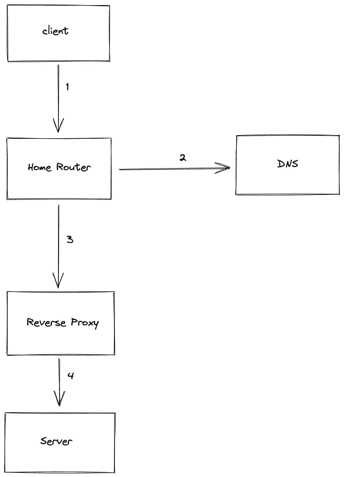
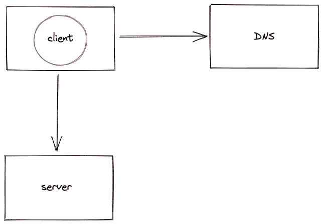
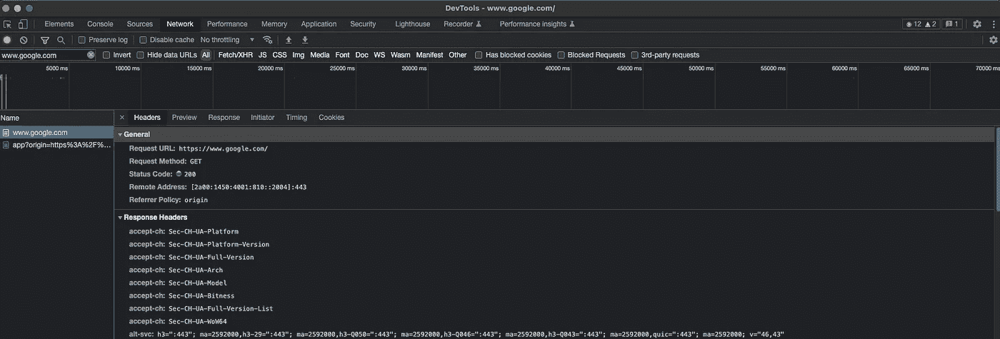
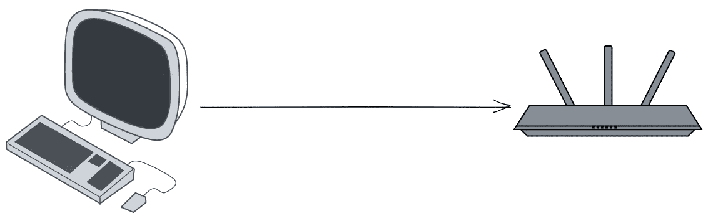
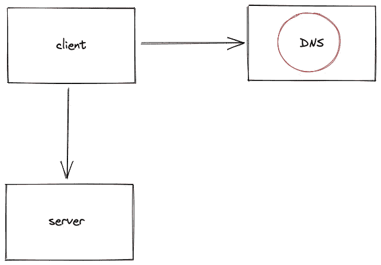
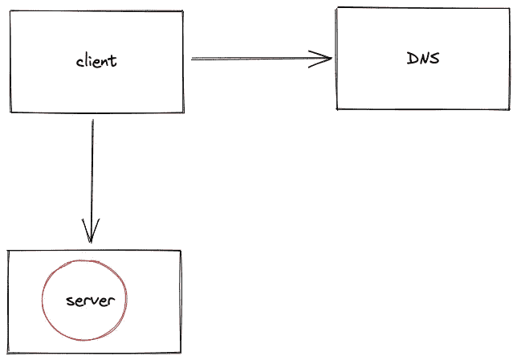

# 如果无法访问特定网站，如何排除故障？

> 原文：<https://medium.com/nerd-for-tech/how-to-troubleshoot-if-you-cant-access-a-particular-website-af681fac3215?source=collection_archive---------4----------------------->


无法访问网站

*本文的目标读者分为以下几类:*

*   *科技工作者*
*   *学生*
*   *产品经理*

阅读这篇文章没有先决条件。我假设您已经使用 web 浏览器浏览过互联网，并且对终端有基本的了解。本文没有深入介绍如何执行某些调试操作。欢迎分享您的反馈，并在评论中提问。

原文发表在 [systemdesign.one](https://systemdesign.one/how-to-troubleshoot-if-you-cannot-access-a-website/) 网站上。

*免责声明* : *系统设计问题是主观的。这篇文章是基于我对这个话题的研究而写的。欢迎分享您的反馈，并在评论中提问。*

# 为什么有些网站不能在 chrome 中打开？

您必须对网络组件的不同层进行故障排除，以解决问题。在**高电平**时，应检查以下故障:

1.  客户端
2.  局部网络
3.  域名服务器(Domain Name Server)
4.  中间网络组件
5.  服务器端

# **术语**

以下术语可能对您有用:

*   DNS:包含从域名到 IP 地址的映射的数据存储
*   HTTP:用于在互联网上交换文件的标准应用层协议
*   客户端:允许您在互联网上执行不同操作的网络浏览器或移动设备
*   服务器:以网站形式存储文件和信息的计算机
*   URL:标识互联网上 web 资源的网址
*   路由器:支持网络数据包转发和路由的设备，在局域网中充当接入点
*   代理服务器:将用户与网站分开的中间服务器
*   防火墙:网络安全设备或软件，根据特定的策略或规则监控和过滤进出的网络流量

# 介绍

当你在浏览器中键入一个网站的统一资源定位符( [**URL**](https://en.wikipedia.org/wiki/URL) )并按回车键时，大量的动作在后台执行。



访问 URL 的高级数据工作流

1.  客户端查询域名系统( **DNS** )服务器，找到网站的 IP 地址
2.  网络数据分组通过家庭路由器被路由
3.  客户端使用超文本传输协议( **HTTP** )请求服务器访问网站
4.  HTTP 请求的数据分组通过诸如反向代理服务器的中间组件被路由
5.  客户端连接到服务器并获取数据

# 客户端故障

由于多种原因，**客户端**(浏览器)可能会出现故障。通过执行以下操作来分析一些常见的客户端故障:



客户端故障

*   使本地客户端缓存无效

网站的更新会使特定网站的客户端缓存无效，并使其不可访问。您可以使用浏览器设置或通过网站的硬刷新来刷新本地[客户端缓存](https://en.wikipedia.org/wiki/Web_cache)。

*   使用浏览器的匿名模式

浏览器的[匿名模式](https://support.google.com/chrome/answer/95464?hl=en&co=GENIE.Platform%3DAndroid)防止浏览器扩展或 [cookies](https://en.wikipedia.org/wiki/HTTP_cookie) 与网站加载冲突。

*   使用浏览器开发工具验证 HTTP 响应状态代码



使用 Chrome DevTools 检查 HTTP 响应状态代码

浏览器 [DevTools](https://en.wikipedia.org/wiki/Web_development_tools) 的网络选项卡显示来自网站的超文本传输协议( [**HTTP**](https://en.wikipedia.org/wiki/Hypertext_Transfer_Protocol) )响应状态码。您可以通过观察响应状态代码来确定是客户端错误还是服务器端错误。状态代码范围*400–499*显示客户端错误，状态代码范围*500–599*显示服务器端错误。

*   使用备用浏览器

在最坏的情况下，你的浏览器是过时的，或者与网站使用的某些特定协议不兼容。您使用另一个浏览器[访问同一个网站。](https://en.wikipedia.org/wiki/List_of_web_browsers)

*   访问另一个热门网站

您试图访问一个由于不同原因(如服务器过载)而停机的网站。除了等待网站恢复运行之外，您什么也做不了。你也许可以通过访问一个替代的流行网站，如 google.com，来识别失败。

# 本地网络故障

本地网络故障可能由多种原因造成。通过执行以下操作，可以分析一些常见的本地网络故障:



局域网

*   验证您的互联网连接

你应该确保客户端可以接入互联网。使用客户端访问一个流行的网站，如*google.com*来验证互联网连接。

*   验证计算机的网络适配器

您使用 [*ping*](https://en.wikipedia.org/wiki/Ping_(networking_utility)) 工具来验证您的计算机的[网络适配器](https://en.wikipedia.org/wiki/Network_interface_controller)是否启动并运行。您可以在[终端](https://en.wikipedia.org/wiki/Computer_terminal)上运行以下命令:

```
ping 127.0.0.1
```

您重新启动计算机，使网络适配器重新启动并运行。

*   尝试备用网络

您可以从连接到另一个网络的移动设备或客户端访问网站。如果你能访问网站，这是你的家庭网络问题。

*   检查家用路由器

你通常可以在贴在路由器上的标签上找到[家用路由器](https://en.wikipedia.org/wiki/Router_(computing))的默认互联网协议([IPT13)地址。您可以使用 *ping* 工具，通过运行以下命令来验证您的客户端是否可以到达家庭路由器:](https://en.wikipedia.org/wiki/IP_address)

```
ping 192.168.0.1
```

如果使用 *ping* 命令无法到达家庭路由器，您可以软重置或硬重置家庭路由器。

*   使用有线网络连接到路由器

你可以使用[以太网](https://en.wikipedia.org/wiki/Ethernet)电缆将你的客户端连接到家用路由器。无线局域网( [**WLAN**](https://en.wikipedia.org/wiki/Wireless_LAN) 又名 WiFi)可能由于路由器问题而关闭。

*   验证防火墙或代理服务器设置

您应该验证本地[防火墙](https://en.wikipedia.org/wiki/Firewall_(computing))或[代理服务器](https://en.wikipedia.org/wiki/Proxy_server)的配置。防火墙软件的文档应能为故障排除提供更深入的见解。您可以禁用代理服务器，然后重试访问网站。

# DNS 失败

域名系统([**)DNS**](https://en.wikipedia.org/wiki/Domain_Name_System))连接故障可能由多种原因造成。通过执行以下操作，可以分析一些常见的 DNS 连接故障:



DNS 失败

*   验证 DNS 连接

使用以下工具之一验证 DNS 解析是否按预期工作:

```
dig google.com

nslookup google.com
```

[dig](https://en.wikipedia.org/wiki/Dig_(command)) :域名信息搜索器

[nslookup](https://en.wikipedia.org/wiki/Nslookup) :名称服务器查找

*   切换到备用 DNS 服务器

您可以尝试备用 DNS 服务器，并验证您是否可以访问该网站。比如试试 Google DNS (8.8.8.8)。

*   刷新 DNS 缓存

该网站可能会更新其 IP 地址。客户端上的 DNS 缓存或家庭路由器上的缓存可能指向过期的 IP 地址。您可以强制刷新客户端和家庭路由器上的缓存。

# 中间网络组件故障

大型系统中存在多个中间组件。比如互联网服务提供商( [**ISP**](https://en.wikipedia.org/wiki/Internet_service_provider) )路由器，内容交付网络( [**CDN**](https://en.wikipedia.org/wiki/Content_delivery_network) )。中间组件的故障可能由于多种原因而发生。通过执行以下操作来分析中间组件的一些常见故障:


网络路径

*   验证客户端是否可以连接到服务器

通过 DNS 解析识别服务器的 IP 地址。您可以使用 *ping* 工具检查从客户端发送的互联网控制消息协议( [ICMP](https://en.wikipedia.org/wiki/Internet_Control_Message_Protocol) )数据包是否到达服务器。您在终端上运行以下命令:

```
ping <server IP address>
```

*   识别网络路径中的缺陷组件

您可以使用 [*traceroute*](https://en.wikipedia.org/wiki/Traceroute) 工具来识别从客户端到服务器的网络路径中的跳数。traceroute 输出应该可以帮助你缩小失败组件的范围。例如，故障组件可能是 CDN 或[反向代理](https://en.wikipedia.org/wiki/Reverse_proxy)服务器。

*   重新路由网络流量

如果网络路径中的一个中间组件出现故障，您需要重新路由网络流量。你用一个虚拟专用网( [**VPN**](https://en.wikipedia.org/wiki/Virtual_private_network) )来重新路由流量，验证是否可以访问网站。

# 服务器端故障

DNS 连接失败可能有多种原因。通过执行以下操作，可以分析一些常见的 DNS 连接故障:



服务器端故障

*   验证 HTTP 响应状态代码

HTTP 响应[状态代码](https://en.wikipedia.org/wiki/Hypertext_Transfer_Protocol#Response_message)范围(500–599)确认服务器端故障。

*   服务器无法正常工作

在大型系统中，有多个服务器或中间组件来满足传入的负载需求。如果您尝试访问的服务器出现故障，您可以使用 VPN 访问同一网站的另一台服务器(假设服务器在地理上是分开的)。

*   客户端无法访问服务器

您可以使用 *ping* 工具或 *traceroute* 工具来验证客户端是否可以到达服务器。

# 摘要

系统故障排除让您缩小访问公共网站失败背后的根本原因。

# 问题和解决方案

如果你想挑战你的知识，请访问文章:[知识测试](/@system-design/knowledge-test-how-to-troubleshoot-if-you-cant-access-a-particular-website-52bc9307343d)

# 许可证

[**【CC BY-NC-ND**](https://creativecommons.org/licenses/by-nc-nd/4.0/):本许可证允许重用者以任何媒体或格式，仅出于非商业目的，以未经改编的形式复制和分发本文中的内容，并且仅在注明作者的情况下。原文章**必须反向链接**。

# 参考

*   [MDN web docs HTTP 响应状态码](https://developer.mozilla.org/en-US/docs/Web/HTTP/Status)，Mozilla.org
*   [什么是 DNS](https://www.cloudflare.com/en-gb/learning/dns/what-is-dns/) ，Cloudflare.com
*   [路由器解说](https://www.techtarget.com/searchnetworking/definition/router)，Techtarget.com
*   [联网工具【Tecmint.com ](https://www.tecmint.com/linux-networking-commands/)