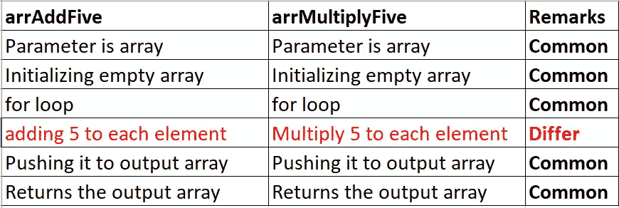

# 如何理解 JS 中的高阶函数和回调

> 原文：<https://medium.com/nerd-for-tech/how-to-understand-higher-order-functions-and-callbacks-in-js-342a10dac63?source=collection_archive---------4----------------------->

在深潜之前，

让我们首先理解为什么我们需要函数。

每一个代码都遵循**干**的原则(**D**on t**R**EPE at**Y**yourself)。干原理的基石是**功能**。

让我们把两个数相加， **10** 和 **20，**

```
const sum1 = 10 + 20;
```

再加上 **50** 和 **60、**

```
const sum2 = 50 + 60
```

坐在这里问这个问题——我在重复我自己吗？我们该怎么办？

如前所述，**功能**来救援！

首先，让我们将上面几行转换成函数。

```
function sum1() { 
return 10 + 20 
}
```

然后，

```
function sum2() {
return 50 + 60
}
```

万岁！我们已经将它转换成函数，但是等待并询问，**‘我们在这里使用的是 DRY 吗？’。**

不，我们仍然在重复两个数的加法。

> 仅仅因为你把你的代码转换成函数并不意味着你遵循了 ***干*** *的原则。*
> 
> ***干*** *=识别什么是变的，什么是不变的。*

什么在改变=数字。

不变的=加法运算。

我们可以在函数中插入不变的模式，但是**改变**怎么办？

> *不变=在函数内部。*
> 
> *已更改=欢迎使用* ***参数*** *。*

```
function sum(a,b) {
return a + b // Addition inside the function
}
```

这里的**‘a’**和**‘b’**是**参数**负责改变一个。

因此使用**参数**调用函数。

```
const sum1 = sum(10,20)
const sum2 = sum(50,60)
```

## 有点复杂:

我们将研究数组。

我们将**把数组**中的每个元素**加 5** 。

```
const arr = [1,2,3];
```

**怎么办？**

我们将遍历数组中的每个元素，并将结果推入一个新的数组。

```
const arr = [1,2,3];

function arrAddFive(inputArray) {
    let output = [] // Initializing empty array
    for(i=0;i<inputArray.length;i++) {
        let addingFive = inputArray[i] + 5; // addingFive to each element
        output.push(addingFive); // Pushing it to output array
    }
 return output // Returns the output array(contains added 5 element)
};

const addresult1 = arrAddFive(arr); 
// [6,7,8]
```

**对于不同的阵列，**

```
// Same code above
const addresult2 = arrAddFive([11,12,13]); // [16,17,18]
const addresult3 = arrAddFive([20,21,22]); // [25,26,27]
```

我们对不同的阵列使用相同的函数来对齐**干**。很好！

我们将做一个不同的操作，比如说**乘以 5**

```
const arr = [1,2,3];

function arrMultiplyFive(inputArray) {
    let output = [] // Initializing empty array
    for(i=0;i<inputArray.length;i++) {
    let multiplyingFive = inputArray[i] * 5; // Multiply 5 to each element
        output.push(multiplyingFive); // Pushing it to output array
    }
 return output // Returns the output array(contains added 5 element)
};

const mulresult1 = arrMultiplyFive(arr); // [5,10,15]
```

对于不同的阵列，

```
const mulresult2 = arrMultiplyFive([11,12,13]) // [50,60,65]
const mulresult3 = arrMultiplyFive([20,21,22]) // [100,105,110]
```

我们这里用**干**吗？当然可以！因为不同的数组调用同一个函数。

## 如果我们希望在同一个代码中既有乘法又有加法呢？

```
const arr = [1,2,3];

function arrAddFive(inputArray) {
    let output = [] // Initializing empty array
    for(i=0;i<inputArray.length;i++) {
        let addingFive = inputArray[i] + 5; // adding 5 to each element
        output.push(addingFive); // Pushing it to output array
    }
 return output // Returns the output array(contains added 5 element)
};

function arrMultiplyFive(inputArray) {
    let output = [] // Initializing empty array
    for(i=0;i<inputArray.length;i++) {
    let multiplyingFive = inputArray[i] * 5; // Multiply 5 to each element
        output.push(multiplyingFive); // Pushing it to output array
    }
 return output // Returns the output array(contains added 5 element)
};

const addresult1 = arrAddFive(arr);
const mulresult1 = arrMultiplyFive(arr);
```

现在告诉我答案，我们是在这里跟随**干**的脚步吗？

> 部分是！因为我们对不同的数组使用相同的函数进行相同的操作。

当你想加 5 时，不考虑数组→我们使用' **arrAddFive '函数。**

当你想乘以 5 而不考虑数组时→我们使用' **arrMultiplyFive '函数。**

> 但是不管**数组**和**运算**(乘法或加法)，我们都不使用同一个函数。
> 
> 我们可以说我们一直在使用一阶或更低阶的函数。

## 干就是找到一个共同的模式:

我们将在这里看到这两个函数的共同模式，



> 任何变化(不同)都将作为参数传递给函数。

**什么变化？**

```
let multiplyingFive = inputArray[i] * 5;
let addingFive = inputArray[i] + 5;
```

我们能不能像这样放一个参数，

```
// Don't do this
const mulresult1=arrFunction(multiplyingFive=InputArray[i]*5,inputArray)
```

我知道这很傻，但我想说明一点。

我可以创建一个函数，它总是返回输入数字乘以 5 或加 5。

让我来编码这个，

```
const arr = [1,2,3];

function arrFunc(callBackFn,inputArray) {
    let output = [] // Initializing empty array
    for(i=0;i<inputArray.length;i++) {
     output.push(callBackFn(inputArray[i])); // Invoking the callBackFn
    }
 return output // Returns the output array(contains added 5 element)
};

function multiplyFive(input) {
    return input * 5;
}

function addingFive(input) {
    return input + 5;
}

const addresult1 = arrFunc(multiplyFive,arr); // [6,7,8]
const mulresult1 = arrFunc(addingFive,arr);  // [5,10,15]
```

因此，当您将函数作为参数传递时，它被称为**回调**函数。

这里的 **multiplyFive 和 addingFive** 被称为**回调**函数。

> 为什么使用术语'**回调**'？因为它不会立即被调用或者在另一个函数中被调用。

调用另一个函数的函数必须比回调函数更高阶，对吗？

这里的 **arrFunc** 是**高阶函数**，因为它需要一个**回调**(另一个函数作为参数)。

arrFunc 在其内部调用回调函数— **multiplyFive 和 addingFive** 。

```
output.push(callBackFn(inputArray[i])); // Invoking the callBackFn
```

> *回调函数是* ***通过一些更高级的函数回调*** *。*
> 
> *或者我们可以说它是* ***被调用后*** *更高的功能被调用。*
> 
> *接受或给出另一个函数的函数称为* ***高阶函数。***

我们将看到一个高阶函数稍后返回另一个函数。

*最初发表于 2022 年 12 月 11 日*[*https://www.pansofarjun.com*](https://www.pansofarjun.com/post/how-to-understand-higher-order-functions-and-callbacks-in-js)*。*