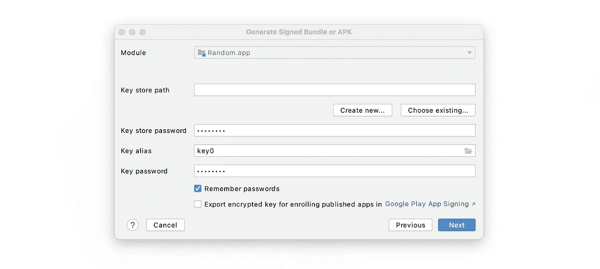
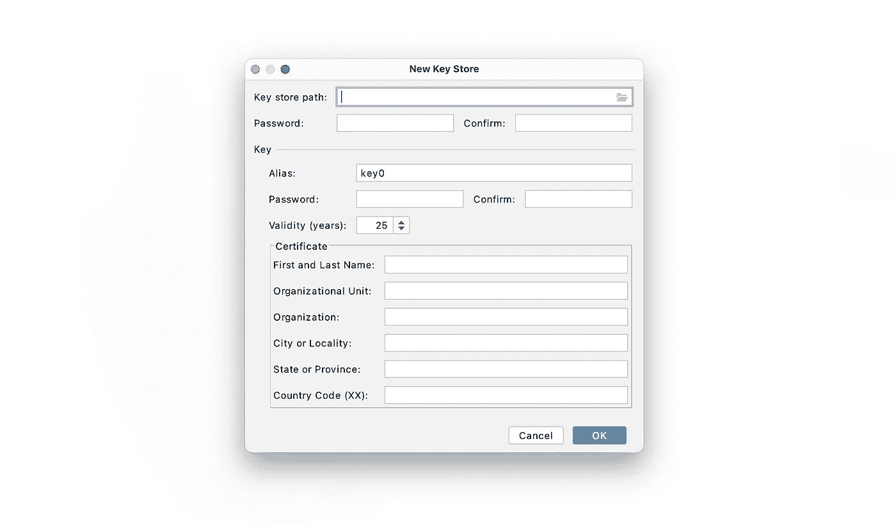
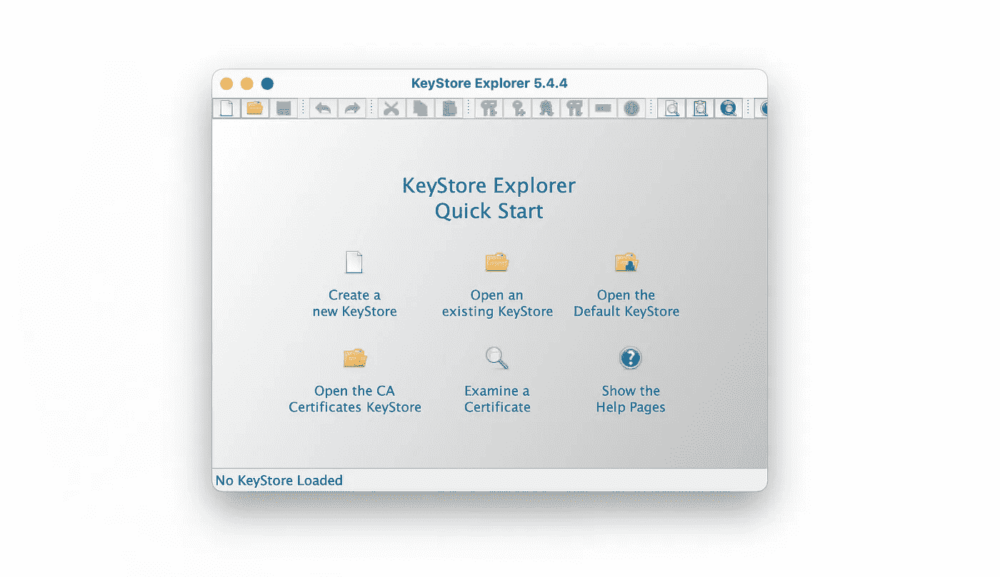
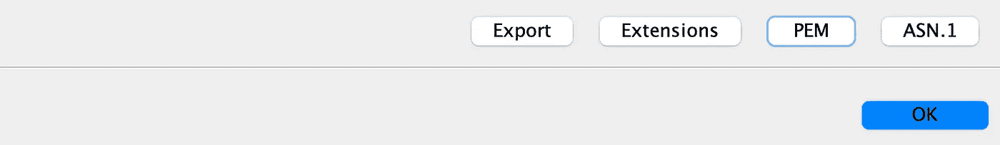
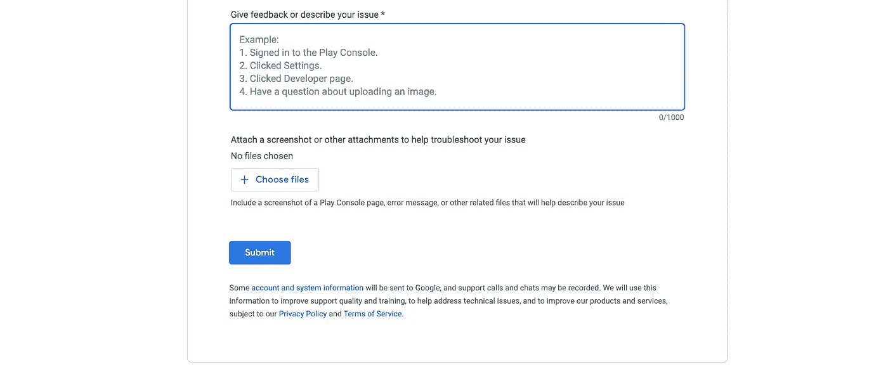
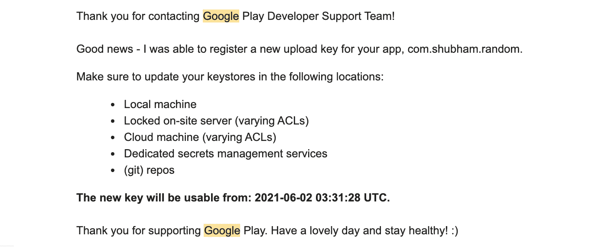
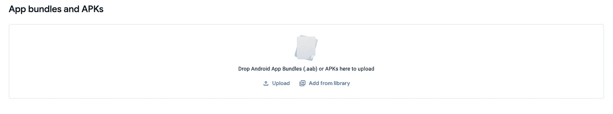

# 当您丢失了应用程序签名密钥时，如何更新您的 Android 应用程序？

> 原文：<https://medium.com/nerd-for-tech/how-to-update-your-android-app-when-you-have-lost-app-signing-key-372a79673894?source=collection_archive---------1----------------------->

通过 Figma 展示我的绘画天赋！！

# **为什么要 App 签约？**

当您将您的 APK 上传到 Google Play 控制台时，Google Play 会强制执行签名检查，因此即使有人能够访问您的 Play 控制台凭据，如果他们没有使用正确的签名密钥对 APK 进行签名，他们也无法发送任何恶意更新。

# **我们还有什么选择？**

如果您已经使用 Google Play 生成了您的应用程序签名密钥，您可以松一口气了。如果没有，你能做的就是改变包名，重新上传一个新的 app。

您可以访问以下网站，查看您是否选择了 Google Play 签名:

> 游戏控制台->发布->设置->应用完整性

您可以在顶部查看:

# **启用播放签名:**

既然您已经确定 Google 正在管理您的应用程序签名密钥，您可以执行以下步骤:

1.  创建新的密钥库文件。
2.  生成 PEM 证书。
3.  向 Google 发送请求以更新您的应用签名密钥。

我们将逐一探索以下步骤，希望能够更新我们的应用签名密钥—

## 创建新的密钥库文件:

创建新的 KeyStore.jks 文件的一个简单而外行的方法是去 Android Studio 并生成一个新的签名包或 apk。如果你很难回忆起来，让我给你演示一下步骤:

> 打开 Android Studio -> Build ->生成签名捆绑包/ APK

在那里你会看到:

单击“新建”并为新的 keystore.jks 文件选择一个路径

填写所有详细信息，然后单击确定。

现在转到您提到的作为密钥存储路径的位置，在那里您将看到新创建的 keystore.jks 文件。

## 生成 PEM 证书:

***隐私增强邮件****(****PEM****)*是一种事实上的文件格式，用于存储和发送密钥、证书和其他数据，基于 1993 年 IETF 定义“隐私增强邮件”的一组标准(src:维基百科)。

要生成 PEM 格式的证书，请下载[**KeyStore Explorer**](https://keystore-explorer.org/)。

单击“打开现有的密钥库”。在这里，选择刚刚创建的 keystore.jks 文件，输入创建 keystore 文件时使用的密码。在底部你会看到一个选项“PEM”。点击它，您将看到一个新的屏幕，您可以选择导出 PEM 证书。点击导出并保存文件。pem 分机。

## 向 Google 发送请求:

创建 PEM 证书成功后，可以去 [**玩控制台帮助**](https://support.google.com/googleplay/android-developer/contact/key) **。**

在那里，您可以填写表格，描述您的问题(您丢失了应用程序签名密钥并希望更新它),并附加您刚刚创建的 PEM 证书。

你会很快收到一封电子邮件，说明他们已经收到了你的请求。

几天内，如果事情进展顺利，你会收到一封邮件，说明他们已经为你的应用程序注册了新的上传密钥。

收到此邮件后，您可以使用新创建的密钥库文件对您的应用包/apk 进行签名，之后就可以在 Google Play 控制台上更新您的应用了。

> 进入游戏控制台->发布->制作

上传您更新的应用程序并创建新版本。

瞧，现在都完成了。你刚刚经历了 Android 开发者最大的噩梦。感谢谷歌救了你的命，别忘了上床好好睡一觉。

如果我没有说清楚，或者你在这个过程中遇到什么困难，请务必告诉我。

快乐发展！