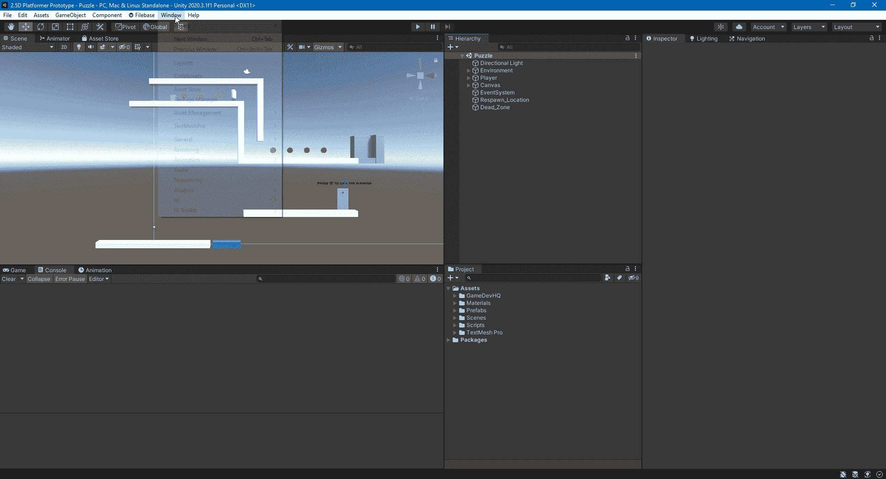
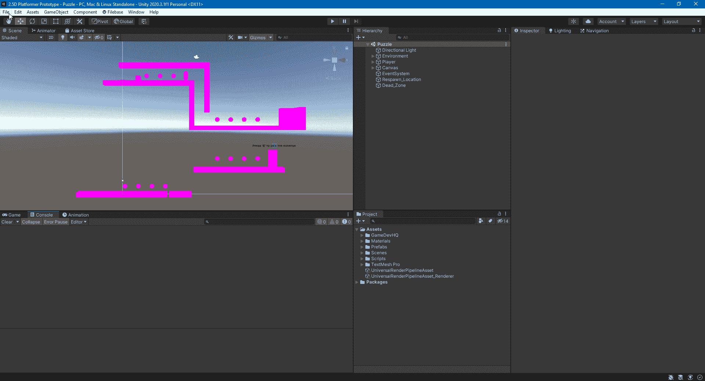
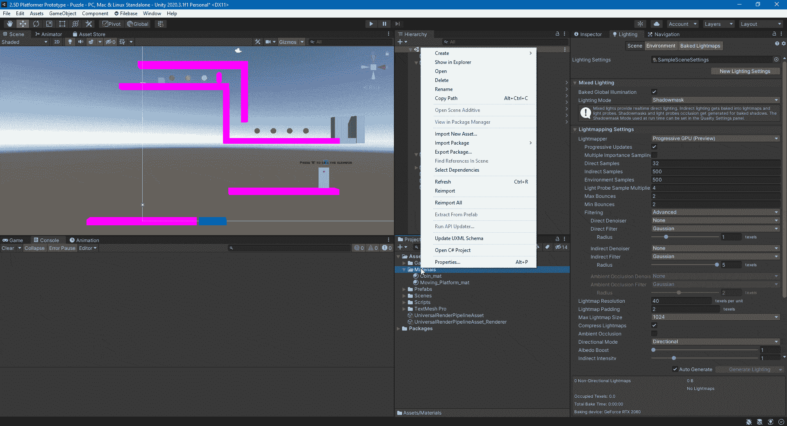
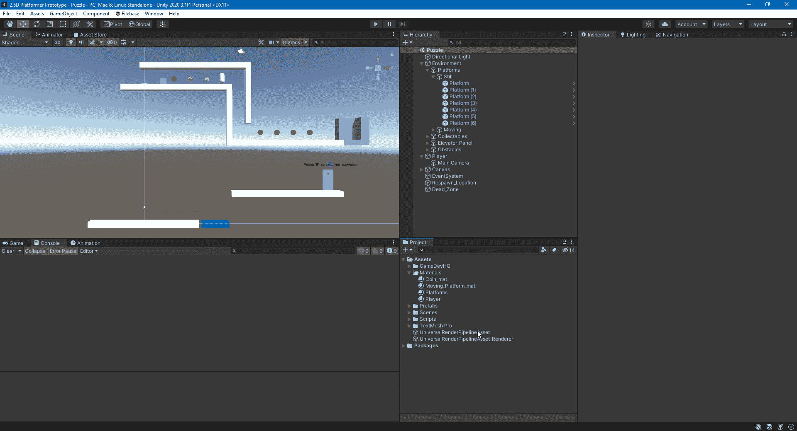

# 如何升级到 Unity 的通用渲染管道

> 原文：<https://medium.com/nerd-for-tech/how-to-upgrade-to-unitys-universal-render-pipeline-f1145b29040d?source=collection_archive---------4----------------------->

本文将展示如何将 Unity 中的现有项目升级到通用渲染管道(URP)。URP 可用于所有平台，其设计比默认的内置渲染管道更节省资源，同时仍能提供出色的图形。

在您想要升级到通用渲染管道的项目中，打开软件包管理器窗口，将软件包下拉列表更改为 Unity Registry，然后搜索通用 RP 并单击安装。

您会注意到场景中没有任何变化。我们需要创建一个通用渲染管道资产，并在图形选项卡下的项目设置中将它指定为可脚本化的渲染管道。这样做之后，场景中的所有东西都会变成粉红色。别担心。这是应该发生的。Unity 告诉你，新管道的材料还没有准备好。

你可以一个一个地检查每一个材料，然后把它们换成 URP。但是，如果您使用的是 Unity 附带的标准着色器，而不是自定义着色器，则可以使用方便的工具一次性更新它们。

应用于内置渲染管道中创建的 3D 对象的默认材质将不会更新，因为您无法编辑该材质。如果你的项目使用与 URP 不兼容的自定义着色器，你可以[在这里看到关于 URP](https://docs.unity3d.com/Packages/com.unity.render-pipelines.universal@11.0/manual/upgrading-your-shaders.html) 着色器的文档。

通用渲染管道资源是您可以访问渲染管道设置的地方。有关设置的更多信息，您可以在此处查看[文档](https://docs.unity3d.com/Packages/com.unity.render-pipelines.universal@11.0/manual/universalrp-asset.html)。

现在，您的项目已经完全升级到通用渲染管道。