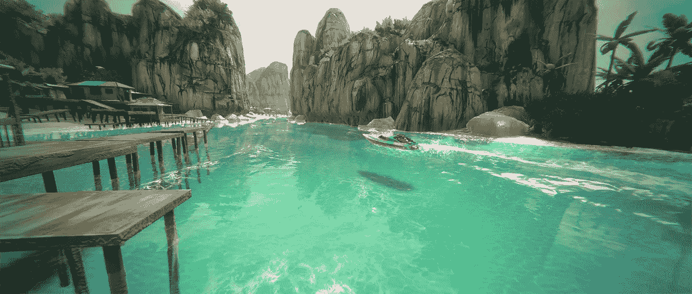

# 如何在 Unity 2021.2 中将您的项目升级到 URP

> 原文：<https://medium.com/nerd-for-tech/how-to-upgrade-your-project-to-urp-in-unity-2021-2-ef10404935a7?source=collection_archive---------1----------------------->

//走向未来

统一的图像属性

通用渲染管道是 Unity 3D 的三个渲染选项之一。当我们从 Unity Hub 创建一个新项目时，我们会看到内置的 URP 和 HDRP，并且可以选择使用这些管道直接开始我们的项目。但是，如果我们想升级目前使用内置渲染器的现有项目，我们该怎么办呢？