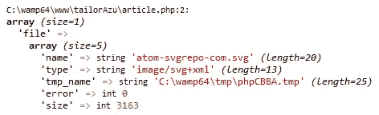
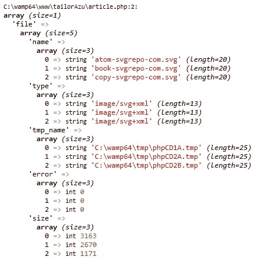

# 如何在 PHP 中上传和压缩单个或多个文件

> 原文：<https://medium.com/nerd-for-tech/how-to-upload-and-zip-single-or-multiple-files-in-php-4a6fcb8bbe02?source=collection_archive---------3----------------------->


亨利公司在 Unsplash 上拍摄的照片

在我今天的文章中，我将向你展示如何用 PHP 上传单个和多个文件，并将它们保存在一个 zip 文件中。

出于本教程的目的，我将使用 PHP 中的`ZipArchive()`类。

# 介绍

`ZipArchive()`类是 PHP 中的一个内置类，可以用来归档一个或一组文件，并用 zip 压缩它。

现在让我向您展示如何使用这个类来上传和压缩单个和多个文件。

# 关于课程

为了在你的项目中使用这个类，你必须使用`new`关键字初始化它

```
//initialize the zip archive class
$zip = new ZipArchive()
```

初始化之后，下面的方法就可以使用了

*   打开

此方法打开一个现有的 zip 存档进行读取、写入或修改，或者创建一个空的 zip 存档。

*   添加文件

此方法将文件从给定路径添加到 ZIP 存档。

*   关闭

此方法关闭打开或创建的归档，然后保存更改。

现在让我们继续，了解如何在 PHP 中上传和压缩单个和多个文件

# 上传单个文件

假设我有一个 HTML 表单，允许用户像这样上传单个文件；

```
<form method="post" action="" enctype="multipart/form-data">
    <input type="file" name="file">
    <button type="submit">Submit</button>
</form>
```

在 PHP 中，我将使用`POST`方法检查是否上传了一个文件，然后我将处理该文件，创建一个新的 zip 存档，并将该文件添加到 Zip 存档中。

现在让我们来谈谈当我们上传一个文件时会发生什么。

# 当我们上传文件时会发生什么

当我们上传一个文件时，它的属性对`$_FILES`全局变量是可用的。

`$_FILES`全局变量是一个通过 HTTP POST 方法上传到当前脚本的关联数组。

这意味着我们可以看到这样的属性:

*   文件的名称`[name]`。
*   文件的类型`[type]`。
*   文件`[tmp_name]`的临时位置。
*   错误代码`[error]`。
*   文件的大小(以字节计)`[size]`。

这是上传单个文件时来自`$_FILES`数组的典型输出示例。



因此我们可以看到索引`tmp_name`包含了上传文件的路径，这也是它在服务器中的临时位置。

现在，让我们创建一个脚本来处理传入的文件，并将其保存到归档文件中。

```
//check if the request method is POST
if($_SERVER['REQUEST_METHOD'] === 'POST'){
    //check if a file was uploaded
    if(isset($_FILES['file']) && !empty($_FILES['file']) && !is_array($_FILES['file'])){
        //initialize the ziparchive class
        $zip = new ZipArchive();
        //set the name of our zip archive
        $zip_file_name = 'MyFile.zip';
        //create the new zip archive using the $file_name above
        if($zip->open($zip_file_name, ZipArchive::CREATE) === true){
            //add the file to the archive
            $zip->addFile($_FILES['file']['tmp_name'], $_FILES['file']['name']);
            //close the archive
            $zip->close();
        }else{
            echo "Couldn't create Zip Archive";
        }
    }
}
```

如果您查看上面的代码片段，您会注意到我们在创建 zip 存档时遵循了一个非常简单的顺序。

首先，我们使用`open()`方法创建了一个名为`MyFile.zip`的新 zip 存档。

然后，我们使用`addFile()`方法添加了来自`$_FILES`数组的文件，最后，我们关闭了存档，这样它将使用`close()`方法保存我们的更改。

如果您应该在本地开发服务器上运行这段代码并上传一个文件，您将会在您的文件夹的根目录下看到 zip 存档文件`MyFile.zip`。打开这个档案，你会看到你刚刚上传的文件。

现在让我们谈谈如何上传和压缩多个文件

# 上传多个文件

上传多个文件并保存在一个 zip 文件中与上面的脚本没有太大区别。

让我们像这样修改负责上传多个文件的 HTML 表单；

```
<form method="post" action="" enctype="multipart/form-data">
    <input type="file" name="file[]" multiple>
    <button type="submit">Submit</button>
</form>
```

在我们进入细节之前，让我们看看当我们上传多个文件时`$_FILES`数组的输出。



此时，您可能对如何检索每个文件的文件路径和名称，以及如何将它们添加到归档文件中感到困惑。

嗯，您不必感到困惑，因为我们将遍历$_FILES 数组，然后根据索引匹配文件 tmp_names 和文件名。

```
//check if the request method is post
if($_SERVER['REQUEST_METHOD'] === 'POST'){
    //check if a file was uploaded
    if(isset($_FILES['file']) && !empty($_FILES['file']) && is_array($_FILES['file'])){
        //initialize the ziparchive class
        $zip = new ZipArchive();
        //set the name of our zip archive
        $zip_file_name = 'MyFile.zip';
        //create the new zip archive using the $file_name above
        if($zip->open($zip_file_name, ZipArchive::CREATE) === true){
            //loop through the tmp_name of the files in $_FILES array
            foreach($_FILES['file']['tmp_name'] as $key => $tmpName){
                //get the name of the file
                $file_name = $_FILES['file']['name'][$key];
                //add the file
                $zip->addFile($tmpName, $file_name);
            }
            //close the archive
            $zip->close();
        }else{
            echo "Couldn't create Zip Archive";
        }
    }
}
```

现在，如果您应该在本地开发服务器上运行这段代码并上传一些文件，您将会注意到归档文件已经用您刚刚上传的文件进行了更新。

您可以轻松地对逻辑进行分组，以处理单个和多个文件上传。

```
//check if request method is post
if ($_SERVER['REQUEST_METHOD'] === 'POST') {
    //check if a file was uploaded
    if (isset($_FILES['file']) && !empty($_FILES['file'])) {
        //single file upload
        if (!is_array($_FILES['file'])) {
            //initialize the ziparchive class
            $zip = new ZipArchive();
            //set the name of our zip archive
            $zip_file_name = 'MyFile.zip';
            //create the new zip archive using the $file_name above
            if ($zip->open($zip_file_name, ZipArchive::CREATE) === true) {
                //add the file to the archive
                $zip->addFile($_FILES['file']['tmp_name'], $_FILES['file']['name']);
                //close the archive
                $zip->close();
            } else {
                echo "Couldn't create Zip Archive";
            }
        }
        //multiple file uploads
        elseif (is_array($_FILES['file'])) {
            //initialize the ziparchive class
            $zip = new ZipArchive();
            //set the name of our zip archive
            $zip_file_name = 'MyFile.zip';
            //create the new zip archive using the $file_name above
            if ($zip->open($zip_file_name, ZipArchive::CREATE) === true) {
                //loop through the tmp_name of the files in $_FILES array
                foreach ($_FILES['file']['tmp_name'] as $key => $tmpName) {
                    //the name of the file
                    $file_name = $_FILES['file']['name'][$key];
                    //add the file
                    $zip->addFile($tmpName, $file_name);
                }
                //close the archive
                $zip->close();
            } else {
                echo "Couldn't create Zip Archive";
            }
        }
    }
}
```

如果在您的应用程序中，允许用户上传多个归档并压缩为 zip 的文件，您需要确保为 zip 归档生成一个唯一的名称。

您可以使用 PHP 的内置函数`uniqid()`、`rand()`为 zip 存档名称生成一个随机密钥。

```
//generate a random key for the zip archive name
$randKey  = uniqid().rand(0000,9999);
//zip file name
$zip_file_name = "$randKey.zip";
```

# 结论

我们已经讨论了 PHP 中的`ZipArchive`类，它的方法，以及我们如何使用它来创建一个文件存档并把它们压缩成 zip。

我们还讨论了上传文件时会发生什么，以及如何从`$_FILES`数组中提取上传文件的名称、大小和临时位置。

我还向您展示了在单个或多个文件上传的情况下,`$_FILES`数组的输出。

最后，我给了你一个提示，如果你正在压缩用户上传的文件，你如何为你的 zip 存档名生成一个随机密钥。

# 额外的

我开发了一个验证库，使用验证规则、复杂的正则表达式和 PHP 内置的验证来帮助验证 PHP 中的表单。

这个库是开源的，您可以使用这个库来验证来自`$_POST`、`$_GET`或`$_FILES`数组的数据。

请查看下面这个库的文档

[](https://octagon-simon.github.io/projects/octavalidate/php/index.html) [## octa validate-PHP:PHP 的服务器端验证库

### 欢迎来到这个伟大的库，它使用 PHP 内置的验证规则来帮助验证表单服务器端…

八角形-simon.github.io](https://octagon-simon.github.io/projects/octavalidate/php/index.html) 

感谢您的阅读。