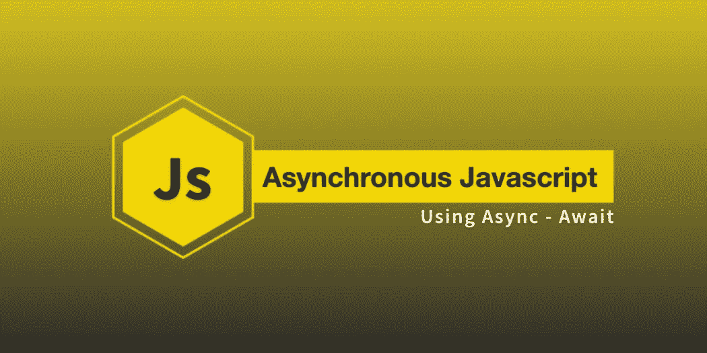
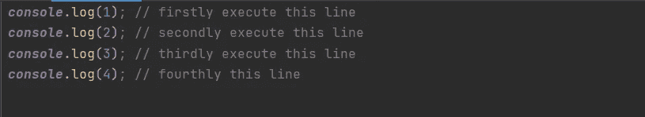
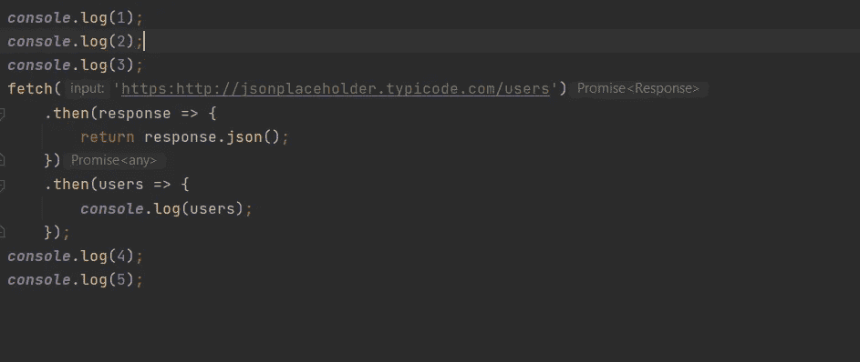
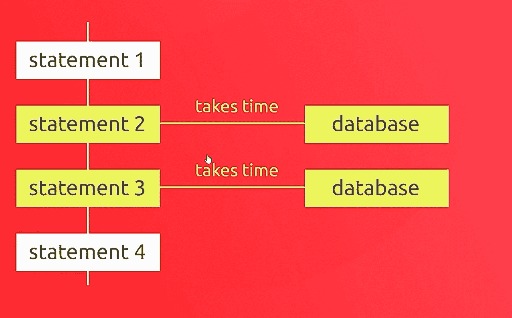
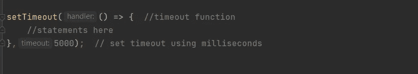
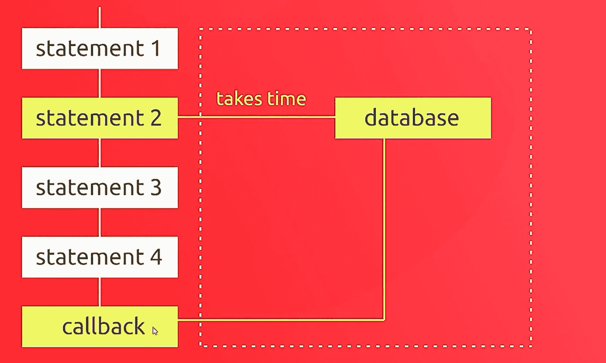
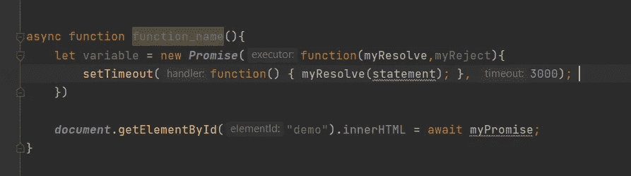
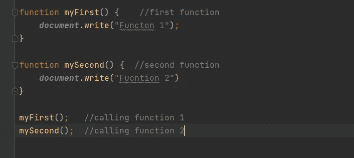
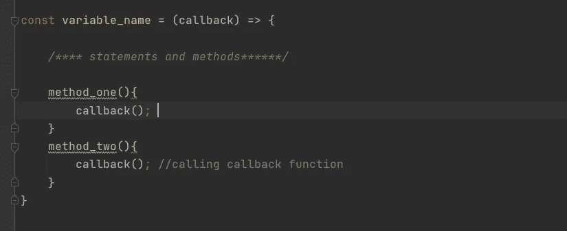
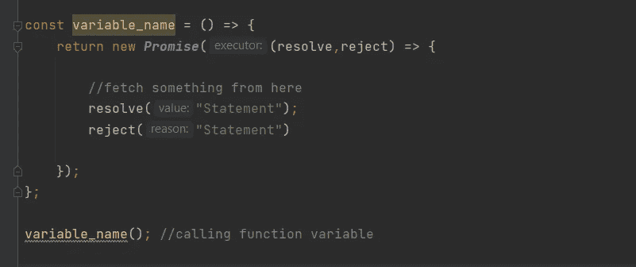

# 如何在 JavaScript 中使用异步函数

> 原文：<https://medium.com/nerd-for-tech/how-to-use-asynchronous-functions-in-javascript-b1b449a6b5be?source=collection_archive---------13----------------------->

大家好，我是迪露莎·费尔南多，这是我关于如何在 JavaScript 中使用异步函数的第二篇博文。我希望您能更好地理解我在这里所说的内容，并理解异步函数背后的概念。所以先简单介绍一下。

# **1。JavaScript 简介**👀

JavaScript 是一种高级且强大的语言，为开发人员提供了一系列功能，例如

1.  **动态打字**
2.  **基于原型的**
3.  **面向对象**
4.  **多参数**

# **2。JavaScript 是单线程的吗？🤔**

所以，除了这个**之外，JavaScript 是一个单线程执行语言**，它有一个调用栈和一个内存堆。简单地说，它在执行阶段充当一个进程队列😉。

显示了执行过程是如何逐行进行的

同样，它自己按顺序一行一行地执行。所以问题是，当重载的进程或函数出现在代码中间，并且花费太多时间来完成它的工作时会发生什么！🤔下面的例子展示了它是如何发生的！

在代码中间提取请求

你可以看到有一个**获取请求**，它在源代码的中间！所以相对而言，遍历网络并找到资源要花费很多时间。如果源代码有多个这样的函数，那么代码的其余部分应该会在执行期间面临延迟和阻塞。为了防止这种情况，我们必须使用线程同步方法作为 JavaScript 中的异步函数。这将导致等待或阻止其余代码的执行，直到 fetch 函数执行为止😑。这些是导致进程阻塞的一些进程。

*   **数据库连接请求**
*   **API 调用**
*   **HTTP 请求等。**

代码中间的数据库连接请求

为了防止这些中断，JavaScript 的开发者引入了异步函数理论。在这里，我演示了它是如何工作的，以及工作流程是如何进行的。😎

# **3。异步ˌ非同步(asynchronous)..前往救援**🤠

以下是我在几种情况下经历和使用的一些功能性方法来防止这些干扰。

1.  **超时功能方法**
2.  **异步/等待方法**
3.  **回调函数方法**
4.  **承诺功能**

*让我们一个一个来了解它的工作原理吧！…..*

# **3.1 超时功能方法**⏰

在这个方法中，我们可以给函数设置一个超时，给时间来结束进程，并通过使用回调函数调用它，并在最后执行。

超时方法的基本语法

在这里，我们必须以毫秒为单位给出超时时间，如下所示。所以 1 秒等于 1000 毫秒(1s = 1000ms 毫秒)

通过使用这种方法，我们可以将复杂的过程函数包含到这个程序块中，并执行程序的其余部分，而不会像🥳那样遇到任何麻烦

获取请求函数在超时函数内

我们可以看到，fetch 请求函数位于超时函数块内部，它执行得很好，没有妨碍其余代码的处理。

超时回调如何工作的概念性视图

# 3.2 异步/等待函数方法😏

Async / await 函数是在源代码中使用“Async”关键字和“await”关键字声明的函数。这些功能还支持异步的、基于承诺的行为，从而使书写风格更加整洁。

所以这个函数可以声明如下:

1.  ***无超时方法:***

无超时的异步 await 函数

> 注意:上面的基本语法显示了如何将函数名和变量作为关键字。

在这个函数中，我们不会使用超时期限。这种类型的函数可以用在不需要关注时间和进程持续时间的程序中。在下一个方法中，我将向您展示如何在代码中使用超时函数，该函数可用于时间集中的流程。

**2。*超时功能方法:***

带有超时的异步 await 函数

> 注意:在超时值中，我们应该给上面例子中的语法以毫秒为单位

因此，这里我们可以使用一个超时周期，给程序中的时间部分一些时间来处理。我们还必须给出 myResolve 和 myReject 作为回调方法。它们的定义如下…🙃

1.  **myResolve -:如果作业/进程成功完成，并有一个结果值。**
2.  **myReject -:如果发生错误，该错误被称为错误对象。**

# 3.3 回调函数方法🧑‍🎤

这个函数的主要和最简单的思想是

> ***“我稍后再打！”*** *🤭*

**那么这是什么意思？？**
*在最简单的意义上，回调是作为参数传递给另一个独立函数的函数！这种技术允许几个函数调用另一个常用函数。它可以在另一个函数完成其进程后运行。

1.  **基本函数调用方法**

基本常用语法

这是我们在没有任何同步或超时方法的情况下使用的基本标准语法。因此，我们可以将它们与同步和超时方法一起使用，如下所述。

2 **。使用回调函数的基本语法**

回调函数基本语法

我们必须将回调函数声明为一个变量，并像上面一样在几个地方调用它。在这种情况下，我们可以通过在通常的时间回调它来使用它。

# 3.4 承诺功能🤝

Promises 函数基于函数内部的 **resolve 方法**和 **reject 方法**。这个函数主要用于 **API 获取请求**和它的操作或者从服务器在线获取东西🙂。

使用承诺功能

> 同样，我们可以在必要的地方将 promises 函数应用到程序中，比如 fetch **API 请求**等。

所以这些方法是可以在 Async JS 中使用的主要功能，如上所述。这篇关于 Async JS 的博文到此结束。当你阅读这个博客时，如果你发现任何错误或任何更好的想法！请在下面留下评论。我会尽快回复你，以后会有新的博客😎。谢谢你，❤