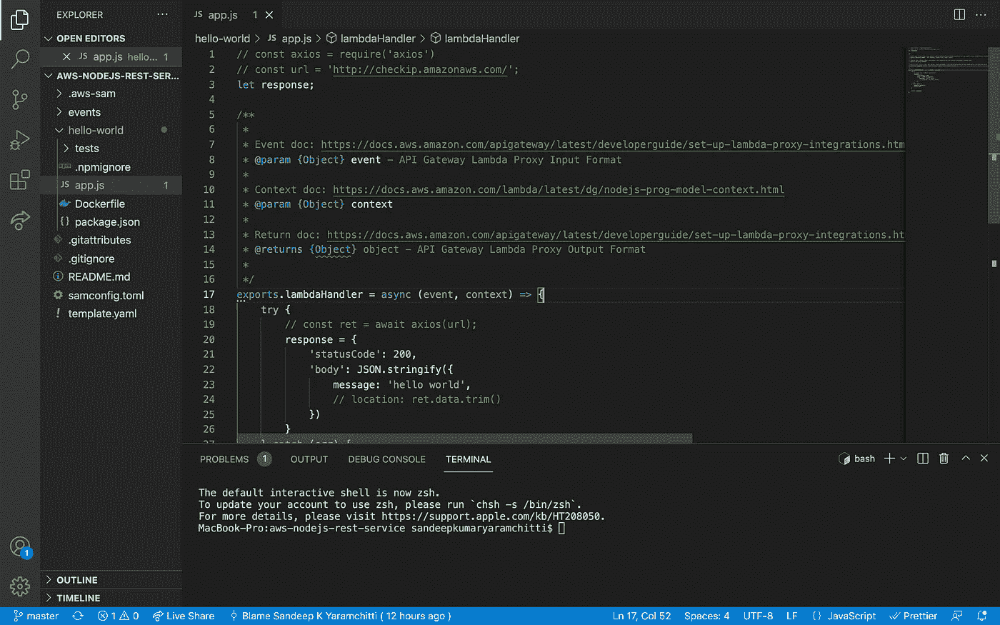
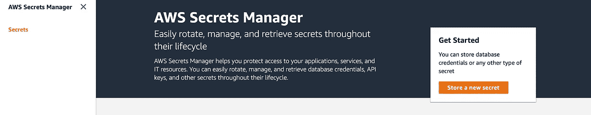
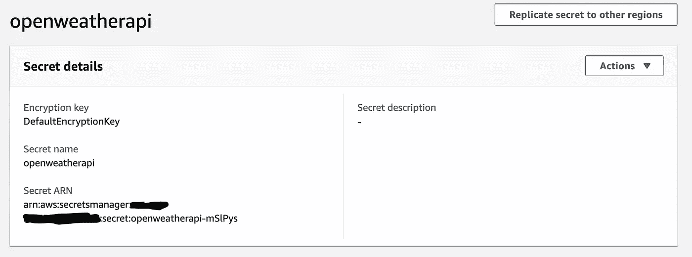

# 如何将 AWS secret manager 和 SES 与 AWS SAM 一起使用

> 原文：<https://medium.com/nerd-for-tech/how-to-use-aws-secret-manager-and-ses-with-aws-sam-a93bb359d45a?source=collection_archive---------3----------------------->


用 Lambda Node.js 构建一个代理 rest 服务，并集成简单的电子邮件服务、Secret Manager 服务等等。

AWS 无服务器应用程序模型(AWS SAM)是一个开源框架，用于使用基础设施代码(IaC)构建无服务器应用程序。它提供开发者声明[**AWS CloudFormation**](https://aws.amazon.com/cloudformation/)资源或 [**SAM 特定资源，属性引用**](https://docs.aws.amazon.com/serverless-application-model/latest/developerguide/sam-specification-resources-and-properties.html) 和 SAM 将 SAM 语法转换和扩展为 AWS cloud formation 语法，使您能够更快地构建无服务器应用。

在这篇文章中，我们将使用 AWS SAM 构建一个 rest 服务，该服务调用天气 API 以通过邮政编码、国家代码获取当前天气数据，我们将在 secret manager 中存储 API 令牌，并在调用 rest API 后通过电子邮件发送当前天气数据。

# 问题陈述:

我们将使用 AWS SAM 创建一个无服务器代理 Rest API 端点，通过邮政编码和国家代码获取当前天气数据，详细信息如下:

*   方法:获取
*   查询参数:邮政编码和国家
*   SAM 策略模板，用于将 Lambda 功能的权限范围扩大到 Secret Manager 和简单电子邮件服务资源。

下面是完整的 GITHUB 项目:[https://GITHUB . com/SandeepKumarYaramchitti/AWS-nodejs-rest-service](https://github.com/SandeepKumarYaramchitti/aws-nodejs-rest-service)

**步骤 1:** 创建一个 SAM 项目

用一些样板代码创建 SAM 项目，或者克隆我的 git repo。选择 Nodejs14 作为运行时，并访问站点 [**此处**](https://docs.aws.amazon.com/serverless-application-model/latest/developerguide/serverless-sam-cli-install.html) 了解安装 AWS SAM cli 的详细步骤

**步骤 2** :让我们开始编码

一旦你生成了这个项目，它将会有一些模板代码，你可以从这里开始你的开发。下面是生成的代码片段。



由于我们将使用开放的天气 api 来收集当前天气数据的细节，让我们前往[https://openweathermap.org/current#zip](https://openweathermap.org/current#zip)。按照网站上的说明创建一个 API 密钥，我们将特别使用下面的 API 端点

```
api.openweathermap.org/data/2.5/weather?zip={zip code},{country code}&appid=[{API key}](https://home.openweathermap.org/api_keys)
```

让我们开始修改 hello-world 文件夹下的 app.js。我们将使用 axios 在 lambda 处理程序中进行 API 调用。

```
cd hello-world
npm install axios
```

下面是使用 axios 进行 API 调用的基本代码

我们将 API_KEY 存储在 AWS Secret Manager 中，我们将选择 AWS SAM 模板来确定 lambda 函数的权限范围，使其具有对 Secret Manager 的读取权限。

您可以使用 AWS 控制台在 secret manager 中存储 API_KEY。此外，还有其他方法可以做到这一点。为了更容易理解，让我们将 API 密钥存储在 Secret Manager 中。



一旦你存储了新的秘密，你应该会看到一个类似的屏幕



> 现在让我们用允许 lambda 函数在 Secret Manager 中访问该资源的策略来更新模板 yml。为此，我们将把 AWSSecretsManagerGetSecretValuePolicy*应用到 lambda 函数*

下面是更新后的 template.yml 代码片段

应用上述 SAM 策略将允许 lambda 函数读取给定 SecretArn 的秘密管理器存储。

现在让我们使用 aws-sdk 获取代码中的 API_KEY 值，为此，您需要安装 aws-sdk

```
npm install aws-sdk
```

确保在 hello-world 文件夹中执行上述步骤。下面是 app.js 修改后的代码，我们导入了 aws-sdk，用 SecretManager()创建了一个实例。

在 lambdahandle 中，我们将通过提供 SecretId 来获取秘密值，并且我们将使用 API_KEY 来调用开放天气 API

此时，您可以运行以下命令来使用 SAM 进行构建和部署

```
sam build
sam deploy --guided --profile dev
```

> 注意:我已经将我的 aws 配置文件配置为 dev，并按照 aws cli 文档设置您的 aws cli 配置文件[T3](https://docs.aws.amazon.com/cli/latest/userguide/cli-configure-profiles.html)

现在，您应该看到您的端点 URL(理想情况下，您会希望将路由更改为类似/weatherdata 的内容)

[https://xxxxx . execute-API . xxxx . Amazon AWS . com/Prod/weather data/](https://texcxw8me4.execute-api.us-east-2.amazonaws.com/Prod/weatherdata/)

现在让我们尝试传递 api 查询参数，为此，我们需要用 Lambda 函数的 **RequestParameters** 更新 template.yml

现在让我们更新 Lambda 处理程序来读取 API 查询参数。这里我们用 event 属性获取查询参数，query parameters 可以用 **event.queryParameters** 读取

```
sam build
sam deploy --guided --profile dev
```

> 注意:我已经将我的 aws 配置文件配置为 dev，并按照 aws cli 文档设置您的 aws cli 配置文件 [**此处**](https://docs.aws.amazon.com/cli/latest/userguide/cli-configure-profiles.html)

新的 API 端点如下:-

```
https://xxxx.execute-api.xxxx.amazonaws.com/Prod/weatherdata?zipcode=94040&country=us
```

现在，让我们移动到这个博客的最后一部分，即以电子邮件的形式发送天气数据。为此，我们需要为 AWS SAM 使用 **SESCrudPolicy** 更新策略，然后更新代码以包含电子邮件功能。

现在让我们更新发送电子邮件的 App.js。在这个例子中，我只从 api 发送响应。您也可以格式化模板来发送电子邮件。

```
sam build
sam deploy --guided --profile dev
```

> 注意:我已经将我的 aws 配置文件配置为 dev，并按照 aws cli 文档来设置您的 aws cli 配置文件 [**这里是**](https://docs.aws.amazon.com/cli/latest/userguide/cli-configure-profiles.html)

希望这篇博文能帮助你获得一些使用 AWS SAM 和一些 AWS 服务的实践经验。