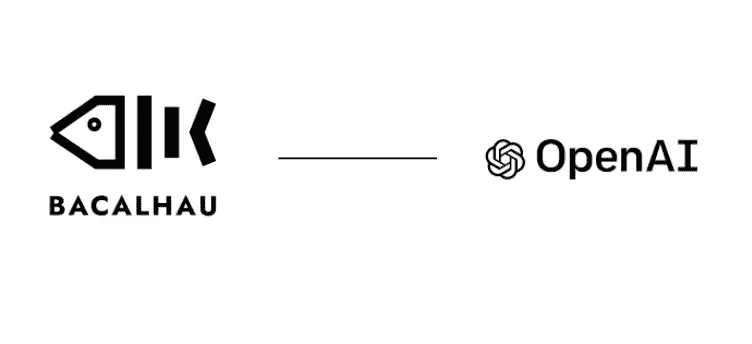
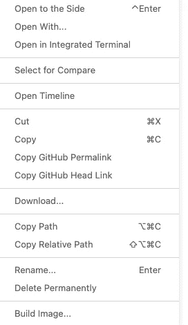
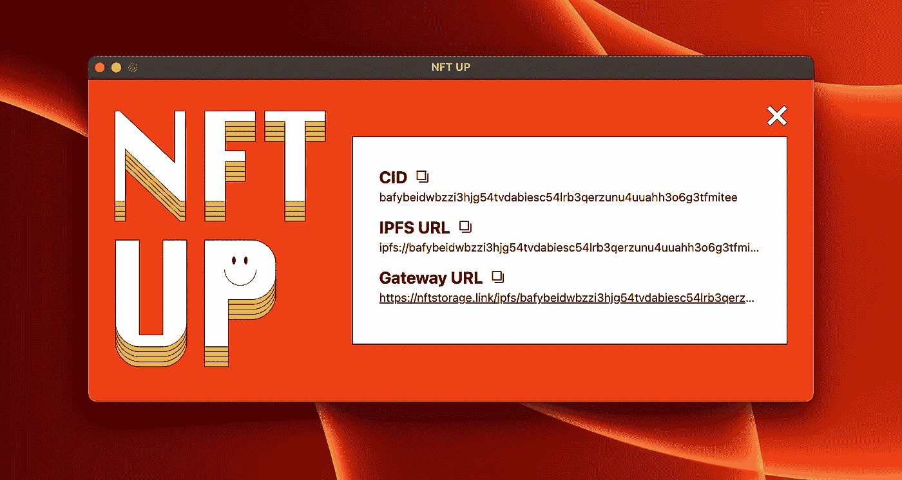
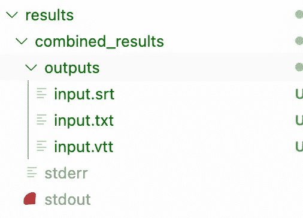
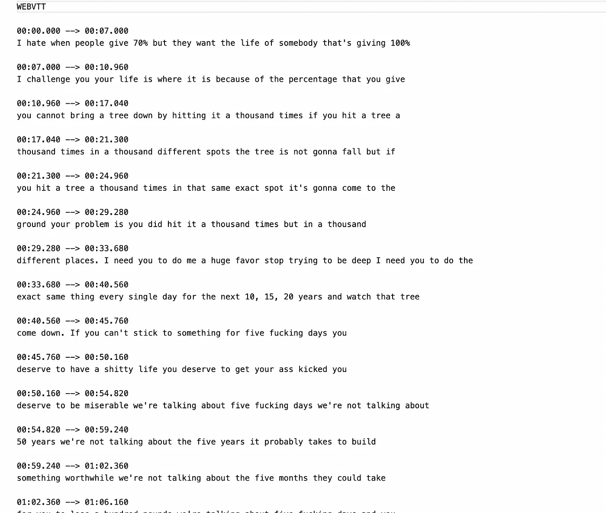

# 如何使用 Bacalhau 和 OpenAI Whisper 转录您的视频和音频文件

> 原文：<https://medium.com/nerd-for-tech/how-to-use-bacalhau-and-openai-whisper-to-transcribe-a-youtube-video-7b6ee0135ce2?source=collection_archive---------0----------------------->



Bacalhau 和 OpenAI

说明文字、字幕和文字记录都是帮助您的音频和视频内容到达更广泛的受众并鼓励与其读者和听众进行更多互动的方式。

在过去的一周里，我尝试了一种新的视频和音频转录方法。我用 OpenAI Whisper 和 Bacalhau 转录我下载的 YouTube 视频，并从中提取不同格式的文本(`.srt`、`.vtt`、`.txt`)。

> 我迫不及待地想尝试一下，它的效果和实现的简单程度让我大吃一惊。这一过程并不仅限于 YouTube 视频，你可以在你选择的任何视频或音频上进行尝试。

如果这是你想尝试的东西，这是一个关于如何开始的教程。

这个项目的路线图如下:

*   [安装依赖项](#81b1)
*   [创建 Whisper Python 脚本](#badf)
*   [创建一个 docker 文件来封装你的 Whisper 脚本](#fece)
*   [在 Bacalhau 上运行耳语](#bbdc)

但在你开始之前，让我们深入了解一下为什么我决定使用 Bacalhau 并打开 AI Whisper 以及它到底是怎么回事

# Bacalhau 和 OpenAI Whisper 是什么？

[Whisper](https://openai.com/blog/whisper/) 是 OpenAI 开发的开源通用语音识别模型。这是一个在大型数据集上训练的多任务模型，用于执行语言识别、声音活动检测、转录和翻译。除了英语，Whisper 还接受了超过 96 种语言的培训，拥有 680，000 小时的音频。

[Bacalhau](https://www.bacalhau.org/)(Compute Over Data，简称 CoD)是一个开放计算资源网络，可用于服务任何数据处理工作负载。它通过使用户能够针对存储在 IPFS ( [星际文件系统](https://docs.ipfs.tech/concepts/what-is-ipfs/))中的数据运行任意 Docker 容器和(WebAssembly) wasm 图像来处理和转换大规模数据集。Bacalhau 是一个点对点的节点网络，其中每个节点都参与执行和计算提交给集群的作业。

## 使用 Bacalhau 优于托管自动语音识别服务的优势

*   您可以管理自己的容器，这些容器可以批量处理数 Pb(*千兆字节)*的音频和视频文件。
*   使用它的分片特性，您可以非常容易地执行分布式推理。通常，分布式推理是在具有数百万条记录的大规模数据集上进行的。
*   如果你把数据存储在 [IPFS](https://docs.ipfs.tech/concepts/what-is-ipfs/) 上，你不需要移动数据，你可以计算出数据在哪里。
*   计算成本比托管服务便宜得多。

# 安装依赖项

要开始，您需要安装下面的所有依赖项。假设您已经安装了 [Python](https://www.python.org/downloads/) 和 [pip](https://pip.pypa.io/en/stable/installation/) 。

1.  安装 FFmpeg 一个音频处理库。

```
#Linux
sudo apt update && sudo apt install ffmpeg
```

```
#MacOS
brew install ffmpeg
```

```
#Windows 
chco install ffmpeg
```

**注意**:MAC OS 安装命令需要[自制](https://brew.sh/)，Windows 安装命令需要[巧克力](https://chocolatey.org/install)。

2.*安装 Pytorch，*一个开源的机器学习(ML)框架

```
pip install torch
```

3.*安装 Whisper，*一个开源的语音识别模型

```
pip install git+https://github.com/openai/whisper.git -q
```

4.*安装 Bacalhau，*计算数据处理工作量

```
curl -sL https://get.bacalhau.org/install.sh | bash
```

# 创建 Whisper Python 脚本

对于 Whisper 脚本，您需要创建一个名为`**openai-whisper.py.**` 的文件。下面是 Bacalhau 团队编写的 Whisper 示例脚本代码。将下面的代码复制并粘贴到您的`**openai-whisper.py**`文件中。

上面的脚本接受并设置所需的参数，如输入文件路径、输出文件路径、温度等。接下来，脚本被配置为在 GPU 上执行，并将`.mp4`文件转换为`.wav`文件。使用耳语模型“大”。你可以找到更多关于不同 [Whisper 型号](https://github.com/openai/whisper/blob/main/model-card.md)的信息。接下来，脚本被设置为在我们加载模型后以各种格式保存输出副本。

## 测试耳语脚本

为了测试脚本以确保一切按预期工作。您需要在终端中运行以下命令

下载测试音频剪辑

```
wget https://github.com/js-ts/hello/raw/main/hello.mp3
```

运行您的耳语脚本

```
python openai-whisper.py
```

若要查看测试样本音频的输出

```
#View the text document file format
cat hello.txt
```

```
#view the subtitle file format
cat hello.srt
```

```
#view the WebVTT format
cat hello.vtt
```

# 创建一个 docker 文件来封装你的耳语脚本

在这个阶段，您需要创建一个`Dockerfile`来封装您的 Python Whisper 脚本。Docker 文件是一个文本文件，包含 Docker 用来创建容器映像的指令。你可以查看文档来了解更多关于 [Docker](https://docs.docker.com/get-started/overview/) 的信息。

将剧本容器化

1.  创建一个名为`Dockerfile`的空文件

```
touch Dockerfile
```

2.在`Dockerfile`中，添加下面几行代码。这些命令指定如何构建映像，以及将包括哪些额外的要求。

3.右键单击`Dockerfile`,然后单击构建映像



## 那么 Dockerfile 文件中到底发生了什么？

1.  `pytorch/pytorch:1.12.1-cuda11.3-cudnn8-runtime`图像被用作基础图像。
2.  要安装的依赖项被添加到容器中
3.  测试音频文件和我们的 `**openai-whisper**`脚本也被添加到容器中
4.  最后，运行 docker 来检查容器是否构建成功。

# Bacalhau 上的跑步耳语

这是你转录视频的地方。如前所述，我将使用这个 [Youtube 视频](https://www.youtube.com/watch?v=AQm--fqu51c)(这是一个 8 分钟长的视频)作为例子来展示这是如何工作的。我在`.mp4`下载了视频。

*你可以使用自己选择的任何视频，不一定非得是 YouTube 视频*

## 获取 CID 号码

下载完你的视频后，下一步就是把它上传到 IPFS 以获得内容识别码。您可以按照以下步骤使用 [NFTUp](https://nft.storage/docs/how-to/nftup/) 上传视频:

*   在[n tup](https://nft.storage/docs/how-to/nftup/)上创建账户
*   在您的帐户页面获取您的密钥。
*   拖放您下载的视频以便上传
*   复制您的 CID 号码



在本例中，CID 编号为:

```
bafybeidwbzzi3hjg54tvdabiesc54lrb3qerzunu4uuahh3o6g3tfmitee
```

## 在 Bacalhau 上运行容器

要在 Bacalhau 上运行容器，请将以下命令复制并粘贴到您的终端中

```
bacalhau docker run \
> jsacex/whisper \
> --gpu 1 \
> -v bafybeidwbzzi3hjg54tvdabiesc54lrb3qerzunu4uuahh3o6g3tfmitee:/ytvideo.mp4 \
> -- python openai-whisper.py -p ytvideo.mp4 -o outputs
```

从上面的命令中:

*   — gpu 标志表示我们将要使用的 gpu 的数量
*   v 标志将我们的文件挂载到一个特定的位置
*   -p 提供了我们文件的输入路径
*   -o 提供文件的输出路径

当您运行该命令时，Bacalhau 打印出相关的作业 id: `f07d5a18–3c5c-4df7–8269–1695ca61ae86`

此时，您可以自由选择并运行一系列 Bacalhau 命令，以了解关于提交的作业的更多信息。

要了解作业的状态，请运行以下命令

```
bacalhau list --id-filter f07d5a18-3c5c-4df7-8269-1695ca61ae86
```

当它显示`Completed`时，这意味着工作已经完成，你可以得到结果了。

要了解有关作业的更多信息，请运行以下命令:

```
bacalhau describe f07d5a18-3c5c-4df7-8269-1695ca61ae86
```

一旦你的工作完成，你会得到这样的东西。

```
Job successfully submitted. Job ID: f07d5a18-3c5c-4df7-8269-1695ca61ae86
Checking job status... (Enter Ctrl+C to exit at any time, your job will continue running):
```

```
Creating job for submission ... done ✅
               Finding node(s) for the job ... done ✅
                     Node accepted the job ... done ✅
           Job finished, verifying results ... done ✅
              Results accepted, publishing ... Results CID: QmWPpwPiBtkJtk5tg7FZnEHzWMEZhFUdbz5vWd1dHsTJ6Q
Job Results By Node:
Node QmUDAXvv:
  Shard 0:
    Status: Completed
    Container Exit Code: 0
    Stdout (truncated: last 2000 characters):
      ]  one day this will go back it's not in that comfort zone it's in the discomfort zone
[06:37.840 --> 06:41.520]  is where my confidence is getting good that's what's getting good the people
[06:41.520 --> 06:46.160]  they want an easier answer there has to be an easier way it's not I'm sorry I
[06:46.160 --> 06:54.000]  searched for my entire life we're built for struggle us human beings you know
```

**注意** : *为了简洁起见，我去掉了结果*的一些部分

作业的输出在处理完成后保存在 IPFS 上。要在本地下载结果，请创建一个输出目录来保存结果

```
mkdir results
```

使用下面的 Bacalhau 命令将结果下载到输出目录中

```
bacalhau get f07d5a18-3c5c-4df7-8269-1695ca61ae86  --output-dir results
```

在下载完成结果目录中的内容后

# 查看输出

在结果文件夹中，有三个子文件夹包含输出格式


你可以在任何一个地方查看你的结果。`srt`、`.txt`或`.vtt`



下面是来自`input.vtt` 文件的截图



就是这样！非常准确和干净的结果。你可以用这个做更多的事情。您可以转录您的电影镜头，播客，讲座录音等。

# Bacalhau 的有趣应用

最有可能的是，这篇文章激起了你对 Bacalhau 的兴趣，如果是这样，我应该告诉你，我只是触及了它的许多应用的表面。除了使用 whisper 进行语音识别之外，它还有许多有趣的应用。它可以用于图像处理、数据转换、使用 styleGAN3 生成逼真的图像等等。

如果你想了解更多关于 Bacalhau 的知识，你可以查阅[官方文档](https://docs.bacalhau.org/getting-started/installation/)。你也可以在 [GitHub](https://github.com/filecoin-project/bacalhau) 和 [slack channel](https://filecoinproject.slack.com/ssb/redirect) 上查看这个惊人的项目

**参考文献**

*   [https://github.com/bacalhau-project/examples](https://github.com/bacalhau-project/examples)
*   【https://docs.bacalhau.org/getting-started/installation/】
*   [https://www.bacalhau.org/](https://www.bacalhau.org/)