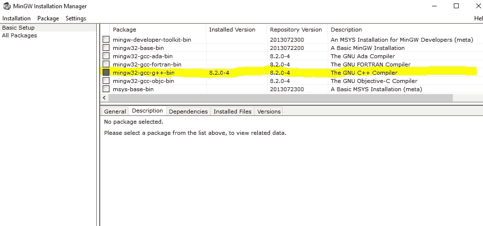
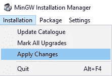
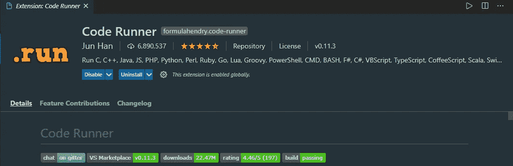
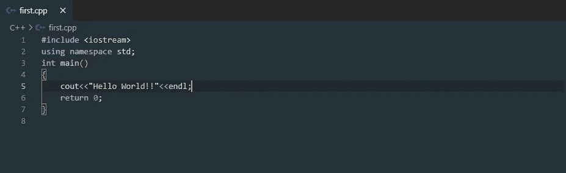
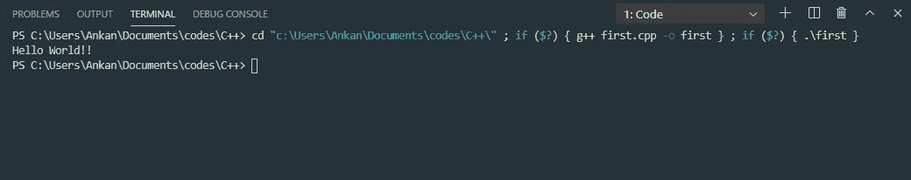

# 如何在 Visual Studio 代码中运行 C++代码

> 原文：<https://medium.com/nerd-for-tech/how-to-use-c-code-in-visual-studio-code-c644ed70f6ab?source=collection_archive---------0----------------------->

Vs 代码和 C++代码

我写这篇文章是因为我在 VS 代码中运行 C++代码时遇到了几个问题。像往常一样，每个人都在使用[代码块 IDE](http://www.codeblocks.org/) 和 [D](https://visualstudio.microsoft.com/) evC++以及更多。但是我已经习惯了 Visual Studio 代码来编写我所有的程序。在本文中，我将向您展示如何在 VsCode 中设置编译器。在本文中，我将使用 Windows 操作系统。

## **那么我们开始吧..**

# 先决条件:

1.  有编程知识。
2.  Visual Studio 代码编辑器(从[这里](https://code.visualstudio.com/#alt-downloads)下载)
3.  网络连接良好！！

# 下载并安装一个 C++编译器:

前往[www.mingw.org](http://www.mingw.org)点击“下载/安装程序”链接下载 MinGW 安装文件，或者点击[此处](https://osdn.net/projects/mingw/downloads/68260/mingw-get-setup.exe/)Windows，点击[此处](http://www.mingw.org/wiki/LinuxCrossMinGW)Linux，点击[此处](https://brewinstall.org/Install-mingw-w64-on-Mac-with-Brew/)Mac。

下载后，安装 MinGW，等待“ **MinGW 安装管理器**”出现。

当“ **MinGW 安装经理**出现时，点击`**mingw32-gcc-g++**`，然后选择“**安装标记**”。

在左上角的菜单中，点击**安装** > **应用修改**

等待并允许完全安装。在此过程中，请确保您有稳定的互联网连接。

# 编辑 PATH 环境变量以包含 C++编译器所在的目录:

安装 MinGW 后，可以在`C:\MinGW\bin`中找到。现在，您必须在环境变量 PATH 中包含这个目录。如果你使用电脑已经有一段时间了，你应该已经知道如何做到这一点，但如果你没有，这里有一些资源:

*   点击[此处](https://www.computerhope.com/issues/ch000549.htm)获取 Windows 操作系统指南
*   点击[此处](https://www.cyberciti.biz/faq/unix-linux-adding-path/)为 Linux
*   点击[此处](https://hathaway.cc/2008/06/how-to-edit-your-path-environment-variables-on-mac/)获取 Mac OS 指南

# 在 VS 代码中安装代码运行器扩展:

现在我们完成了编译器的设置，让我们安装代码运行器

Code Runner 允许你运行多种语言的代码片段或代码文件:C，C++，Java，JavaScript，PHP，Python，Perl，Perl 6，Ruby，Go，Lua，Groovy，PowerShell，BAT/CMD，BASH/SH，F# Script，F#(。NET 核心)、C#脚本、C#(。NET Core)、VBScript、TypeScript、CoffeeScript、Scala、Swift、Julia、Crystal、OCaml Script、R、AppleScript 等。

在 VsCode marketplace 选项卡中搜索:

就是这个！！！！我们快到了！！

安装后，重新启动 VsCode。在 VsCode 中打开 C++文件。

下面是一个基本的 hello world 程序:

**将该文件另存为第一个** `**.cpp**`

# 使用代码运行器运行您的代码:

1.使用快捷键`Ctrl+Alt+N`

2.按 F1，然后选择/键入运行代码

3.右击文本编辑器，然后在编辑器上下文菜单中单击运行代码。

代码将运行，输出将显示在输出窗口中。使用“Ctrl+快捷键”打开输出窗口。

答对了。！！我们做到了。

# 不要跳过这一步:

默认情况下，VsCode 的输出端子是只读的。意思是默认情况下不能用终端取输入。要解决这个问题，您需要手动启用读写。步骤如下:

*   在 VsCode 中，转到**文件>首选项>设置。**
*   在左侧面板的用户选项卡中，找到**扩展部分**
*   滚动并找到'**运行代码配置**
*   滚动并找到一个复选框`Run in Terminal`(是否在综合终端运行代码)勾选该复选框。

运筹学

*   在您的`setting.json`文件中，添加:

好了，你已经完成了，可以开始了！！！**快乐编码**！！

## 感谢您的阅读&如果您觉得这篇文章有用，那么请与您的编程社区分享这篇文章，互相帮助！！