# 如何在 Windows 10 VirtualBox 中使用相机

> 原文：<https://medium.com/nerd-for-tech/how-to-use-camera-in-windows-10-virtualbox-aa92ffbe1f24?source=collection_archive---------0----------------------->

米拉德·法库里安在 [Unsplash](https://unsplash.com/s/photos/box?utm_source=unsplash&utm_medium=referral&utm_content=creditCopyText) 上拍摄的照片

VirtualBox 是一项新技术，它让我们可以在计算机内部创建一个虚拟机。这项技术帮助我们尝试新事物；就像名字一样，它是虚拟的，所以我们在机器上做的每个实验都不会影响主系统。所以你可以在一台电脑上安装多个操作系统。除了勒索软件的传播，如果你使用桥接网络，它可能会破坏整个网络。

但我们不要深入讨论这个问题，因为在这篇文章中，我想写如何将主机摄像头集成到 VirtualBox 中，尤其是在 Windows 10 VM 中。

# 问题是

好吧，每当你从一个虚拟机访问相机，你可能会得到这个错误。

是的，相机还没装好。你知道解决这个问题并不难，但并不容易吗？所以让我们来看看解决方案。

# 解决方案

这是我已经做过的解决方案。

1.  转到 VirtualBox 网站并下载 VirtualBox 扩展包。

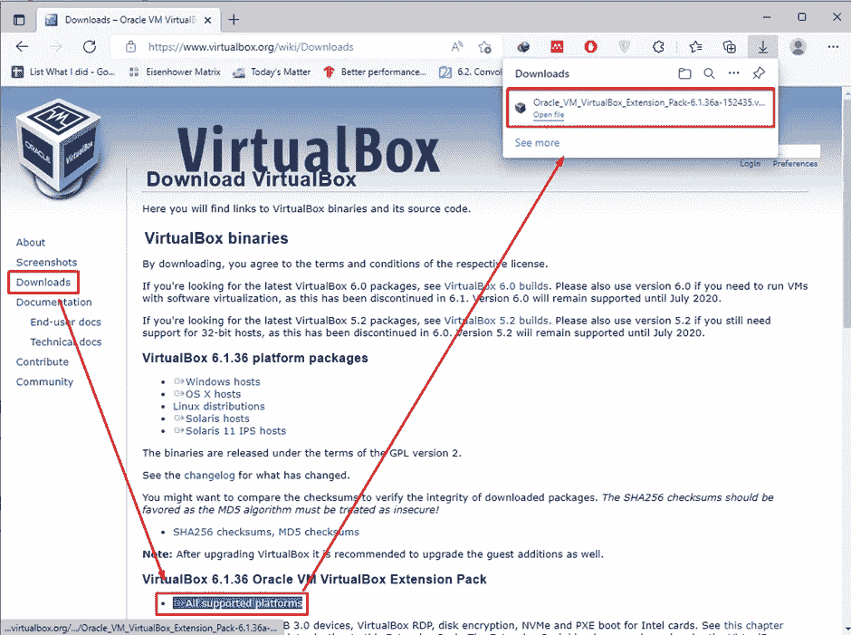

2.运行程序。它会自动打开 VirtualBox 单击安装

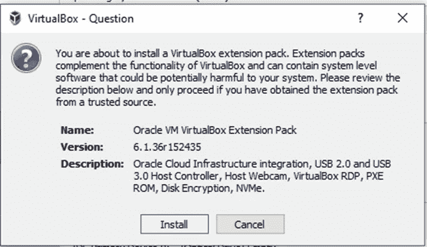

3.阅读许可协议并选择“我同意”

4.大多数情况下，您会得到这样的错误；我获得了管理员组错误的成员资格。你知道怎么解决吗？

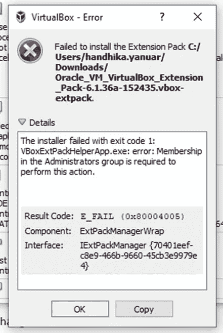

如果你知道，恭喜你，你知道一个解决问题的人😊。如果没有，也没关系；下面我们来解一下。

5.使用管理员权限运行 VirtualBox。

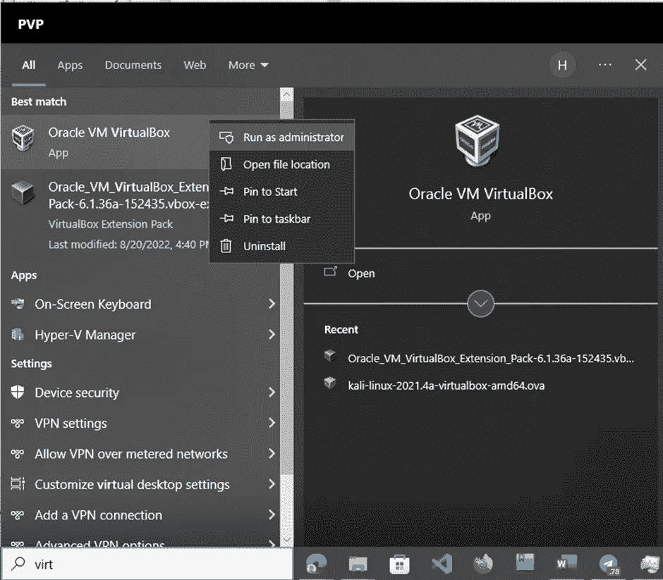

6.通过点击“文件”标签或者简单地点击键盘上的“Ctrl+G”来打开偏好设置。

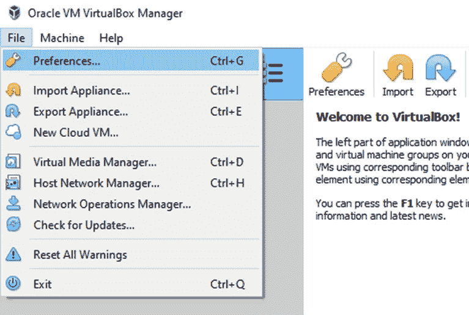

7.在新窗口中，转到“Extensions ”,你看到有十字符号的蓝色矩形了吗？点击它。

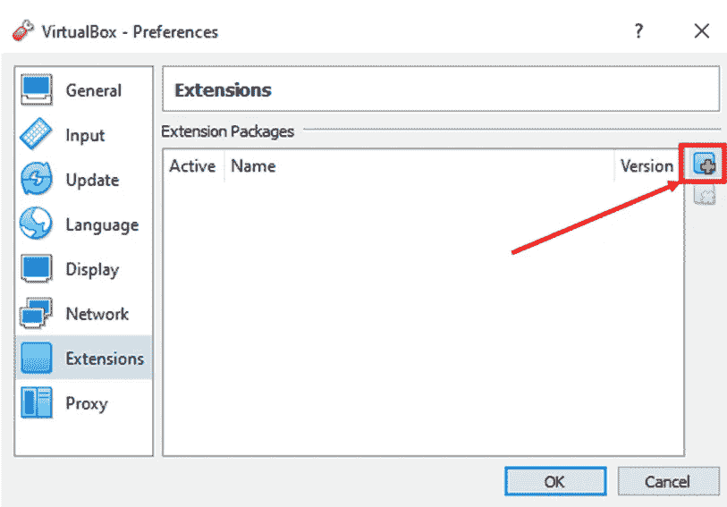

8.将包指向之前下载的文件。

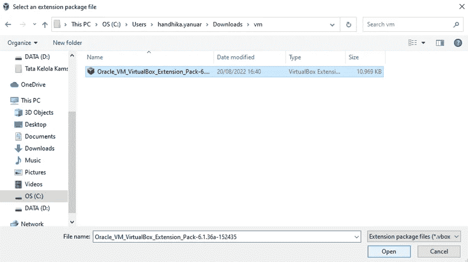

9.现在，按照之前的步骤 2 和 3 进行安装。

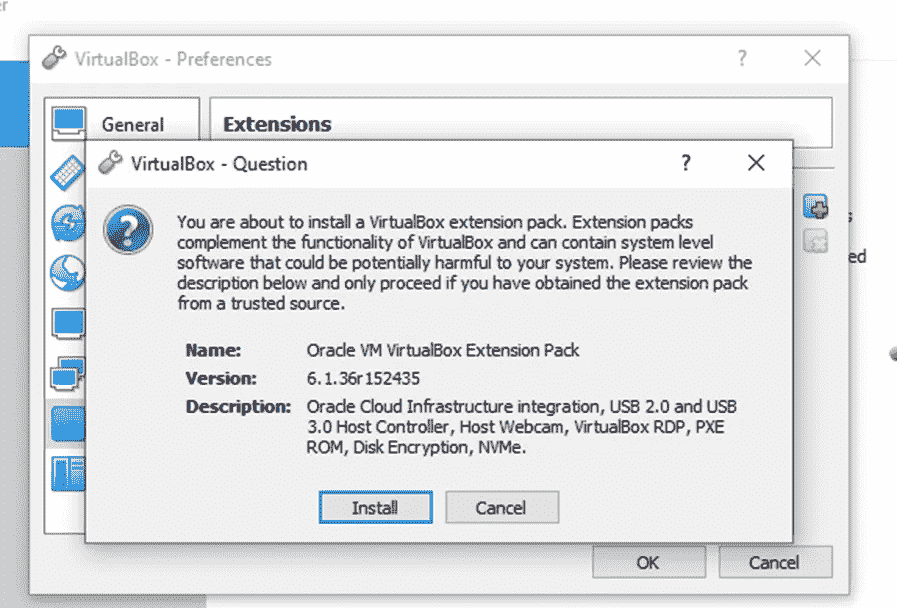

10.扩展将很快成功安装。

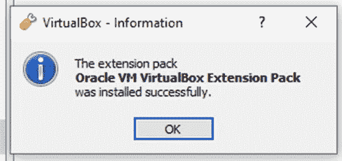

11.这是现在扩展的视图。

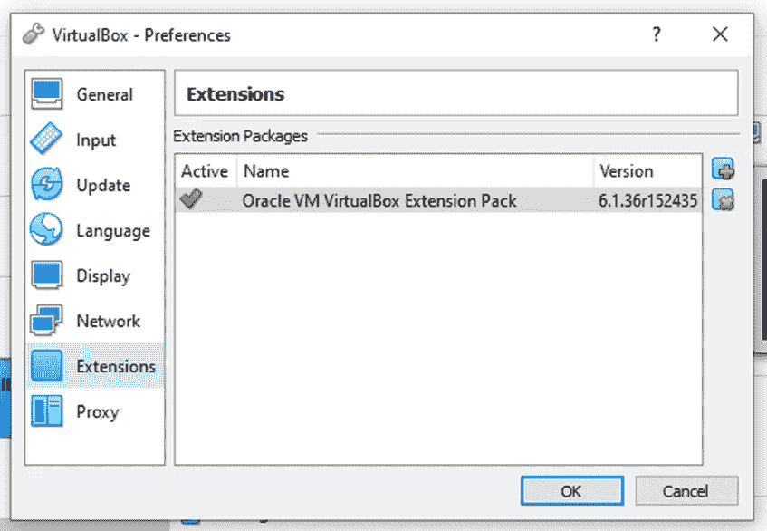

12.打开 VirtualBox，进入“设备”选项卡，悬停在“网络摄像头”上，然后选择“集成网络摄像头”

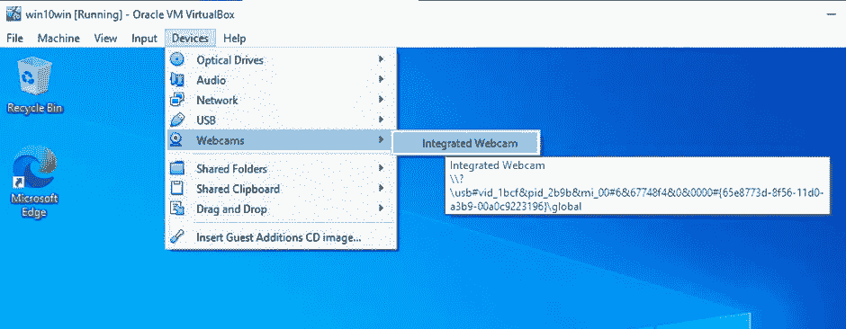

13.恭喜你，你现在就可以使用虚拟机上的摄像头了。

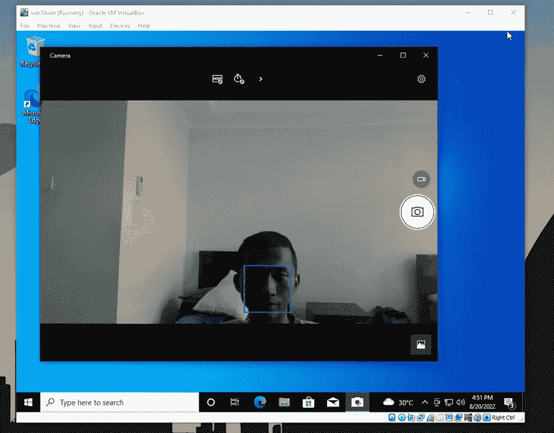

# 结论

这篇文章大概是简洁的，我在尝试解释如何在 windows 10 VirtualBox 中使用摄像头，我们做得很好。我希望你能跟上，也希望有一天这篇文章至少对某个不知名的人有所帮助。感谢阅读。🙏