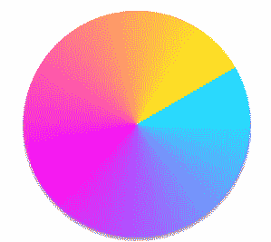
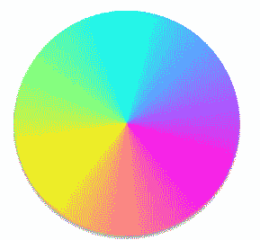
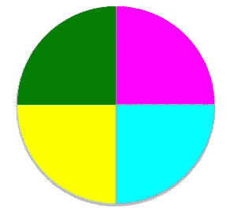
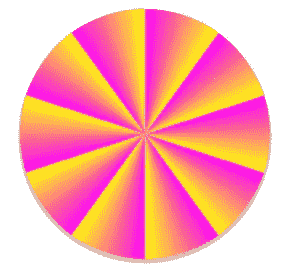
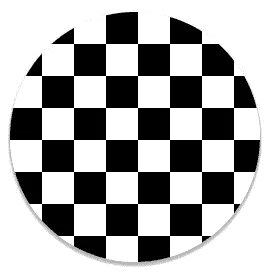

# 如何在 CSS 中使用圆锥渐变

> 原文：<https://medium.com/nerd-for-tech/how-to-use-conic-gradients-in-css-9136a6bf5b35?source=collection_archive---------6----------------------->

> 本文描述了圆锥渐变，圆锥渐变是 CSS 渐变的第三种类型，使用圆锥渐变()函数可以使我们的用户界面更加优雅。

圆锥形渐变是 CSS 渐变的第三种类型，我们已经有了[线性渐变和](/swlh/how-to-use-css-gradient-colors-1d06994a26dc)径向渐变。现在我们将使用圆锥形渐变来使我们的 web 用户界面更加优雅，

conic-gradient()是 CSS 中使用圆锥渐变的内置函数，就像 linear-gradient()& radial-gradient()一样。

在 CSS 中说明 conic-gradient()函数的例子下面:

## 没有角度的圆锥形渐变

这是一个没有角度或者没有任何位置的圆锥梯度的基本例子。

**语法:**

```
Background image: conic-gradient(color degree, color degree, ...)
```

**结果**


没有角度的圆锥形渐变

**HTML**

```
<!DOCTYPE html>
<html lang="en">

<head>
  <title>CSS Gradients</title>
  <link rel="stylesheet" href="temp.css">
</head>

<body>
  <div class="grad1 conic-grad-1"></div>

</body>
</html>
```

**CSS**

```
body {
    margin: auto;
    color: white;
  }

.grad1{
  margin: 20px auto;
  padding: 25px;
  max-width: 200px;
  height: 200px;
  border-radius: 50%;
  box-shadow:0 3px 1px 2px rgba(0,0,0,.2),0 2px 2px 0 rgba(0,0,0,.14),0 1px 5px 0 rgba(0,0,0,.12)
}

.conic-grad-1{
  background-image: conic-gradient( cyan, magenta, yellow); 
}
```

## 带角度的圆锥梯度

在此示例中，您将发现使用 from 关键字指定的角度为 60 度。

**结果**



60 度角的圆锥形渐变

**HTML**

```
<!DOCTYPE html>
<html lang="en">

<head>
  <title>CSS Gradients</title>
  <link rel="stylesheet" href="temp.css">
</head>

<body>
  <div class="grad1 conic-grad-2"></div>

</body>
</html>
```

**CSS**

```
body {
    margin: auto;
    color: white;
  }

.grad1{
  margin: 20px auto;
  padding: 25px;
  max-width: 200px;
  height: 200px;
  border-radius: 50%;
  box-shadow:0 3px 1px 2px rgba(0,0,0,.2),0 2px 2px 0 rgba(0,0,0,.14),0 1px 5px 0 rgba(0,0,0,.12)
}

.conic-grad-2{
  background-image: conic-gradient(from 60deg,  cyan, magenta, yellow); 
}
```

## 带位置的圆锥梯度

在本例中，我们将使用带有 conic-gradient()函数的 from 和 at 关键字。

**语法:**

```
Background image: conic-gradient(from deg at percentage, color, color, ...)
```

**结果**


带位置和 40 度角的圆锥形渐变

**HTML**

```
<!DOCTYPE html>
<html lang="en">

<head>
  <title>CSS Gradients</title>
  <link rel="stylesheet" href="temp.css">
</head>

<body>
  <div class="grad1 conic-grad-3"></div>

</body>
</html>
```

**CSS**

```
body {
    margin: auto;
    color: white;
  }

.grad1{
  margin: 20px auto;
  padding: 25px;
  max-width: 200px;
  height: 200px;
  border-radius: 50%;
  box-shadow:0 3px 1px 2px rgba(0,0,0,.2),0 2px 2px 0 rgba(0,0,0,.14),0 1px 5px 0 rgba(0,0,0,.12)
}

.conic-grad-3{
  background: conic-gradient(from 45deg at 65% 35%, cyan, magenta, yellow);
}
```

## **平滑圆锥梯度**

这是一个多色平滑圆锥渐变。我们在这里得不到任何角度，因为我们使用了多种颜色，即多于三种颜色，没有任何角度或任何位置。因此，它只是创建了多个颜色梯度如下图所示。

**结果**



平滑圆锥梯度

**HTML**

```
<!DOCTYPE html>
<html lang="en">

<head>
  <title>CSS Gradients</title>
  <link rel="stylesheet" href="temp.css">
</head>

<body>
  <div class="grad1 conic-grad-4"></div>

</body>
</html>
```

**CSS**

```
body {
    margin: auto;
    color: white;
  }

.grad1{
  margin: 20px auto;
  padding: 25px;
  max-width: 200px;
  height: 200px;
  border-radius: 50%;
  box-shadow:0 3px 1px 2px rgba(0,0,0,.2),0 2px 2px 0 rgba(0,0,0,.14),0 1px 5px 0 rgba(0,0,0,.12)
}

.conic-grad-4{
  background-image: conic-gradient( cyan, magenta, yellow, cyan); 
}
```

## 圆锥梯度饼图

具有圆锥梯度()函数的简单饼图。下面的代码将创建一个简单的圆锥梯度()函数饼图。

```
background-image: conic-gradient(  
  magenta 0deg, magenta 90deg, 
  cyan 90deg, cyan 180deg, 
  yellow 180deg, yellow 270deg, 
  green 270deg, green 360deg);
```

这里我们使用了 360 度循环逻辑。

**结果**



圆锥梯度饼图

**HTML**

```
<!DOCTYPE html>
<html lang="en"><head>
  <title>CSS Gradients</title>
  <link rel="stylesheet" href="temp.css">
</head><body>
  <div class="grad1 conic-grad-pie"></div></body>
</html>
```

**CSS**

```
body {
    margin: auto;
    color: white;
  }.grad1{
  margin: 20px auto;
  padding: 25px;
  max-width: 200px;
  height: 200px;
  border-radius: 50%;
  box-shadow:0 3px 1px 2px rgba(0,0,0,.2),0 2px 2px 0 rgba(0,0,0,.14),0 1px 5px 0 rgba(0,0,0,.12)
}.conic-grad-pie{
  background-image: conic-gradient(  magenta 0deg, magenta 90deg, 
  cyan 90deg, cyan 180deg, 
  yellow 180deg, yellow 270deg, 
  green 270deg, green 360deg); 
}
```

## 圆锥梯度重复

就像其他梯度一样，线性和径向，我们可以创建重复梯度与圆锥梯度()函数。换句话说，我们用重复二次曲线梯度()函数显示了向外的光线。

**语法:**

```
Background image: repeating-conic-gradient( color deg, color deg, ...)
```

**结果**



圆锥梯度重复

**HTML**

```
<!DOCTYPE html>
<html lang="en"><head>
  <title>CSS Gradients</title>
  <link rel="stylesheet" href="temp.css">
</head><body>
  <div class="grad1 conic-grad-repeat"></div></body>
</html>
```

**CSS**

```
body {
    margin: auto;
    color: white;
  }.grad1{
  margin: 20px auto;
  padding: 25px;
  max-width: 200px;
  height: 200px;
  border-radius: 50%;
  box-shadow:0 3px 1px 2px rgba(0,0,0,.2),0 2px 2px 0 rgba(0,0,0,.14),0 1px 5px 0 rgba(0,0,0,.12)
}.conic-grad-repeat{
  background: repeating-conic-gradient(magenta 10%, yellow 20%);
}
```

## 圆锥梯度检查

另一个例子，我们可以用这个渐变得到更多的乐趣，也就是说，我们可以创建检查

**结果**



圆锥梯度检查

**HTML**

```
<!DOCTYPE html>
<html lang="en"><head>
  <title>CSS Gradients</title>
  <link rel="stylesheet" href="temp.css">
</head><body>
  <div class="grad1 conic-grad-checks"></div></body>
</html>
```

**CSS**

```
body {
    margin: auto;
    color: white;
  }.grad1{
  margin: 20px auto;
  padding: 25px;
  max-width: 200px;
  height: 200px;
  border-radius: 50%;
  box-shadow:0 3px 1px 2px rgba(0,0,0,.2),0 2px 2px 0 rgba(0,0,0,.14),0 1px 5px 0 rgba(0,0,0,.12)
}.conic-grad-checks{
  background: conic-gradient(black 25%, white 0 50%, black 0 75%, white 0);
  background-size: 4em 4em;
}
```

我们已经看到了使用 conic-gradient()函数的多种可能方式。你可以用自己的逻辑创造更多。

编码快乐！