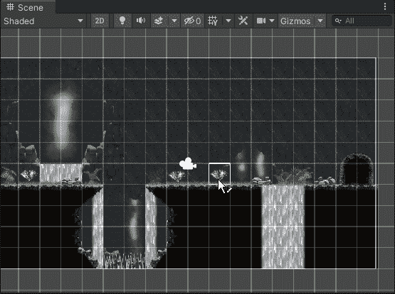
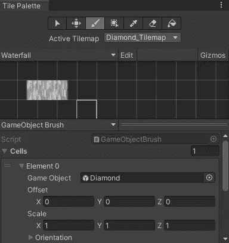

# 如何使用游戏物体笔刷

> 原文：<https://medium.com/nerd-for-tech/how-to-use-gameobject-brush-7be9a1ddeae9?source=collection_archive---------5----------------------->

2D 手机游戏

**目标:**使用游戏对象笔刷实例化场景中的游戏对象，而无需拖动预设

使用游戏物体笔刷，非常简单。首先在平铺面板中选择游戏对象笔刷，然后展开单元格，你可以看到一个带有空单元格的游戏对象变量。将你的游戏对象拖到那个单元格中，现在你就可以在你的场景中使用这个游戏对象了。

确保选择正确的 tilemap 并选择 paint 工具来绘制游戏对象。