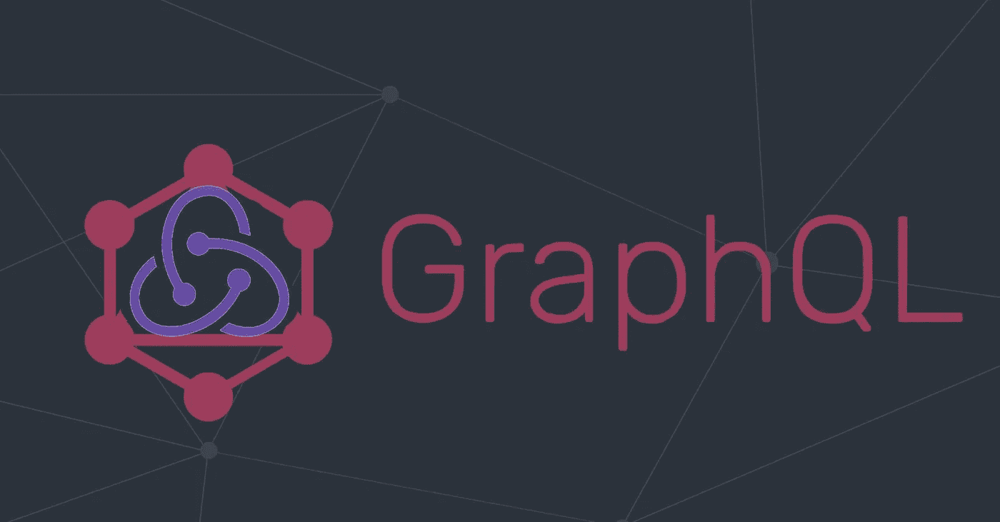

# 如何在 Redux 中使用 GraphQL

> 原文：<https://medium.com/nerd-for-tech/how-to-use-graphql-with-redux-50ad20ec051f?source=collection_archive---------0----------------------->

每隔一段时间，当一项新技术出现时，我们认为它应该取代旧技术，对此我并不完全同意。

例如，我们有 Apollo GraphQL 处理您的异步调用、状态缓存…所以看起来它就是您所需要的全部。那么，如果你是一个有点老的学校，你想让你的异步远离你的组件，你的状态由你控制，让我们看看如何用阿波罗和 redux 做到这一点。



因为我希望 GraphQL 客户端只负责我的 API 调用，所以我将它作为 redux 上下文的一部分，这样我就可以在我的异步层中使用它。(*对于这个例子，我将使用* ***redux-thunk*** )

让我们创建一个 GraphQL 客户端。
*gql-client.ts*

```
*import* { ApolloClient, InMemoryCache } *from* '@apollo/client';
*import* { *createUploadLink* } *from* 'apollo-upload-client';*export type GraphQLClient* = void*export const createGQLClient* = (): *GraphQLClient* => {
  *const* cache = *new* InMemoryCache({
    addTypename: *false*,
    resultCaching: *false*,
  });

  *const* client = *new* ApolloClient({
    *// Provide required constructor fields* cache: cache,
    link: *createUploadLink*({
      uri: API_URL_FROM_ENV,
      includeUnusedVariables: *false*,
      credentials: 'include',
    }),
    defaultOptions: {
      watchQuery: {
        fetchPolicy: 'no-cache',
      },
      mutate: {
        fetchPolicy: 'no-cache',
      },
    },
  });
}
```

好了，这看起来不错，我们已经创建了一个客户端，但我们希望能够查询和改变数据，对不对？让我们添加查询和变异方法

```
*type Query* = <QV, RT>(*name*: *string*, *query*: *DocumentNode*, *variables*?: QV) => *Promise*<RT>;*type Mutate* = <MV, RT>(*name*: *string*, *mutation*: *DocumentNode*, *variables*?: MV) => *Promise*<RT>;
```

现在让我们扩展我们的 ***GraphQLClient***

```
*export type GraphQLClient* = {
  query: *Query*;
  mutate: *Mutate*;
}
```

现在让我们添加方法

```
*const* query: *Query* = (*name*, *query*, *variables*) => {
  *return* client
    .query({
      *query*,
      *variables*,
      fetchPolicy: 'no-cache',
    })
    .then(({ *data* }) => *data*[*name*]);
};

*const* mutate: *Mutate* = (*name*, *mutation*, *variables*) => {
  *return* client
    .mutate({
      *mutation*,
      *variables*,
    })
    .then(({ *data* }) => *data*[*name*]);
};
```

所以我们的客户现在看起来像这样

```
*import* { ApolloClient, *DocumentNode*, InMemoryCache } *from* '@apollo/client';
*import* { *createUploadLink* } *from* 'apollo-upload-client';

*type Query* = <QV, RT>(*name*: *string*, *query*: *DocumentNode*, *variables*?: QV) => *Promise*<RT>;
*type Mutate* = <MV, RT>(*name*: *string*, *mutation*: *DocumentNode*, *variables*?: MV) => *Promise*<RT>;

*export type GraphQLClient* = {
  query: *Query*;
  mutate: *Mutate*;
};

*export const createGQLClient* = (): *GraphQLClient* => {
  *const* cache = *new* InMemoryCache({
    addTypename: *false*,
    resultCaching: *false*,
  });

  *const* client = *new* ApolloClient({
    *// Provide required constructor fields* cache: cache,
    link: *createUploadLink*({
      uri: API_URL_FROM_ENV,
      includeUnusedVariables: *false*,
      credentials: 'include',
    }),
    defaultOptions: {
      watchQuery: {
        fetchPolicy: 'no-cache',
      },
      mutate: {
        fetchPolicy: 'no-cache',
      },
    },
  });

  *const* query: *Query* = (*name*, *query*, *variables*) => {
    *return* client
      .query({
        *query*,
        *variables*,
        fetchPolicy: 'no-cache',
      })
      .then(({ *data* }) => *data*[*name*]);
  };

  *const* mutate: *Mutate* = (*name*, *mutation*, *variables*) => {
    *return* client
      .mutate({
        *mutation*,
        *variables*,
      })
      .then(({ *data* }) => *data*[*name*]);
  };

  *return* { query, mutate };
};
```

因此，让我们创建一个 **Redux** 商店，并将我们的客户添加到其中

```
*import* { createStore, *applyMiddleware*, *combineReducers* } *from* 'redux';
*import* thunk *from* 'redux-thunk';*...**import* { *createGQLClient* } *from* '..../gql-client';

*const* rootReducer = *combineReducers*({ *... // Your Reducers*
});

*export type StoreState* = {
  ... // Store Type Parts
};

*export const* store = createStore(
  rootReducer,
  *applyMiddleware*(
    thunk.*withExtraArgument*({ client: *createGQLClient*() })
  )
);
```

现在，我们已经为 ActionCreators 提供了我们的客户端，让我们创建一个示例变异任务

*createorganizationtask . ts*

```
*import* { gql } *from* '@apollo/client/core';
*import* {
  *Organization,
  SetOrganizationAction*,
  *SetOrganizationErrorAction*,
  *SetOrganizationRequestInProgressAction*,
} *from* '../types';*import* {
  setOrganizationAction,
  setOrganizationErrorAction,
  setOrganizationRequestInProgress
} *from* '../actions';

*export type CreateOrganizationPayload* = *Pick*<*Organization*, 'name'>;

*const* CREATE_ORGANIZATION = *gql*`
  mutation createOrganization($name: String!) {
    createOrganization(name: $name) {
      identity
      name
      createdAt
    }
  }
`;

*export const createOrganizationTask* = (
  *data: CreateOrganizationPayload
)* => (*dispatch*, *_*, { *client* }) => {
  *dispatch*(setOrganizationRequestInProgress(true));
  *return client* .mutate<*CreateOrganizationPayload*, *Organization*>('createOrganization', CREATE_ORGANIZATION, *data*)
    .then(*data* => *dispatch*(*SetOrganizationAction*(data))))
    .catch((e) => *dispatch*(setOrganizationErrorAction(e.message)))
    .finaly(() => *dispatch*(setOrganizationRequestInProgress(false)))
};
```

这同样适用于数据查询

*getOrganizationTask.ts*

```
*import* { gql } *from* '@apollo/client/core';

*import* {
  *Organization*,
  *SetOrganizationAction*,
  *SetOrganizationErrorAction*,
  *SetOrganizationRequestInProgressAction*,
} *from* '../types';
*import* {
  setOrganizationAction,
  setOrganizationErrorAction,
  setOrganizationRequestInProgress
} *from* '../actions';

*const* GET_ORGANIZATION = *gql*`
  query getOrganization($identity: String!) {
    getOrganization(identity: $identity) {
      identity
      name
      createdAt
      clearanceLevel
      owner {
        username
        firstName
        lastName
      }
    }
  }
`;

*export const getOrganizationTask* = *identity* => (*dispatch*, *_*, { *client* }) => {
  *dispatch*(setOrganizationRequestInProgress());
  *return client* .query<*unknown*, *Organization* | *null*>(
      'getOrganization', 
      GET_ORGANIZATION,
      { *identity* }
    )
    .then(*data* => *dispatch*(setOrganizationAction(*data*)))
    .catch((e) => *dispatch*(setOrganizationErrorAction(e.message)))
    .finaly(() => *dispatch*(setOrganizationRequestInProgress(false)))
};
```

就是这样…我们的应用程序现在使用 GraphQL 进行 API 通信，所以我们可以获得它真正强大的特性，但是我们的状态是干净的，由 redux 管理，所以我们的应用程序甚至不知道 GQL。

想象一下，如果将来由于技术上的需要，你不得不从 GraphQL 转换过来，那么在任何地方改变每一个组件都可能是难以处理的。但是…通过这种方式，你只需修改你的异步层，因为你的应用程序逻辑与它完全解耦，所以不管你使用的是 RestApi、GraphQL 还是其他什么。

*编码快乐！*